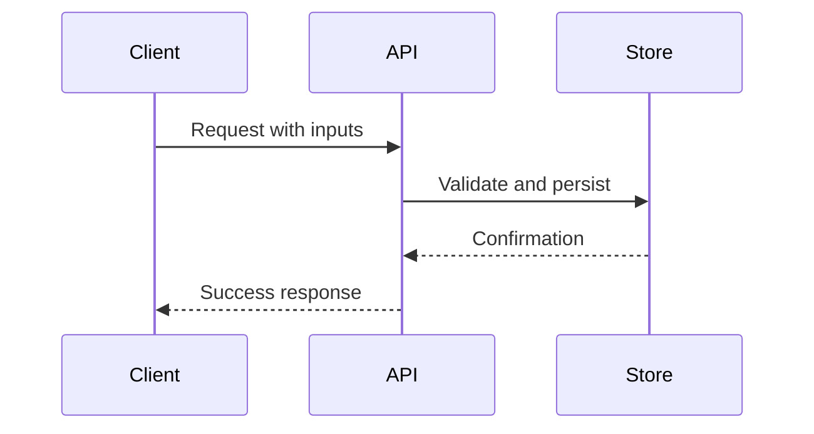
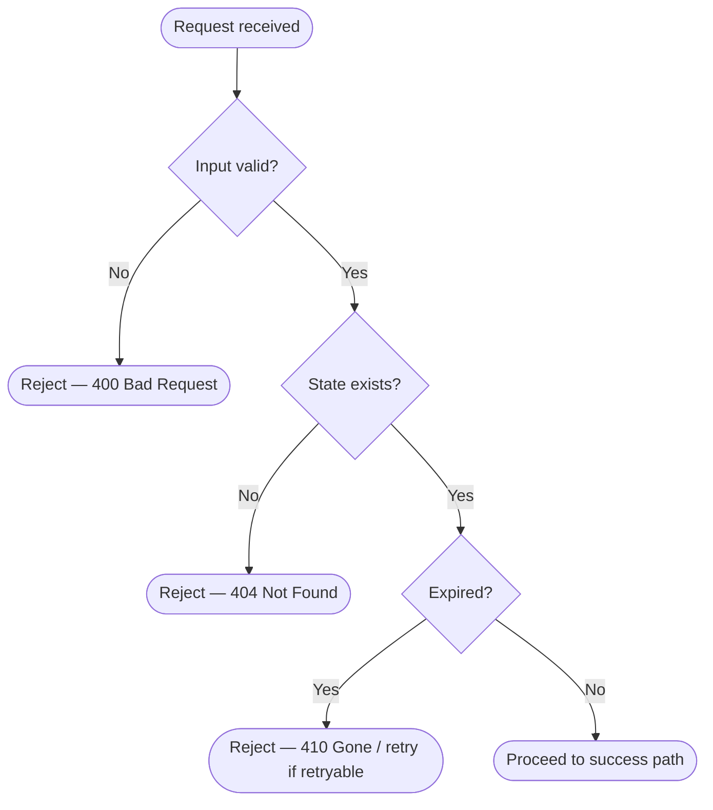

# App Standard Document Template & Guidelines

You are reviewing the implementation of a capability provided by a code library that will soon be deprecated. Your job is to extract a reusable **App Standard Document** — a practical, implementation-ready guide for future developers to re-implement the same functionality correctly without depending on this library.

> [!IMPORTANT]
> This is not documentation of the library itself. It is a canonical application standard, grounded only in what is enforced by the implementation and consistent with platform or security standards.

---

## 🛠 Guidelines

### ❌ Do Not
- **Do not** describe the internals, classes, or file layout of the deprecated library being replaced.
- **Do not** say “this is not implemented” — instead, state what must be implemented in future apps.
- **Do not** invent functionality.
- **Do not** reference optional features unless the code enforces or directly supports them.

### ✅ Do
- **Write the output file in Markdown format** — the file must be a `.md` file. XML, HTML, angle brackets, and other markup are permitted within the content where relevant (e.g., documenting HTTP headers, generics, or tag-based formats).
- **Describe observable behaviors** as enforceable design rules.
- **Reference applicable standards** (e.g., OWASP, NIST, RFCs, ISO/IEC) only when directly supported by the code.
- **Separate Base-level standards from Org-level policies.**
- **Reference external third-party library classes** (e.g., JasperReports, Apache POI, Spring, Hibernate) ONLY where they represent enforceable implementation requirements — provided the reference describes an observable behavior or constraint, not the library’s internal design.

---

## 📄 Output Format: [CAPABILITY NAME] Application Standard

### 1. Overview

- **Purpose (1 paragraph):** What this capability enables (e.g., “Adds a second authentication factor to protect sensitive operations.”)
- **Scope:** What kinds of systems should follow this standard.
- **Definitions:** 5–7 key behavioral concepts (e.g., “challenge ID”, “principal”, “delivery mechanism”).

### 2. Standard Flow

- Step-by-step happy path behavior.
- Step-by-step failure paths with rejection, retry, fallback rules.
- Any decision logic enforced in the implementation.

> [!NOTE]
> **Required:** Include flow diagrams covering both the happy path and all failure paths (rejection, retry, fallback rules) using either Mermaid or PlantUML. Only include steps that are directly traceable from the implementation — do not invent steps.

#### Mermaid example (happy path as sequence, failure paths as flowchart):

PlantUML is equally acceptable in place of Mermaid for either diagram. Only include diagrams if:
- No steps are guessed or invented.
- Initiators and responders are clearly modeled in code.

### 3. Best Practices & Contracts

If applicable, split each subsection into two distinct categories:
- ✅ **Base Standard:** (e.g., NIST, RFC, OWASP-aligned) - optional
- 🏢 **Org Standard:** (Company-wide rule or policy enforced in the library) - required

#### 3.1 Inputs / Outputs
- Required and optional inputs
- Validation logic (e.g., format checks, enum matching)
- Outputs and side effects (persistence, tokens issued, state cleared)

#### 3.2 Error Contract
- Common failure categories (input validation, missing state, expired session, etc.)
- Retryability (retryable vs terminal errors)
- HTTP status codes or transport mapping (if observable)

#### 3.3 Audit Contract
- When audit events MUST be emitted.
- What fields each event MUST include (actor, timestamp, target, etc.).
- If no audit is present, clearly state that audit must be implemented by integrators.

#### 3.4 Logging Contract
- ✅ **Structured log fields:** correlation ID, principal ID, source IP, etc.
- ✅ **Required log levels:** info on success, warn on failure.
- 🏢 Include logging conventions for batch jobs, interface transactions, or domain-specific events — if present in code.
- ❌ **Prohibited log content:** sensitive fields (codes, secrets, raw credentials).

#### 3.5 Security Contract
- ✅ **Enforced constraints:** identity required, roles checked, token formats.
- ✅ **TTL or expiry logic.**
- ✅ **Use of secure storage:** (e.g., secrets encrypted with KMS).
- ✅ **Reference applicable standards:** (e.g., RFC 6238 for TOTP, NIST 800-63B for OTP length).

### 4. Architectural Design

Describe design choices visible in the implementation. Split into relevant groups only if observable, such as:

- **Runtime Context:** Where is the identity context read from?
- **State Model:** Ephemeral? Durable store? Redis?
- **Synchronous vs Async:** Does the flow block the user?
- **Separation of Concerns:** Are responsibilities decoupled? (e.g., generation ≠ delivery)
- **External Assumptions:** Any reliance on KMS, queues, auth gateways?
- **Interoperability:** Any use of standardized formats or URI schemes (e.g., otpauth://)
- **Cross-Cutting Behavior:** Logging, exception handling, interceptors, AOP — without naming the library/framework.

Each observation should be labeled as:
- **Enforced Constraint:** strictly implemented in code. Each enforced constraint MUST include an inline source reference (e.g., OWASP, NIST, RFC, or framework documentation) to justify why it is a constraint rather than a choice — format: **[Enforced Constraint]** **[[Source Name](url)]**.
- **Design Choice:** implementation pattern.
- **Assumption:** requires external integration.

### 5. Test & Validation Standard

- Unit tests present in the codebase.
- Flows that MUST be covered by app integration tests.
- Gaps to be filled by the integrator.
- ✅ **Test data guidelines:** use deterministic test codes, no PII, etc.

### 6. Operational Runbook

- Observable logs and metrics.
- Manual vs self-healing error modes.
- External failure sources (e.g., KMS, external queues).
- Config and secrets required at runtime.

### 7. Appendix

- **Glossary:** Defined terms used in the doc.
- **Changelog:** Date/version of the standard.
- **Standards Referenced:** RFCs, OWASP, NIST, ISO/IEC — only if behavior is clearly aligned.
