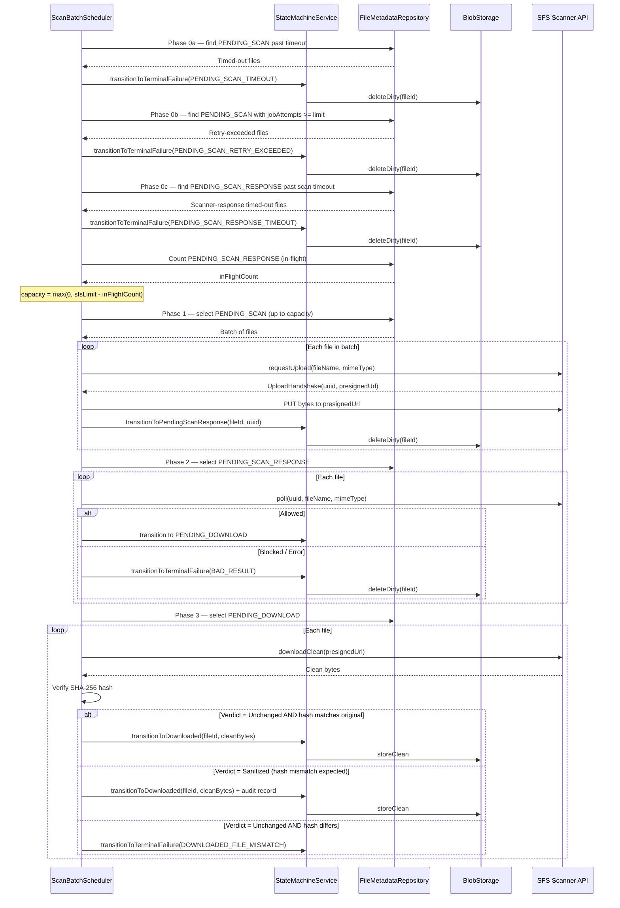

# 06. AWS Default Orchestration (Scheduled Phases)

**Goal**: In the AWS profile, run the async submit -> poll -> clean-file retrieval lifecycle with explicit phase ownership and SFS-aware throttling.

**Default AWS Flow**:

```text
Upload -> status = PENDING_SCAN
  -> Phase 0 cleanup runs first (terminates upload zombies, retry-exceeded files, and scanner response timeouts so the in-flight count used in Phase 1 reflects only genuinely pending SFS work)
  -> Phase 1 selects only the remaining SFS capacity
  -> request upload metadata -> PUT bytes to presigned URL
  -> status = PENDING_SCAN_RESPONSE
  -> Phase 2 polls by scanner UUID and file identity
  -> status = PENDING_DOWNLOAD or terminal failure
  -> Phase 3 downloads clean bytes from SFS
  -> verify downloaded SHA-256 against original hash
  -> if verdict is Unchanged AND hash matches: store in configured Clean Store
  -> if verdict is Unchanged AND hash matches: status = DOWNLOADED and emit FileScanEvent(DOWNLOADED)
  -> if verdict is Sanitized: store sanitized content in Clean Store, status = DOWNLOADED, emit FileScanEvent(DOWNLOADED) + audit record (original hash, sanitized hash)
  -> if verdict is Unchanged AND hash differs: status = DOWNLOADED_FILE_MISMATCH (genuine integrity failure)
  -> if DOWNLOADED: retain for download OR ingest records and delete clean artifact
```

**AWS Batch Lifecycle Sequence**:



> Rules for event publication, hash mismatch handling, SFS capacity throttling, metadata persistence, and lock coordination are defined in §4.4 and §4.5 of the [AWS Standard](../../standards/file_management_standards_aws_core.md).
