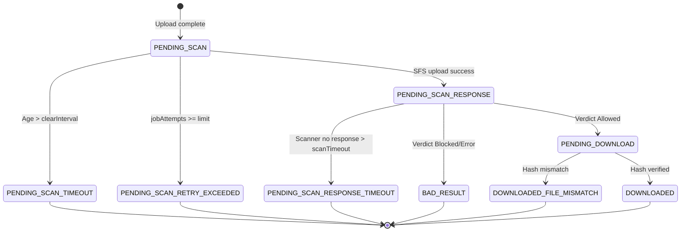

# 08. AWS Scanner State Transitions

**Goal**: Persist AWS SFS lifecycle metadata and publish events for every scanner state transition.

**AWS lifecycle**:

**AWS transition rules**:

* Persist scanner UUID and submission timestamp before publishing `PENDING_SCAN_RESPONSE`.
* Persist scanner verdict and clean download reference before publishing `PENDING_DOWNLOAD`.
* Persist scanner diagnostic detail before publishing `BAD_RESULT` or timeout states.
* Delete dirty content only after SFS handoff is confirmed and scanner correlation metadata is durable.
* Keep SFS upload, poll, and download calls outside the metadata transition transaction.

**Mandatory event publication points**:

| Transition | Event Status |
|:---|:---|
| Upload complete | `PENDING_SCAN` |
| Cleanup: timeout | `PENDING_SCAN_TIMEOUT` |
| Cleanup: retries exhausted | `PENDING_SCAN_RETRY_EXCEEDED` |
| Scanner upload success | `PENDING_SCAN_RESPONSE` |
| Scanner response timeout | `PENDING_SCAN_RESPONSE_TIMEOUT` |
| Scanner verdict: allowed | `PENDING_DOWNLOAD` |
| Scanner verdict: blocked/error | `BAD_RESULT` |
| Clean file retrieval: hash verified | `DOWNLOADED` |
| Clean file retrieval: hash mismatch | `DOWNLOADED_FILE_MISMATCH` |
