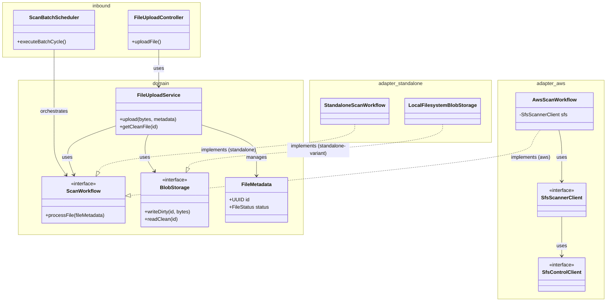

# 25. Code Organization & Package Structure

**Goal**: Maintain a clean hexagonal architecture with clear package boundaries and separation of concerns.

### Module Placement: `shared`, Not `features`

File Management is a **shared platform module** — it lives under `com.example.shared.fileupload`, not `com.example.features.*`. This distinction matters:

- **Shared platform modules** (`shared.*`) are reusable capabilities defined by AppStandards. They ship as part of the framework layer and are consumed by any application that activates the standard. File management, shared auth, and the app shell all live here.
- **Features** (`features.*`) are application-specific domain logic built by consuming teams. A feature _uses_ `shared.fileupload` but never _is_ file upload. For example, a loan-processing feature might call `FileUploadService.upload()` to attach supporting documents — the feature is `features.loans`, not `features.filemanagement`.

An AI agent or developer implementing this recipe **must** place all file management code under `shared.fileupload.*` (backend) and `src/shared/fileupload/` (frontend). Placing it under `features/` is incorrect and breaks the consuming-app integration boundary.

#### Frontend placement

The file management UI components (upload page, file list, status labels) are delivered as part of the shared platform layer at `frontend/src/shared/fileupload/`. A consuming app's router imports and mounts them directly — they are not feature routes.

```tsx
// In the consuming app's router.tsx:
import { FileListPage, UploadPage } from '../../shared/fileupload';

// These are shared routes, not feature routes.
{ path: '/files', element: <FileListPage /> },
{ path: '/files/upload', element: <UploadPage /> },
```

If a consuming app needs to customize or wrap file management pages (e.g. embed them inside a domain-specific layout), it builds a thin feature wrapper that composes the shared components.

---

### Architectural Overview (Hexagonal)

The File Management module follows a **Ports and Adapters** pattern. The core business logic depends on stable interfaces (**Ports**), while profile-specific implementations (**Adapters**) are injected at runtime based on the active Spring profile (`aws` or `standalone`).



**Root Package**: `shared.fileupload`

| Package | Purpose | Key Classes |
|:---|:---|:---|
| `domain.model` | JPA entities and domain enums | `FileMetadata`, `IngestionRecord`, `FileStatus`, `FileScanResultStatus`, `IngestionStatus` |
| `domain.port` | Hexagonal architecture ports (interfaces) | `BlobStorage`, `ScanWorkflow`, `RecordProcessor`, `StorageQuotaChecker`, `FileScanEventPublisher`, `FileScanEvent`, `IngestionProgress` |
| `domain.service` | Core domain business logic (profile-agnostic) | `FileUploadService`, `StateMachineService`, `IngestionOrchestrator`, `IngestionService` |
| `domain.validation` | Input validation & file integrity rules | `AcceptedFile` (annotation), `AcceptedFileValidator`, `MagicBytesRegistry`, `PdfEncryptionDetector` |
| `domain.exception` | Domain-level exceptions (not SFS-specific) | `FileNotFoundException`, `FileValidationException`, `RecordProcessorException` |
| `adapter.inbound.rest` | REST API controllers | `FileUploadController` (upload endpoint) |
| `adapter.inbound.batch` | Scheduled batch jobs (cron) | `ScanBatchScheduler` (`@Scheduled executeBatchCycle`) |
| `adapter.outbound.persistence` | JPA repositories | `FileMetadataRepository`, `IngestionRecordRepository`, optional `DirtyFileBlobRepository`, optional `FileBlobRepository` |
| `config` | Spring configuration classes | `FileScanProperties`, `FileValidationProperties`, `JpaConfig`, `SecurityConfig`, `ObservabilityConfig` |

Profile-specific adapter packages are documented in:
* [25. AWS Package Structure](../aws/25-aws-package-structure.md)
* [25. Standalone Package Structure](../standalone/25-standalone-package-structure.md)

**Database Resources**:

| Resource | Location | Purpose |
|:---|:---|:---|
| `db/changelog/db.changelog-master.yaml` | `src/main/resources/db/changelog/` | Master changelog orchestrator |
| `001-create-file-metadata.yaml` | `src/main/resources/db/changelog/changes/` | `FILE_METADATA` table (all profiles) |
| `002-create-file-content-cleaned.yaml` | `src/main/resources/db/changelog/changes/` | `FILE_CONTENT_CLEANED` (database-backed variant only) |
| `003-create-file-content-dirty.yaml` | `src/main/resources/db/changelog/changes/` | `FILE_CONTENT_DIRTY` (database-backed variant only) |
| `004-create-ingestion-record.yaml` | `src/main/resources/db/changelog/changes/` | `INGESTION_RECORD` (all profiles) |

**Reference DDL (Database-Backed Variant)**:

```sql
-- FILE_METADATA (all profiles)
create table FILE_METADATA (
    id                  uuid primary key,
    hash                varchar(64) not null,
    original_hash       varchar(64),
    status              varchar(40) not null,
    file_size           bigint not null,
    file_type           varchar(120) not null,
    file_extension      varchar(20) not null,
    display_name        varchar(255) not null,
    tags                varchar(500),
    uploaded_by         varchar(120) not null,
    uploaded_on         timestamp not null,
    job_attempts        int not null default 0,
    uuid                varchar(120),
    sent_to_scanned_on  timestamp,
    sfs_error_message   varchar(2000),
    ingestion_status    varchar(40),
    ingestion_error_message varchar(2000),
    ingestion_attempts  int not null default 0,
    total_rows          bigint,
    processed_rows      bigint,
    row_ingestion_required boolean not null default false,
    version             int not null default 0
);

create index idx_fm_status on FILE_METADATA (status);
create index idx_fm_uploaded_on on FILE_METADATA (uploaded_on);

-- FILE_CONTENT_DIRTY (database-backed variant)
create table FILE_CONTENT_DIRTY (
    id                  uuid primary key,
    file_metadata_id    uuid not null,
    blob                blob not null
);

create index idx_fcd_metadata on FILE_CONTENT_DIRTY (file_metadata_id);

-- FILE_CONTENT_CLEANED (database-backed variant)
create table FILE_CONTENT_CLEANED (
    id                  uuid primary key,
    blob                blob not null
);

-- INGESTION_RECORD (all profiles)
create table INGESTION_RECORD (
    id                  uuid primary key,
    file_metadata_id    uuid not null,
    row_number          bigint not null,
    status              varchar(20) not null,
    error_message       varchar(2000)
);

create index idx_ir_metadata on INGESTION_RECORD (file_metadata_id);
```

**Reference Entity Fields**:

The concrete entity model may vary by profile and storage backend, but the database-backed reference implementation uses these core shapes.

#### `FileMetadata` (Table: `FILE_METADATA`)

One record per uploaded file. Standalone mode uses the local validation, storage, owner-scope, and ingestion fields; the AWS profile additionally uses scanner correlation and retry fields.

| Field | Type | Description |
|:---|:---|:---|
| `id` | `UUID` | Unique file identifier. |
| `displayName` | `String` | User-facing filename validated by the configured display-name rule. |
| `tags` | `String` | Optional categorization string. |
| `fileSize` | `long` | Size in bytes at upload time. |
| `fileType` | `String` | MIME type accepted by validation. |
| `fileExtension` | `String` | Extension accepted by validation. |
| `hash` | `String` | SHA-256 of the stored clean-store content. On a `Sanitized` verdict this is overwritten with the sanitized content's hash; otherwise it matches the uploaded content. |
| `originalHash` | `String` | SHA-256 of the originally uploaded content; populated only when the scanner verdict is `Sanitized` (null for `Unchanged` verdicts). Non-null value is the authoritative sanitization indicator. |
| `uploadedOn` | `Instant` | Upload timestamp. |
| `uploadedBy` | `String` | Uploading principal used for owner-scope enforcement. |
| `status` | `FileStatus` | Current lifecycle state. |
| `jobAttempts` | `int` | Scanner or lifecycle retry counter for profiles that retry asynchronously. |
| `uuid` | `String` | External scanner correlation UUID when applicable. |
| `sentToScannedOn` | `Instant` | Scanner submission timestamp when applicable. |
| `sfsErrorMessage` | `String` | Safely truncated scanner diagnostic detail when applicable. |
| `rowIngestionRequired` | `boolean` | Whether post-download record-level ingestion should run. |
| `ingestionStatus` | `IngestionStatus` | Record-level ingestion state. |
| `ingestionAttempts` | `int` | Ingestion retry counter. |
| `ingestionErrorMessage` | `String` | Ingestion error detail. |
| `totalRows` | `Long` | Expected row count for ingestion. |
| `processedRows` | `long` | Rows processed so far. |
| `version` | `int` | Optimistic-locking version when the implementation uses JPA versioning. |

#### `DirtyFileBlob` (Table: `FILE_CONTENT_DIRTY`) - Database-Backed Variant

Temporary storage for uploaded content before scanner handoff, local promotion, or terminal cleanup completes.

| Field | Type | Description |
|:---|:---|:---|
| `id` | `UUID` | Internal identifier. |
| `fileMetadataId` | `UUID` | Owning metadata record. |
| `blob` | `Blob` | Uploaded binary content. Use lazy BLOB mapping; see [14. Hibernate 7 LOB Strategy](14-hibernate-7-lob-strategy.md). |

#### `FileBlob` / `CleanFileBlob` (Table: `FILE_CONTENT_CLEANED`) - Database-Backed Variant

Clean content retained for download or used as transient input to record-level ingestion.

| Field | Type | Description |
|:---|:---|:---|
| `id` | `UUID` | Clean content identifier, commonly matching `FileMetadata.id` in the shared-PK model. |
| `blob` | `Blob` | Clean binary content. Use lazy BLOB mapping; see [14. Hibernate 7 LOB Strategy](14-hibernate-7-lob-strategy.md). |

#### `IngestionRecord` (Table: `INGESTION_RECORD`)

Per-record processing result for row-level ingestion when enabled.

| Field | Type | Description |
|:---|:---|:---|
| `id` | `UUID` | Unique record ID. |
| `fileMetadataId` | `UUID` | Owning file. |
| `rowNumber` | `long` | 1-indexed row number. |
| `status` | `IngestionStatus` or `String` | Row processing state such as `PENDING`, `SUCCESS`, `FAILED`, or `SKIPPED`. |
| `errorMessage` | `String` | Error detail if processing failed. |
| `processedOn` | `Instant` | Completion timestamp when tracked by the implementation. |

### Content Storage Alternatives

For filesystem-backed and S3-backed deployments, use one of the following architectural strategies to track external file locators rather than database-backed binary tables (`FILE_CONTENT_DIRTY`, `FILE_CONTENT_CLEANED`).

#### Strategy A: Flat Metadata Fields (Direct Columns)
Best for single-backend implementations where the storage schema is stable. Add backend-specific columns directly to the `FILE_METADATA` table.

*   **Filesystem-backed variant**: Add `dirty_store_path`, `clean_store_path`, and `storage_backend='FILESYSTEM'`.
    *   *Example*: `C:/app/data/clean/{fileId}.pdf`
*   **S3-backed variant**: Add `storage_backend='S3'`, `s3_bucket`, and `s3_key`.
    *   *Example*: `s3_bucket='my-app-clean-files'`, `s3_key='uploads/2024/{fileId}.pdf'`

#### Strategy B: Storage Mapping Table (Polymorphic Link)
Best for hybrid environments, multi-cloud platforms, or systems undergoing storage migration. Offload locators to a dedicated table to keep the main metadata table clean and extensible.

**Table**: `FILE_STORAGE_LOCATION`

| Column | Type | Description |
| :--- | :--- | :--- |
| `file_metadata_id` | `UUID` | Foreign key to `FILE_METADATA.id`. |
| `store_phase` | `String` | The lifecycle phase: `DIRTY` or `CLEAN`. |
| `backend` | `String` | The storage technology: `FILESYSTEM`, `S3`, `AZURE_BLOB`, etc. |
| `locator` | `String` | The physical address: local path, S3 URI, or backend-specific key. |
| `content_type` | `String` | MIME type used for retrieval headers. |

**Example Rows**:
*   `('uuid-1', 'DIRTY', 'FILESYSTEM', 'C:/app/data/dirty/uuid-1.upload', 'application/pdf')`
*   `('uuid-1', 'CLEAN', 'S3', 's3://my-bucket/prefix/uuid-1.pdf', 'application/pdf')`
