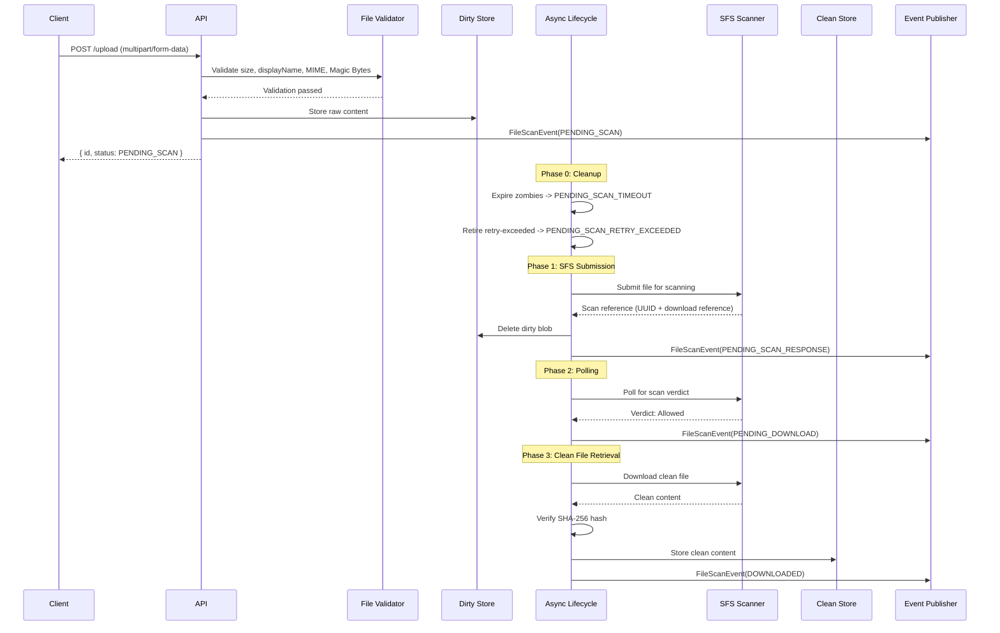
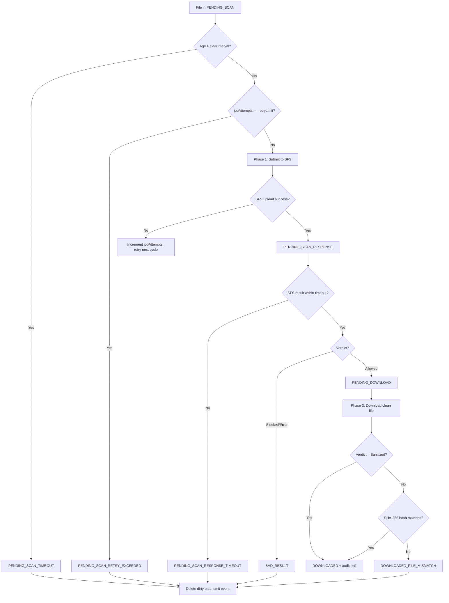
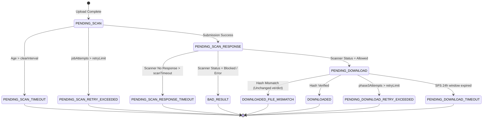

# File Management — Core Lifecycle (AWS Profile)

Parent: [File Management Standards — AWS Profile](../index.md)

> **Compliance note:** Both Base Standard and Org Standard are mandatory for all implementations. The layering separates universal practice from organization-specific compliance requirements for traceability and auditability purposes — it does not represent an opt-out boundary.

## 1. Overview

**Purpose**: Define the AWS-profile reference standard for validating, scanning, and storing files using an external AWS-native scanner (SFS), covering the dirty/clean store lifecycle, scheduled scan phases, and the retain-for-download and ingest-and-delete integration modes.

**Scope**: AWS-profile backend services that accept file uploads, submit them to SFS for scanning, and either retain the clean artifact for download or ingest it record-by-record and delete it. Applies to multi-node deployments where scheduled lifecycle phases require distributed coordination.

**Definitions**:
* **Dirty Store**: Temporary storage for files that have been uploaded but not yet finalized. Exists until the file is successfully handed off to SFS or reaches a terminal failure state.
* **Clean Store**: Storage for files retrieved during Phase 3. Content may be retained for download or used as transient input to post-scan ingestion.
* **Owner Scope**: The rule that only the uploading principal may list, download, bulk-download, or remove a file through the application-facing API.
* **Magic Bytes**: The first few bytes of a file used to verify its actual format.
* **Terminal State**: A final file status that ends processing.
* **FileScanEvent**: The event emitted when a file changes state. Payload carries `fileId`, `status`, and `eventTimestamp`.
* **Record-Level Ingestion**: Post-download processing that reads supported files from the Clean Store record by record (ingest-and-delete mode only).
* **Zombie File**: A file that remains pending indefinitely due to crashes or repeated processing failure.
* **SFS (Secure File Scanner)**: The AWS-native external scanner used in this profile.
* **Poison Pill**: A malformed or problematic file that repeatedly fails processing.

**Assumptions**:
* <assumption>Local development uses an S3-compatible endpoint (LocalStack). The [MCC Project Bootstrap Application Standard](../../../Appfw-Project-Bootstrap/Mcc/Mcc_Project_Bootstrap_Application_Standard.md) provides the LocalStack container and an init-script hook; this standard provisions its own dirty/clean buckets by dropping an init script into that hook — see [29. LocalStack Dev Bucket Provisioning](../recipes/aws/29-aws-localstack-dev-bucket-provisioning.md). See §4.1 Runtime Context.</assumption>
* <assumption>The `@SpringBootApplication` entry point (`Application.java`) exists at `shared/app/` (package `com.<org>.<app>.shared.app`) as defined by the [MCC Project Bootstrap Application Standard](../../../Appfw-Project-Bootstrap/Mcc/Mcc_Project_Bootstrap_Application_Standard.md). That entry point's `scanBasePackages` discovers this module automatically. If it does not yet exist, implementors must create it per [Bootstrap Recipes Step 4](../../../Appfw-Project-Bootstrap/Mcc/Mcc_Project_Bootstrap_Recipes.md) before proceeding — modules cannot be component-scanned without it.</assumption>
* <assumption>AWS commonly runs as a multi-node application cluster. If the lifecycle runs on more than one node, distributed coordination is required. See §4.1 and §4.4.</assumption>
* <assumption>Background scanner work depends on the MCC shared auth foundation being available. See the [MCC Shared Auth Foundation Standard](../../../Appfw-Mcc-Standards/Appfw-Shared-Auth-Standards/MCC_Shared_Auth_Standard.md).</assumption>

## 2. Standard Flow

### 2.1 Happy Path

1. **Upload**: Client submits the file using `multipart/form-data`.
2. **Validation**: Service synchronously validates size, display name, MIME type, extension consistency, and Magic Bytes.
   * *Decision*: If any check fails, reject immediately with HTTP 400.
3. **File and Metadata Storage**:
   * Compute SHA-256 hash of the input stream.
   * Generate a random UUID for the file.
   * Store raw content in the **Dirty Store**.
   * Create metadata with status `PENDING_SCAN`.
4. **Scan Initiation (Phase 1)**:
   * Submit the file to SFS through the scanner service API, subject to the SFS in-flight capacity limit (see §2.4 and §4.4).
   * Record the returned scanner UUID and any required download metadata.
   * Transition the file to `PENDING_SCAN_RESPONSE`.
   * Delete the dirty blob only after the metadata transaction has successfully committed and the scanner reference is durably persisted (delete-after-commit ordering). The blob delete must never execute before the metadata commit — a premature delete followed by a metadata rollback corrupts the retry path: Phase 1 will re-attempt submission against a blob that no longer exists, producing spurious `jobAttempts` exhaustion. A delete that fails after a successful commit is the lesser failure: the dirty blob is orphaned (logged as a leak) and retried on the next scheduler cycle by detecting files in `PENDING_SCAN_RESPONSE` with a dirty blob still present.
5. **Polling (Phase 2)**:
   * Poll SFS for the scan result.
   * Persist the scanner verdict, scanner message, and any download reference before the transition is committed.
   * If the verdict is allowed, transition to `PENDING_DOWNLOAD`.
   * If the verdict is blocked or error, transition to `BAD_RESULT`.
6. **Clean File Retrieval and Finalization (Phase 3)**:
   * Retrieve the scanner-returned file from SFS.
   * Read the persisted scanner verdict from metadata to determine the hash-check branch. Phase 3 runs in a separate scheduler cycle from Phase 2 with no in-memory continuity; the verdict must not be assumed from the calling context.
   * Verify the downloaded file's SHA-256 hash against the original hash.
   * Store the final content in the **Clean Store**.
   * Finalize metadata with status `DOWNLOADED` when the scanner verdict is `Unchanged` and the downloaded hash matches the original hash.
   * If the scanner verdict is `Sanitized`, the hash mismatch is expected (SFS intentionally modified the content). Accept the sanitized content, store it in the Clean Store, finalize as `DOWNLOADED`, and emit an audit record noting the sanitization. The sanitized artifact becomes the downloadable version.
   * If the scanner verdict is `Unchanged` but the downloaded file's hash differs from the original, finalize as `DOWNLOADED_FILE_MISMATCH` (genuine integrity failure — content was corrupted in transit).

**Event Note**: Emit a `FileScanEvent(fileId, status, eventTimestamp)` at each state transition, including `PENDING_SCAN`, `PENDING_SCAN_RESPONSE`, `PENDING_DOWNLOAD`, terminal failures, and `DOWNLOADED`.

### Happy-Path Sequence Diagram



> See [06. AWS Default Orchestration](../recipes/aws/06-aws-default-orchestration-scheduled-phases.md) for the concrete implementation-level sequence diagram.

### 2.2 Failure Paths

* **Validation Failure**: Reject with HTTP 400 before any persistence.
* **Scan Submission Failure**: If the SFS client fails during Phase 1, increment `jobAttempts`, persist it, and retry on the next scheduler cycle. The scheduler cycle interval is the effective retry delay; no intra-cycle backoff or sleep is applied. Operators tune the cycle interval and `jobRetryLimit` together to control the total retry window. The constraint `jobRetryLimit × cycleInterval < clearInterval` must hold so retry exhaustion is reached before the zombie cleanup fires. Additionally, the constraint `phase3RetryLimit × cycleInterval < 24 hours` must hold so Phase 3 retry exhaustion is reached before the SFS retention window expires; without this, the `PENDING_DOWNLOAD_TIMEOUT` always fires first, making the retry limit ineffective. Implementations must validate both constraints at application startup and refuse to start if either is violated.
* **Scan Timeout**: If SFS does not return a result within `scan-duration-timeout`, transition to `PENDING_SCAN_RESPONSE_TIMEOUT` and emit an event.
* **Blocked or Error Result**: If SFS returns blocked or error, transition to `BAD_RESULT` and emit an event.
* **Hash Mismatch (Unchanged verdict)**: If the downloaded Phase 3 file does not match the original SHA-256 hash and the scanner verdict is `Unchanged`, transition to `DOWNLOADED_FILE_MISMATCH` and log an error. This indicates genuine content corruption in transit. (Note: a `Sanitized` verdict with a hash difference is not a failure — see §2.1 step 6.)
* **Phase 3 Transient Failure (Retry)**: If clean-file retrieval fails with a transient error (network fault, SFS download error, or Clean Store write failure), retain `PENDING_DOWNLOAD` and retry on the next scheduler cycle using a dedicated `phase3Attempts` counter. No `FileScanEvent` is emitted on transient retry; the file remains visible to operators as `PENDING_DOWNLOAD`.
* **Phase 3 Retry Exhaustion**: If `phase3Attempts` reaches the configured retry limit, transition to `PENDING_DOWNLOAD_RETRY_EXCEEDED` and emit an event. This distinguishes Phase 3 infrastructure failure from Phase 1 SFS submission failure and must not be conflated with `BAD_RESULT` (scanner rejection).
* **Phase 3 Timeout**: If the elapsed time since the SFS submission timestamp exceeds 24 hours (SFS retention window), transition to `PENDING_DOWNLOAD_TIMEOUT` regardless of `phase3Attempts`. The 24-hour window is a hard external deadline; once it passes the clean file cannot be retrieved. Emit an event and delete dirty content.
* **Zombie Detection**: If a file remains `PENDING_SCAN` longer than the cleanup interval, transition to `PENDING_SCAN_TIMEOUT`.
* **Poison Pill / Repeated Processing Failure**: One file's repeated failure must not abort the entire batch chunk.

### Failure-Path Flowchart



### 2.3 Recommended Processing Rules

* **Scan-Before-Use**: Consumers should not access dirty content. Downloads must be limited to retained files in `DOWNLOADED` state.
* **Atomic Transitions**: Metadata changes, file-content writes, and event publication must be coordinated using the transactional outbox pattern. The `FileScanEvent` payload is written to an outbox table in the same database transaction as the state transition and relayed asynchronously to the broker. This eliminates the dual-write gap between state commits and event publication and guarantees at-least-once delivery. All `FileScanEvent` consumers must be idempotent.
* **Zero-Byte Rejection**: Zero-byte files should usually be rejected immediately.
* **Extension Consistency**: The file extension should align with the format detected from Magic Bytes.
* **No Silent Failures**: Every terminal outcome should be paired with a `FileScanEvent`.
* **Dirty File Cleanup**: Dirty content should not remain once the file has either reached a terminal state or been successfully handed off to SFS.

### 2.4 AWS SFS Notes

* **Concurrency Cap**: Keep SFS submissions at or below 10 in-flight files.
* **Backlog-Aware Throttling**: Calculate available submission capacity after counting files already in `PENDING_SCAN_RESPONSE`; do not treat the cap as a per-read limit only.
* **Sanitized Output**: SFS may return `Sanitized` output, indicating the scanner actively modified the content (e.g. stripped macros or embedded objects). A `Sanitized` verdict is accepted with an audit trail: the sanitized content is stored in the Clean Store and finalized as `DOWNLOADED`. The audit record must capture the original upload hash, the sanitized content hash, and the scanner verdict. A genuine hash mismatch under an `Unchanged` verdict (content corrupted in transit) still transitions to `DOWNLOADED_FILE_MISMATCH`.
* **Retention Window**: Polling and clean-file retrieval must finish within 24 hours before SFS removes the hosted file or result.
* **Typed Error Handling**: Scanner operation outcomes must be distinguishable by operation type and carry enough diagnostic context to audit failures.
* **Protocol Boundary**: The scan adapter MUST preserve the SFS wire contract while remaining replaceable without modifying the core domain.
* **Storage Default**: The current AWS reference implementation uses S3-backed clean storage as the default. A database-backed variant MAY be used without changing the core lifecycle.

## 3. Best Practices & Contracts

### 3.1 Inputs / Outputs

#### Base Standard
* **Content-Type**: `multipart/form-data` with a required file part.
* **Filename**: Sanitize filenames to prevent directory traversal attempts such as `../`.
* **Response**: Return JSON containing `{ id, status }`, with the initial status set to `PENDING_SCAN`.

#### Org Standard
* **Upload Request Fields**:

| Field | Required | Description |
|:---|:---|:---|
| `file` | Yes | The file content as a multipart part |
| `displayName` | Yes | User-facing filename, must match `^[a-zA-Z0-9_\\- ]+$` |
| `tags` | No | Optional string for categorization |

* **UploadedBy**: Principal ID captured from the security context.
* **Classification Notice**: For internal applications serving public officers, specify the highest permitted security and sensitivity classification for input data for file uploads. The classification notice must appear at or near the file upload input field.
* **Owner Scope**: List, single-download, bulk-download, and remove operations must be restricted to the uploading principal.
* **Magic Bytes Registry**:
  * **PDF**: `25 50 44 46 2D`
  * **PNG**: `89 50 4E 47 0D 0A 1A 0A`
  * **JPEG**: `FF D8 FF DB`, `FF D8 FF E0`, `FF D8 FF E1`, `FF D8 FF E2`, `FF D8 FF EE`
  * **ZIP/OOXML**: `50 4B 03 04` — accepted for upload and scanning only; ZIP container extraction and record-level ingestion of ZIP contents are not supported
* **Per-Component MIME Type Configuration**: Applications hosting multiple upload components with different persistence modes must support per-component `acceptedMimeTypes` configuration. Global accepted-type configuration is insufficient when components have different ingestion requirements — ingest-and-delete components must exclude ZIP/OOXML at the upload validation layer. Relying on the ingest-path skip as the primary guard allows files to be accepted, scanned, and silently discarded with no user signal. See [Ingest-and-Delete §1](./file_management_standards_aws_ingest.md) for the mode-specific requirement.

### 3.2 Error Contract

#### Base Standard
* **400 Bad Request**: Validation failures.
* **404 Not Found**: File ID does not exist, or the file is outside the caller's owner scope.
* **502 Bad Gateway**: SFS communication failure.
* **500 Internal Server Error**: Unexpected persistence, clean-storage, or retrieval failure.

#### Org Standard
* **RFC 9457 Problem Details**: Error responses MUST include `type`, `title`, `status`, `detail`, `instance`, and `traceId`.
* **Retry Ownership**: Callers do not retry. Synchronous errors (400, 403, 404, 422) are terminal. Asynchronous SFS and persistence failures (502, 500) are retried automatically by the scheduled batch lifecycle via `jobAttempts`.
* **Error Categories**: Implementations must distinguish validation errors, owner-scope misses, non-downloadable state, SFS communication failures, missing storage artifacts, and unexpected persistence or storage failures.
* **SFS Failure Diagnostics**: SFS failures must preserve the lifecycle operation, affected file, HTTP status when available, and a safely truncated response body. Concrete exception classes belong in [20. AWS SFS Exception Handling](../recipes/aws/20-aws-sfs-exception-handling.md).

### 3.3 Audit Contract

#### Base Standard
* **Events**: Emit a `FileScanEvent` for every state transition.
* **Fields**: Events MUST include `fileId`, `status`, and `eventTimestamp`.
* **Actor Traceability**: The uploading principal must remain traceable from metadata or audit context when lifecycle events are reviewed.

#### Org Standard
* **Job Attempts**: Persist `jobAttempts` even on failure so retry exhaustion can be reached deterministically.
* **Scanner Diagnostics**: Persist scanner UUID, submission timestamp, verdict, download reference/URL, and scanner error detail when provided.
* **Sanitization Audit Event**: When the scanner verdict is `Sanitized`, the framework must emit a `FileSanitizationEvent(fileId, originalHash, sanitizedHash, scannerVerdict, eventTimestamp)` via the outbox in the same Phase 3 transaction as `FileScanEvent(DOWNLOADED)`. This is a framework responsibility — not an integrator concern — because the framework holds all required data at the point of transition and delegating it to integrators produces inconsistent or absent audit records across implementations. `FileSanitizationEvent` is an audit notification only: no state-dependent action may be conditioned on it. Consumers must handle delivery in either order relative to `FileScanEvent(DOWNLOADED)`.
* **Integrator Responsibility**: `FileScanEvent` and `FileSanitizationEvent` cover the file lifecycle and sanitization audit trail respectively. If additional business-level audit is required beyond these, the integrator is responsible for emitting those events.
* **Recommended Event Publication Points**:

| Transition | Event Status |
|:---|:---|
| Upload complete | `PENDING_SCAN` |
| Scanner upload success | `PENDING_SCAN_RESPONSE` |
| Cleanup: timeout | `PENDING_SCAN_TIMEOUT` |
| Cleanup: retries exhausted | `PENDING_SCAN_RETRY_EXCEEDED` |
| Scanner response timeout | `PENDING_SCAN_RESPONSE_TIMEOUT` |
| Scanner verdict: allowed | `PENDING_DOWNLOAD` |
| Scanner verdict: blocked/error | `BAD_RESULT` |
| Clean file retrieval: hash verified | `DOWNLOADED` |
| Clean file retrieval: verdict = Sanitized | `FileSanitizationEvent` (alongside `DOWNLOADED`; audit only, not a trigger) |
| Clean file retrieval: hash mismatch | `DOWNLOADED_FILE_MISMATCH` |
| Phase 3 retrieval: retries exhausted | `PENDING_DOWNLOAD_RETRY_EXCEEDED` |
| Phase 3 retrieval: SFS window expired | `PENDING_DOWNLOAD_TIMEOUT` |

### 3.4 Logging Contract

#### Base Standard
* **Levels**: `INFO` for transitions, `WARN` for retries and timeouts, `ERROR` for terminal failures.
* **No Secrets**: Logs should not include raw content, presigned URLs, or credentials.
* **Required Structured Fields**: Every log entry MUST include `trace.id`, `correlation.id`, `user.id` (when authenticated), and `file.id` (when in file-processing context) as MDC or structured log fields.

#### Org Standard
* **Structured Logging Coverage**: Logs must cover upload acceptance, validation rejection, lifecycle transitions, scanner failures, scanner timeouts, blocked verdicts, hash mismatches, dirty/clean cleanup, retry exhaustion, and record-level ingestion outcomes (when ingest-and-delete mode is active).
* **AWS Scanner Diagnostics**: SFS failure logs must include the operation, status when available, retry attempt context, and a safely truncated response body. Logs must not include raw content, presigned URLs, or credentials.
* **Tag Catalog Ownership**: Shared tag names belong in [28. Logging, Audit, and Observability](../recipes/shared/28-logging-audit-observability.md); AWS SFS-specific tags belong in [28. AWS Logging, Audit, and Observability](../recipes/aws/28-aws-logging-audit-observability.md).

### 3.5 Security Contract

#### Base Standard
* **Defense in Depth**: Verify Magic Bytes instead of relying only on client-sent headers.
* **DoS Protection**: Reject by size limit before heavy processing. When file size is bounded by an enforced limit, materializing the full byte array after the size check is acceptable and avoids repeated reads of the underlying temp file.
* **Transport-Level Size Alignment**: The Spring multipart resolver `max-file-size` must equal the configured application-level maximum file size. A mismatch allows either false rejections (resolver limit lower) or unbounded memory/disk consumption before the application-level validation rejects the payload (resolver limit higher or unlimited).
* **Encrypted File Security**: Reject encrypted or password-protected files that cannot be safely inspected.
* **Attachment Header Safety**: Validate attachment filename and content type before writing them into download response headers.

#### Org Standard
* **Dirty/Clean Separation**: Dirty content remains quarantined until the SFS flow succeeds.
* **Retention**: Dirty files should be deleted on every terminal state transition and after successful SFS handoff when the external reference is persisted.
* **Poison Pill Protection**: One file's repeated failure must not abort processing for unrelated files in the same batch cycle.
* **Integrity Verification**: Finalize as `DOWNLOADED` when the scanner verdict is `Unchanged` AND the downloaded SHA-256 hash matches the original, OR when the verdict is `Sanitized` (hash mismatch is expected and accepted with audit trail). An `Unchanged` verdict with a hash mismatch becomes `DOWNLOADED_FILE_MISMATCH`.
* **Anti-DoS Row Ingestion**: When the ingest-and-delete mode is active, parsers should favor iterator patterns instead of loading the entire file into memory.
* **Owner Scope**: Do not disclose whether a non-owned file exists; return the same not-found behavior used for missing files.
* **Zombie and Stranded Dirty Blob Cleanup**: Pending files must eventually reach a terminal state through timeout or retry exhaustion, and terminal transitions must remove dirty content. The cleanup mechanism should be part of the scheduled AWS lifecycle rather than a disconnected retention process.
* **S3 Variant Guidance**: When the AWS S3 clean-store variant is enabled, retain dirty/clean separation by using a dedicated bucket or prefix for clean artifacts, private IAM access, and server-side encryption.

## 4. Architectural Design

### 4.1 Runtime Context

* **Deployment Model** *(Assumption)*: AWS commonly runs as a multi-node application cluster. If the lifecycle runs on more than one node, distributed coordination is required.
* **Local S3 Provisioning** *(Assumption)*: Local development uses an S3-compatible endpoint (LocalStack). The [MCC Project Bootstrap Application Standard](../../../Appfw-Project-Bootstrap/Mcc/Mcc_Project_Bootstrap_Application_Standard.md) provides the LocalStack container and the init-script hook; this standard owns creating its dirty/clean buckets via [29. LocalStack Dev Bucket Provisioning](../recipes/aws/29-aws-localstack-dev-bucket-provisioning.md), using the names chosen in backend question B10.
* **Scanner Model** *(Enforced Constraint)*: Secure File Scanner (SFS) provides upload, status polling, and clean download endpoints. The AWS scanner adapter must preserve this protocol: request upload metadata, upload raw bytes to the presigned URL, poll by scanner UUID and file identity, then download from the returned clean-file reference.
* **Storage Model** *(Design Choice)*: The current AWS reference implementation uses S3-backed clean storage by default. A database-backed variant MAY be configured. The clean-store backend is replaceable without changing core lifecycle rules. See [05. AWS SFS Processing](../recipes/aws/05-aws-sfs-processing-declarative-client-virtual-threads.md) for storage variant selection guidance.
* **MCC Authentication Model** *(Enforced Constraint)*: Background scanner work depends on the MCC shared auth foundation. Scheduled jobs MUST use an auth context that is independent of the HTTP request lifecycle. See the [MCC Shared Auth Foundation Standard](../../../Appfw-Mcc-Standards/Appfw-Shared-Auth-Standards/MCC_Shared_Auth_Standard.md) for registration, key management, and client execution mode details.

### 4.2 State Model

* **Machine** *(Enforced Constraint)*: Finite State Machine (FSM) driven by durable file metadata.
* **Phases** *(Enforced Constraint)*:
  * Phase 0: Cleanup (timeout and retry exhaustion)
  * Phase 1: SFS submission
  * Phase 2: Polling for results
  * Phase 3: Clean-file retrieval
  * Post-retrieval: Record-level ingestion (ingest-and-delete mode only)
* **State Transition Diagram**:



* **Operational FileStatus Values**:

| State | Classification | Description |
|:---|:---|:---|
| `PENDING_SCAN` | Transient | File uploaded, awaiting SFS submission. |
| `PENDING_SCAN_RESPONSE` | Transient | File submitted to SFS, awaiting result. |
| `PENDING_DOWNLOAD` | Transient | SFS verdict allowed; awaiting clean retrieval. |
| `DOWNLOADED` | Terminal (Success) | Clean file retrieved and verified. |
| `PENDING_SCAN_TIMEOUT` | Terminal (Failure) | File exceeded the cleanup interval. |
| `PENDING_SCAN_RETRY_EXCEEDED` | Terminal (Failure) | File exceeded retry attempts. |
| `PENDING_SCAN_RESPONSE_TIMEOUT` | Terminal (Failure) | SFS did not return a result in time. |
| `BAD_RESULT` | Terminal (Failure) | SFS verdict was blocked or error. |
| `DOWNLOADED_FILE_MISMATCH` | Terminal (Failure) | Clean content hash did not match the original unchanged hash. |
| `PENDING_DOWNLOAD_RETRY_EXCEEDED` | Terminal (Failure) | Phase 3 retrieval failed more than `phase3RetryLimit` times due to transient errors. Distinct from Phase 1 retry exhaustion. |
| `PENDING_DOWNLOAD_TIMEOUT` | Terminal (Failure) | The 24-hour SFS retention window elapsed before clean-file retrieval succeeded. |

* **Scanner Verdict Values**: AWS verdict handling must distinguish `Sanitized`, `Unchanged`, and `Quarantined`. A `Sanitized` verdict is accepted with audit trail — the sanitized content is stored and finalized as `DOWNLOADED`, with an audit record capturing the original and sanitized hashes. An `Unchanged` verdict whose downloaded hash matches the original finalizes as `DOWNLOADED`. An `Unchanged` verdict with a hash mismatch finalizes as `DOWNLOADED_FILE_MISMATCH`. `Quarantined` finalizes as `BAD_RESULT` without a clean download.

### 4.3 Separation of Concerns

* **Stable Domain Boundary** *(Enforced Constraint)*: Core lifecycle rules must depend on stable file, storage, scan, record-processing, and event-publishing contracts rather than AWS transport or storage internals.
* **AWS Replaceability** *(Enforced Constraint)*: SFS transport and the optional clean-store backend must be replaceable without changing validation, state-transition, owner-scope, or ingestion rules.
* **Storage System of Record** *(Enforced Constraint)*: Metadata remains the lifecycle system of record even when retained clean artifacts are stored outside the metadata database.
* **Implementation Recipes**: Concrete package names, adapter classes, bean registration, and database DDL belong in [25. Code Organization & Package Structure](../recipes/shared/25-code-organization-package-structure.md), [24. Profile-Specific Bean Registration & Configuration](../recipes/shared/24-profile-specific-bean-registration-configuration.md), [24. AWS Bean Registration](../recipes/aws/24-aws-bean-registration.md), [21. Configuration Properties Classes](../recipes/shared/21-configuration-properties-classes.md), and [21. AWS Configuration Properties](../recipes/aws/21-aws-configuration-properties.md).

### 4.4 Concurrency and Coordination

* **Lifecycle Ownership** *(Enforced Constraint)*: Each scheduled lifecycle phase must have a single effective owner at execution time. A dedicated batch owner satisfies this; shared schedulers require distributed coordination.
* **Phase Sequencing** *(Enforced Constraint)*: Phase 0 (cleanup) must fully complete — all per-file transitions committed — before Phase 1 (SFS submission) builds its candidate list. Phase 1 must query eligible `PENDING_SCAN` files from the database fresh after Phase 0 finishes; it must not use a candidate list built before Phase 0 ran. A stale pre-Phase-0 list risks submitting files that Phase 0 has just retired, producing orphaned SFS submissions that consume in-flight capacity outside the application's accounting. In a sequential single-threaded scheduler this ordering is implicit; parallelised implementations must explicitly synchronise on Phase 0 completion before Phase 1 queries.
* **Per-File Isolation** *(Enforced Constraint)*: Processing failure for one file must not prevent unrelated eligible files from progressing.
* **SFS Capacity** *(Enforced Constraint)*: Phase 1 submissions must remain within the SFS 10-file in-flight limit after accounting for files already waiting for an SFS response.
* **Distributed Cap Race** *(Accepted Limitation)*: In a multi-node deployment, the `PENDING_SCAN_RESPONSE` count query and the SFS submission are not atomic. Two nodes may race and briefly exceed the 10-file cap. SFS rejection of an over-cap submission increments `jobAttempts` and the file retries next cycle — self-healing in the normal case. However, a persistent race can exhaust `jobAttempts` on files that never received a genuine scan attempt, producing `PENDING_SCAN_RETRY_EXCEEDED` that is diagnostically indistinguishable from SFS unavailability. Operators should verify node coordination before investigating SFS health when retry exhaustion spikes occur without corresponding SFS error logs.
* **Over-Cap Rejection Logging** *(Enforced Constraint)*: SFS over-cap rejections must be logged with a distinct structured tag (e.g., `sfs.rejection.reason=CAPACITY_EXCEEDED`) separate from SFS error and timeout tags. This enables operators to triage `PENDING_SCAN_RETRY_EXCEEDED` events by root cause without manual log correlation.
* **Locking Posture** *(Design Choice)*: Scheduling contention must be visible and diagnosable; silent work-skipping is not acceptable.
* **Implementation Recipes**: Concrete scheduler, zombie cleanup, locking, and per-file retry patterns belong in [06. AWS Default Orchestration](../recipes/aws/06-aws-default-orchestration-scheduled-phases.md), [10. AWS Zombie File Detection & Cleanup](../recipes/aws/10-aws-zombie-file-detection-cleanup.md), [16. AWS Concurrency Strategy](../recipes/aws/16-aws-concurrency-strategy.md), [18. AWS Distributed Scheduling](../recipes/aws/18-aws-distributed-scheduling-shedlock.md), and [15. AWS Robust Batch Job Pattern](../recipes/aws/15-aws-robust-batch-job-pattern-poison-pill-zombie-fix.md).

### 4.5 Event-Driven Architecture

* **Event Contract** *(Enforced Constraint)*: `FileScanEvent` is the lifecycle event. Its payload must identify the file, lifecycle status, and event timestamp. When the scanner verdict is `Sanitized`, the framework must additionally emit `FileSanitizationEvent(fileId, originalHash, sanitizedHash, scannerVerdict, eventTimestamp)` via the outbox in the same Phase 3 transaction — not as an integrator responsibility, but as a framework-level security audit obligation. Both rows are written atomically; the relay delivers them independently with no ordering guarantee. Consumers must treat `FileSanitizationEvent` as an audit notification only — no state-dependent processing may be conditioned on it.
* **Event Completeness** *(Enforced Constraint)*: Every state transition must emit the lifecycle event, including terminal failure states.
* **Implementation Recipes**: Event publisher shape and listener wiring belong in [28. Logging, Audit, and Observability](../recipes/shared/28-logging-audit-observability.md), [28. AWS Logging, Audit, and Observability](../recipes/aws/28-aws-logging-audit-observability.md), [08. Transactional State Transitions](../recipes/shared/08-transactional-state-transitions-statemachineservice.md), and [08. AWS Scanner State Transitions](../recipes/aws/08-aws-scanner-state-transitions.md).

### 4.6 Persistence and Storage Contracts

* **Metadata Durability** *(Enforced Constraint)*: Metadata must persist the current state, original hash, owner, retry count, scanner correlation details, and enough diagnostics to explain terminal scanner outcomes. `jobAttempts` tracks Phase 1 SFS submission retries; `phase3Attempts` tracks Phase 3 clean-file retrieval retries. These counters are separate: a file that reached `PENDING_DOWNLOAD` has already exhausted its Phase 1 retry budget independently. The SFS submission timestamp must be persisted to enforce the 24-hour `PENDING_DOWNLOAD_TIMEOUT` boundary. When the ingest-and-delete mode is active, additional ingestion fields are required — see [Ingest-and-Delete §6](./file_management_standards_aws_ingest.md#6-persistence-mode-specific-additions).
* **Dual-Hash Persistence for Sanitized Verdicts** *(Enforced Constraint)*: The metadata `hash` field must always hold the SHA-256 of the **stored clean-store content** — on a `Sanitized` verdict, this is overwritten with the sanitized content's hash. An `originalHash` field (nullable) preserves the SHA-256 of the originally uploaded content and is populated only when the scanner verdict is `Sanitized`. When `originalHash` is null, the file was not sanitized (verdict was `Unchanged`). This pattern ensures: (a) `hash` always matches the stored artifact for integrity verification, (b) `originalHash != null` is the authoritative signal that the file was sanitized, usable by the download handler to emit the `X-File-Sanitized` response header without interpreting verdict enums, and (c) both hashes are available in metadata without relying on event replay.
* **Dirty Store Invariant** *(Enforced Constraint)*: Dirty content exists only before successful SFS handoff or terminal failure cleanup. It must not be retained after confirmed SFS handoff or after a terminal state.
* **Clean Store Invariant** *(Enforced Constraint)*: Clean content is available only after successful Phase 3 retrieval and hash verification. Retained clean content is the only downloadable content.
* **Clean-Store Variant** *(Design Choice)*: The clean-store backend is replaceable without changing core lifecycle rules. See [05. AWS SFS Processing](../recipes/aws/05-aws-sfs-processing-declarative-client-virtual-threads.md) for storage variant selection guidance.
* **Implementation Recipes**: DDL, entity fields, storage-location variants, and lazy LOB guidance belong in [25. Code Organization & Package Structure](../recipes/shared/25-code-organization-package-structure.md), [14. Hibernate 7 LOB Strategy](../recipes/shared/14-hibernate-7-lob-strategy.md), and [09. DirtyFileBlob Lifecycle](../recipes/shared/09-dirtyfileblob-lifecycle-consolidated.md).

### 4.7 Enforced Constraints (Negative Requirements)

| Constraint | Standard Expectation |
|:---|:---|
| Full file materialization during upload validation | Acceptable when file size is bounded by an enforced limit; reject by size before calling `getBytes()` |
| `FileScanEvent` published outside of a transactional outbox | Event payload must be written in the same transaction as the state transition and relayed asynchronously |
| Dirty blob deleted before metadata transaction commits | Blob delete must execute only after the metadata commit is durable; delete-before-commit corrupts the Phase 1 retry path |
| Dirty blob surviving past terminal state or confirmed SFS handoff | Dirty content must be removed by the lifecycle transition; a failed post-commit delete is a logged leak retried on the next cycle, not a correctness failure |
| Missing event publication on terminal transitions | Every lifecycle state change emits `FileScanEvent` |
| Error-swallowing preventing retry exhaustion | Failed attempts must be visible and persisted |
| Single-file errors aborting unrelated file processing | Batch work must isolate failures per file |
| SFS client swallowing HTTP exceptions | Scanner failures must preserve operation, status, and safe diagnostic context |
| Boolean-only scanner outcomes | Scanner operations must expose structured success and typed failure outcomes |
| Missing MCC onboarding prerequisites | AWS scanner integration must use the shared authenticated outbound client boundary |
| Delete operations failing when target is already absent | Cleanup operations must be idempotent |
| `jobRetryLimit × cycleInterval ≥ clearInterval` at startup | Application must validate this constraint at startup and refuse to start if violated; misconfiguration produces `PENDING_SCAN_TIMEOUT` spikes that are diagnostically indistinguishable from SFS unavailability |
| `phase3RetryLimit × cycleInterval ≥ 24 hours` at startup | Application must validate this constraint at startup and refuse to start if violated; misconfiguration makes `phase3RetryLimit` ineffective because `PENDING_DOWNLOAD_TIMEOUT` always fires first |
| Ingest-and-delete component with ZIP/OOXML in `acceptedMimeTypes` at startup | Application must validate at startup that ingest-and-delete components exclude ZIP/OOXML (`50 4B 03 04`) from `acceptedMimeTypes` and refuse to start if violated; misconfiguration causes files to be accepted, scanned, and silently discarded with no user signal |

### 4.8 Framework and Infrastructure

* **Persistence** *(Enforced Constraint)*: Binary content must not be eagerly materialized during metadata queries.
* **Coordination** *(Design Choice)*: A dedicated batch job server is preferred. If lifecycle jobs can run on more than one AWS node, distributed scheduler coordination is required.
* **ID Generation** *(Enforced Constraint)*: File identifiers must be random UUIDs.
* **HTTP Client** *(Enforced Constraint)*: The scanner protocol boundary must be replaceable without changing core domain logic.
* **Cross-Module MCC Dependency** *(Enforced Constraint)*: Background scanner lifecycle work must use an authenticated outbound client configured for non-servlet use. See the [MCC Shared Auth Foundation Standard](../../../Appfw-Mcc-Standards/Appfw-Shared-Auth-Standards/MCC_Shared_Auth_Standard.md) for the shared auth boundary, registration requirements, and background client execution mode.

## 5. Test & Validation Standard

### 5.1 Unit Tests

* **Magic Bytes**: Verify signatures for all supported formats, including all JPEG variants.
* **PDF Encryption Check**: Verify that encrypted and password-protected PDFs are rejected at upload time.
* **State Transitions**: Verify every terminal transition deletes the dirty blob and publishes an event.
* **Zombie Fix**: Verify `jobAttempts` is incremented and persisted on failure paths.
* **Phase 3 Retry Counter**: Verify `phase3Attempts` is incremented independently of `jobAttempts` on Phase 3 transient failures, and that exhaustion transitions to `PENDING_DOWNLOAD_RETRY_EXCEEDED`.
* **Poison Pill Isolation**: Verify single-file failure does not abort the whole batch chunk.
* **Display Name**: Verify the regex pattern matches the spec.

### 5.2 Integration Tests

* **Database Integration**: Use an actual database for persistence and locking validation when the selected implementation depends on database-backed coordination.
* **SFS Adapter Integration**: Verify upload, poll, and clean-download behavior against the SFS contract.
* **LocalStack**: Use when the S3 clean-store variant is enabled.
* **Profile Acceptance**: AWS acceptance tests should verify the full submit → poll → download flow and the 10-file concurrency cap.
* **Hash Mismatch**: Verify that a downloaded file with a different SHA-256 hash under an `Unchanged` verdict finalizes as `DOWNLOADED_FILE_MISMATCH`.
* **Sanitized Output**: Verify that a `Sanitized` verdict stores the sanitized content and finalizes as `DOWNLOADED` with an audit record capturing both hashes. Verify separately that an `Unchanged` verdict with a hash mismatch finalizes as `DOWNLOADED_FILE_MISMATCH`.
* **Storage Variant Coverage**: Verify the default S3-backed path and, when enabled, the database-backed variant produce the same lifecycle outcomes and API-visible behavior.
* **Retry Exhaustion**: Verify that a file with `jobAttempts >= jobRetryLimit` transitions to `PENDING_SCAN_RETRY_EXCEEDED`.
* **Phase 3 Retry Exhaustion**: Verify that a file with `phase3Attempts >= phase3RetryLimit` transitions to `PENDING_DOWNLOAD_RETRY_EXCEEDED` and emits a `FileScanEvent`. Verify that `phase3Attempts` is independent of `jobAttempts`.
* **Phase 3 Timeout**: Verify that a file in `PENDING_DOWNLOAD` whose SFS submission timestamp exceeds 24 hours transitions to `PENDING_DOWNLOAD_TIMEOUT` regardless of remaining `phase3Attempts`.
* **Zombie Timeout**: Verify that a file in `PENDING_SCAN` past the configured cleanup interval transitions to `PENDING_SCAN_TIMEOUT`.
* **Owner Scope Enforcement**: Verify that a cross-principal access attempt returns the same not-found response as a missing file.
* **Error Code Paths**: Verify HTTP 400 (validation), 404 (missing/non-owned), and 502 (SFS failure) responses.

### 5.3 Integrator Responsibilities

The library consumer is responsible for:
* Testing custom MIME type registries and any application-specific accepted-type configuration.
* Testing application-specific audit events beyond `FileScanEvent`.
* Verifying profile-specific bean wiring (`ScanWorkflow`, `BlobStorage`) in the consumer's Spring context.

### 5.4 Test Data Guidelines

* Use synthetic test files with deterministic content. Do not use real user-uploaded files.
* Pin Magic Bytes sequences for each supported format (PDF: `25 50 44 46 2D`, PNG: `89 50 4E 47 0D 0A 1A 0A`, JPEG variants, ZIP/OOXML: `50 4B 03 04`).
* For hash-mismatch testing, pre-compute SHA-256 hashes of known test content and verify against expected values.
* Do not include PII, real credentials, or production data in test fixtures.
* For encrypted PDF detection tests, use a purpose-built encrypted sample file, not a production document.

## 6. Operational Runbook

### 6.1 Configuration

AWS configuration must cover scanner endpoint access, SFS capacity and timing, upload validation, retry exhaustion, scheduler coordination, optional S3 clean storage, and MCC authenticated outbound client prerequisites.

The standard does not own concrete property names or defaults. Those belong in [21. Configuration Properties Classes](../recipes/shared/21-configuration-properties-classes.md), [21. AWS Configuration Properties](../recipes/aws/21-aws-configuration-properties.md), [24. Profile-Specific Bean Registration & Configuration](../recipes/shared/24-profile-specific-bean-registration-configuration.md), [24. AWS Bean Registration](../recipes/aws/24-aws-bean-registration.md), [17. AWS Scanner Bypass Mode](../recipes/aws/17-aws-scanner-bypass-mode-local-development.md), and [05. AWS SFS Processing](../recipes/aws/05-aws-sfs-processing-declarative-client-virtual-threads.md).

SFS may return sanitized content; a `Sanitized` verdict is accepted with audit trail and finalized as `DOWNLOADED`. Only an `Unchanged` verdict with a hash-changing download finalizes as `DOWNLOADED_FILE_MISMATCH`. SFS-hosted files/results are retained for only 24 hours, so scanner timing and retry configuration must keep polling and clean-file retrieval inside that window.

AWS/MCC scanner integration requires the shared MCC common-services module and its authenticated outbound client setup. Scheduled lifecycle work must use the background client execution mode described by the [MCC Shared Auth Foundation Standard](../../../Appfw-Mcc-Standards/Appfw-Shared-Auth-Standards/MCC_Shared_Auth_Standard.md).

#### 6.1.1 SFS Endpoint Inventory

The following SIT endpoints are the current reference URLs for AWS SFS scanner integration:

| Purpose | Method | URL / Source |
|:---|:---|:---|
| MCC SSO token acquisition | `POST` | `https://sit.auth-ecs.defcloud.gov.sg/auth/realms/SSO/protocol/openid-connect/token` |
| SFS service base endpoint | N/A | `https://sit.sft-ecs.defcloud.gov.sg` |
| Request dirty-file upload URL | `POST` | `https://sit.sft-ecs.defcloud.gov.sg/put` (body: `{name, type, action:"put"}`) |
| Poll scan result | `POST` | `https://sit.sft-ecs.defcloud.gov.sg/get` (body: `{uuid, name, type, action:"get"}`) |
| Upload dirty file bytes | `PUT` | `preSignedInfo.preSignedUrl` returned by `/put` |
| Download scanned file bytes | `GET` | `preSignedInfo.preSignedUrl` returned by `/get` |

The scanner must not configure or depend on a fixed S3 bucket URL for dirty-file submission. SFS owns the backing object-store location and returns short-lived presigned URLs plus required headers inside a nested `preSignedInfo` object. Presigned URLs and token values are credentials and must not be written to logs, events, or persistent diagnostic fields.

**SFS API field mapping:**

The `/put` and `/get` responses share a common structure:
```json
{
  "uuid": "<scanner-tracking-id>",
  "processingStatus": "Processing | Allowed | Blocked",
  "preSignedInfo": {
    "preSignedUrl": "<url-for-upload-or-download>",
    "preSignedHeaders": { "<header-name>": "<header-value>" }
  },
  "fileStatus": "<verdict: Sanitized | Unchanged | Quarantined>",
  "message": "<optional error or info message>"
}
```

The `action` field in the request body (`"put"` or `"get"`) is mandatory — omitting it causes a 400 with no body. The `fileStatus` field carries the scan verdict once `processingStatus` is no longer `"Processing"`. All SFS calls (including the presigned URL upload and download) must carry the MCC bearer token in local dev (mock-SFS enforces OAuth2 resource server on all endpoints). In real SIT/prod deployments, only the control endpoints (`/put`, `/get`) require the bearer token — presigned URLs are truly self-authenticating (S3-signed).

### 6.2 Scanner Bypass Mode (Local Development)

AWS development-style environments may support a scanner bypass mode that avoids the external SFS integration. This must not be used in production. See [17. AWS Scanner Bypass Mode](../recipes/aws/17-aws-scanner-bypass-mode-local-development.md) for activation and behavior.

### 6.3 Observability

Concrete shared log tag names are defined in [28. Logging, Audit, and Observability](../recipes/shared/28-logging-audit-observability.md), and AWS SFS-specific tags are defined in [28. AWS Logging, Audit, and Observability](../recipes/aws/28-aws-logging-audit-observability.md). Operators should monitor for the following behavioral signals:

| Observable Signal | Meaning | Action |
|:---|:---|:---|
| SFS upload failure logs repeated for the same file | File approaching retry exhaustion | Check SFS connectivity; file will auto-retire at `jobRetryLimit` |
| Scan timeout logs accumulating | Files stuck in `PENDING_SCAN` past cleanup interval | Verify the lifecycle processor is running and SFS is reachable |
| Retry-exceeded logs spiking | Multiple files hitting retry limit | Investigate SFS availability or systematic upload failures |
| `DOWNLOADED_FILE_MISMATCH` transitions on clean file download | Hash differed under `Unchanged` verdict (genuine integrity failure) | Investigate transport or storage corruption; `Sanitized` verdicts no longer produce this state |
| `PENDING_DOWNLOAD_RETRY_EXCEEDED` transitions accumulating | Phase 3 retrieval failing repeatedly (distinct from SFS submission failures) | Investigate Clean Store (S3/DB) availability and SFS download endpoint; do not confuse with `PENDING_SCAN_RETRY_EXCEEDED` |
| `PENDING_DOWNLOAD_TIMEOUT` transitions appearing | Files in `PENDING_DOWNLOAD` exceeded the 24-hour SFS retention window | Tune scheduler timing and Phase 3 batch frequency; check for Phase 2 polling delays that push Phase 3 past the deadline |
| Dirty blob present for a file in `PENDING_SCAN_RESPONSE` | Post-commit blob delete failed; dirty blob leaked | Scheduler retries the delete on next cycle; verify storage connectivity if leak persists across multiple cycles |
| Dirty-store cleanup absent after terminal transitions | Dirty blob leak | Verify dirty-store cleanup path is executing |
| SFS download failures near the 24-hour mark | SFS retention window expiring | Tune polling interval and batch timing to complete within 24 hours |

### 6.4 Manual vs Self-Healing Error Modes

| Error Mode | Self-Healing? | Operator Action |
|:---|:---|:---|
| SFS temporarily unavailable | Yes — batch retries via `jobAttempts` on next cycle | Monitor; no action unless retry limit is reached |
| SFS permanently unavailable | No — files exhaust retries and reach `PENDING_SCAN_RETRY_EXCEEDED` | Restore SFS connectivity; re-upload affected files |
| Clean Store temporarily unavailable (Phase 3) | Yes — `phase3Attempts` increments; retries on next cycle | Monitor; no action unless `phase3RetryLimit` is reached |
| SFS 24h retention window exceeded | No — file transitions to `PENDING_DOWNLOAD_TIMEOUT`; clean file is gone | Tune Phase 2 polling cadence and Phase 3 batch frequency to complete within 24 hours; re-upload affected files |
| MCC SSO token acquisition failure | No — all SFS calls blocked until token endpoint recovers | Verify MCC SSO endpoint, client credentials, and key material |
| Database unavailable | No — batch cycle fails entirely | Restore database connectivity |
| S3 unavailable (when S3 backend enabled) | No — Phase 3 clean-store writes fail | Restore S3 access; files retry on next cycle |
| `PENDING_SCAN_TIMEOUT` files accumulating | Partially — zombie cleanup runs automatically | Investigate root cause (scheduler not running, SFS backlog) |
| Scheduler lock contention | Yes, when the selected lock has a bounded lease | Monitor batch duration and tune the implementation-specific lock window if cycles are consistently long |

### 6.5 External Failure Sources

| Dependency | Impact When Unavailable |
|:---|:---|
| SFS Scanner API | Phase 1 submissions fail; `jobAttempts` incremented; files retry until `PENDING_SCAN_RETRY_EXCEEDED` |
| MCC SSO Token Endpoint | **Endpoint unavailable**: All SFS calls blocked; no files progress past `PENDING_SCAN`. **Token expiry mid-batch**: SFS calls fail with 401; `jobAttempts` and `phase3Attempts` increment identically to SFS unavailability — check token TTL and client credential configuration before assuming SFS is the cause. See [MCC Shared Auth Foundation Standard](../../../Appfw-Mcc-Standards/Appfw-Shared-Auth-Standards/MCC_Shared_Auth_Standard.md) for token lifecycle and refresh details. |
| Database | Entire batch cycle fails; uploads fail; no state transitions |
| S3 Bucket (when enabled) | Phase 3 clean-store writes fail; files remain in `PENDING_DOWNLOAD` and retry next cycle |

## 7. Changelog

| Version | Date | Description | Files Changed |
|:---|:---|:---|:---|
| 1.0.7 | 2026-06-29 | Added mandatory compliance preamble (Base+Org always mandatory); added transport-level size alignment requirement (multipart resolver must match app-level max); added over-cap rejection logging as enforced constraint with distinct structured tag. | Core |
| 1.0.6 | 2026-06-23 | Added startup validation requirement for `jobRetryLimit × cycleInterval < clearInterval`; documented distributed SFS cap race as accepted limitation with diagnostic guidance; added per-component MIME type configuration requirement; updated §6.5 SSO row to distinguish token expiry from endpoint unavailability. | Core |
| 1.0.6 | 2026-07-19 | Corrected SFS API contract: `action` field mandatory in `/put` and `/get` requests, response uses nested `preSignedInfo` object (not flat fields), `fileStatus` is the verdict field, all mock-SFS calls require bearer token (including presigned URL upload/download). Updated endpoint reference table and added field mapping documentation. | Core |
| 1.0.5 | 2026-06-17 | Revised `Sanitized` verdict handling: sanitized files are now accepted with audit trail and finalized as `DOWNLOADED` (downloadable). Only `Unchanged` verdict with hash mismatch transitions to `DOWNLOADED_FILE_MISMATCH`. | Core |
| 1.0.4 | 2026-05-14 | Changed the default clean-store backend from database-backed to S3-backed; database-backed is now the opt-in variant. | Core |
| 1.0.3 | 2026-05-08 | Added the SIT SFS endpoint inventory, including MCC SSO token, `/put`, `/get`, and presigned upload/download URL handling. | Core |
| 1.0.2 | 2026-05-07 | Tightened `Sanitized` verdict handling: a `Sanitized` verdict now always finalizes as `DOWNLOADED_FILE_MISMATCH`, regardless of whether the downloaded hash matches the original. | Core |
| 1.0.1 | 2026-04-24 | Clarified that the AWS reference implementation remains database-backed by default, documented when that default is acceptable. | Core |
| 1.0.0 | 2026-04-13 | Initial publication | All |

## 8. Appendix

### Standards Referenced

* **RFC 9457**: Problem Details for HTTP APIs
* **NIST 800-53 SI-10**: Input Validation
* **OWASP**: File Upload Cheat Sheet

### Glossary

| Abbreviation | Meaning |
|:---|:---|
| FSM | Finite State Machine |
| SFS | Secure File Scanner |
| MCC | MCC Common Services platform |
| SSO | Single Sign-On |
| LOB | Large Object (database binary storage) |
| S3 | Amazon Simple Storage Service |
| OOXML | Office Open XML (ZIP-based document format) |
| SHA-256 | Secure Hash Algorithm, 256-bit |
| AES256 | Advanced Encryption Standard, 256-bit |
| JWKS | JSON Web Key Set |
| MDC | Mapped Diagnostic Context (structured logging) |
| UUID | Universally Unique Identifier |
| MIME | Multipurpose Internet Mail Extensions (content type) |
