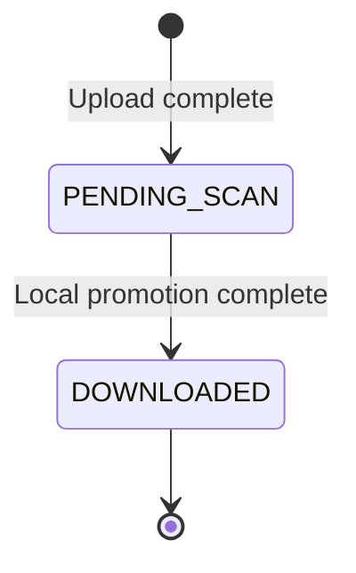

# 08. Standalone Local Promotion Transitions

**Goal**: Implement the standalone lifecycle transition from locally validated dirty content to clean content.

**Standalone lifecycle**:

**Rules**:

* `PENDING_SCAN -> DOWNLOADED` is the only normal standalone lifecycle transition after upload.
* The clean artifact must be written before metadata is finalized as `DOWNLOADED`.
* The dirty artifact must be deleted during successful promotion.
* If promotion fails after dirty persistence, the file remains unavailable to consumers and the dirty artifact is cleaned up or surfaced to an explicit recovery procedure.
* Standalone does not persist SFS scanner UUIDs, verdicts, or scanner error details.

**Event publication points**:

| Transition | Event Status |
|:---|:---|
| Upload complete | `PENDING_SCAN` |
| Local promotion complete | `DOWNLOADED` |
