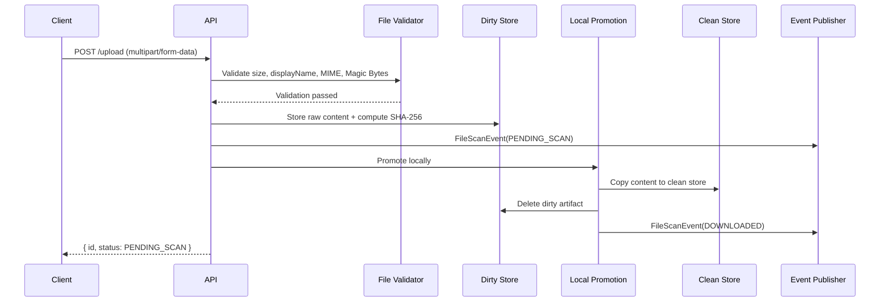
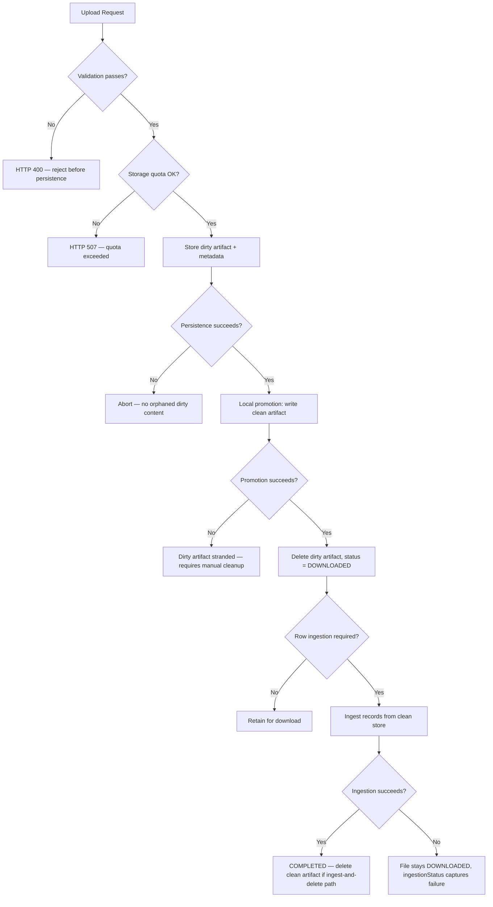
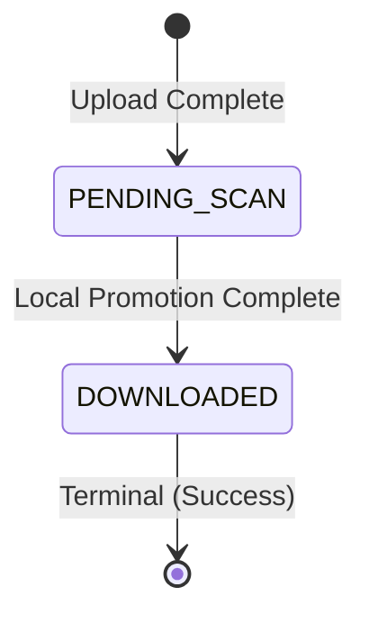

# File Management Application Standards — Standalone Profile (Core Lifecycle)

Parent: [Standalone File Management Index](../index.md)

> **Compliance note:** Both Base Standard and Org Standard are mandatory for all implementations. The layering separates universal practice from organization-specific compliance requirements for traceability and auditability purposes — it does not represent an opt-out boundary.

## Standards

* [Retain-for-Download Mode](./file_management_standards_standalone_retain.md) — Retrieval/removal API, bulk download, single download, removal
* [Ingest-and-Delete Mode](./file_management_standards_standalone_ingest.md) — Record-level ingestion trigger, processing rules, clean artifact deletion after ingestion

## 1. Overview

**Purpose**: Define the standalone reference standard for validating, ingesting, storing, and retrieving files on a single-node deployment that does not use an external scanner.

**Scope**: Standalone-profile backend services that accept file uploads, with local dirty/clean store separation, synchronous validation, and optional post-download record-level ingestion.

**Definitions**:
* **Dirty Store**: Temporary storage for files before the local promotion flow completes. In standalone mode it is short-lived and should not be exposed to consumers.
* **Clean Store**: Storage for validated files that are either retained for download or used as transient input to post-promotion ingestion.
* **Owner Scope**: The rule that only the uploading principal may list, download, bulk-download, or remove a file through the application-facing API.
* **Magic Bytes**: The first few bytes of a file used to verify its actual format, independent of extension or MIME type.
* **Terminal State**: A final file status that ends processing.
* **FileScanEvent**: The event emitted when a file changes state. The payload should carry `fileId`, `status`, and `eventTimestamp`.
* **Record-Level Ingestion**: Post-download processing that starts only after the file reaches `DOWNLOADED`, reads supported files from the Clean Store record by record for validation or downstream handling, and may delete the clean file artifact after ingestion when that business path is selected.

## 2. Standard Flow

### 2.1 Happy Path
1. **Upload**: Client submits the file using `multipart/form-data`.
2. **Validation**: Service synchronously validates size, display name, MIME type, extension consistency, and Magic Bytes.
   * *Decision*: If any check fails, reject immediately with HTTP 400.
3. **File and Metadata Storage**:
   * Compute SHA-256 hash of the input stream.
   * Generate a random UUID for the file.
   * Store raw content in the **Dirty Store**.
   * Create metadata with status `PENDING_SCAN`.
4. **Local Promotion**: Standalone does not use external scanning. After validation and persistence complete, the service promotes the file locally.
   * Copy or move content to the **Clean Store**.
   * Finalize metadata with status `DOWNLOADED`.
   * Delete the corresponding dirty-store artifact.
5. **Post-Promotion Business Handling**:
   * If the file is on the retain-for-download path, keep the clean artifact in the Clean Store for later retrieval. See [Retain-for-Download Mode](./file_management_standards_standalone_retain.md).
   * If the file is on the ingest-and-delete path, trigger record-level ingestion after the file reaches `DOWNLOADED`. See [Ingest-and-Delete Mode](./file_management_standards_standalone_ingest.md).

**Event Note**: Emit a `FileScanEvent` for the initial `PENDING_SCAN` state and again when the file reaches `DOWNLOADED`.

### Happy-Path Sequence Diagram

### 2.2 Failure Paths
* **Validation Failure**: Reject with HTTP 400 before any persistence.
* **Storage Quota Exceeded**: If aggregate storage exceeds `standalone.storage-quota-bytes`, reject the upload with HTTP 507.
* **Persistence Failure**: If metadata or file-content persistence fails, abort the request and avoid leaving orphaned dirty content.
* **Promotion Failure**: If writing the clean artifact fails after the dirty artifact is stored, keep the file unavailable to consumers and ensure cleanup or retry logic prevents a partial state.
* **Record-Level Ingestion Failure**: If post-download ingestion fails, the file remains `DOWNLOADED` while ingestion status captures the failure separately.

### Failure-Path Flowchart

### 2.3 Recommended Processing Rules
* **Scan-Before-Use Equivalent**: Even though no external scan occurs, consumers should download only retained files in `DOWNLOADED` status.
* **Atomic Transitions**: Metadata updates, clean artifact writes, dirty artifact cleanup, and event publication should be handled together so the file is not left in a partial state.
* **Zero-Byte Rejection**: Zero-byte files should usually be rejected immediately.
* **Extension Consistency**: The file extension should align with the format detected from Magic Bytes.
* **No Silent Failures**: Every terminal outcome should be paired with a `FileScanEvent`.
* **Dirty File Cleanup**: No dirty-store artifact should remain after local promotion succeeds or a terminal failure is recorded.

### 2.4 Standalone Profile Notes
* **No External Scanner**: This profile never calls an external malware scanning service.
* **No Polling Phase**: There is no Phase 2 poll loop and no Phase 3 remote clean-file retrieval.
* **Local Quota**: The default storage quota is enforced locally at 5 GB.
* **Shared Model Note**: The underlying shared implementation may still define scanner-related states and fields, but the standalone operational path should not rely on them.

## 3. Best Practices & Contracts

### 3.1 Inputs / Outputs
#### Base Standard
* **Content-Type**: `multipart/form-data` with a required file part.
* **Filename**: Sanitize filenames to prevent directory traversal attempts such as `../`.
* **Response**: Return JSON containing `{ id, status }`, with the initial status set to `PENDING_SCAN`.
* **Single Download Response**: Return the file as an attachment with validated `Content-Type` and `Content-Disposition` header values.
* **Bulk Download Response**: When bulk download is supported, return a ZIP attachment named `files.zip`.

#### Org Standard
* **Upload Request Fields**:

| Field | Required | Description |
|:---|:---|:---|
| `file` | Yes | The file content as a multipart part |
| `displayName` | Yes | User-facing filename, must match `^[a-zA-Z0-9_\\- ]+$` |
| `tags` | No | Optional string for categorization |

* **UploadedBy**: Principal ID captured from the security context.
* **Classification Notice**: For internal applications serving public officers, specify the highest permitted security and sensitivity classification for input data for file uploads. The classification notice must appear at or near the file upload input field.
* **Owner Scope**: List, single-download, bulk-download, and remove operations must be restricted to the uploading principal.
* **Bulk Download Rule**: Every requested file must be owned by the caller and already be in the retained final downloadable state.
* **Magic Bytes Registry**:
  * **PDF**: `25 50 44 46 2D`
  * **PNG**: `89 50 4E 47 0D 0A 1A 0A`
  * **JPEG**: `FF D8 FF DB`, `FF D8 FF E0`, `FF D8 FF E1`, `FF D8 FF E2`, `FF D8 FF EE`
  * **ZIP/OOXML**: `50 4B 03 04`

### 3.2 Error Contract
#### Base Standard
* **400 Bad Request**: Validation failures such as size, MIME type, Magic Bytes, encrypted PDF, or invalid display name.
* **403 Forbidden**: Attempt to download a file not in retained `DOWNLOADED` state.
* **404 Not Found**: File ID does not exist, or the file is outside the caller's owner scope.
* **422 Unprocessable Entity**: Record-level ingestion parsing or validation failure.
* **507 Insufficient Storage**: Storage quota exceeded.
* **500 Internal Server Error**: Unexpected local persistence or file-storage failure.

#### Org Standard
* **RFC 9457 Problem Details**: Error responses MUST include `type`, `title`, `status`, `detail`, `instance`, and `traceId`.
* **Retry Ownership**: All errors are terminal from the caller's perspective. No automatic retry mechanism exists in the standalone profile.
* **Exception Hierarchy (RFC 9457 ProblemDetail)**:

| Exception | HTTP Status | Thrown By | Recovery |
|:---|:---|:---|:---|
| `FileValidationException` | 400 Bad Request | Validators | Reject upload immediately |
| `FileNotFoundException` | 404 Not Found | Services | Log and return 404 |
| `RowParsingException` | 422 Unprocessable Entity | `RecordProcessor` | Mark row failed; continue |
| `RowProcessingException` | 422 Unprocessable Entity | Ingestion service | Mark row failed; persist error; continue |
| `StorageQuotaExceededException` | 507 Insufficient Storage | `StorageQuotaChecker` | Reject upload |
| `BlobNotFoundException` | 404 Not Found | `BlobStorage.readDirty/readClean` | Retry local promotion or mark terminal |
| `BlobStorageIOException` | 500 Internal Server Error | `BlobStorage` | Retry the local processing step |

* **Local Storage Exception Guidance**: Local storage exceptions are easier to troubleshoot when they include `fileId`, the storage operation (`write-dirty`, `write-clean`, `delete-dirty`, `read-clean`), the storage backend type, and the underlying persistence or I/O cause.
* **Storage Exception Equivalence**: Implementations MAY use different storage exception names when the backend is not database-blob-based, but they SHOULD preserve equivalent semantics for not-found and I/O failures in dirty and clean storage operations.

### 3.3 Audit Contract
#### Base Standard
* **Events**: Emit a `FileScanEvent` for every state transition that occurs in the standalone lifecycle.
* **Fields**: Events MUST include `fileId`, `status`, `eventTimestamp`, and `uploadedBy` (actor).

#### Org Standard
* **Integrator Responsibility**: `FileScanEvent` covers the file lifecycle audit trail. If additional business-level audit is required beyond state transitions (e.g., downstream ingestion outcomes or application-specific access logging), the integrator is responsible for emitting those events.
* **Recommended Event Publication Points**:

| Transition | Event Status |
|:---|:---|
| Upload complete | `PENDING_SCAN` |
| Standalone local promotion complete | `DOWNLOADED` |

### 3.4 Logging Contract
#### Base Standard
* **Levels**: `INFO` for transitions, `WARN` for recoverable processing issues, `ERROR` for terminal failures.
* **No Secrets**: Logs should not include raw file content or credentials.
* **Required Structured Fields**: Every log entry MUST include `trace.id`, `correlation.id`, `user.id` (when authenticated), and `file.id` (when in file-processing context) as MDC or structured log fields.

#### Org Standard
* **Structured Log Templates**:
  * `[FILE_UPLOADED]` File {} uploaded. Size={}, Type={}, By={}.
  * `[STATE_TRANSITION]` File {} transitioned to {}.
  * `[FILE_DOWNLOADED]` FileId={} locally promoted and available. Status: DOWNLOADED.
  * `[DIRTY_STORE_CLEANUP]` Deleted dirty-store artifact for fileId={} (Reason: {}).
  * `[PDF_VALIDATION_FAIL]` IOException during PDF encryption check: {}.
  * `[VALIDATION_ERROR]` File validation failed for displayName='{}'. Rule: {}. Reason: {}.
  * `[STORAGE_QUOTA_EXCEEDED]` Storage quota exceeded. Current: {} MB, Limit: {} MB, Requested: {} MB.
  * `[INGESTION_STARTED]` Starting record-level ingestion for fileId={} ({} rows).
  * `[INGESTION_COMPLETED]` Completed record-level ingestion for fileId={}. Processed: {}/{} rows. Status: {}.
  * `[INGESTION_FAILED]` Record-level ingestion failed for fileId={}. Attempt {}/5. Error: {}.
  * `[ROW_PARSE_ERROR]` Record {} parsing failed in fileId={}. Error: {}.

### 3.5 Security Contract
#### Base Standard
* **Defense in Depth**: Verify Magic Bytes instead of relying only on client-sent headers.
* **DoS Protection**: Reject by size limit before heavy processing. When file size is bounded by an enforced limit, materializing the full byte array after the size check is acceptable and avoids repeated reads of the underlying temp file.
* **Transport-Level Size Alignment**: The Spring multipart resolver `max-file-size` must equal the configured application-level maximum file size. A mismatch allows either false rejections (resolver limit lower) or unbounded memory/disk consumption before the application-level validation rejects the payload (resolver limit higher or unlimited).
* **Encrypted File Security**: Reject encrypted or password-protected files that cannot be safely inspected.
* **Attachment Header Safety**: Validate attachment filename and content type before writing them into download response headers.

#### Org Standard
* **Dirty/Clean Separation**: Keep dirty and clean storage physically separated even though promotion happens locally.
* **Retention**: Dirty files should be deleted immediately after successful local promotion or terminal failure.
* **Storage Quota**: Enforce `standalone.storage-quota-bytes` locally.
* **Anti-DoS Row Ingestion**: Parsers should prefer iterator patterns instead of loading the entire file into memory.
* **Owner Scope**: Do not disclose whether a non-owned file exists; return the same not-found behavior used for missing files.
* **Stranded Dirty Artifact Handling**: The standalone profile has no background scheduler or TTL-based cleanup. If the process crashes between dirty artifact creation and promotion completion, the dirty artifact is orphaned. Database-backed and filesystem-backed variants should define equivalent cleanup procedures for orphaned dirty-store artifacts (see Section 6.4 and [09. DirtyFileBlob Lifecycle](../recipes/shared/09-dirtyfileblob-lifecycle-consolidated.md)).

## 4. Architectural Design

### 4.1 Runtime Context
* **Deployment Model** *(Assumption)*: Single node, typically a field laptop or other standalone runtime.
* **Storage Model** *(Design Choice)*: The current standalone reference implementation uses database-backed dirty and clean storage by default. Database-backed storage remains acceptable for low- to moderate-volume standalone deployments with small files, controlled retention, and a preference for simpler transactional persistence in a single local runtime. A filesystem-backed local-storage variant MAY be configured when retained files are larger or longer-lived, when teams want cleaner operational separation between metadata persistence and retained file artifacts, or when local file handling is operationally preferred.
* **Operational Model** *(Enforced Constraint)*: Validation and promotion happen inside the application without external scanner dependencies.

### 4.2 State Model
* **Machine** *(Enforced Constraint)*: Finite State Machine (FSM) driven by `FILE_METADATA`.
* **Operational Phases** *(Enforced Constraint)*:
  * Upload and validation
  * Local promotion to clean storage
  * Optional record-level ingestion
* **State Transition Diagram**:

* **Operational FileStatus Values**:

| State | Classification | Description |
|:---|:---|:---|
| `PENDING_SCAN` | Transient | File uploaded and awaiting local promotion. |
| `DOWNLOADED` | Terminal (Success) | File promoted to clean storage, then either retained for download or used as transient ingestion input. |

* **Shared Enum Note**: The shared implementation may define additional scanner-related states, but they are not part of the normal standalone path.

### 4.3 Separation of Concerns
* **Hexagonal Architecture** *(Enforced Constraint)*: Core domain interacts with stable ports while the standalone profile supplies local adapters.

| Port | Standalone Adapter |
|:---|:---|
| `BlobStorage` | Local Database Blob Adapter by default, with an optional filesystem-backed local-storage variant |
| `ScanWorkflow` | Local Promotion Adapter |
| `RecordProcessor` | Direct Ingestion Adapter |
| `EventPublisher` | In-Process Event Adapter |

### 4.4 Concurrency Strategy

| Aspect | Standalone |
|:---|:---|
| Coordinator | Single process |
| Lock Mechanism | None |
| Lock Duration | N/A |
| Lock Timeout Behavior | N/A |
| Parallelization | Optional local parallelism only; no external scan submission phase |
| Ordering Guarantee | Sequential per request |
| Node Count | 1 |

### 4.5 Event-Driven Architecture
* **Internal Events** *(Design Choice)*: Spring `ApplicationEvent` remains the in-process decoupling mechanism.
* **Event Contract** *(Enforced Constraint)*: The payload remains `FileScanEvent` with `fileId`, `status`, and `eventTimestamp`.
* **Downstream Trigger** *(Enforced Constraint)*: Record-level ingestion should start only after the `DOWNLOADED` event is emitted, should read the file from the Clean Store, and should delete the clean artifact afterward when the ingest-and-delete path is selected.

### 4.6 Persistence and Storage Contracts
* **Metadata System of Record** *(Enforced Constraint)*: Durable file metadata remains the lifecycle system of record, regardless of whether file content is stored in database BLOBs or local filesystem artifacts.
* **Required Metadata Facts** *(Enforced Constraint)*: Standalone implementations must persist file identity, owner, display name, file size, MIME type, extension, SHA-256 hash, upload timestamp, lifecycle status, and any record-level ingestion tracking required by the selected business path.
* **Dirty/Clean Separation** *(Enforced Constraint)*: Dirty and clean artifacts must remain logically and physically separate. Dirty content must not be downloadable through the application-facing API.
* **Promotion Durability** *(Enforced Constraint)*: A file may be marked `DOWNLOADED` only after the clean artifact has been written successfully and the metadata update can be committed consistently with dirty-artifact cleanup.
* **Storage Backend Replaceability** *(Design Choice)*: The default standalone reference implementation uses database-backed dirty and clean content. Filesystem-backed local storage MAY be used when metadata remains authoritative and dirty/clean locators preserve the same lifecycle invariants.
* **Implementation Recipes**: Entity fields, table names, database DDL, storage-location variants, standalone wiring, and lazy BLOB mapping guidance belong in [25. Code Organization & Package Structure](../recipes/shared/25-code-organization-package-structure.md), [24. Standalone Bean Registration](../recipes/standalone/24-standalone-bean-registration.md), [21. Standalone Configuration Properties](../recipes/standalone/21-standalone-configuration-properties.md), [14. Hibernate 7 LOB Strategy](../recipes/shared/14-hibernate-7-lob-strategy.md), and [09. DirtyFileBlob Lifecycle](../recipes/shared/09-dirtyfileblob-lifecycle-consolidated.md).

### 4.7 Dirty Store Artifact Lifecycle

* **Pre-Persistence Validation Failure** *(Enforced Constraint)*: Dirty artifacts must not be created when validation rejects the upload before persistence.
* **Successful Promotion Cleanup** *(Enforced Constraint)*: The `PENDING_SCAN` -> `DOWNLOADED` transition must delete the dirty artifact.
* **Failed Promotion Handling** *(Enforced Constraint)*: If local promotion fails after dirty persistence, the file must remain unavailable to consumers and the dirty artifact must be cleaned up or made visible to an explicit recovery procedure.
* **Implementation Recipes**: Concrete deletion hooks, local promotion transitions, and storage-backend-specific cleanup steps belong in [09. DirtyFileBlob Lifecycle](../recipes/shared/09-dirtyfileblob-lifecycle-consolidated.md) and [08. Standalone Local Promotion Transitions](../recipes/standalone/08-standalone-local-promotion-transitions.md).

### 4.8 Enforced Constraints (Negative Requirements)

| Constraint | Enforcement |
|:---|:---|
| Full file materialization during upload validation | Acceptable when file size is bounded by an enforced limit; reject by size before calling `getBytes()` |
| Dirty artifact surviving after local promotion | Delete the dirty artifact when `DOWNLOADED` is recorded |
| Missing event publication on completion | Publish a `FileScanEvent` for `PENDING_SCAN` and `DOWNLOADED` |
| Storage quota not enforced | Reject uploads once aggregate storage exceeds `standalone.storage-quota-bytes` |
| Full file materialization during row ingestion | Use iterators or streaming readers and flush in batches |

### 4.9 Framework & Infrastructure

* **Persistence** *(Enforced Constraint)*: Database-backed binary content must not be eagerly materialized during metadata queries. See [14. Hibernate 7 LOB Strategy](../recipes/shared/14-hibernate-7-lob-strategy.md) for the reference lazy-loading implementation.
* **Coordination** *(Enforced Constraint)*: No distributed coordinator is required because this profile runs as a single node.
* **ID Generation** *(Enforced Constraint)*: Primary keys MUST use random UUIDs generated by the persistence layer.
* **Promotion Model** *(Design Choice)*: Local promotion replaces the multi-phase external scanning workflow used in scanner-backed deployments.

## 5. Test & Validation Standard

### 5.1 Unit Tests
* **Magic Bytes**: Verify signatures for all supported formats, including all JPEG variants.
* **PDF Encryption Check**: Verify that encrypted and password-protected PDFs are rejected at upload time.
* **Local Promotion**: Verify `PENDING_SCAN` transitions directly to `DOWNLOADED` and deletes the dirty artifact.
* **Display Name**: Verify the regex pattern matches the spec.

### 5.2 Integration Tests
* **Profile Acceptance**: Standalone acceptance tests should verify immediate promotion without scanner calls.
* **Validation Failures**: Verify HTTP 400 for each validation failure type (size, display name regex, MIME type, Magic Bytes mismatch, encrypted PDF).
* **Storage Quota**: Verify HTTP 507 when aggregate storage exceeds `standalone.storage-quota-bytes`.
* **Event Publication**: Verify `FileScanEvent` is emitted for both `PENDING_SCAN` and `DOWNLOADED` on each upload.

### 5.3 Integrator Responsibilities
The library consumer is responsible for:
* Testing custom MIME type registries and any application-specific accepted-type configuration.
* Testing downstream ingestion handlers and row-processing logic beyond the framework-provided ingestion port contract.
* Testing application-specific audit events beyond `FileScanEvent`.
* Verifying profile-specific bean wiring in the consumer's Spring context.

### 5.4 Test Data Guidelines
* Use synthetic test files with deterministic content. Do not use real user-uploaded files.
* Pin Magic Bytes sequences for each supported format (PDF: `25 50 44 46 2D`, PNG: `89 50 4E 47 0D 0A 1A 0A`, JPEG variants, ZIP/OOXML: `50 4B 03 04`).
* Use boundary values for `min-size` and `max-size` to test size validation edges.
* Do not include PII, real credentials, or production data in test fixtures.
* For encrypted PDF detection tests, use a purpose-built encrypted sample file, not a production document.

## 6. Operational Runbook

### 6.1 Configuration

#### Processing Properties

Standalone uses a profile-specific configuration subset. The implementation may still inherit shared application properties, but external scanner integration is not part of this profile.

| Property | Type | Default | Description |
|:---|:---|:---|:---|
| `standalone.storage-quota-bytes` | `long` | `5368709120` | Max aggregate file storage for the standalone profile (5 GB) |
| `transaction-timeout-upload-ms` | `long` | `30000` | Upload transaction timeout |
| `transaction-timeout-ingestion-ms` | `long` | `1800000` | Row-level ingestion timeout |
| `ingestion-batch-flush-size` | `int` | `500` | Rows per flush during ingestion |

#### Filesystem-Backed Variant Properties

These properties apply only when the optional filesystem-backed standalone variant is enabled. The default standalone reference implementation remains database-backed.

| Property | Type | Default | Description |
|:---|:---|:---|:---|
| `standalone.storage.backend` | `String` | `DATABASE` | Storage backend selection for standalone file content (`DATABASE` or `FILESYSTEM`) |
| `standalone.storage.dirty-dir` | `String` | `null` | Managed local directory for dirty-store artifacts when `standalone.storage.backend=FILESYSTEM` |
| `standalone.storage.clean-dir` | `String` | `null` | Managed local directory for clean-store artifacts when `standalone.storage.backend=FILESYSTEM` |

#### Upload/Validation Properties

| Property | Type | Default | Description |
|:---|:---|:---|:---|
| `min-size` | `long` | `1` | Minimum file size in bytes |
| `max-size` | `long` | `10485760` | Maximum file size in bytes |
| `accepted-mime-types` | `List<String>` | `null` | Allowed MIME types; `null` means accept all |
| `row-ingestion-mime-types` | `List<String>` | `null` | MIME types eligible for record-level ingestion |

### 6.2 Observability

Key log patterns operators should monitor:

| Pattern | Meaning | Action |
|:---|:---|:---|
| `[DIRTY_STORE_CLEANUP]` absent after uploads | Dirty-store artifacts may be accumulating | Inspect the configured dirty-store backend for orphaned content |
| `[STORAGE_QUOTA_EXCEEDED]` appearing | Storage nearing or at capacity | Free space or increase `standalone.storage-quota-bytes` |
| `[INGESTION_FAILED]` repeated for same `fileId` | Ingestion retries exhausting | Investigate file content or ingestion handler |
| `[VALIDATION_ERROR]` spike | Clients submitting invalid files | Review client-side validation or accepted-type configuration |

### 6.3 Manual vs Self-Healing Error Modes

| Error Mode | Self-Healing? | Operator Action |
|:---|:---|:---|
| Validation failure (400) | N/A — rejected synchronously | None; caller must fix the request |
| Storage quota exceeded (507) | No | Free storage or increase `standalone.storage-quota-bytes` |
| Promotion failure (dirty artifact stranded) | No — no background cleanup exists | Manually clean up orphaned dirty-store content in the configured backend |
| Ingestion failure | Partially — `ingestionAttempts` tracks retries if the implementation retries | Investigate file content; re-trigger ingestion if needed |
| Database unavailable | No | Restore database connectivity |

### 6.4 External Failure Sources

| Dependency | Impact When Unavailable |
|:---|:---|
| Metadata database | Metadata writes/reads fail, so uploads, promotions, and downloads cannot complete correctly |
| Local file-content backend | Dirty/clean file-content reads or writes fail, so uploads, promotions, and downloads cannot complete correctly |
| Filesystem-backed storage directories | When the optional filesystem variant is enabled, dirty/clean file reads or writes fail if the configured directories are unavailable or mispermissioned |
| In-process event bus | `FileScanEvent` publication may fail silently if not transactionally bound to the promotion |
| External scanner | Not applicable — standalone profile has no external scanner dependency |

## 7. Appendix

### Standards Referenced
* **RFC 9457**: Problem Details for HTTP APIs
* **NIST 800-53 SI-10**: Input Validation — enforced through Magic Bytes verification (Section 3.5, Defense in Depth) and display name regex validation (Section 3.1, Org Standard)
* **OWASP**: File Upload Cheat Sheet

### Glossary

| Term | Meaning |
|:---|:---|
| Clean Store | Storage for validated files that are either retained for download or used as transient input to post-promotion ingestion. |
| Dirty Store | Temporary storage for files before the local promotion flow completes. |
| FileScanEvent | The event emitted when a file changes state. The payload carries `fileId`, `status`, and `eventTimestamp`. |
| FK | Foreign Key |
| FSM | Finite State Machine |
| LOB | Large Object (database binary content) |
| Magic Bytes | The first few bytes of a file used to verify its actual format, independent of extension or MIME type. |
| Owner Scope | The rule that only the uploading principal may list, download, bulk-download, or remove a file through the application-facing API. |
| Record-Level Ingestion | Post-download processing that reads supported files from the Clean Store record by record. |
| SHA-256 | Secure Hash Algorithm, 256-bit |
| Terminal State | A final file status that ends processing. |
| MDC | Mapped Diagnostic Context (structured logging) |
| MIME | Multipurpose Internet Mail Extensions (content type) |
| OOXML | Office Open XML (ZIP-based document format) |
| PK | Primary Key |
| UUID | Universally Unique Identifier |

## 8. Changelog

| Version | Date | Description | Files Changed |
|:---|:---|:---|:---|
| 1.0.2 | 2026-06-25 | Split monolithic standard into core/retain/ingest matching AWS convention. | All |
| 1.0.1 | 2026-04-24 | Clarified that the standalone reference implementation remains database-backed by default, while preserving a filesystem-backed variant as an optional local-storage path. | Core |
| 1.0.0 | 2026-04-13 | Initial publication | All |
