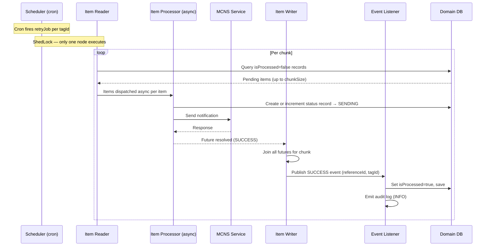
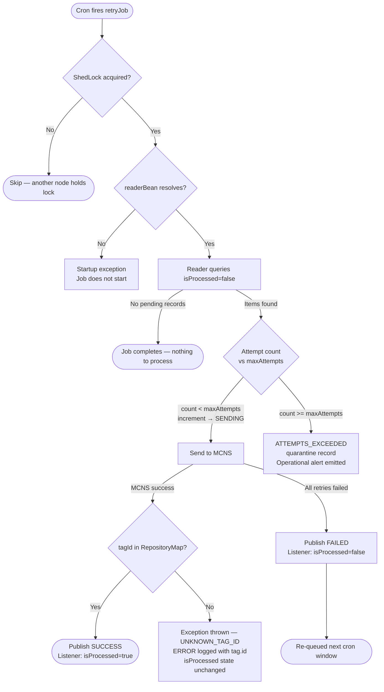
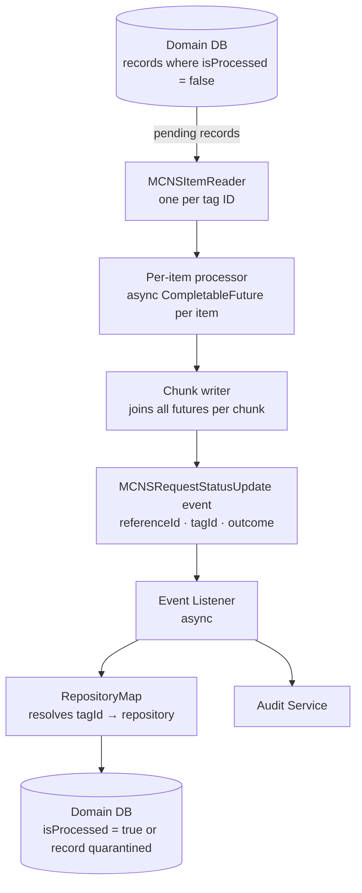

# MCC Notification and Communication Service (MCNS) — Batch Retry Standard

## 1. Overview

**Purpose**: To define requirements for the batch retry pipeline that augments the core MCNS integration with durable, scheduled retries of failed or pending notifications.

**Prerequisite**: The [Core MCNS Standard](../MCNS_Core/MCNS_Core_Standard.md) is a hard prerequisite — the batch retry pipeline is built on top of core and cannot function without it. Teams must fully implement the core integration before applying this standard. This standard describes the batch retry extension only.

**Relationship to Core retry**: The batch pipeline is a higher-order recovery mechanism, not a replacement for Core's Resilience4j retry. Core retry handles transient HTTP failures fast, synchronously, and in-process — each attempt is invisible to the caller and resolves within the same send call. Batch retry operates only on notifications where Core has already exhausted all of its retry attempts: it re-queues them as durable domain records for recovery in a future cron window. Both layers must be in place; neither substitutes for the other.

**Scope**: Server-side Java applications that require scheduled, fault-tolerant retry of MCNS notifications using Spring Batch and ShedLock, with retry state persisted in a relational store.

**Definitions**:

*   **Tag ID**: A logical grouping label that identifies a batch of notification requests. Each tag ID maps to one scheduled retry job with its own cron expression and item reader. Must be registered in `RepositoryMap` to enable event routing.
*   **Reference ID**: A UUID that uniquely identifies a single notification request across the retry lifecycle. Assigned at domain record creation and must not change.
*   **RepositoryMap**: An application component that maps tag ID strings to their corresponding domain repositories. Used by the event listener to resolve the correct repository when routing batch outcome events across multiple tag IDs. All active tag IDs must be registered in `RepositoryMap`.
*   **System Identity**: A configured service account identifier that the batch pipeline provides as the sender identity on all MCNS calls and audit entries. Set once at startup and reused for every item the pipeline dispatches. Example: `system:mcns-batch-processor`. Must be configured by the integrator — there is no user context at job execution time.


## 2. Standard Flow

### 2.1 Batch Retry Happy Path

On each cron trigger, the pipeline reads pending records, processes them asynchronously per chunk, and closes the loop via an event listener.



### 2.2 Failure Paths

Each failure branch is handled without interrupting other items in the chunk. For exception types and HTTP mappings see Section 3.1 Error Contract.




## 3. Contracts

### 3.1 Error Contract

#### Base Standard

| Trigger | Error Category | Error Type | HTTP Status | Retryable |
|:---|:---|:---|:---|:---|
| Max attempts exceeded for a reference ID | `network` | `MAX_ATTEMPTS_EXCEEDED` | `429 Too Many Requests` or suppress | Terminal — no further automatic retries |
| tagId not found in RepositoryMap | `app` | `UNKNOWN_TAG_ID` | `404 Not Found Error` or `500 Internal Server Error` | No — requires `RepositoryMap` registration fix and restart |


<enforced-constraint>**tagId not found in RepositoryMap must throw an exception — silent dropping is not permitted.** All active tag IDs must be registered in `RepositoryMap` before the job runs. An unregistered tag ID at runtime indicates a configuration defect that requires a code fix and restart.</enforced-constraint>

---

### 3.2 Audit Contract

#### Base Standard

All batch notification dispatch operations must emit an auditable event for each item processed, regardless of outcome.

| Trigger | Log Level | Fields |
|:---|:---|:---|
| Successful send of a single notification | `INFO` | `reference.id` = `referenceId`; `sender.id` = `senderId`; `event.action` = `NOTIFICATION_SEND_RETRY`; `event.outcome` = `success` |
| Item re-queued for next cron window | `WARN` | `reference.id` = `referenceId`; `sender.id` = `senderId`; `event.action` = `NOTIFICATION_SEND_RETRY`; `event.outcome` = `partial` |
| Max attempts exceeded | `ERROR` | `reference.id` = `referenceId`; `sender.id` = senderId; `event.action` = `NOTIFICATION_SEND_RETRY`; `event.outcome` = `failure`; `error.message`: Max retry attempts exceeded; `error.code`: 429; `error.category`: `network`  |
| Domain record moved to quarantine table | `INFO` | `reference.id` = `referenceId`; `sender.id` = `senderId`; `event.action` = `NOTIFICATION_QUARANTINE`; |
| tagId not found in RepositoryMap | `ERROR` | `tag.id` = `tagId`; `error.message`: Tag ID not found; `error.code`: 404; `error.category`: `app` |

<enforced-constraint>`MAX_ATTEMPTS_EXCEEDED` must trigger an **operational alert** in addition to the audit entry as no further automatic retries will occur and manual intervention is required.</enforced-constraint>

For the complete list of required standard fields and batch job logging conventions (job start/end), refer to the [App Standard: Structured Logging](../../../Appfw-Logging-Standards/Structured_Logging_Application_Standard.md) and the [Batch Logging Guide](../../../Appfw-Logging-Standards/Recipes/Logging_Batch_And_Scheduled_Jobs.md). The MCNS-specific fields in the table above are required in addition to those standard fields.

---

### 3.3 Security Contract

#### Base Standard

<enforced-constraint>ShedLock must be configured to prevent concurrent batch job execution across nodes. A `LockProvider` bean must be provided.</enforced-constraint>

ShedLock prevents concurrent runs across nodes but does not eliminate duplicate sends — a crash between the chunk commit and the event listener write can still cause a record to be re-sent. See [Section 4.2 — Delivery semantics](#42-design-choices) for the accepted trade-off.


## 4. Implementation Approach

### 4.1 Architecture Overview

The batch retry pipeline is built entirely by the application using Spring Batch and ShedLock. The four core components are:

<enforced-constraint>`jobDateTime` must be passed as a job parameter so every scheduled execution is treated as a distinct job instance in the Spring Batch metadata tables. Omitting it causes Spring Batch to reject re-runs of the same logical job.</enforced-constraint>



**MCNSItemReader** — one per tag ID, queries the domain table for records where `isProcessed = false` and returns them to the pipeline. Returns `null` when exhausted to signal end-of-chunk to Spring Batch. The reader does not read from or join to `MCNSRequestStatusDetails`.

<enforced-constraint>The reader bean name must exactly match the `readerBean` value configured for the corresponding tag ID. A mismatch causes a startup exception and the job does not run.</enforced-constraint>

**Per-item processor** — receives each item as a `CompletableFuture`, writes to the retry status record, and dispatches the MCNS call:

1. Reads the current `MCNSRequestStatusDetails` record for the `referenceId` (or creates one if none exists).
2. If `attemptCount >= maxAttempts`: sets status → `ATTEMPTS_EXCEEDED`, publishes the `ATTEMPTS_EXCEEDED` event, and does not call MCNS.
3. Otherwise: increments `attemptCount`, sets status → `SENDING`, and calls MCNS.

**Chunk writer** — joins all `CompletableFuture` results for the chunk and updates the retry status record:

- If the future resolves (MCNS call succeeded): sets status → `SUCCESS`, stores `MessageDetailsResponse.msgId` on the status record for downstream delivery tracking, publishes `MCNSRequestStatusUpdate(SUCCESS)` event.
- If the future throws (MCNS call failed): sets status → `FAILED`, publishes `MCNSRequestStatusUpdate(FAILED)` event.

**System identity bean** — a configured service account identifier injected at job startup (e.g. `system:mcns-batch-processor`). The per-item processor provides it as the sender identity on every MCNS call and audit entry. Simple and auditable; requires the integrator to configure it.

**Domain entity and repository** — one domain table per notification type holds the pending request data alongside an `isProcessed` flag and a `referenceId` UUID. The repository must provide `findByReferenceId(UUID)`, which the event listener uses to close the loop.

**RepositoryMap** — a single component that maps each tag ID to its domain repository. When batch outcome events arrive, the listener uses `RepositoryMap` to route to the correct repository without needing per-tag-ID listener logic.

**Event listener** — listens for `MCNSRequestStatusUpdate` events published by the writer and updates the domain table. Runs asynchronously so it does not block the writer thread.

<enforced-constraint>The event listener is the only component that writes `isProcessed` on the domain entity. No other component may modify this flag.</enforced-constraint>

- `SUCCESS` → set `isProcessed = true` on the domain record; emit audit log (`INFO`)
- `FAILED` → leave `isProcessed = false` so the reader picks it up on the next run; emit audit log (`WARN`)
- `ATTEMPTS_EXCEEDED` → quarantine the domain record; emit operational alert
- `UNKNOWN_TAG_ID` → throw an exception; emit `ERROR` log with `tag.id`

<enforced-constraint>**`UNKNOWN_TAG_ID` must be configured as a skippable exception in the Spring Batch step.** The job must continue processing remaining items in the chunk — do not let a missing tag ID registration abort the entire job. The skip must be loud: emit an `ERROR` log including the `tag.id` and trigger an operational alert. `isProcessed` remains unchanged. The item is not re-queued — `UNKNOWN_TAG_ID` is a configuration defect, not a transient failure. Resolution requires a `RepositoryMap` registration fix and restart.</enforced-constraint>

### 4.2 Design Choices

<design-choice>**Domain record fate after successful send**: When `SUCCESS` is received, the event listener sets `isProcessed = true` by default, retaining the record for audit and manual re-queue. Alternatively, the record may be **deleted outright** if no local send history is needed and storage overhead is a concern. Consider: keeping `isProcessed = true` records preserves an audit trail and allows re-queuing by resetting the flag; deletion is cleaner but removes the payload from the domain table permanently.</design-choice>

<enforced-constraint>**Records that reach `ATTEMPTS_EXCEEDED` must be quarantined** — moved to a terminal, non-reprocessable state so the reader cannot pick them up again and no further automatic retries occur. The quarantine must preserve the `referenceId`, `attemptCount`, and failure reason for audit purposes. An operational alert must be emitted — manual intervention is required.</enforced-constraint>

<design-choice>**Quarantine implementation**: The mechanism is the integrator's choice — a separate quarantine table, a dead-letter store, or an in-place terminal status flag on the domain record. The constraint is that the implementation must be non-reprocessable and must retain `referenceId`, `attemptCount`, and failure reason.</design-choice>

<design-choice>**Delivery semantics — at-least-once vs exactly-once**: The default pipeline provides **at-least-once delivery**. If a node crashes after MCNS accepts the notification but before the event listener sets `isProcessed = true`, the record will be re-sent on the next cron run. To achieve **exactly-once semantics**, either the MCNS recipient must be idempotent on `referenceId`, or the processor must perform a pre-send deduplication check (e.g. query a sent-IDs store before dispatching). At-least-once is sufficient when duplicate notifications are tolerable; exactly-once adds infrastructure complexity and should only be applied where duplicates have a real business impact.</design-choice>

### 4.3 State Model

Two separate database tables track each notification through the pipeline. The domain table owns the payload and re-queue gate; `MCNSRequestStatusDetails` owns all retry-tracking state. This separation keeps retry concerns out of the domain model — the domain table does not carry attempt count or status columns.

**Domain table** (one per notification type):

| Column | Type | Purpose |
|:---|:---|:---|
| `referenceId` | `UUID` | Unique identifier for this notification request; must not change after creation |
| `isProcessed` | `boolean` | Reader gate — `false` means eligible for retry; set to `true` only by the event listener on `SUCCESS` |
| notification payload | (domain-specific) | The data needed to construct the MCNS request (recipient, template ID, template values, etc.) |

**`MCNSRequestStatusDetails` table**:

| Column | Type | Purpose |
|:---|:---|:---|
| `referenceId` | `UUID` | Foreign key to the domain record |
| `attemptCount` | `int` | Number of send attempts made; incremented by the per-item processor on each attempt |
| `status` | `enum` | Current send status — written by the per-item processor (`SENDING`, `ATTEMPTS_EXCEEDED`) and the chunk writer (`SUCCESS`, `FAILED`) |
| `msgId` | `String` | Per-recipient message ID returned by MCNS (`MessageDetailsResponse.msgId`); null until `SUCCESS` — use for downstream delivery tracking |

`MCNSRequestStatusDetails.status` lifecycle:
```
(no record) → SENDING → SUCCESS / FAILED / ATTEMPTS_EXCEEDED
```

`isProcessed` transitions:
```
false (initial) → false (SENDING / FAILED) → true (SUCCESS) / quarantined (ATTEMPTS_EXCEEDED)
```

The two tables are kept consistent through the `MCNSRequestStatusUpdate` event. If the event listener fails with `UNKNOWN_TAG_ID`, the item is skipped (not re-queued) — `isProcessed` stays `false` and the record remains in the domain table, but the skip policy prevents further processing until the configuration defect is resolved. For other listener failures, `isProcessed` stays `false` and the record is re-queued on the next run; `attemptCount` will continue incrementing.

<enforced-constraint>`attemptCount` is persisted in `MCNSRequestStatusDetails` and survives application restarts. `isProcessed` on the domain entity is managed solely by the event listener and must not be modified by any other component.</enforced-constraint>

### 4.4 Async Processing

Each item within a chunk is dispatched as a `CompletableFuture` by the per-item processor. The chunk writer joins all futures for the chunk before committing, so parallelism is scoped per chunk rather than running unbounded across the entire job.

<enforced-constraint>Items within a chunk are processed asynchronously in parallel; chunks themselves are committed sequentially. This guarantees that state is persisted at chunk boundaries even if individual items fail.</enforced-constraint>

<enforced-constraint>A dedicated bounded `ThreadPoolExecutor` must be provided for MCNS batch sends. Do not rely on the JVM common `ForkJoinPool` — it is shared across all async work in the application, provides no isolation, and cannot be sized for MCNS-specific throughput requirements.</enforced-constraint>

<design-choice>With a bounded executor, effective concurrency per chunk is `min(chunkSize, maxPoolSize)`. Size both together:
- `chunkSize` caps how many items are in-flight before a chunk commits and state is persisted
- `maxPoolSize` caps how many of those items are actually executing concurrently
- Set `maxPoolSize` ≤ `chunkSize`; a pool larger than `chunkSize` adds threads that can never all be used within a single chunk
- The default rejection policy is `CallerRunsPolicy` — when the queue is full, the submitting thread runs the task itself, providing natural back-pressure rather than throwing a rejection exception
</design-choice>


## 5. Test Requirements

### 5.1 Required Batch Tests

**Batch pipeline:**
*   First-time item: no `MCNSRequestStatusDetails` record exists → verify record created with status `SENDING`, `attemptCount = 1`.
*   Retry increment: existing record with `attemptCount = 1` → run batch again → verify `attemptCount = 2`, status `SENDING`.
*   Max attempts: seed `MCNSRequestStatusDetails` with `attemptCount = maxAttempts` → verify `MaxAttemptsExceededException` thrown, status set to `ATTEMPTS_EXCEEDED`, event published.
*   Writer SUCCESS path: mock `MCNSRequestCommand` to return a valid `MCNSResponse` → verify `MCNSRequestStatusDetails` status set to `SUCCESS`, `msgId` populated from the response, and `MCNSRequestStatusUpdate(SUCCESS)` event published.
*   Writer FAILED path: mock `MCNSRequestCommand` to throw → verify status set to `FAILED` and `MCNSRequestStatusUpdate(FAILED, errorMsg)` event published with null `mcnsResponse`.
*   readerBean name mismatch: set `readerBean` in configuration to a name not matching any registered bean → verify `MissingMCNSConfigurationException` at step build time, job does not start.
*   Concurrent chunks: run multiple chunks in parallel → verify no status corruption across reference IDs in `MCNSRequestStatusDetails`.

**Event listener and domain state:**
*   SUCCESS closes the loop: trigger `MCNSRequestStatusUpdate(SUCCESS)` event → verify event listener sets `isProcessed = true` on the domain record and saves.
*   FAILED leaves record open: trigger `MCNSRequestStatusUpdate(FAILED)` event → verify `isProcessed` remains `false`; verify record is returned by the reader on the next batch run.
*   ATTEMPTS_EXCEEDED quarantines domain record: trigger `MCNSRequestStatusUpdate(ATTEMPTS_EXCEEDED)` event → verify domain record is moved to a terminal, non-reprocessable state with `referenceId`, `attemptCount`, and failure reason preserved.
*   RepositoryMap routes by tagId: register two tag IDs in `RepositoryMap`; trigger events for each → verify each event resolves to the correct repository with no cross-contamination.
*   Unknown tagId throws exception: trigger event for a tagId not registered in `RepositoryMap` → verify exception thrown and `ERROR` logged with `tag.id` = tagId; verify `isProcessed` is not modified.
*   Reader skips processed records: seed domain records with `isProcessed = true` → verify reader returns `null` immediately and no `MCNSRequestStatusDetails` records are created or incremented.

### 5.2 Test Data Guidelines

*   Use deterministic UUIDs and fixed cron schedules for reproducible batch tests.
*   Use mock email values (e.g. `test@example.gov.sg`). For phone numbers, use your own number or an organisation-owned test number — do not use arbitrary E.164 numbers, as real MCNS calls in integration tests will send SMS to whoever owns that number. Avoid real PII in test fixtures.
*   Use in-memory H2 for `MCNSRequestStatusDetails` and Spring Batch metadata in unit and integration tests.
*   Mock `MccAuthenticatedClientProvider` (specifically its `backgroundClient()`, since batch retry runs outside servlet request state) to control MCNS service responses without network calls.


## 6. Operational Guidance

### 6.1 Configuration Reference

Prefix: `spring.eds.mcc.mcns.retry`

| Key | Default | Description |
|:---|:---|:---|
| `systemIdentity` | — | Service account identifier used as the sender identity on all batch-dispatched MCNS calls and audit entries (required) |
| `enabled` | `false` | Enable/disable the batch retry module |
| `maxAttempts` | `5` | Max batch retry attempts per referenceId |
| `chunkSize` | `1000` | Items processed per chunk |
| `tagId` | — | Map of tagId → `{ cronExpression, readerBean }` |
| `executor.corePoolSize` | `10` | Warm threads kept alive between chunks |
| `executor.maxPoolSize` | `20` | Hard concurrency ceiling; must be ≤ `chunkSize` |
| `executor.queueCapacity` | `100` | Tasks queued when all threads are busy |
| `executor.rejectionPolicy` | `CallerRunsPolicy` | Rejection policy when queue is full — submitting thread runs the task, providing back-pressure |

### 6.2 Monitoring and Alerts

| Alert | Threshold | Action |
|:---|:---|:---|
| `ATTEMPTS_EXCEEDED` events per hour | > 0 | Investigate root cause; manually re-queue or escalate |
| Batch job exit status FAILED | Any | Check `BATCH_JOB_EXECUTION` table for error detail |
| `MCNSRequestStatusDetails` FAILED count | Trending up | Check MCNS service; review error messages |
| ShedLock not acquired (missed runs) | Consecutive misses | Check lock table and scheduler health |
| Domain records with `isProcessed = false` beyond SLA | Any | Check event listener registration; verify all active tag IDs are in `RepositoryMap` |
| `MissingMCNSConfigurationException` at startup | Any | Verify `readerBean` value in config matches `@Component` name on reader class (case-sensitive) |

### 6.3 Error Recovery

| Error Type | Recovery |
|:---|:---|
| Transient MCNS service error | Batch retry cron provides further recovery beyond the core synchronous retries. |
| Persistent MCNS service failure | After `maxAttempts` batch attempts exhausted, record is `ATTEMPTS_EXCEEDED`. Manual intervention required to re-queue. |
| ShedLock node crash | Lock expires after `lockAtMostFor`. Configure `lockAtMostFor` and `lockAtLeastFor` appropriately. |
| Database connectivity loss | Batch step aborts; in-flight `SENDING` records remain until the next successful run. |
| `MissingMCNSConfigurationException` at startup | Verify `readerBean` value in `application.yml` exactly matches the `@Component` name on the reader class (case-sensitive). Requires configuration fix and restart. |


## 7. Appendix

### Standards Referenced

*   **Spring Batch** — Chunk-oriented processing model for the retry pipeline.
*   **ShedLock** — Distributed lock contract for scheduled Spring Batch jobs.
*   **OWASP A02:2021 — Cryptographic Failures**: SSO credentials and sender identity must not be exposed in logs or source code.

*   2026-04-06 — v1.1 reframed as app-owned implementation standard (no library/integrator split); updated definitions, flow, architecture, and state model accordingly.
*   2026-04-01 — v1.0 initial draft.
