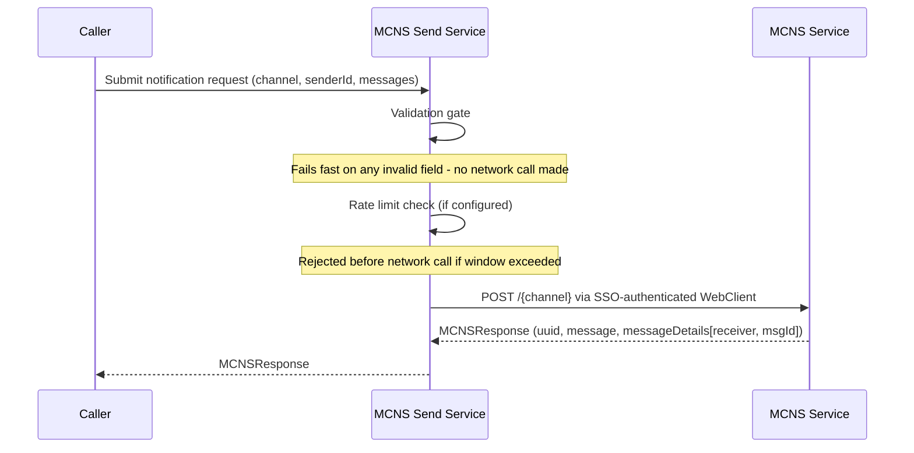
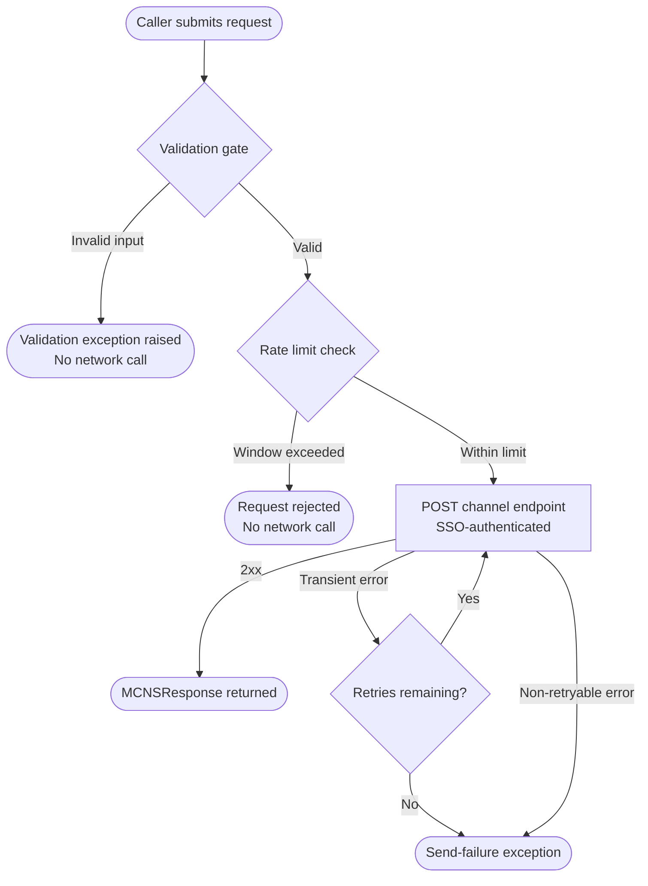

# MCNS — Core Integration Standard

## 1. Overview

**Purpose**: To define the minimum requirements for integrating the MCNS notification service into an application for synchronous (immediate) notification sends.

**Scope**: Server-side Java applications that dispatch SMS or email notifications via the MCNS service. Applies to services that supply an MCC-authenticated `WebClient` obtained from the [MCC Shared Auth Foundation](../../Appfw-Shared-Auth-Standards/MCC_Shared_Auth_Standard.md)'s `MccAuthenticatedClientProvider` (see [Shared Auth Recipes, Recipe 4](../../Appfw-Shared-Auth-Standards/MCC_Shared_Auth_Recipes.md#recipe-4-expose-request-context-and-background-authenticated-clients)).

**Definitions**:

*   **Channel**: The notification transport channel — `email` or `sms`. Determines recipient format validation and the endpoint path used for the request.
*   **Sender ID**: The originating address or number identifying the notification sender. Set by the caller when constructing the notification request. For background callers such as the batch retry pipeline, a static system identity (e.g. `system:mcns-batch-processor`) must be used in place of a user-derived identity — see the [MCNS Batch Retry Standard](../MCNS_Batch/MCNS_Batch_Standard.md).
*   **Retry**: Automatic re-attempt of a failed MCNS request, up to a configurable number of times, with a configurable wait duration between attempts.
*   **Rate Limiting**: A configurable cap on the number of requests dispatched within a sliding time window. Requests exceeding the limit are rejected before any network call.


## 2. Standard Flow

<assumption>The MCC-authenticated `WebClient` is constructed and owned by the calling application, sourced from the [MCC Shared Auth Foundation](../../Appfw-Shared-Auth-Standards/MCC_Shared_Auth_Standard.md)'s `MccAuthenticatedClientProvider`. The send service accepts the configured WebClient and does not manage its lifecycle. The calling application picks whichever client fits its own execution context — `requestContextClient()` when the send happens inside a live request (e.g. an interactive MFA OTP send), or `backgroundClient()` when the send happens outside servlet request state (e.g. the [MCNS Batch Retry Standard](../MCNS_Batch/MCNS_Batch_Standard.md)'s scheduled retry). MCNS Core does not mandate one over the other.</assumption>

<assumption>Before implementing this integration, a template should be onboarded with MCC MCNS with the same `clientId`.</assumption> 

### 2.1 Synchronous Send Flow

The integration follows a two-step pattern: the caller constructs the notification request, then passes it to a send service that wraps the outbound MCNS call.

```
[Caller]
  Build notification request
    — set channel (email or sms)
    — add one or more messages, each with receiver, a logical template key, and optional templateValues
    — (senderId is injected by the send service from config, not set by the caller)
        ↓
[MCNS Send Service]
  Resolve logical template key -> environment's onboarded template-id
        ↓
  Validate request (required fields, receiver format, templateValues allowlist/patterns)
        ↓
  Apply rate limiter (if configured) — reject before network call if window exceeded
        ↓
  Apply retry wrapper (if configured) — re-attempt on transient failure
        ↓
  POST {url}/{channel} via SSO-authenticated WebClient
        ↓
  Return MCNSResponse (uuid, message, messageDetails with msgId per recipient)
```



### 2.2 Failure Paths

Each failure is fail-fast. No network call is made before validation and rate limit checks pass.



For exception types, HTTP mappings, and retryability, see Section 3.2 Error Contract.


## 3. Contracts

### 3.1 Inputs / Outputs

#### Base Standard

**Required inputs** — all must be present before any processing begins:

| Input | Type | Validation |
|:---|:---|:---|
| `channel` | `String` | Must be `email` or `sms` |
| `senderId` | `String` | Must not be null or blank |
| `messages` | `List` | Must be non-empty |
| Each message `receiver` | `String` | Must match channel-appropriate regex (see below) |
| Each message `templateId` | `String` | The **logical template key** (Section 6.1), not a raw MCNS id. Must be non-blank and resolve to a configured policy whose environment-specific `template-id` is set; the resolved onboarded id is what is POSTed to MCNS. |
| `url` (configuration) | `String` | Must be set to the environment-appropriate MCNS base URL |

**Optional inputs**:

| Input | Type | Notes |
|:---|:---|:---|
| Each message `templateValues` | `Map` / `String` | Template substitution values. Must not contain PII or confidential data — see Section 3.3 Audit Contract and Section 3.4 Security Contract. |

<design-choice>**Channel selection**: Choose `email` or `sms` based on the notification requirement. The channel determines recipient format validation and the endpoint path (`{url}/{channel}`) used for the request.</design-choice>

<enforced-constraint>**Channel validation**:

*   `email` — receiver must match `^[a-zA-Z0-9._%+-]+@[a-zA-Z0-9.-]+\.[a-zA-Z]{2,}$`
*   `sms` — receiver must conform to E.164 format: `^\+[1-9]{1}[0-9]{1,14}$` or `^\+[1-9]{1}[0-9]{1,3} [0-9]{4,14}(?:x.+)?$`
</enforced-constraint>

The MCNS base URL must be environment-appropriate and stored in a secrets vault — do not hardcode it in source code or configuration files.


<enforced-constraint>All validation checks must pass before any network call is made. Validation failures are non-retryable — the caller must fix the input and resubmit.</enforced-constraint>

**Outputs and side effects**:

*   **Success output**: an `MCNSResponse` with the following fields:

| Field | Type | Description |
|:---|:---|:---|
| `uuid` | `UUID` | Correlation ID assigned by MCNS for the overall request |
| `message` | `String` | Status message returned by MCNS |
| `messageDetails` | `List` | Per-recipient delivery details — one entry per message sent |

Each entry in `messageDetails` contains:

| Field | Type | Description |
|:---|:---|:---|
| `receiver` | `String` | The recipient address or phone number |
| `msgId` | `String` | Per-recipient message ID assigned by MCNS; use this for delivery tracking |

*   **Side effects**: none. The integration is stateless — no state is persisted by the integration layer. Callers are responsible for persisting `uuid` and `msgId` values if delivery tracking is required.

---

### 3.2 Error Contract

#### Base Standard

| Trigger | Error Category | Error Type | HTTP Status | Retryable |
|:---|:---|:---|:---|:---|
| Null senderId, bad receiver format, empty messages list, blank templateId, or invalid channel | `data` | `INVALID_MCNS_REQUEST` | `400 Bad Request` | No — caller must fix input |
| MCNS rejects the request due to invalid or mismatched `templateValues` (e.g. failing regex) | `data` | `INVALID_MCNS_REQUEST` | `400 Bad Request` | No — caller must fix template or values |
| MCNS rejects due to authentication or authorisation failure — template not registered, clientId not registered | `cert/auth` | `INVALID_MCNS_REQUEST` | `401 Unauthorized` or `403 Forbidden` | No — requires configuration fix (template onboarding, clientId registration) |
| All retry attempts exhausted after transient MCNS failures | `network` | `MCNS_REQUEST_FAILED` | `503 Service Unavailable` | Terminal — retries exhausted internally. Refer to the Batch Retry Guide for extended retries. |

---

### 3.3 Audit and Logging Contract

#### Base Standard

All notification dispatch operations must emit an auditable event regardless of outcome. 

| Trigger | Log Level | Required Fields |
|:---|:---|:---|
| Successful synchronous send | `INFO` | `event.action`: `NOTIFICATION_SEND`; `sender.id`: `{senderId}`; `user.id`: `{userId}`; `event.outcome`: `success` |
| Validation failure (pre-network) | `ERROR` | `event.action`: `NOTIFICATION_SEND`; `sender.id`: `{senderId}`; `user.id`: `{userId}`; `event.outcome`: `failure`; `error.type`: `INVALID_MCNS_REQUEST` |
| Transient send error (retry in progress) | `WARN` | `event.action`: `NOTIFICATION_SEND`; `sender.id`: `{senderId}`; `user.id`: `{userId}`; `event.outcome`: `partial` |
| All retry attempts exhausted after transient MCNS failures | `ERROR` | `event.action`: `NOTIFICATION_SEND`; `sender.id`: `{senderId}`; `user.id`: `{userId}`; `event.outcome`: `failure`; `error.type`: `MCNS_REQUEST_FAILED`; `error.category`: `network` |
| MCNS rejects due to auth or authorisation failure (template not registered, clientId not registered) | `ERROR` | `event.action`: `NOTIFICATION_SEND`; `sender.id`: `{senderId}`; `user.id`: `{userId}`; `event.outcome`: `failure`; `error.type`: `INVALID_MCNS_REQUEST`; `error.category`: `cert/auth` |
| MCNS rejects due to invalid or mismatched `templateValues` | `ERROR` | `event.action`: `NOTIFICATION_SEND`; `sender.id`: `{senderId}`; `user.id`: `{userId}`; `event.outcome`: `failure`; `error.type`: `INVALID_MCNS_REQUEST`; `error.category`: `data` |


<enforced-constraint>**Prohibited log content**: receiver email addresses or phone numbers in plain text, raw `templateValues` containing personal or sensitive data, SSO tokens or WebClient credentials.</enforced-constraint>

For the full list of required standard log fields, refer to the [App Standard: Structured Logging](../../../Appfw-Logging-Standards/Structured_Logging_Application_Standard.md). The MCNS-specific fields above are required in addition to the standard fields defined there.

---

### 3.4 Security Contract

#### Base Standard

* <enforced-constraint>Do not include confidential or sensitive information — credentials, personal identifiers, or classified data — as `templateValues`. Template values are substituted into notification content delivered to recipients and must not carry information that exceeds the sensitivity of the notification channel.</enforced-constraint>

* <enforced-constraint>The validation step must check `templateValues` for injection attempts by enforcing a **per-template allowlist policy**. Each notification targets a stable **logical template key**; its policy under `spring.security.eds.mcc.mcns.templates.<key>` declares the environment-specific onboarded `template-id` (injected per environment), the accepted substitution keys (`allowed-keys`), and — where practical — a value pattern per key (see Section 6.1). Before any network call, the send service resolves the logical key to the active environment's `template-id` and must reject — as a non-retryable `InvalidMCNSRequestException` — any request whose logical key has no configured policy, whose resolved `template-id` is unset for the active environment, or whose `templateValues` contain a key outside `allowed-keys` or a value failing its pattern. This is a fail-fast gate: a policy miss never reaches the MCNS service.</enforced-constraint>

* <enforced-constraint>Rate limiting must be applied at the send service to prevent the MCNS integration from being used as a vector for abuse or denial-of-service, and also protect against burst traffic. Configure `rateLimitPerPeriod` and `limitRefreshPeriod` to cap outbound send volume to values agreed with the MCNS service owner. Requests exceeding the window are rejected before any network call — the MCNS service is never reached.</enforced-constraint>

---


## 4. Architecture

### Rate Limiting and Retry Configurations

<design-choice>**Retry**: Decide whether the integration requires automatic retry on transient MCNS failures. If retry is needed, use **Resilience4j** and configure `maxRetries` and `retryWaitDuration`. Resilience4j retries are **immediate and synchronous** — each attempt blocks the calling thread and adds `retryWaitDuration` to the total response time. This is appropriate for urgent notifications where the caller must know the outcome before proceeding. For non-urgent notifications where delivery can be deferred, use the batch retry pipeline instead of synchronous retry — see the [MCNS Batch Retry Standard](../MCNS_Batch/MCNS_Batch_Standard.md). If retry is not required, transient failures propagate immediately to the caller.</design-choice>

<design-choice>**Rate limiting scope — per-instance vs distributed**: Resilience4j's rate limiter is per-instance. In a multi-node deployment, each node enforces its own window independently — the org-wide quota is not protected. Two approaches:

- **Per-instance rate limiting** (default): simple, no additional infrastructure. Each node is configured with `rateLimitPerPeriod` sized to `orgQuota / nodeCount`. This is a known limitation — node count changes (scaling events, restarts) can cause the aggregate rate to drift above the agreed quota until configuration is updated.
- **Distributed rate limiter** (e.g. Redis-backed): a shared counter enforces the quota across all nodes regardless of instance count. Closes the gap but adds an infrastructure dependency. Apply this when the MCNS service owner enforces a hard org-wide quota and over-quota requests carry a penalty.
</design-choice>

<enforced-constraint>The MCNS send service is the single integration point. All validation, rate limiting, and retry behaviour is encapsulated within it. Callers must not replicate these concerns outside the send service. Double-retrying bypasses the rate limiter window and can exhaust MCNS capacity.</enforced-constraint>

**Two-layer retry architecture**: The Batch retry pipeline is not a violation of the constraint above — it is a distinct, higher-order recovery layer that operates only after Core has exhausted all Resilience4j retry attempts. Core retry is fast, synchronous, and in-process: it handles transient HTTP failures within a single send call, invisible to the caller. Batch retry is slow, durable, and cron-scheduled: it re-queues notifications that survived all of Core's attempts for recovery in a future window. The two layers are complementary — Batch does not replace Core retry, and Core retry does not eliminate the need for Batch.

<design-choice>The synchronous send is blocking. It is suitable for request-response HTTP handlers where the caller waits for a response before continuing. Callers in reactive contexts may apply an external timeout wrapper around the send service call.</design-choice>


## 5. Test Requirements

### 5.1 Required Unit Tests

*   Valid email send: configured `senderId`, valid email receiver → verify `MCNSResponse` returned.
*   Valid SMS send: E.164 receiver → verify channel routing to SMS endpoint.
*   Invalid channel rejected: channel = `"push"` → verify `InvalidMCNSRequestException` before any HTTP call.
*   Invalid email format rejected: receiver = `"not-an-email"` → verify `InvalidMCNSRequestException`.
*   Invalid phone format rejected: receiver = `"123"` (no country code) → verify `InvalidMCNSRequestException`.
*   Retry exhaustion: mock WebClient always fails → verify send-failure exception after `maxRetries` attempts.
*   Rate limit: send more than `rateLimitPerPeriod` requests within window → verify excess rejected.

### 5.2 Test Data Guidelines

*   Use mock email values (e.g. `test@example.gov.sg`). For phone numbers, use your own number or an organisation-owned test number — do not use arbitrary E.164 numbers, as real MCNS calls in integration tests will send SMS to whoever owns that number. Avoid real PII in test fixtures.


## 6. Operational Guidance

### 6.1 Configuration Reference

Prefix: `spring.security.eds.mcc.mcns`

| Key | Default | Description |
|:---|:---|:---|
| `url` | — | Base URL of the MCNS service (required) |
| `senderId` | — | Sender address/ID set on every outgoing message (required) |
| `requestTimeout` | `1` | HTTP request timeout, minutes |
| `retryWaitDuration` | `5` | Wait between retries, seconds |
| `maxRetries` | `3` | Max synchronous retry attempts |
| `limitRefreshPeriod` | `30` | Rate limiter window, seconds |
| `rateLimitPerPeriod` | `3000` | Requests permitted per window |
| `templates.<key>.template-id` | — | The **environment-specific** MCNS-onboarded template id for logical template `<key>`. Each environment onboards its own template, so this is injected in production (`${…}`) and set per non-production profile. `<key>` is a stable logical name the caller references (never the raw id). |
| `templates.<key>.allowed-keys` | — | Allowlist of `templateValues` keys for logical template `<key>` — the onboarding variable contract, the same across environments. A request referencing `<key>` whose `templateValues` contain a key outside this list is rejected before any network call (see Section 3.4). |
| `templates.<key>.value-patterns.<var>` | — | Optional per-variable regex the corresponding `templateValues` entry must match; a value failing its pattern is rejected pre-network. |

Example — base `application.yml` (the **production** profile): declare property **keys only**; production values are injected at runtime, so no literal values appear here.

```yaml
spring:
  security:
    eds:
      mcc:
        mcns:
          url: ${MCNS_URL}
          senderId: ${MCNS_SENDER_ID}
```

#### Deployed-environment configuration (SIT and beyond)

`url` and `senderId` are environment-specific and MUST NOT live as hardcoded literals in the base `application.yml`. Per the [Bootstrap Profile Configuration Contract](../../../Appfw-Project-Bootstrap/Mcc/Mcc_Project_Bootstrap_Application_Standard.md#36-profile-configuration-contract), deployed environments populate these via environment variables (`MCNS_URL`, `MCNS_SENDER_ID`, `MCNS_OTP_TEMPLATE_ID`).

For step-by-step implementation, `application-sit.yml` snippets, and `.env.sit.example` configuration, refer to [MCNS Core Recipe 7](MCNS_Core_Recipes.md#recipe-7-deployed-environment-profile-configuration-sit).

### 6.2 Monitoring and Alerts

| Alert | Threshold | Action |
|:---|:---|:---|
| `MCNSRequestFailedException` rate | > 5% of sends | Check MCNS service health; review retry configuration |

### 6.3 Error Recovery

| Error Type | Recovery |
|:---|:---|
| Transient MCNS service error | Retry wrapper (if configured) re-attempts up to `maxRetries` times automatically. |
| Incorrect `senderId` or URL | Configuration fix and application restart required. Not self-healing. |


## 7. Appendix

### Standards Referenced

*   **E.164** — ITU-T telephone number format used for SMS receiver validation.
*   **RFC 5321/5322** — Email address format (regex-approximated in receiver validation).
*   **Resilience4j** — Retry and rate limiter framework; see Section 3.5 for usage requirements.
*   **OWASP A02:2021 — Cryptographic Failures**: SSO credentials and sender identity must not be exposed in logs or source code.

*   2026-04-01 — v1.0 extracted from `eds-spring-boot-starter-mcns-core`.
