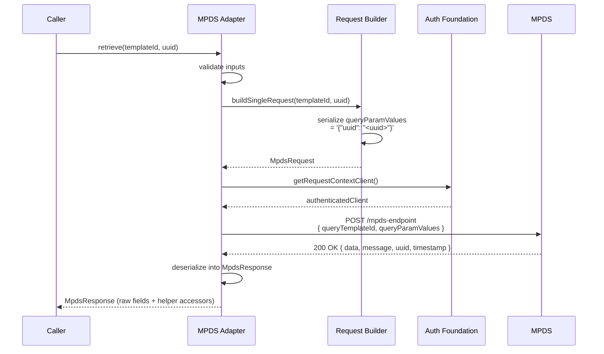
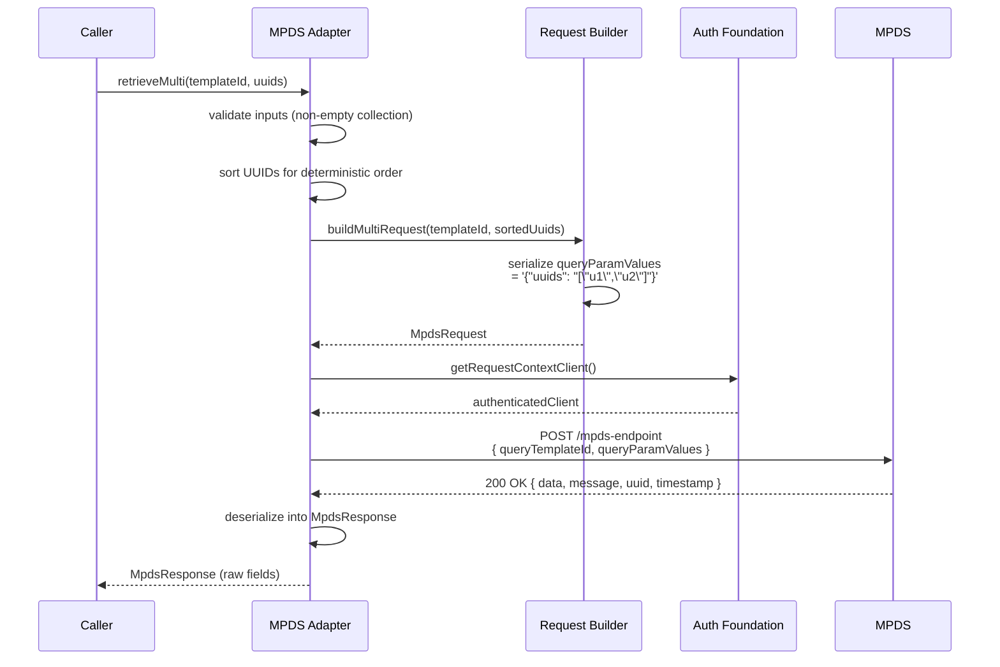
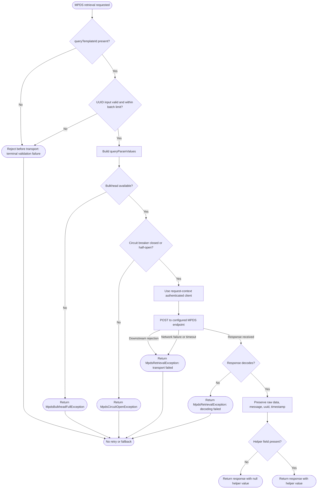

# MPDS Retrieval Standard

## 1. Overview

### Purpose

This standard covers synchronous personnel-data retrieval from MPDS through the shared MCC auth foundation. It defines the exact wire contract for single-UUID and multiple-UUID queries, the required use of the request-context authenticated client, the response model expected by application code, and the resilience mechanisms that protect the service from MPDS degradation.

### Scope

This standard applies to backend services that perform synchronous MPDS lookups over an MCC-authenticated machine-to-machine channel. It assumes the shared MCC auth foundation already exists and focuses specifically on:

* MPDS request construction
* request execution over the request-context outbound path
* raw response preservation
* helper accessors for commonly used personnel data
* resilience (bulkhead + circuit breaker) at the adapter boundary
* observability (structured logging and audit) at the adapter boundary

It does not define MCNS send behavior or the shared auth foundation itself.

### Migration Notes

The following changes apply compared to the legacy `eds-spring-boot-starter-mpds-library`:

* The command-object pattern (`MPDSSingleUUIDRequestCommand`, `MPDSMultipleUUIDRequestCommand`) is eliminated. A stateless singleton gateway replaces it.
* The `clientId` property (`MPDSConfigurationProperties.clientId`) is removed. It was declared but never used in any operational code. OAuth2 client identity is owned entirely by the shared MCC auth foundation's registration configuration.
* The `Set<String>` input for multiple-UUID queries is widened to `Collection<String>` with internal normalization to a sorted `List`.
* A latent NPE bug in the subtype field lookup is fixed — missing fields now return `null` instead of throwing.
* `MpdsRequestConstructionException` is removed — request construction cannot fail after input validation when using manual UUID serialization.


### Definitions

| Term | Definition |
|:---|:---|
| MPDS Retrieval | The lookup flow that issues synchronous `POST` requests to the configured MPDS endpoint and returns personnel data. |
| Query Template ID | The template selector passed to MPDS as `queryTemplateId`. It determines the data shape returned under `data`. Each template must be pre-registered on MTM before it can be used; registration defines the personnel-data fields the template returns. |
| Template Registration | The prerequisite step of registering a query template on MTM. A template declares the fields the caller wants MPDS to return. Single-UUID and multiple-UUID queries each require their own registered template. |
| Single-UUID Query | An MPDS request that carries one UUID inside a stringified `queryParamValues` payload. Uses a template registered for single-UUID lookups. |
| Multiple-UUID Query | An MPDS request that carries more than one UUID using MPDS's nested string encoding for `queryParamValues`. Uses a template registered for multiple-UUID lookups. |
| `queryParamValues` | A JSON string field, not a nested JSON object. Its exact serialization is protocol-sensitive and must be preserved. |
| Request-Context Client | The authenticated outbound client intended for interactive servlet-backed flows. MPDS retrieval MUST use this client rather than the background client. The concrete interface is `MccAuthenticatedClientProvider.requestContextClient()` from the shared auth foundation. |
| Raw Response | The full MPDS response fields `data`, `message`, `uuid`, and `timestamp` as returned by the downstream service. |
| Response Field Helper | A helper that reads frequently used fields such as NRIC, full name, email, or mobile number from known MPDS template nodes. |
| Template Node | A node under `data` keyed by template name such as `it0002_main` or `it0105_main`. |
| Subtype | The MPDS discriminator field `subty` used to distinguish values inside template arrays such as `it0105_main`. |
| Bulkhead | A concurrency limiter that caps the maximum number of simultaneous MPDS calls to prevent servlet thread-pool exhaustion. |
| Circuit Breaker | A state machine that detects sustained MPDS failures and short-circuits requests to fail fast, protecting the service from a degraded dependency. |


## 2. Integration Requirements

### 2.0 Template Registration Prerequisite

Before any MPDS retrieval can succeed, the required query templates must be registered on MTM:

1. Register a single-UUID query template on MTM that declares the personnel-data fields needed for single-UUID lookups. Record the resulting template ID.
2. Register a separate multiple-UUID query template on MTM that declares the personnel-data fields needed for multiple-UUID lookups. Record the resulting template ID.
3. <design-choice>Configure the application with both template IDs so they can be passed as `queryTemplateId` at call time. How the application stores and resolves these IDs — a hardcoded constant, a Spring `@ConfigurationProperties`-bound value, or a database-backed template registry looked up per tenant or request — is an application-specific decision this standard does not prescribe.</design-choice>

Template registration is a one-time setup step per environment. The template defines which fields MPDS returns under `data`; if the template does not include a field, that field will not appear in the response regardless of what the helper accessors expect.

### 2.1 Single-UUID Happy Path

1. Accept one `queryTemplateId` (from a template registered for single-UUID lookups on MTM) and one UUID.
2. Build an MPDS request body containing:
   `queryTemplateId`
   `queryParamValues = "{\"uuid\": \"<uuid>\"}"`
3. Use the request-context MCC-authenticated outbound client from the shared auth foundation.
4. Send a synchronous `POST` to the configured MPDS endpoint.
5. Deserialize the response into `data`, `message`, `uuid`, and `timestamp`.
6. Expose the raw response fields to callers.
7. Expose the baseline helper accessors for commonly used personnel fields when the registered template returns the corresponding nodes.

### 2.2 Multiple-UUID Happy Path

1. Accept one `queryTemplateId` (from a template registered for multiple-UUID lookups on MTM) and a non-empty `Collection<String>` of UUIDs.
2. Validate the collection size does not exceed the configured maximum batch size (default: 100).
3. Normalize the collection to a deterministically sorted `List<String>` (alphabetical) internally before serialization.
4. Serialize the collection into the MPDS nested-string form:
   `queryParamValues = "{\"uuids\": \"[\"uuid1\",\"uuid2\"]"}"`
5. Preserve `queryParamValues` as a string field, not a nested object or array.
6. Use the same request-context MCC-authenticated outbound client used by the single-UUID flow.
7. Send a synchronous `POST` to the configured MPDS endpoint.
8. Return the raw MPDS response fields unchanged.

### 2.2.1 Sequence Diagram — Single-UUID Happy Path



### 2.2.2 Sequence Diagram — Multiple-UUID Happy Path



### 2.3 Response Field Interpretation

1. Preserve the raw `data` tree even when helper accessors are provided.
2. For `it0002_main`, the first element may expose:
   `nric`
   `zzpad_cname`
3. For `it0105_main`, subtype-based lookup may expose:
   `usrid_long` when `subty = 0010` as email
   `usrid` when `subty = 9001` as mobile number
4. Missing nodes, missing subtype matches, and missing fields return `null` rather than throwing by default.
5. Baseline helper accessors must not replace, flatten, or mutate the raw response. Template-specific helper accessors are outside this standard; if an application adds them, they must preserve raw-response access and must not change the baseline helper behavior.

### 2.4 Failure Paths

1. Missing or blank `queryTemplateId` is a terminal validation failure and MUST block transport.
2. Missing or blank UUID input is a terminal validation failure and MUST block transport.
3. Invalid multi-UUID input such as an empty collection is a terminal validation failure and MUST block transport.
4. Multi-UUID collection exceeding the configured maximum batch size is a terminal validation failure and MUST block transport.
5. Downstream MPDS rejection, network failure, timeout, or deserialization error MUST be reported as MPDS retrieval failure.
6. Missing helper fields are not errors by themselves; they MUST produce `null` accessors while preserving the raw response.
7. MPDS retrieval MUST NOT use alternate endpoints, fallback transports, or automatic caller-level retries unless the application explicitly defines and tests that behavior.

### 2.5 Resilience Requirements

MPDS retrieval MUST be protected by both a **bulkhead** and a **circuit breaker**, implemented as a decorator (`ResilientMpdsGateway`) around the transport gateway (`DefaultMpdsGateway`).

#### 2.5.1 Bulkhead

1. The bulkhead MUST limit the maximum number of concurrent MPDS calls to prevent servlet thread-pool exhaustion.
2. The maximum concurrent calls MUST be configurable via `spring.security.eds.mcc.mpds.resilience.bulkhead-max-concurrent-calls` (default: 10).
3. When the bulkhead is full, the call MUST be rejected immediately with `MpdsBulkheadFullException`.
4. Bulkhead rejection MUST NOT hold a servlet thread waiting.

<design-choice>The right `bulkhead-max-concurrent-calls` value depends on the application's servlet thread pool size and MPDS's agreed concurrency capacity for the calling `clientId`. Size it low enough that a saturated bulkhead still leaves headroom on the thread pool for other work, and no higher than what MPDS has agreed to sustain.</design-choice>

#### 2.5.2 Circuit Breaker

1. The circuit breaker MUST monitor MPDS call outcomes and open when the failure rate exceeds the configured threshold.
2. All circuit breaker parameters MUST be configurable:

| Parameter | Property | Default |
|:---|:---|:---|
| Failure rate threshold | `spring.security.eds.mcc.mpds.resilience.circuit-breaker-failure-rate-threshold` | 50% |
| Minimum number of calls | `spring.security.eds.mcc.mpds.resilience.circuit-breaker-minimum-number-of-calls` | 5 |
| Wait duration in open state | `spring.security.eds.mcc.mpds.resilience.circuit-breaker-wait-duration-in-open-state` | 30s |
| Sliding window size | `spring.security.eds.mcc.mpds.resilience.circuit-breaker-sliding-window-size` | 10 |
| Permitted calls in half-open | `spring.security.eds.mcc.mpds.resilience.circuit-breaker-permitted-calls-in-half-open` | 3 |

3. When the circuit breaker is open, calls MUST be rejected immediately with `MpdsCircuitOpenException`.
4. Circuit-breaker half-open probes are NOT considered automatic retries. They permit a bounded number of new requests to test dependency recovery; they do not re-execute previously failed requests. This does not violate the no-auto-retry rule.

<design-choice>The failure-rate threshold, minimum-calls, sliding-window, wait-duration, and half-open-probe defaults are starting points, not fixed values. Tune them against MPDS's actual latency/error profile and the application's tolerance for false-positive circuit opens — a low-traffic caller may need a smaller sliding window to reach `minimum-number-of-calls` in a reasonable time, while a caller sensitive to brief MPDS blips may want a longer `wait-duration-in-open-state`.</design-choice>

#### 2.5.3 Resilience Architecture

1. Resilience MUST be implemented as a decorator around `MpdsGateway`, not inline in the transport gateway.
2. The decorator class MUST be named `ResilientMpdsGateway`.
3. `DefaultMpdsGateway` MUST remain testable without resilience wiring.
4. The application MUST wire `ResilientMpdsGateway` as the primary `MpdsGateway` bean in production.

### 2.6 Failure Path Flow Diagram




## 3. Contracts

### 3.1 Inputs / Outputs

#### Base Standard

* Required inputs are `queryTemplateId`, either a single UUID or a non-empty multiple-UUID `Collection<String>`, the configured MPDS endpoint, and the request-context MCC-authenticated outbound client (`MccAuthenticatedClientProvider.requestContextClient()`).
* Context inputs are application-level correlation or actor context used for logging and audit; they MUST NOT alter the MPDS wire payload.
* The implementation MUST use JSON request and response bodies over authenticated HTTPS transport.
* The implementation MUST preserve the exact `queryParamValues` wire contract for both single and multiple UUID queries.
* The implementation MUST expose raw response access even when helper accessors exist.
* MPDS retrieval performs one synchronous outbound `POST` and response parsing. It MUST NOT persist local state, clear local state, or mutate application records as a side effect of retrieval.
* An HTTP-facing controller MUST NOT return `MpdsResponse` directly. A purpose-built response DTO MUST be used to expose only the fields required by the calling client.

#### Org Standard

* Single-UUID requests MUST serialize `queryParamValues` exactly as a JSON string containing `{"uuid": "<uuid>"}`.
* Multiple-UUID requests MUST serialize `queryParamValues` exactly as a JSON string containing `{"uuids": "["uuid1","uuid2"]"}`. The UUID array string is built manually (no Jackson ObjectMapper) since UUIDs contain only hex characters that require no JSON escaping.
* Multiple-UUID input MUST be normalized to a deterministically sorted `List<String>` (alphabetical) before serialization.
* Multiple-UUID input MUST be validated against the configured maximum batch size (default: 100) before transport.
* MPDS retrieval MUST use the request-context client from the shared MCC auth foundation (`MccAuthenticatedClientProvider.requestContextClient()`).
* Raw output MUST preserve `data`, `message`, `uuid`, and `timestamp`.
* The `MpdsResponse` MUST be immutable — `@Getter` + `@Builder` + `@JsonDeserialize(builder = ...)`, no setters.
* The baseline response helper methods MUST include:
  `getNric()`
  `getFullName()`
  `getEmail()`
  `getMobileNumber()`
* Baseline helper methods MUST return values only from the preserved raw response tree and MUST return `null` when the expected node, subtype, or field is absent.
* Multiple-UUID ordering MUST be deterministic (sorted alphabetically) for contract tests and operational reproducibility.
* Headers MUST continue to be derived from the shared auth foundation.

### 3.2 Error Contract

#### Base Standard

* Validation failures are terminal and are not retryable.
* Transport failures MUST be explicit to callers and operators.
* Missing helper fields MUST NOT erase or mutate the raw response payload.

#### Org Standard

* Blank `queryTemplateId`, blank UUID input, empty multi-UUID collections, and collections exceeding the configured maximum batch size MUST fail before transport with `IllegalArgumentException`.
* Timeout, downstream HTTP or network failure, and response-decoding failure MUST be reported as terminal `MpdsRetrievalException` for that call.
* Circuit breaker open MUST be reported as `MpdsCircuitOpenException extends MpdsRetrievalException`.
* Bulkhead full MUST be reported as `MpdsBulkheadFullException extends MpdsRetrievalException`.
* Implementations MUST apply a bounded timeout through the adapter or shared outbound layer.
* Caller-level automatic retry MUST NOT be added unless the application explicitly defines the retryable failure mode and covers it with tests. Circuit-breaker half-open probes are NOT considered automatic retries.

<design-choice>**Retry**: Decide whether the integration needs automatic retry on transient MPDS failures on top of the bulkhead and circuit breaker. If so, layer a Resilience4j `Retry` inside the existing `ResilientMpdsGateway` decorator, scoped to the same non-retryable failure modes (validation, circuit-open, bulkhead-full). If retry is not required, transient failures propagate immediately to the caller as `MpdsRetrievalException`.</design-choice>

* The complete exception hierarchy is:
  - `IllegalArgumentException` — validation failures (before transport)
  - `MpdsRetrievalException` — transport failures (timeout, network, decoding)
    - `MpdsCircuitOpenException` — circuit breaker is open
    - `MpdsBulkheadFullException` — bulkhead is full

### 3.3 Audit Contract

#### Base Standard

* Implementations MUST emit auditable records for direct MPDS calls and terminal MPDS failures.
* Audit records MUST be immutable and timestamped.

#### Org Standard

* The implementation MUST emit an audit event for:
  successful MPDS retrieval
  failed MPDS retrieval
* Each audit event MUST include:
  event timestamp
  actor or service principal
  correlation ID (MUST include when available in the request context)
  target dependency (`MPDS`)
  target subject policy (`query count and cardinality only` unless the application has explicit approval to record subject identifiers)
  query template ID
  query cardinality (`single` or `multiple`)
  query count
  outcome
  high-level error reason (MUST include when present)

### 3.4 Logging Contract

#### Base Standard

* Implementations MUST produce structured logs for MPDS request start, completion, and failure.
* Logs MUST distinguish validation rejection from downstream failure.

#### Org Standard

* A default `Slf4jMpdsObservationRecorder` implementation MUST be shipped with the adapter. It satisfies both audit and logging contracts via structured logging.
* Structured log fields MUST include:
  `@timestamp` (auto-populated)
  `correlation.id` (MUST include when available in request context; see [Tracing section](../../Appfw-Logging-Standards/Log_Schema.md#tracing--correlation))
  `user.id` (MUST include when available; see [User section](../../Appfw-Logging-Standards/Log_Schema.md#user))
  `query.template.id`
  `query.cardinality`
  `query.count`
  `event.duration_ms` (see [Event section](../../Appfw-Logging-Standards/Log_Schema.md#event))
  `event.outcome` (see [Event section](../../Appfw-Logging-Standards/Log_Schema.md#event))
  `error.category` (MUST include on failure; see [Error section](../../Appfw-Logging-Standards/Log_Schema.md#error))
* Required log levels:
  `INFO` for successful retrieval
  `WARN` for validation rejection and dependency failures that MAY be transient
  `ERROR` for repeated dependency failure or response-deserialization defects
* Prohibited log content (MUST NOT log):
  raw bearer tokens
  private keys
  full raw MPDS response payloads containing personal identifiers
  full UUID lists when logging only count would suffice

### 3.5 Security Contract

#### Base Standard

* All MPDS calls MUST use an MCC-authenticated outbound client over TLS.
* Input MUST be validated before transport.
* Raw personnel data MUST be handled according to the application's data-classification policy.
* OAuth token lifetime, client assertion expiry, signing-key lifecycle, and secure signing-key storage are inherited from the shared MCC auth foundation.

#### Org Standard

* MPDS retrieval MUST use the request-context authenticated client (`MccAuthenticatedClientProvider.requestContextClient()`) and MUST NOT depend on background-only auth wiring.
* Reimplementations MUST set an explicit timeout for MPDS calls. This timeout is the MPDS retrieval-level expiry control; token or assertion expiry remains owned by the shared auth foundation.
* MPDS retrieval MUST NOT load, persist, or log private keys directly. It MUST consume the authenticated client supplied by the shared auth foundation, which owns secure storage and signing-key resolution.
* Logs and audit payloads MUST NOT expose full raw MPDS data unless explicitly approved.
* MPDS retrieval performs no end-user authorization by itself. User-level or service-level access control MUST be enforced by the application boundary that triggers the lookup.
* An HTTP-facing controller MUST NOT return `MpdsResponse` directly to the client. A purpose-built DTO MUST be used to control which PII fields reach the frontend.


## 4. Implementation Approach

### 4.1 Runtime Context

* **[Enforced Constraint]** **[[Section 3.5 Security Contract](#35-security-contract)]** MPDS retrieval runs through the request-context authenticated client from the shared auth foundation.

* **[Enforced Constraint]** **[[RFC 7523](https://www.rfc-editor.org/rfc/rfc7523)]** Keep the request-context execution mode, but hide it behind an adapter boundary so application services never need to know about outbound client setup or `private_key_jwt`.

* **[Enforced Constraint]** **[[Section 3.1 Inputs / Outputs](#31-inputs--outputs)]** Application services depend on an MPDS retrieval interface instead of low-level transport and auth mechanics.

### 4.2 Contract-Sensitive Payloads

* **[Enforced Constraint]** **[[RFC 8259](https://www.rfc-editor.org/rfc/rfc8259)]** `queryParamValues` is a string field, not an embedded JSON object.
* **[Enforced Constraint]** **[[Section 2.1 Single-UUID Happy Path](#21-single-uuid-happy-path)]** Single-UUID and multiple-UUID payloads have different serialization rules and both must be preserved exactly.

* **[Enforced Constraint]** **[[Section 3.1 Inputs / Outputs](#31-inputs--outputs)]** Keep request-building logic isolated so refactors do not change the payload rules.

* **[Enforced Constraint]** **[[Section 5 Test & Validation Standard](#5-test--validation-standard)]** The MPDS string-encoded payload rule is kept in one place and covered by tests.

### 4.3 Response Model

* **[Enforced Constraint]** **[[Section 3.1 Inputs / Outputs](#31-inputs--outputs)]** The response model preserves raw `data`, `message`, `uuid`, and `timestamp`.

* **[Enforced Constraint]** **[[Section 2.3 Response Field Interpretation](#23-response-field-interpretation)]** Preserve the raw MPDS `data`, `message`, `uuid`, and `timestamp` fields. Baseline accessors such as NRIC, full name, email, and mobile number may read from `data`, but they must not replace or flatten the raw `data` payload. These accessors cover common fields only and do not define every field MPDS may return for a registered query template.


### 4.4 Synchronous Behavior

* **[Enforced Constraint]** **[[Section 3.2 Error Contract](#32-error-contract)]** MPDS retrieval is synchronous from the caller's perspective. Preserve the synchronous contract where the app needs it, but pair that behavior with an explicit timeout and clear failure mapping. Callers still get a blocking result, and timeouts stop calls from running indefinitely.

### 4.5 Separation of Concerns

* **[Enforced Constraint]** **[[Section 3.5 Security Contract](#35-security-contract)]** Shared auth remains outside the MPDS adapter.
* **[Enforced Constraint]** **[[Section 3.1 Inputs / Outputs](#31-inputs--outputs)]** Request construction, transport, and response helper extraction remain separable responsibilities.
* **[Enforced Constraint]** **[[Section 2.4 Failure Paths](#24-failure-paths)]** Add validation at the adapter boundary before request construction and transport begin. Invalid input is rejected earlier, and each layer can be tested separately.
* **[Enforced Constraint]** **[[Section 2.5 Resilience Requirements](#25-resilience-requirements)]** Resilience (bulkhead + circuit breaker) is implemented as a decorator (`ResilientMpdsGateway`) around the transport gateway (`DefaultMpdsGateway`), not inline.

### 4.6 Package Structure

The MPDS adapter MUST follow the existing MCNS adapter package conventions. All classes MUST be placed in the following structure:

```
<base-package>.shared.mpds/
├── client/        (transport internals)
│   ├── DefaultMpdsGateway.java
│   ├── ResilientMpdsGateway.java
│   ├── MpdsSingleUuidRequest.java
│   └── MpdsMultipleUuidRequest.java
├── config/        (Spring wiring + properties)
│   ├── MpdsAdapterConfiguration.java
│   ├── MpdsProperties.java
│   └── MpdsResilienceProperties.java
├── exception/     (exception hierarchy)
│   ├── MpdsRetrievalException.java
│   ├── MpdsCircuitOpenException.java
│   └── MpdsBulkheadFullException.java
├── logging/       (observation)
│   ├── MpdsObservationRecorder.java
│   └── Slf4jMpdsObservationRecorder.java
├── validation/    (input validation)
│   └── MpdsRequestValidator.java
├── MpdsGateway.java              (public interface)
├── MpdsResponse.java             (public response model)
└── MpdsObservationContext.java   (observation context record)
```

* `<base-package>` is application-specific — derive from the application's existing root package.
* Interfaces and domain models at the package root are the public API.
* Application services MUST import from `shared.mpds`, MUST NOT import from `shared.mpds.client`.

### 4.7 External Assumptions

* Assumption: Query templates for single-UUID and multiple-UUID lookups have been registered on MTM and the resulting template IDs are available to the application.
* Assumption: MPDS accepts `POST` requests at the configured `url`.
* Assumption: MPDS returns a JSON body with `data`, `message`, `uuid`, and `timestamp`.
* Assumption: The fields returned under `data` correspond to the fields declared in the registered template. Template names such as `it0002_main` and `it0105_main` continue to behave as expected for the helper methods only when the template includes those fields.


## 5. Test & Validation Standard

### 5.1 Required Unit Tests

Existing starter-library tests that demonstrate the historical behavior:

* `eds-spring-boot-starter-mpds-library/src/test/java/org/eds/starter/mpds/model/MPDSSingleUUIDRequestTest.java`
* `eds-spring-boot-starter-mpds-library/src/test/java/org/eds/starter/mpds/model/MPDSMulitpleUUIDRequestTest.java`
* `eds-spring-boot-starter-mpds-library/src/test/java/org/eds/starter/mpds/model/MPDSResponseTest.java`
* `eds-spring-boot-starter-mpds-library/src/test/java/org/eds/starter/mpds/service/MPDSSingleUUIDRequestCommandTest.java`
* `eds-spring-boot-starter-mpds-library/src/test/java/org/eds/starter/mpds/service/MPDSMultipleUUIDRequestCommandTest.java`
* `eds-spring-boot-starter-mpds-library/src/test/java/org/eds/starter/mpds/properties/MPDSConfigurationPropertiesTest.java`

### 5.2 Required Test Class Structure

Reimplementations MUST produce exactly these test classes:

| Test class | Covers |
|:---|:---|
| `MpdsSingleUuidRequestTest` | Single-UUID serialization matches the exact MPDS wire contract |
| `MpdsMultipleUuidRequestTest` | Multiple-UUID serialization matches the exact MPDS nested-string wire contract; deterministic ordering verified |
| `MpdsResponseTest` | Response deserialization; helper accessors resolve NRIC, full name, email, mobile; raw fields preserved; missing fields return `null`; helpers do not mutate raw data |
| `MpdsRequestValidatorTest` | Blank `queryTemplateId` → `IllegalArgumentException`; blank UUID → `IllegalArgumentException`; empty collection → `IllegalArgumentException`; exceeds max batch size → `IllegalArgumentException` |
| `DefaultMpdsGatewayTest` | Gateway uses request-context client (not background); timeout maps to `MpdsRetrievalException`; transport failure maps to `MpdsRetrievalException`; response decoding failure maps to `MpdsRetrievalException` |
| `ResilientMpdsGatewayTest` | Circuit breaker opens after threshold; bulkhead rejects when full; `MpdsCircuitOpenException` thrown when open; `MpdsBulkheadFullException` thrown when full; half-open recovery works |
| `Slf4jMpdsObservationRecorderTest` | Audit/logging events emitted on success and failure with correct structured fields |

### 5.3 Required Test Coverage

Reimplementations MUST cover:

* Single-UUID request serialization matches the required MPDS wire contract.
* Multiple-UUID request serialization matches the required MPDS nested-string wire contract.
* Multiple-UUID ordering is deterministic regardless of input order.
* Response helpers resolve NRIC, full name, email, and mobile number from known template nodes.
* Raw response fields `data`, `message`, `uuid`, and `timestamp` are preserved unchanged.
* Helper accessors do not remove, flatten, or mutate the raw `data` payload.
* Missing template nodes, missing subtype matches, and missing fields return `null`.
* Single-UUID and multiple-UUID gateway methods use the request-context authenticated client and return typed MPDS responses.
* MPDS configuration properties bind correctly.
* Validation rejects blank `queryTemplateId` → `IllegalArgumentException`.
* Validation rejects blank UUID → `IllegalArgumentException`.
* Validation rejects empty multi-UUID collection → `IllegalArgumentException`.
* Validation rejects collection exceeding max batch size → `IllegalArgumentException`.
* Timeout maps to `MpdsRetrievalException` with timeout message.
* Transport failure maps to `MpdsRetrievalException` with transport failure message.
* Response decoding failure maps to `MpdsRetrievalException` with decoding failure message.
* Circuit breaker opens and throws `MpdsCircuitOpenException`.
* Bulkhead rejects and throws `MpdsBulkheadFullException`.
* Observation recorder emits structured logs on success and failure.

### 5.4 Required Integration Tests

* End-to-end single-UUID retrieval against a stub or sandbox enforcing the real MPDS wire contract.
* End-to-end multiple-UUID retrieval against a stub or sandbox enforcing the real MPDS wire contract.
* Request-context client reuse through the shared auth foundation.
* Gateway uses request-context client, not background client.
* Single-UUID and multiple-UUID requests use `POST` to the configured MPDS endpoint.
* Deterministic multiple-UUID serialization order verified across repeated requests.
* Validation rejection occurs before any network call is made.
* MPDS retrieval does not retry automatically unless the application explicitly adds a retry policy.

### 5.5 Gaps to Be Filled by the Integrator

* Any application-specific validation beyond the base MPDS contract.
* Exact timeout values and any deliberate retry policy.
* Template-specific helpers beyond the common helper set defined by this standard.
* Clear application-level error mapping when MPDS retrieval is exposed over HTTP or messaging.
* The purpose-built response DTO shape for HTTP-facing controllers.

### 5.6 Test Data Guidelines

* Use deterministic UUIDs, template IDs, and synthetic personnel values in tests.
* Do not use real NRICs, real email addresses, or live MPDS endpoints in local or CI fixtures.
* Keep recorded payload fixtures short and masked.


## 6. Operational Runbook

### 6.1 Observable Logs and Metrics

* Implementations MUST expose counters for MPDS calls, MPDS failures, validation rejections, timeout events, bulkhead rejections, and circuit breaker state transitions.
* Implementations SHOULD expose timers for MPDS response time.
* Audit and log correlation IDs MUST align with the application's broader request tracing when available.

### 6.2 Manual vs Self-Healing Error Modes

* Validation failures are manual-fix input defects.
* Downstream MPDS outages MAY self-heal once the dependency recovers; the circuit breaker will automatically transition to half-open and probe recovery.
* Template or response-shape changes are manual-fix contract issues.
* Timeout configuration that is too low or too high is an operator-tunable issue.
* Bulkhead saturation under normal load indicates the need to increase `bulkhead-max-concurrent-calls` or scale the service.
* Persistent circuit-breaker-open state indicates MPDS dependency failure requiring investigation.

### 6.3 External Failure Sources

* MPDS endpoint unavailable or slow.
* Shared MCC token acquisition failure in the auth foundation.
* Invalid, outdated, or unregistered query template IDs (template must exist on MTM).
* Response-shape changes that break helper assumptions (e.g., template re-registered without expected fields).
* Excessively large UUID batches or malformed upstream input.

### 6.4 Config and Secrets Required at Runtime

| Key | Required | Default | Description |
|:---|:---|:---|:---|
| `spring.security.eds.mcc.mpds.url` | Yes | — | MPDS retrieval endpoint. |
| `spring.security.eds.mcc.mpds.request-timeout` | Yes | — | Explicit timeout for MPDS calls. |
| `spring.security.eds.mcc.mpds.max-batch-size` | Yes | 100 | Maximum UUIDs per multiple-UUID request. |
| Single-UUID query template ID | Yes | — | Template ID obtained from MTM registration for single-UUID lookups. Passed as `queryTemplateId` at call time. |
| Multiple-UUID query template ID | Yes | — | Template ID obtained from MTM registration for multiple-UUID lookups. Passed as `queryTemplateId` at call time. |
| Shared auth foundation config | Yes | — | The OAuth2 registration and signing-key configuration used by the MCC-authenticated request-context client. |
| `spring.security.eds.mcc.mpds.resilience.bulkhead-max-concurrent-calls` | Yes | 10 | Maximum concurrent MPDS calls allowed. |
| `spring.security.eds.mcc.mpds.resilience.circuit-breaker-failure-rate-threshold` | Yes | 50 | Failure rate percentage to open the circuit. |
| `spring.security.eds.mcc.mpds.resilience.circuit-breaker-minimum-number-of-calls` | Yes | 5 | Minimum calls in sliding window before evaluation. |
| `spring.security.eds.mcc.mpds.resilience.circuit-breaker-wait-duration-in-open-state` | Yes | 30s | Wait before half-open probe. |
| `spring.security.eds.mcc.mpds.resilience.circuit-breaker-sliding-window-size` | Yes | 10 | Number of calls in the evaluation window. |
| `spring.security.eds.mcc.mpds.resilience.circuit-breaker-permitted-calls-in-half-open` | Yes | 3 | Probes allowed during half-open state. |

<design-choice>**Max batch size**: The default of 100 is a starting point, not a fixed limit. Size it to the application's actual UI/UX batch needs and whatever cardinality MPDS has agreed to accept per request for the calling `clientId`.</design-choice>

#### Deployed-environment configuration (SIT and beyond)

`url` is environment-specific and MUST NOT live as a hardcoded literal in the base `application.yml`. Per the [Bootstrap Profile Configuration Contract](../../Appfw-Project-Bootstrap/Mcc/Mcc_Project_Bootstrap_Application_Standard.md#36-profile-configuration-contract), deployed environments populate this via an environment variable (`MPDS_URL`).

For step-by-step implementation, `application-sit.yml` snippets, and `.env.sit.example` configuration, refer to [MPDS Retrieval Recipe 10](MPDS_Retrieval_Recipes.md#recipe-10-deployed-environment-profile-configuration-sit).


## 7. Appendix

### 7.1 Glossary

| Term | Definition |
|:---|:---|
| MPDS Retrieval | The lookup flow that issues synchronous `POST` requests to the configured MPDS endpoint and returns personnel data. |
| Query Template ID | The template selector passed to MPDS as `queryTemplateId`. It determines the data shape returned under `data`. |
| Template Registration | The prerequisite MTM setup step that declares which personnel-data fields MPDS returns for a query template. |
| Single-UUID Query | An MPDS request that carries one UUID inside a stringified `queryParamValues` payload. |
| Multiple-UUID Query | An MPDS request that carries more than one UUID using MPDS's nested string encoding for `queryParamValues`. |
| Request-Context Client | The authenticated outbound client intended for interactive servlet-backed flows. Concrete interface: `MccAuthenticatedClientProvider.requestContextClient()`. |
| Raw Response | The full MPDS response fields `data`, `message`, `uuid`, and `timestamp` as returned by the downstream service. |
| Baseline Helper Accessor | A helper method that reads a commonly used field from the raw MPDS `data` tree without replacing or mutating that tree. |
| Template Node | A node under `data` keyed by template name such as `it0002_main` or `it0105_main`. |
| Subtype | The MPDS discriminator field `subty` used to distinguish values inside template arrays such as `it0105_main`. |
| Bulkhead | A concurrency limiter (`ResilientMpdsGateway`) that caps concurrent MPDS calls to prevent servlet thread-pool exhaustion. Rejects with `MpdsBulkheadFullException` when full. |
| Circuit Breaker | A state machine (`ResilientMpdsGateway`) that monitors MPDS failures and short-circuits when the failure rate exceeds a threshold. Rejects with `MpdsCircuitOpenException` when open. |
| Half-Open Probe | A bounded number of requests allowed through an open circuit breaker to test if the dependency has recovered. NOT considered an automatic retry. |
| Max Batch Size | The configurable maximum number of UUIDs allowed per multiple-UUID request (default: 100). |

### 7.2 Changelog

| Date | Version | Change |
|:---|:---|:---|
| 2026-06-29 | 2.0.0 | Added resilience requirements (bulkhead + circuit breaker), prescribed package and test structure, adopted RFC 2119 keywords, fixed multiple-UUID serialization to match legacy, widened input to `Collection<String>`, removed `MpdsRequestConstructionException`, mandated immutable response, added max batch size, added default `Slf4jMpdsObservationRecorder`, mandated response DTO for HTTP exposure, clarified half-open probes vs. no-auto-retry, removed dead `clientId` property, manual UUID serialization (no ObjectMapper). |
| 2026-04-25 | 1.0.0 | Added failure-path diagram, tightened helper-accessor contract, completed inputs/outputs, audit, security, architecture, test, runbook, and appendix requirements. |

### 7.3 Standards Referenced

* RFC 6749: The OAuth 2.0 Authorization Framework, inherited through the shared-auth foundation used for outbound MCC authentication
* RFC 7517: JSON Web Key (JWK), inherited through the shared-auth foundation used for `private_key_jwt`
* RFC 7523: JSON Web Token (JWT) Profile for OAuth 2.0 Client Authentication and Authorization Grants, inherited through the shared-auth foundation
* RFC 8259: The JavaScript Object Notation (JSON) Data Interchange Format used by the observed MPDS request and response payloads

### 7.4 Reimplementation Recipes

See [MPDS Retrieval - Reimplementation Recipes](MPDS_Retrieval_Recipes.md) for implementation-ready recipes.
