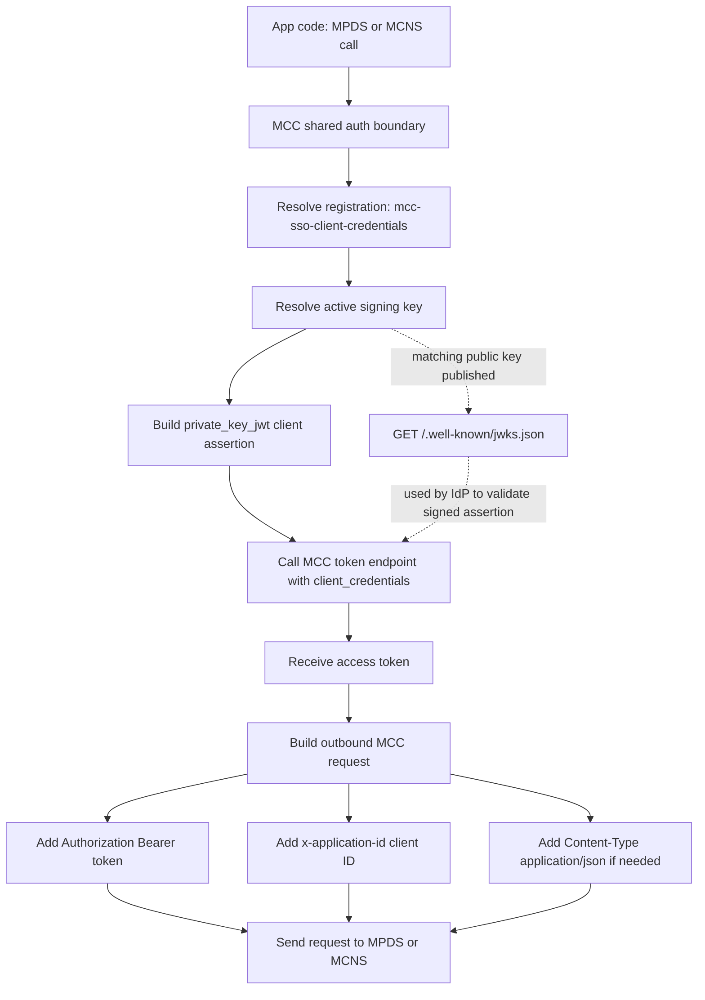
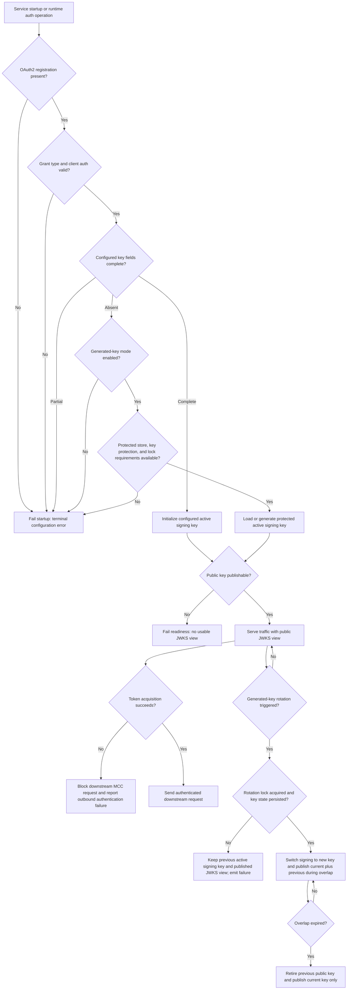

# MCC Shared Auth Foundation Standard

## 1. Overview

### Purpose

This standard covers shared outbound authentication for MCC-integrated services. It owns OAuth 2.0 client-credentials token acquisition with `private_key_jwt`, signing-key lifecycle management, JWKS publication for onboarding and rollover, and the authenticated outbound client modes used by adapters such as MPDS and MCNS.

### Scope

This standard applies to backend services that call MCC-managed machine-to-machine APIs and need one reusable foundation for:

* MCC OAuth2 client registration and token acquisition
* signing-key management and optional generated-key rotation
* public JWKS publication at `/.well-known/jwks.json`
* request-context and background authenticated outbound clients

It does not define MPDS or MCNS payload behavior. Those adapters build on top of this foundation.

### Assumptions

* <assumption>Local development uses the mock-m-sso Keycloak container and supporting infrastructure provided by the [MCC Project Bootstrap Application Standard](../../Appfw-Project-Bootstrap/Mcc/Mcc_Project_Bootstrap_Application_Standard.md). That standard owns the compose stack, mock IdP configuration, and dev-profile defaults; this standard owns the MCC shared auth foundation that runs on top of that infrastructure.</assumption>
* <assumption>The `@SpringBootApplication` entry point (`Application.java`) exists at `shared/app/` (package `com.<org>.<app>.shared.app`) as defined by the [MCC Project Bootstrap Application Standard](../../Appfw-Project-Bootstrap/Mcc/Mcc_Project_Bootstrap_Application_Standard.md). That entry point's `scanBasePackages` discovers this module automatically. If it does not yet exist, implementors must create it per [Bootstrap Recipes Step 4](../../Appfw-Project-Bootstrap/Mcc/Mcc_Project_Bootstrap_Recipes.md) before proceeding — modules cannot be component-scanned without it.</assumption>
* <assumption>A relational or equivalent durable store is available when generated-key persistence is enabled.</assumption>
* <assumption>A shared lock provider is available when generated-key rotation can run on more than one node.</assumption>

### Definitions

| Term | Definition |
|:---|:---|
| Shared Auth Foundation | The reusable platform layer that owns MCC OAuth2 registration, signing-key lifecycle, JWKS publication, and outbound authenticated client setup. |
| Registration ID | The fixed Spring Security OAuth2 registration name used for MCC client-credentials flows: `mcc-sso-client-credentials`. |
| App-Managed Key Mode | A deployment mode where `kid`, `publicKey`, and `privateKey` are supplied in configuration and used as the signing key material. |
| Generated-Key Mode | A deployment mode where the platform generates a signing key, persists protected key history, and rotates it on a schedule. |
| Active Signing Key | The single JWK currently used to sign `private_key_jwt` client assertions. |
| Published JWKS View | The public-key document exposed at `GET /.well-known/jwks.json`. It contains one public key in steady state and may temporarily contain the current and previous public keys during rollover overlap. |
| JWKS Overlap Window | The implementation-configurable period during which both the current and previous public keys remain published after rotation. |
| Request-Context Client | The MCC-authenticated outbound client intended for interactive request flows that run inside servlet-backed request handling. |
| Background Client | The MCC-authenticated outbound client intended for schedulers, async handlers, event listeners, and other flows that must not depend on servlet request state at use time. |
| Protected Key History | A durable record of generated signing keys and publication metadata, stored through encrypted-at-rest persistence or an equivalent secret-management or key-management-backed abstraction. |
| `x-application-id` | The outbound header populated from the configured OAuth2 registration `client-id`. |

## 2. Standard Flow

### 2.1 Happy Path Flow

### 2.2 Startup and Key Source Selection

1. Bind the Spring Security OAuth2 registration under `mcc-sso-client-credentials`.
2. Require `authorization-grant-type = client_credentials`.
3. Require `client-authentication-method = private_key_jwt`.
4. Bind MCC-specific registration metadata under `spring.security.eds.oauth2.client.registration.mcc-sso-client-credentials`.
5. If `kid`, `publicKey`, and `privateKey` are all present, build the active signing key from those configured values and set key source to `configured`.
6. If any configured key field is present but the group is incomplete, fail startup as a terminal configuration error.
7. If configured key material is absent and generated-key mode is enabled, load the protected active generated key from durable storage or generate an initial signing key and persist protected key history.
8. If configured key material is absent and generated-key mode is disabled, fail startup as a terminal configuration error.
9. Publish the public JWKS view for the active key state.
10. Make the active signing key available to the token-acquisition path used by both outbound execution modes.

### 2.3 Outbound Token Acquisition and Header Flow

1. Application code requests either the request-context client or the background client from the shared-auth boundary.
2. The outbound client resolves registration `mcc-sso-client-credentials`.
3. During token acquisition, the `private_key_jwt` converter asks the signing-key resolver for the active JWK.
4. The resolver signs the client assertion with the active key.
5. The authorized-client manager exchanges that assertion for an MCC access token.
6. The outbound client adds `Authorization: Bearer <token>`.
7. The outbound client adds `x-application-id` using the OAuth2 registration `client-id`.
8. The outbound client defaults `Content-Type` to `application/json` where the downstream API expects JSON.
9. Higher-level capabilities such as MPDS and MCNS reuse this same foundation rather than configuring their own OAuth2 clients.

### 2.4 JWKS Publication and Rollover

1. Publish only public keys through the JWKS endpoint.
2. Publish the JWKS response in standard set form: `{"keys":[...]}`.
3. In steady state, publish one public key only.
4. During rollover overlap, publish the current and previous public keys together.
5. Sign new client assertions only with the current active key.
6. Keep the JWKS overlap window implementation-configurable unless an org policy requires a fixed duration.
7. If generated-key mode is enabled and rotation can run on more than one node, acquire a distributed lock before rotation.
8. During rotation, generate the next signing key, persist protected key history, switch signing to the new key, publish both public keys for the overlap window, and retire the previous public key after the overlap window expires.
9. The JWKS endpoint must not expose private key material or an empty response; the service should fail readiness if no public key is available.

### 2.5 Background Execution

1. The request-context client may depend on servlet request state because it is intended for servlet-backed interactive flows.
2. The background client must not require servlet request state at use time.
3. The background client may obtain tokens through a direct token-supplier pattern or an equivalent non-servlet-safe mechanism.
4. Both clients must use the same registration, same signing-key foundation, and same outbound header defaults.

### 2.6 Failure Behavior

1. Missing registration `mcc-sso-client-credentials` is a terminal configuration error.
2. Any value other than `client_credentials` plus `private_key_jwt` is incompatible with this shared-auth design.
3. Unsupported key material must fail with `UnknownKeyTypeException` or an equivalent explicit error.
4. Missing configured key material with generated-key mode disabled must fail startup with a configuration error.
5. Generated-key mode must fail startup or rotation with a configuration error if required protected persistence, key protection, or lock coordination is unavailable.
6. Token acquisition failure blocks downstream MCC calls and is reported as an outbound authentication failure.
7. Rotation failure must never leave the service signing with one key while publishing a different key set.
8. Readiness must fail if the service cannot determine a public key to publish.

## 3. Contracts

### 3.1 Inputs / Outputs

#### Base Standard

* Keep OAuth2 client registration metadata separate from MCC-specific signing-key metadata.
* Expose one request-context authenticated client and one background-safe authenticated client.
* Publish only public key material at the JWKS endpoint.
* Keep active-key resolution centralized so downstream capabilities do not know how signing works.

#### Org Standard

* The registration ID must be exactly `mcc-sso-client-credentials`.
* `kid`, `publicKey`, and `privateKey` are all-or-nothing in app-managed key mode.
* App-managed key mode may use RSA or EC keys.
* Generated-key mode should generate RSA keys unless a different org-standard algorithm is approved.
* Outbound requests must set `x-application-id` to the Spring OAuth2 registration `client-id`.
* The background client must not require servlet request state at use time.
* Publish a public-only JWKS set document even if only one key is present.
* Publish one public key in steady state and allow `current + previous` public keys during the overlap window after rotation.
* Use only the current active key to sign new client assertions.
* Keep JWKS overlap duration implementation-configurable unless an org policy fixes it centrally.
* Do not document `preferredIdentityProvider` as supported behavior unless the implementation wires it into the token request and verifies it in tests.

### 3.2 Error Contract

#### Base Standard

* Invalid auth configuration is terminal and must fail before serving traffic.
* Token acquisition failures must be visible to callers and operators.
* Rotation failures must be explicit and must not leave the service publishing one key while signing with another.

#### Org Standard

* Unsupported key types must raise a clear configuration error.
* Partial configured key material must fail validation before any JWK build attempt.
* Missing configured key material with generated-key mode disabled must fail with a configuration error.
* Generated-key mode must fail with a configuration error if protected key persistence, key protection, or required lock coordination is unavailable.
* Applications must not swallow MCC token failures and continue with unauthenticated downstream requests.
* If no active key exists, the service should fail readiness rather than serving a broken JWKS endpoint.

### 3.3 Audit Contract

#### Base Standard

* Implementations must emit auditable operational events for key provisioning, key rotation, and repeated token-acquisition failure.
* Audit records must be immutable and timestamped.

#### Org Standard

* Emit audit events for startup key-source selection, successful key rotation, failed key rotation, and repeated token-acquisition failure beyond the local retry budget, if any.
* Audit records must include event timestamp, registration ID, OAuth2 `client-id`, key source, active `kid` when available, node or instance ID, outcome, and high-level error reason when present.

### 3.4 Logging Contract

#### Base Standard

* Implementations must emit structured logs for key selection, token acquisition, JWKS publication, and key rotation.
* Logs must distinguish configuration errors from runtime failures.

#### Org Standard

* Structured log fields should include `registration.id`, `client.id`, `key.source`, `key.id`, `published.key.count`, `execution.mode`, `token.uri`, `event.duration_ms` (see [Event section](../../Appfw-Logging-Standards/Log_Schema.md#event)), `event.outcome` (see [Event section](../../Appfw-Logging-Standards/Log_Schema.md#event)), `error.category` (see [Error section](../../Appfw-Logging-Standards/Log_Schema.md#error)), and `node.id` when available.
* Use `INFO` for startup key-source selection, JWKS publication state changes, readiness state changes, and successful generated-key rotation.
* Use `WARN` for retryable token-acquisition failures, failed rotation attempts that preserve the previous active key and published JWKS view, and lock-acquisition misses.
* Use `ERROR` for terminal startup configuration errors, generated-key infrastructure failures that prevent startup, repeated token-acquisition failure beyond the local retry budget, and any condition that prevents a public JWKS view from being published.
* Logs must never contain raw access tokens, private keys, raw persisted JWK blobs that include private members, client assertions, or secret-store values.

### 3.5 Security Contract

#### Base Standard

* All token and downstream calls must use TLS.
* The OAuth2 token endpoint client (`RestClientClientCredentialsTokenResponseClient`) uses a custom `RestClient` with an `SSLContext` built from the Spring Boot SSL bundle (`spring.ssl.bundle.pem.mcc`). This ensures token acquisition trusts the same CA chain as downstream WebClient calls — no JVM-level truststore override (`-Djavax.net.ssl.trustStore`) is required. When no TLS bundle is configured (e.g. the IdP uses a publicly-trusted CA), the JVM default trust store applies.
* All MCC machine-to-machine authentication must use `private_key_jwt`.
* Private key material must remain server-managed and must never be returned by the JWKS endpoint.
* Key rotation must preserve alignment between the signing key and the published public keys.
* Base64 is encoding, not protection.

#### Org Standard

* Registration `mcc-sso-client-credentials` is mandatory for the shared foundation.
* App-managed keys must come from protected secret-management or encrypted environment-specific configuration, never from source code.
* Generated-key history must use encrypted-at-rest storage or a secret-management or key-management-backed protection abstraction; raw JWK JSON must not be stored as plaintext.
* Multi-node deployments that rotate keys must use a distributed lock provider.
* The JWKS endpoint must publish public keys only.
* Background execution may use a direct token-supplier pattern or an equivalent non-servlet-safe mechanism, but it must not depend on servlet request state at call time.
* Fixed-key deployments may omit generated-key history, rotation scheduling, and shared lock infrastructure when generated-key mode is disabled.

## 4. Implementation Approach

### 4.1 Runtime Boundary

* **[Enforced Constraint]** **[[Spring Security OAuth2 Client](https://docs.spring.io/spring-security/reference/servlet/oauth2/client/index.html)]** Implementations must use Spring Security OAuth2 as the foundation for client registration, token acquisition, `private_key_jwt` client authentication, and authorized-client management.
* **[Enforced Constraint]** **[[Section 3.1 Inputs / Outputs](#31-inputs--outputs)]** The platform exposes two authenticated outbound execution modes: one for request-context work and one for background work.
* **[Enforced Constraint]** **[[Section 3.1 Inputs / Outputs](#31-inputs--outputs)]** Both execution modes use the same OAuth2 registration and signing-key foundation.
* **[Enforced Constraint]** **[[Section 3.5 Security Contract](#35-security-contract)]** The background client must not require servlet request state at use time.
* **[Design Choice]** Downstream capabilities should depend on a thin provider or gateway boundary instead of instantiating `WebClient` or OAuth2 managers directly.
* **[Design Choice]** A reference implementation may use a direct background token-supplier pattern so the background client can add bearer auth without depending on servlet-specific exchange state.

### 4.2 Key Source Model

* **[Enforced Constraint]** **[[RFC 7523](https://www.rfc-editor.org/rfc/rfc7523#section-2.2)]** Exactly one active signing key is used for new token requests at any point in time.

* **[Enforced Constraint]** **[[Section 2.2 Startup and Key Source Selection](#22-startup-and-key-source-selection)]** Make key source explicit at startup as `configured` versus `generated`, reject partial configured key state before any JWK build attempt, and allow fixed-key mode to start without generated-key persistence, scheduler, or lock infrastructure.

### 4.3 JWKS Publication

* **[Enforced Constraint]** **[[RFC 7517](https://www.rfc-editor.org/rfc/rfc7517)]** Publish the active public key through the JWKS endpoint.

* **[Enforced Constraint]** **[[RFC 7517 Section 5](https://www.rfc-editor.org/rfc/rfc7517#section-5)]** Publish a standard JWKS set document `{"keys":[...]}` containing public keys only. In steady state, publish the current public key only. During rollover overlap, publish both the current and previous public keys so MCC can select the matching key by `kid`. Publishing a standard JWKS set document with `current + previous` public keys during overlap adds rollover safety while preserving a simple public-key discovery model.

* **[Enforced Constraint]** **[[OWASP Cryptographic Failures](https://owasp.org/Top10/A02_2021-Cryptographic_Failures/)]** Keep private key unreachable from the endpoint.

* **[Enforced Constraint]** **[[RFC 7517 Section 5](https://www.rfc-editor.org/rfc/rfc7517#section-5)]** The JWKS endpoint must exist for runtime IdP key discovery. The integrator must register the JWKS endpoint, client ID, etc with MTM. Refer to MCC client credential SSO documentation for onboarding information.

* **[Enforced Constraint]** **[[Section 2.4 JWKS Publication and Rollover](#24-jwks-publication-and-rollover)]** Publish `{"keys":[...]}` with one public key in steady state and `current + previous` public keys during rollover overlap.

### 4.4 Scheduled Rotation Structure

* **[Enforced Constraint]** **[[Section 2.4 JWKS Publication and Rollover](#24-jwks-publication-and-rollover)]** Schedule generated-key rotation from a dedicated runtime component that delegates to the active-key service.

* **[Enforced Constraint]** **[[Section 6.4 Config and Secrets Required at Runtime](#64-config-and-secrets-required-at-runtime)]** Generated-key rotation must be scheduled using cron property `spring.security.eds.oauth2.client.mcc.key-rotation-duration`, default value `0 0 0 1 1 *`, and timezone `Asia/Singapore`.

* **[Enforced Constraint]** **[[Section 3.5 Security Contract](#35-security-contract)]** Create the rotator only when generated-key mode is enabled, keep protected key storage behind an explicit storage abstraction, and coordinate multi-node rotation through a shared lock.

* **[Enforced Constraint]** **[[Section 5 Test & Validation Standard](#5-test--validation-standard)]** Key rotation must run as a controlled runtime process. It must be testable, observable, and easy to turn off when the app uses fixed keys.

* **[Enforced Constraint]** **[[Section 3.5 Security Contract](#35-security-contract)]** Multi-node rotation must coordinate through a shared lock.

### 4.5 Separation of Concerns

* **[Enforced Constraint]** **[[Section 3.1 Inputs / Outputs](#31-inputs--outputs)]** JWK utilities, active-key management, JWKS publication, protected key persistence, and outbound-client provisioning remain separate responsibilities.
* **[Enforced Constraint]** **[[Section 3.1 Inputs / Outputs](#31-inputs--outputs)]** MPDS, MCNS, and other MCC adapters consume the shared foundation but do not own key management.
* **[Design Choice]** The published JWKS view may be modeled separately from the active signing key so rollover overlap can be expressed without exposing private key state over HTTP.

**Reference implementation map**: The shared auth bootstrap composes JWKS publication, signing-key resolution, OAuth2 authorized-client management, and authenticated outbound-client provisioning. MPDS adapters call downstream APIs through the request-context authenticated client, while MCNS background flows use the background authenticated client. This confirms MPDS and MCNS are consumers of the shared auth foundation, not separate auth foundations.

### 4.6 External Assumptions

* **[Assumption]** The MCC token endpoint accepts `private_key_jwt` client authentication.
* **[Assumption]** Downstream MCC services accept bearer tokens plus `x-application-id`.
* **[Assumption]** JSON is the dominant outbound payload format for services using this foundation.
* **[Assumption]** A relational or equivalent durable store is available when generated-key persistence is enabled.
* **[Assumption]** A shared lock provider is available when generated-key rotation can run on more than one node.

## 5. Test & Validation Standard

### 5.1 Reimplementation Recipes

See [MCC Shared Auth Foundation - Reimplementation Recipes](MCC_Shared_Auth_Recipes.md) for implementation-ready recipes.

This section defines the mandatory validation suite for reimplementations. If a consuming application does not ship a canonical shared-auth test suite, it must map these scenarios to its own unit, component, and integration tests and keep the mapping traceable in the application's test plan.

### 5.2 Required Unit Tests

* Registration-specific key properties bind correctly.
* Complete RSA configured key material builds into a JWK successfully.
* Complete EC configured key material builds into a JWK successfully.
* Unsupported key types raise `UnknownKeyTypeException` or an equivalent explicit configuration error.
* Partial configured key material fails validation before any JWK build attempt.
* Missing configured key material with generated-key mode disabled fails startup validation.
* Startup records the selected key source as `CONFIGURED` or `GENERATED`.
* Fixed-key mode initializes without generated-key infrastructure such as generated-key store, key protector, scheduler, or lock provider.
* Generated-key creation yields an RSA signature key and persists protected generated-key history.
* Generated-key history stores ciphertext, not raw JWK JSON.
* Generated-key mode fails fast when `GeneratedSigningKeyStore` is missing and results in `IllegalStateException`.
* Generated-key mode fails fast when `JwkMaterialProtector` is missing and results in `IllegalStateException`.
* Generated-key mode fails fast when required multi-node lock coordination is unavailable for a deployment that can rotate from more than one node.
* Rotation creates a new active signing key while preserving the previous public key for publication during the configured overlap window.
* Rotation failure during generation, protection, persistence, or active-key switch preserves the previous active signing key and published JWKS view.
* New client assertions are signed only with the current active key during rollover overlap.
* JWKS steady-state view contains one public key only and no private members such as `d`, `p`, or `q`.
* JWKS rollover view contains previous and current public keys during the overlap window.
* JWKS rollover view removes the previous public key after `jwks-overlap-duration`.

### 5.3 Required Component Tests

* Missing `mcc-sso-client-credentials` OAuth2 registration fails startup.
* Any grant type other than `client_credentials` fails startup.
* Any client authentication method other than `private_key_jwt` fails startup.
* The provider boundary exposes both request-context and background authenticated clients.
* The request-context authenticated client sends `x-application-id`, `Content-Type: application/json`, and bearer auth.
* The background client sends `x-application-id`, `Content-Type: application/json`, and bearer auth without servlet request state.
* JWKS endpoint returns valid `{"keys":[...]}` JSON structure.
* JWKS endpoint never exposes private key material.
* Readiness fails when no active public key can be published.
* Readiness fails when generated-key mode cannot load or create an active key.
* Readiness succeeds when fixed-key mode has a valid configured key and public JWKS view.
* Readiness succeeds when generated-key mode has a valid active generated key and public JWKS view.

### 5.4 Required Integration Tests

* Actual token acquisition against a stub or sandbox that enforces `private_key_jwt`.
* Request-context client usage succeeds in servlet-backed interactive flows.
* Background client usage succeeds without servlet request state at call time.
* Outbound requests include `x-application-id` header from OAuth2 registration `client-id`.
* Outbound requests include `Content-Type: application/json` header.
* Token acquisition failure prevents the downstream MCC request from being sent.
* Alignment between the published public keys and the signing key used for new client assertions.
* End-to-end key rotation flow: generate new key, protect, persist, switch signing, publish overlap, retire previous.
* Multi-node rotation acquires a shared lock before rotating.
* Concurrent multi-node rotation results in only one successful active-key switch.
* Rotation failure never leaves the service signing with one key while publishing a mismatched key set.
* Rollover overlap behavior is verified before expiry, at expiry, and after expiry.

### 5.5 Gaps to Be Filled by the Integrator

* Concrete protected-storage implementation backed by KMS, Vault, database encryption, or an equivalent platform service.
* Actual distributed lock implementation and operational tuning for multi-node rotation.
* Audit, metrics, and structured logging.
* Any explicit preferred-identity-provider token-request behavior, if the org still wants it.

### 5.6 Test Data Guidelines

* Use synthetic RSA or EC keys only.
* Use non-production token URIs and dummy MCC client IDs in tests.
* Do not use real private keys, live token endpoints, or real onboarding metadata in local fixtures.
* Verify logs and audit payloads with masked or synthetic identifiers only.

### 5.7 Deployed-Environment Integration (Required)

Local and CI tests above use stubs and synthetic keys. They do **not** prove the foundation works against a real MCC IdP. Delivering this foundation is therefore **not complete** until a deployed-environment profile has been produced and verified — **SIT is the first required target**.

* Deliver a deployed profile (e.g. `application-sit.yml`) carrying that environment's real MCC token endpoint, client ID, scopes, key material, and trust bundle per Section 6.4 and [MCC Shared Auth Recipe 1](MCC_Shared_Auth_Recipes.md#recipe-1-define-configuration-and-mode-selection).
* Register the application's JWKS endpoint with MCC **per environment** — the QA and SIT clients are distinct registrations with distinct client-ids, and each must have its JWKS URI onboarded for `private_key_jwt` validation.
* Verify end-to-end against the environment: token acquisition succeeds via `private_key_jwt`, an authenticated downstream call carries `x-application-id` and bearer auth, and the IdP can fetch the published JWKS. This verification is the definition of done for the deployed integration.

## 6. Operational Runbook

### 6.1 Logs and Metrics

* Implementations must expose counters for token requests, token-request failures, key-generation attempts, key-rotation successes, key-rotation failures, and lock-acquisition misses.
* Implementations should expose counters for JWKS steady-state publication and overlap publication, plus timers for token-acquisition latency and key-rotation duration.
* Readiness should fail if the service cannot determine an active public key.

### 6.2 Manual vs Self-Healing Error Modes

* Token-endpoint outages may self-heal once the endpoint recovers, but downstream MCC calls remain blocked until then.
* Generated-key failures are not self-healing if the root cause is invalid crypto configuration, missing protected persistence, missing key protection, or missing lock infrastructure.
* Partial configured key state is a manual-fix configuration defect.
* JWKS-publication defects require immediate operator action because they block onboarding and rollover safety.
* An overlap window that is too short is an operational defect because previous public keys may disappear before all verifiers have refreshed state.

### 6.3 External Failure Sources

* MCC token endpoint unavailable or rejecting the client assertion.
* Invalid or mismatched `kid`, public key, and private key.
* Secret store or environment configuration missing key material.
* Protected generated-key store unavailable or misconfigured.
* Distributed lock table unavailable or misconfigured in multi-node rotation mode.
* JWKS overlap window misconfigured for downstream verifier refresh behavior.

### 6.4 Config and Secrets Required at Runtime

| Key | Required | Description |
|:---|:---|:---|
| `spring.security.oauth2.client.provider.mcc-sso-client-credentials.token-uri` | Yes | MCC token endpoint for client-credentials flow. |
| `spring.security.oauth2.client.registration.mcc-sso-client-credentials.client-id` | Yes | OAuth2 client ID and source for outbound `x-application-id`. |
| `spring.security.oauth2.client.registration.mcc-sso-client-credentials.authorization-grant-type` | Yes | Must be `client_credentials`. |
| `spring.security.oauth2.client.registration.mcc-sso-client-credentials.client-authentication-method` | Yes | Must be `private_key_jwt`. |
| `spring.security.oauth2.client.registration.mcc-sso-client-credentials.scope` | Yes | One or more onboarded MCC scopes such as `mds` or `mcns`. |
| `spring.security.eds.oauth2.client.registration.mcc-sso-client-credentials.kid` | Conditionally | Required in app-managed key mode. |
| `spring.security.eds.oauth2.client.registration.mcc-sso-client-credentials.public-key` | Conditionally | Required in app-managed key mode. |
| `spring.security.eds.oauth2.client.registration.mcc-sso-client-credentials.private-key` | Conditionally | Required in app-managed key mode. |
| `spring.security.eds.oauth2.client.mcc.generated-key-mode-enabled` | Conditionally | Required when configured key material is absent; enables generated-key mode. |
| `spring.security.eds.oauth2.client.mcc.key-rotation-duration` | Optional | Cron expression for generated-key rotation; default is `0 0 0 1 1 *`. |
| `spring.security.eds.oauth2.client.mcc.key-rotation-zone` | Optional | Time zone used by the reference rotation scheduler; default is typically `Asia/Singapore`. |
| `spring.security.eds.oauth2.client.mcc.jwks-overlap-duration` | Optional | Duration to continue publishing the previous public key after rotation. |
| `spring.security.eds.oauth2.client.mcc.tls.bundle` | Optional | Name of the Spring Boot SSL bundle for per-client TLS trust on token acquisition and downstream calls. Default is `mcc`. When set, the token endpoint `RestClient` and outbound `WebClient` both use this bundle's CA chain. When absent, the JVM default trust store applies. |
| `spring.security.eds.oauth2.client.mcc.connect-timeout` | Optional | Connect timeout for the token endpoint `RestClient`. Default `5s`. |
| `spring.security.eds.oauth2.client.mcc.read-timeout` | Optional | Read timeout for the token endpoint `RestClient`. Default `10s`. |
| Protected generated-key history store | Conditionally | Durable encrypted-at-rest key history for generated-key mode. |
| Key protection abstraction or secret-management backing | Conditionally | KMS, Vault, database encryption, or equivalent mechanism used to protect generated JWK material. |
| Shared lock table or equivalent | Conditionally | Required when generated-key rotation can run on more than one node. |

#### Deployed-environment configuration (SIT and beyond)

Token URI, client ID, and signing key material are environment-specific and MUST NOT live as hardcoded literals in the base `application.yml`. Per the [Bootstrap Profile Configuration Contract](../../Appfw-Project-Bootstrap/Mcc/Mcc_Project_Bootstrap_Application_Standard.md#36-profile-configuration-contract), deployed environments populate these via platform environment variables (`MCC_M2M_TOKEN_URI`, `MCC_CLIENT_ID_M2M`, `MCC_KEY_ID`, `MCC_PUBLIC_KEY`, `MCC_PRIVATE_KEY`, `MCC_TRUST_CERT`).

For step-by-step implementation, `application-sit.yml` snippets, and `.env.sit.example` configuration, refer to [MCC Shared Auth Foundation Recipes (Recipe 9)](MCC_Shared_Auth_Recipes.md#recipe-9-deployed-environment-profile-configuration-sit).

## 7. Appendix

### Glossary

The canonical glossary for this standard is the Definitions table in Section 1. The key terms are Shared Auth Foundation, Registration ID, App-Managed Key Mode, Generated-Key Mode, Active Signing Key, Published JWKS View, JWKS Overlap Window, Request-Context Client, Background Client, Protected Key History, and `x-application-id`.

### Changelog

| Version | Date | Change |
|:---|:---|:---|
| 1.1.0 | 2026-07-21 | Replaced `DefaultClientCredentialsTokenResponseClient` (RestTemplate) with `RestClientClientCredentialsTokenResponseClient` (RestClient). Token acquisition now uses Spring SSL bundles for TLS trust, eliminating the JVM-level truststore override requirement. |
| 1.0.0 | 2026-04-25 | Initial MCC Shared Auth Foundation standard. |

### Standards Referenced

* [RFC 6749: The OAuth 2.0 Authorization Framework](https://www.rfc-editor.org/rfc/rfc6749)
* [RFC 7517: JSON Web Key (JWK)](https://www.rfc-editor.org/rfc/rfc7517)
* [RFC 7523: JSON Web Token (JWT) Profile for OAuth 2.0 Client Authentication and Authorization Grants](https://www.rfc-editor.org/rfc/rfc7523)
* [OWASP A02:2021 Cryptographic Failures](https://owasp.org/Top10/A02_2021-Cryptographic_Failures/): signing keys, client assertions, and bearer tokens must not be exposed in logs, source code, or public endpoints
