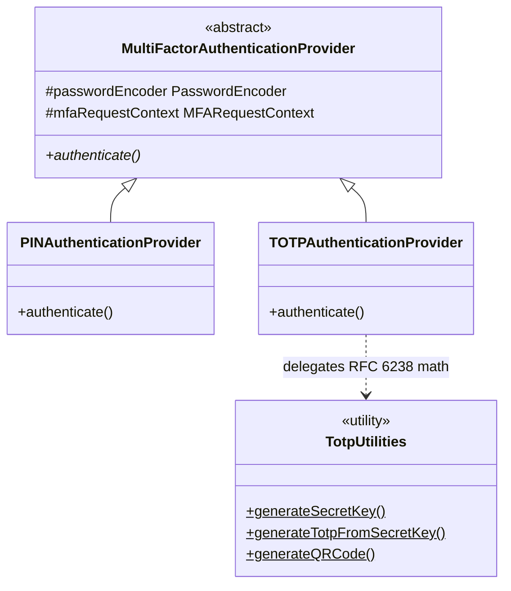

# Unified Multi-Factor Authentication (MFA) Application Standard

## 1. Overview

**Purpose**: To define a secure, consistent standard for implementing the PIN and TOTP authentication factors. This standard covers factor setup, provisioning, verification, and storage — providing a reusable foundation that can be composed with enforcement strategies defined in extending standards.

**Scope**: Server-side services that implement PIN or TOTP factor verification; that can read HTTP request headers; and that persist per-user factor state in a relational store.

**Definitions**:
*   **Principal**: The authenticated user identity (subject); all factor lookups are scoped to this identity.
*   **Challenge Header**: The HTTP request header carrying the submitted factor value. Header names follow the format `X-<FACTOR_TYPE>` (e.g., `X-PIN`, `X-TOTP`).
*   **Factor Provider**: Component responsible for verifying one specific factor type (PIN or TOTP) using stored credentials.
*   **PIN**: A user-created 6-digit numeric secret stored as a bcrypt hash. Self-service enrollment is permitted only when no existing PIN is set.
*   **TOTP**: A time-based one-time password computed from a shared secret and current time window per RFC 6238. Secret is encrypted at rest.


<design-choice>**User Identity**: Services must decide which field `userId` identifies a user within the MFA store. For example, `ssoId` is an identity that services may populate if they route MFA lookups via an SSO identifier. </design-choice>


## 2. Standard Flow

<design-choice>**Registration timing**: Services must decide when MFA registration (PIN setup / TOTP provisioning) is triggered for a user. Options include: (a) **self-service after login** — the user completes enrollment during their first authenticated session, guided by a setup-required prompt; (b) **admin-initiated** — an administrator provisions or resets credentials on behalf of the user, and the user changes them on first use. The choice affects the onboarding UX and who is responsible for bootstrapping credentials.</design-choice>

<design-choice>PIN and TOTP setup is self-service and does not require admin approval. It is blocked only when a PIN or TOTP is already set for the user; admin removal is required before the user may set a new PIN or obtain a new TOTP key.</design-choice>

### 2.1 Happy Path — PIN Setup

1.  Authenticated caller with no existing PIN submits a request to set up a PIN with a raw 6-digit PIN in the `X-PIN` header.
2.  <enforced-constraint>Service validates format against `^\d{6}$` and confirms no non-null PIN exists for this user.</enforced-constraint>
3.  <enforced-constraint>PIN is bcrypt-hashed and persisted to database table. The raw PIN value is never stored.</enforced-constraint>
4.  Response: `200 OK` (void body).

<enforced-constraint>Users may only set up a PIN if no PIN currently exists. Self-service enrollment is blocked when a non-null PIN is already stored.</enforced-constraint>

### 2.2 Happy Path — TOTP Provisioning

1.  Authenticated caller submits a GET request to generate a TOTP QR code.
2.  Service generates a 20-byte cryptographically random secret.
3.  <enforced-constraint>Secret is encrypted using the configured encryption key; ciphertext is stored in the user's `PENDING_TOTP` record. Record is created if absent, updated if present. The main TOTP user details table is not written to at this point.</enforced-constraint>
4.  QR code PNG is generated from `otpauth://totp/<issuer>:<account>?secret=<base32>&issuer=<issuer>&period=<period>&digits=<digits>`.
5.  Response: `200 OK` with PNG bytes in body.

### 2.2a Happy Path — TOTP Setup Confirmation

After receiving the QR code, the caller must immediately verify a TOTP code to confirm the secret was enrolled in their authenticator app correctly. <enforced-constraint>TOTP is not considered active until this confirmation succeeds.</enforced-constraint>

1.  Caller scans the QR code with their authenticator app.
2.  Caller submits a request to the TOTP confirmation endpoint with the first generated code in the `X-TOTP` header.
3.  <enforced-constraint>Service verifies the code against the provisioned secret: decrypt stored ciphertext, compute TOTP for three time windows (counter − 1, counter, counter + 1), constant-time compare against each.</enforced-constraint>
4.  <enforced-constraint>On success: the `PENDING_TOTP` record is promoted — the encrypted secret is written to the main `TOTP_USER_DETAILS` table and the `PENDING_TOTP` record is deleted. The confirmation handler MUST be annotated with `@Transactional`. If either write fails, the transaction is rolled back in full — `PENDING_TOTP` is preserved and `TOTP_USER_DETAILS` is unchanged — so the user can re-scan and retry without data loss.</enforced-constraint> Response: `200 OK`.
5.  On failure (wrong code): `PENDING_TOTP` record is left intact. On failure (write error): the `@Transactional` rollback preserves `PENDING_TOTP`. In both cases the caller may re-scan and retry.

### 2.3 Happy Path — Factor Verification

1.  The factor provider reads the factor value from the request header (`X-<TYPE>`) and verifies:
    *   **PIN**: Bcrypt-matches the supplied value against the stored hash. Throws a missing-code exception if header is empty; throws an invalid-PIN exception if no record exists or the value mismatches.
    *   **TOTP**: Checks that a TOTP key is stored and header is present. Decrypts key using the configured encryption key. Computes TOTP for three consecutive time windows — previous (`counter - 1`), current (`counter`), and next (`counter + 1`). Accepts if the submitted value matches **any** window using constant-time comparison. <enforced-constraint>If the matched counter ≤ `lastUsedCounter` stored on the `TOTP_USER_DETAILS` record, reject with an invalid-TOTP exception (RFC 6238 §5.2 replay prevention). On success, persist `lastUsedCounter` = matched counter.</enforced-constraint>

### 2.4 Failure Paths

*   **Missing factor header**: Header absent or empty → missing-code exception carrying the expected header key string (e.g., `"X-PIN"`).
*   **Invalid PIN**: Bcrypt mismatch → invalid-PIN exception.
*   **PIN not configured**: No PIN record for the user, or PIN field is `null` (removed by admin) → invalid-PIN exception.
*   **Missing TOTP secret or header**: TOTP key is null in the user's record, or `X-TOTP` header is null → missing-code exception.
*   **Invalid TOTP**: Submitted TOTP does not match any of the three computed windows (previous, current, next) → invalid-TOTP exception.
*   **Replayed TOTP counter**: Submitted code matches a time window but that window's counter ≤ `lastUsedCounter` → invalid-TOTP exception (RFC 6238 §5.2).
*   **Encryption/decryption failure**: Encryption or decryption exception surfaces as an internal system exception — no internal retry.
*   **PIN setup rejected**: User already has a non-null PIN → PIN-already-set exception.
*   **PIN removal**: Admin endpoint (requires User Update Role). Sets PIN field to `null`.

### 2.5 Enforced Decision Logic

*   <enforced-constraint>**TOTP RFC 6238 conformance**: TOTP computation MUST follow RFC 6238 exactly — HMAC-SHA1 keyed with the shared secret, time-step counter, and dynamic truncation. Any deviation will produce codes incompatible with standard authenticator apps.</enforced-constraint>
*   <enforced-constraint>**TOTP clock-skew tolerance**: Implementations MUST accept the previous, current, and next time windows (`counter - 1`, `counter`, `counter + 1`) to accommodate clock drift between server and authenticator app.</enforced-constraint>
*   <enforced-constraint>**TOTP replay prevention (RFC 6238 §5.2)**: The last accepted time-step counter MUST be persisted as `lastUsedCounter` on `TOTP_USER_DETAILS`. On each verification, reject any code whose matched counter ≤ `lastUsedCounter`, even if the HMAC comparison succeeds. Update `lastUsedCounter` to the matched counter on every successful verification. Without this check, an intercepted code can be replayed for up to 90 seconds (the full ±1 skew window). On setup confirmation, `lastUsedCounter` MUST be initialised to the matched counter so the confirmation code cannot be immediately replayed as an authentication attempt.</enforced-constraint>

### 2.6 Flow Diagrams

#### Happy Path — Sequence Diagram

```mermaid
sequenceDiagram
    participant C as Caller
    participant S as Service
    participant DB as Database

    Note over C,DB: PIN Setup
    C->>S: POST /pin (X-PIN: raw 6-digit PIN)
    S->>S: Validate format (^\d{6}$) & confirm no existing PIN
    S->>DB: Persist bcrypt-hashed PIN
    S-->>C: 200 OK

    Note over C,DB: TOTP Provisioning
    C->>S: GET /totp/provision
    S->>S: Generate 20-byte random secret
    S->>S: Encrypt secret with configured encryption key
    S->>DB: Persist ciphertext in TOTP record
    S->>S: Generate QR code (otpauth URI)
    S-->>C: 200 OK (PNG bytes)

    Note over C,DB: TOTP Setup Confirmation
    C->>S: POST /totp/confirm (X-TOTP header — first code from authenticator app)
    S->>DB: Load TOTP record
    S->>S: Decrypt secret, compute counter-1/counter/counter+1 windows
    S->>S: Constant-time compare submitted code vs all three windows
    S->>DB: Promote confirmed record; set lastUsedCounter = matched counter
    S-->>C: 200 OK (TOTP setup confirmed)

    Note over C,DB: Factor Verification — PIN
    C->>S: Request with X-PIN header
    S->>DB: Load PIN record
    S->>S: Bcrypt-match submitted PIN vs stored hash
    S-->>C: Verification success (proceeds to protected operation)

    Note over C,DB: Factor Verification — TOTP
    C->>S: Request with X-TOTP header
    S->>DB: Load TOTP record
    S->>S: Decrypt TOTP secret with configured encryption key
    S->>S: Compute TOTP for counter-1, counter, counter+1
    S->>S: Constant-time compare submitted value vs all three windows
    S->>S: Check matched counter > lastUsedCounter (replay prevention — RFC 6238 §5.2)
    S->>DB: Update lastUsedCounter = matched counter
    S-->>C: Verification success (proceeds to protected operation)
```

#### Failure Paths — Flowchart

```mermaid
flowchart TD
    A[Incoming MFA Request] --> B{Operation type?}

    B -->|Factor Verification| C{Factor header present?}
    C -->|No — header absent or empty| D[missing-code exception → 412]
    C -->|Yes| E{Factor type?}

    E -->|PIN| F{PIN record exists?}
    F -->|No| G[invalid-PIN exception → 412]
    F -->|Yes| H{Bcrypt match?}
    H -->|No| I[invalid-PIN exception → 412]
    H -->|Yes| J[Verification success ✓]

    E -->|TOTP| K{TOTP key stored?}
    K -->|No — key null| L[missing-code exception → 412]
    K -->|Yes| M{Decrypt succeeds?}
    M -->|No| N[internal system exception → 500]
    M -->|Yes| O{Matches any window counter±1?}
    O -->|No| P[invalid-TOTP exception → 412]
    O -->|Yes| O2{matched counter > lastUsedCounter?}
    O2 -->|No — replay| P
    O2 -->|Yes| O3[Update lastUsedCounter]
    O3 --> J

    B -->|PIN Setup| Q{Existing non-null PIN?}
    Q -->|Yes| R[PIN-already-set exception → 422]
    Q -->|No| S{Format valid — ^\d{6}$?}
    S -->|No| T[validation exception → 422]
    S -->|Yes| U[Persist bcrypt hash → 200 OK ✓]

    B -->|TOTP Setup Confirmation| V{TOTP key stored?}
    V -->|No — provisioning not done| W[missing-code exception → 412]
    V -->|Yes| X{Decrypt succeeds?}
    X -->|No| Y[internal system exception → 500]
    X -->|Yes| Z{Matches any window counter±1?}
    Z -->|No| AA[invalid-TOTP exception → 412 — user may re-scan and retry]
    Z -->|Yes| AB[Promote TOTP; set lastUsedCounter = matched counter → 200 OK ✓]
```


## 3. Best Practices & Contracts

### 3.1 Inputs / Outputs

#### Base Standard

| Operation | Input | HTTP Response | Database Side Effect |
|:---|:---|:---|:---|
| PIN Setup | Raw 6-digit PIN (`^\d{6}$`) in `X-PIN` header. Rejected at validation if format invalid or header absent. | `200 OK` (void body) | New PIN record created with bcrypt-hashed PIN. |
| TOTP Provisioning | None — caller provides no input; secret is server-generated. | `200 OK` (QR code PNG bytes). QR encodes `otpauth://totp/<issuer>:<account>?secret=<base32>&issuer=<issuer>&period=<period>&digits=<digits>`. | `PENDING_TOTP` record created or updated with encrypted secret ciphertext (20-byte secret). Plaintext secret is never stored. Main `TOTP_USER_DETAILS` table is not written to until setup confirmation succeeds. |
| Factor Verification (success) | Factor value submitted via challenge header (`X-PIN` or `X-TOTP`). TOTP digits: 6 (enforced at startup). | Proceeds to protected operation; no direct HTTP response from this layer. | TOTP: `lastUsedCounter` updated to the matched counter on `TOTP_USER_DETAILS`. PIN: no mutation. |
| PIN Removal (admin) | None — admin action; no request body required. | `200 OK` (void body) | PIN field set to `null` in PIN record. |

### 3.2 Error Contract

#### Base Standard

| Failure Category | Error Type | HTTP Status | Error Category | Retryability |
|:---|:---|:---|:---|:---|
| Missing factor header | missing-code exception | `412` | Authentication | **Retryable** — caller submits the missing header and retries. |
| Invalid factor value (PIN/TOTP mismatch or expired) | invalid-factor exception | `412` | Authentication | **Retryable** — user must correct the input; no automatic retry. |
| System failure (encryption, persistence) | internal system exception | `500` | Authentication | **Terminal** — no internal retry; requires infrastructure investigation. |
| Business constraint violation (e.g. PIN already set) | constraint-violation exception | `422` | Authentication | **Terminal** — user action required (e.g., admin must remove existing PIN). |

#### Org Standard

*   Error responses MUST NOT expose internal exception messages, class names, or stack traces to the caller. The response body MUST be a structured error object conforming to the org API error schema.
*   Missing-header and invalid-factor errors use `412 Precondition Failed`. Business constraint violations (e.g. PIN already set) use `422`. Callers can distinguish these cases by HTTP status alone.
*   When a `422` is returned because the user's MFA enrolment is incomplete (e.g. no PIN record, no TOTP key), the response body MUST include `"detail": "User Details not found."`. The frontend relies on this exact string to distinguish "MFA not set up" from other `422` causes and trigger the setup redirect.
*   `429 Too Many Requests` responses MUST include a `Retry-After` header (integer seconds) so clients can honour the backoff period.

### 3.3 Audit & Logging Contract

#### Base Standard

| Trigger Event | Fields to Log | Log Level |
|:---|:---|:---|
| Factor verification failure (PIN or TOTP mismatch) | `user.id`: `{user.id}`, `error.message`: `{no. attempts}` | `WARN` |
| Account locked — 10+ consecutive failures within 1-hour window | `event.action`: `ATTEMPTS_EXCEEDED`; `user.id`: `{user.id}`, `error.message`: `{no. attempts}` | `ERROR` |
| PIN setup rejected — PIN already exists for user | `event.outcome`: `failure`, `event.reason`: `PIN_ALREADY_EXISTS`; `user.id`: `{user.id}` | `ERROR` |
| PIN created successfully | `event.action`: `PIN_CREATED`; `user.id`: `{user.id}` | `INFO` |
| TOTP setup confirmed — post-provisioning verification passed | `event.action`: `TOTP_SETUP`; `user.id`: `{user.id}` | `INFO` |
| Access denied — insufficient role or privilege | `event.action`: `ACCESS_DENIED`; `error.message`: `{no. attempts}`, `user.id`: `{user.id}` | `ERROR` |

**Prohibited log content** — the following MUST NOT appear in any log line:
*   Raw or unhashed PIN values.
*   Plaintext TOTP secrets or decrypted TOTP key material.
*   Encryption keys or key ciphertext.
*   Raw usernames or PII

For the full list of required standard log fields, refer to the [App Standard: Structured Logging](../../Appfw-Logging-Standards/Log_Schema.md). The MFA-specific fields above are required in addition to the standard fields defined there.


### 3.4 Security Contract

**Encryption**
*   <enforced-constraint>**Hash before persist**: PINs are bcrypt-hashed before storage. Raw values are never written to the database. bcrypt alone does not prevent brute-force enumeration — it MUST be used in conjunction with a persisted lockout counter (see Per-User Attempt Limits below).</enforced-constraint>
*   <enforced-constraint>**Encrypted TOTP secrets**: Secrets are encrypted using the configured encryption key on provisioning and decrypted only at verification time. Raw secret is never stored.</enforced-constraint>

**TOTP Standards**
*   <enforced-constraint>**RFC 6238 conformance**: TOTP generation and verification MUST follow the algorithm specified in RFC 6238. The TOTP value MUST be computed as: `counter = floor(unixEpochSeconds / period)` → HMAC-SHA1 of the counter (big-endian 8-byte) keyed with the shared secret → dynamic truncation (offset = last nibble of hash; extract 4 bytes; mask high bit) → `truncated mod 10^digits` → zero-pad to `digits` width. Any deviation will produce codes incompatible with standard authenticator apps.</enforced-constraint>
*   <enforced-constraint>**TOTP digit length**: TOTP output MUST be exactly 6 digits. This satisfies the NIST SP 800-63B (§5.1.4.1) requirement that OTP authenticator outputs provide sufficient entropy to resist brute-force attack.</enforced-constraint>
*   <enforced-constraint>**Clock-skew tolerance**: Accepting only the exact current time window will reject valid codes from authenticator apps with minor clock drift. Implementations MUST accept the previous, current, and next time windows (`counter - 1`, `counter`, `counter + 1`) to handle clock skew. With a default 30-second period this provides ±30 seconds of tolerance. Do NOT extend the window beyond ±1 period — wider windows significantly increase the brute-force attack surface.</enforced-constraint>
*   <enforced-constraint>**Constant-time comparison**: TOTP values MUST be compared using constant-time byte comparison to prevent timing-attack enumeration of valid codes.</enforced-constraint>

<enforced-constraint>**Per-User Attempt Limits**:
*   Failed verification attempts MUST be tracked per principal and factor type in the database. In-memory counters are insufficient — they reset on application restart and do not survive across scaled or restarted deployments.
*   After **10 cumulative failures** within a 1-hour window, the user must be kicked out of the current session and the account locked until administrative review.
*   Reset the failure counter on successful verification.
*   The following fields MUST be persisted on `PIN_USER_DETAILS`: `failedAttempts` (integer), `lastFailedAttemptAt` (timestamp), `lockedAt` (timestamp). See §4.2 schema.</enforced-constraint>

<design-choice> **Exponential Backoff**:
*   Introduce increasing delays between allowed attempts: e.g., 1 s → 2 s → 4 s → 8 s → … capped at 60 s.
*   The delay SHOULD be enforced server-side (reject early retries with `429 Too Many Requests` and a `Retry-After` header) rather than relying on client-side cooperation.

The backoff schedule and cap are a design decision. Services may choose a different progression or a flat delay.</design-choice>

<design-choice>**Global / IP-Level Throttling**:
*   Apply a global rate limit on MFA verification endpoints (e.g., **20 requests per minute per IP**) at the API gateway.
*   Use sliding-window or token-bucket algorithms for smooth enforcement.

Whether to enforce at the API gateway vs. the application layer, and the specific rate limit, are implementation decisions.</design-choice>

<enforced-constraint>**Encryption Key Rotation**:
The encryption key used to protect TOTP secrets is stored in the database and MUST be rotated at minimum once yearly. Rotation requires re-encrypting all existing TOTP secret records under the new key.</enforced-constraint>

<enforced-constraint>**Setup self-service guard**:
A user may only set their own PIN and set up TOTP when none exists. Overwriting an existing PIN or TOTP key requires admin removal first.</enforced-constraint>

### 3.5 Framework & Infrastructure

#### Base Standard

*   **Core**: Spring Boot, Spring Data JPA.
*   **Hashing**: bcrypt for PINs.
*   **TOTP**: HMAC-SHA1 (`javax.crypto.Mac`); QR code generation library (e.g., ZXing); Base32 encoding for secrets (e.g., Apache Commons Codec).
*   **Persistence**: JPA repository against a relational store.

## 4. Architectural Design

### 4.1 Factor Provider Model

#### Class Hierarchy



`MultiFactorAuthenticationProvider` is the abstract base. It declares `authenticate()`, which each concrete provider must implement. Shared dependencies (`PasswordEncoder`, `MFARequestContext`) are declared once on the base.

*   **`PINAuthenticationProvider`**: Reads `X-PIN` header, loads PIN record, bcrypt-matches submitted value against stored hash. Throws missing-code exception if header absent; throws invalid-PIN exception on mismatch or missing record.

*   **`TOTPAuthenticationProvider`**: Reads `X-TOTP` header, loads TOTP record, decrypts stored ciphertext, delegates RFC 6238 computation to `TotpUtilities`. Iterates three windows (counter ± 1) with constant-time comparison. Throws missing-code exception if header or stored key absent; throws invalid-TOTP exception on window mismatch.

*   **`TotpUtilities`** (static utility, no Spring lifecycle): Owns all TOTP math — HMAC-SHA1, time-step counter, dynamic truncation — and QR code generation. Shared by `TOTPAuthenticationProvider` and the TOTP provisioning command.

#### Provider Dispatch

<design-choice>The MFA enforcement layer holds a collection of registered `MultiFactorAuthenticationProvider` instances configured for the service. Which factor providers are active (PIN, TOTP, or both) is a deployment decision — not all providers need to be registered. Services should select factors based on what the user has (e.g., authenticator app for TOTP) and what the user knows (e.g., PIN).</design-choice>

<enforced-constraint>On each request the enforcement layer iterates through all present providers and calls `authenticate()` on each in sequence. A request is accepted only if every registered provider passes without throwing. Any exception from any provider immediately rejects the request.</enforced-constraint>

<enforced-constraint>**Provider registration startup validation**: The configuration class responsible for registering factor providers in the MFA Type Container MUST validate at startup — before the application begins serving traffic — that no registered `mfaType` key is blank and no provider value is `null`. A misconfigured container (e.g., a blank key or a null provider) would otherwise fail silently at construction and only surface as a `NullPointerException` on the first runtime invocation of the affected operation.</enforced-constraint>

```mermaid
flowchart LR
    A[MFA Request] --> B[Enforcement Layer]
    B --> C{For each registered provider}
    C --> D[provider.authenticate()]
    D --> E{Exception?}
    E -->|Yes| F[Reject — propagate exception]
    E -->|No| G{More providers?}
    G -->|Yes| C
    G -->|No| H[All passed — proceed to protected operation]
```


#### Provider Summary

| Factor | Provider Class |  Storage Table | Storage Fields |
|:---|:---|:---|:---|
| PIN | `PINAuthenticationProvider` | PIN user details | bcrypt-hashed PIN |
| TOTP | `TOTPAuthenticationProvider` | TOTP user details | encrypted TOTP secret bytes |

#### Synchronous vs Asynchronous

*   **CON-01**: All factor verification executes synchronously in the HTTP request thread. There is no deferred or background verification. If the database is unavailable or decryption fails, the request fails immediately and the caller receives a `500` error.

#### External Assumptions

*   <assumption>A relational store reachable via the JPA data source is available at runtime. All factor record reads and writes — including retrieval of the encryption key — fail if the database is unavailable.</assumption>
*   <assumption>A bcrypt `PasswordEncoder` bean is configured and available in the application context. PIN verification cannot proceed without it.</assumption>


### 4.2 Entity Schema

#### PIN User Details

| Field | Type | Constraint | Description | Label |
|:---|:---|:---|:---|:---|
| `id` | integer | **PK**, auto-generated | Internal record ID. | Enforced Constraint |
| `userId` | string | UNIQUE, NOT NULL | User identifier. | Design Choice — chosen user identity key. |
| `pin` | string | Nullable | Bcrypt-hashed PIN. Set to `null` after admin removal. | Enforced Constraint — raw value never stored. |
| `failedAttempts` | integer | NOT NULL, default 0 | Count of consecutive failed verifications in the current 1-hour window. | Enforced Constraint |
| `lastFailedAttemptAt` | timestamp | Nullable | Timestamp of the most recent failed verification. Used to expire the 1-hour window. | Enforced Constraint |
| `lockedAt` | timestamp | Nullable | Set when the account is locked (10+ failures). `null` means not locked. Cleared by admin. | Enforced Constraint |

#### TOTP User Details

| Field | Type | Constraint | Description | Label |
|:---|:---|:---|:---|:---|
| `id` | integer | **PK**, auto-generated | Internal record ID. | Enforced Constraint |
| `userId` | string | UNIQUE, NOT NULL | User identifier. | Design Choice — chosen user identity key. |
| `totpKey` | bytes | Nullable | Encrypted TOTP secret bytes. Null if TOTP not provisioned. | Enforced Constraint — ciphertext only; plaintext never persisted. |
| `failedAttempts` | integer | NOT NULL, default 0 | Count of consecutive failed TOTP verifications in the current 1-hour window. | Enforced Constraint |
| `lastFailedAttemptAt` | timestamp | Nullable | Timestamp of the most recent failed TOTP verification. Used to expire the 1-hour window. | Enforced Constraint |
| `lockedAt` | timestamp | Nullable | Set when the account is locked (10+ TOTP failures). `null` means not locked. Cleared by admin. | Enforced Constraint |
| `lastUsedCounter` | long | NOT NULL, default −1 | Counter value (`floor(epoch / period)`) of the last successfully accepted TOTP code. Verification is rejected if the matched counter ≤ this value (RFC 6238 §5.2 replay prevention). Initialised to −1; updated on every successful verification and on setup confirmation. | Enforced Constraint |

> The Cloud MFA Standard extends this table with `otp` and `otpTtl` columns for OTP factor support.

#### Pending TOTP

Temporary staging table for TOTP secrets that have been provisioned but not yet confirmed by the user. A record is written here when the QR code is generated and removed when the user submits their first valid confirmation code.

| Field | Type | Constraint | Description | Label |
|:---|:---|:---|:---|:---|
| `id` | integer | **PK**, auto-generated | Internal record ID. | Enforced Constraint |
| `userId` | string | UNIQUE, NOT NULL | User identifier. | Design Choice — chosen user identity key. |
| `totpKey` | bytes | NOT NULL | Encrypted TOTP secret bytes awaiting confirmation. | Enforced Constraint — deleted on successful confirmation; ciphertext only, plaintext never persisted. |

<enforced-constraint>On successful setup confirmation, `totpKey` is copied to `TOTP_USER_DETAILS` and the `PENDING_TOTP` record is deleted within the same `@Transactional` boundary. If either write fails, both are rolled back — `PENDING_TOTP` is preserved so the user can re-scan and retry. The main `TOTP_USER_DETAILS` table only ever holds confirmed, active secrets — an unconfirmed secret must never be used for factor verification.</enforced-constraint>


## 5. Test & Validation Standard

### 5.1 Unit Tests

*   **PIN verify success**: Pre-load a bcrypt-hashed PIN; confirm no exception on matching input.
*   **PIN verify failure**: Confirm invalid-PIN exception on mismatched input.
*   **PIN verify missing header**: Confirm missing-code exception when header is empty.
*   **PIN format validation**: Confirm PIN-already-set / validation exception on inputs shorter than 6 digits, longer than 6 digits, non-numeric, and empty. Confirm `^\d{6}$` allows only exactly 6 digits.
*   **PIN setup guard**: Confirm PIN-already-set exception when an existing non-null PIN is present.
*   **TOTP computation**: Use a fixed secret byte array and a fixed epoch timestamp to verify HMAC-SHA1 + truncation + modulo produces the expected string.
*   **TOTP window matching**: Verify that a TOTP generated at `counter - 1` (previous window) and `counter + 1` (next window) are both accepted. Verify that a TOTP from `counter - 2` or `counter + 2` is rejected with an invalid-TOTP exception.
*   **TOTP boundary condition**: Use a fixed instant exactly on a period boundary and verify the previous window's code is still accepted.
*   **TOTP replay rejection**: Successfully verify a TOTP code; confirm `lastUsedCounter` is updated to the matched counter; immediately attempt verification with the same code again → confirm invalid-TOTP exception is thrown.
*   **TOTP provisioning**: Confirm encryption is called with the configured key; confirm QR PNG bytes are non-empty; confirm internal system exception when encryption fails.

### 5.2 Integration Tests

*   Full request flow with an authenticated principal and valid `X-PIN`, `X-TOTP` headers.
*   Simulated encrypt/decrypt using deterministic test doubles (fixed byte passthrough).

### 5.3 Test Data Guidance

*   Use deterministic fixed-byte secrets for TOTP unit tests.
*   Use a fixed timestamp to validate TOTP counter and TTL boundary conditions.
*   Never use real PII in test fixtures.
*   Use a stub or fixed-key encryption implementation for CI environments.

### 5.4 Integrator Test Gaps

The following test scenarios are the integrator's responsibility and are not covered by this standard's test suite:

*   **HTTP exception mapping**: End-to-end tests confirming domain exceptions (missing-code, invalid-factor, etc.) are mapped to the correct HTTP status codes by the integrator's exception handler.
*   **Audit event emission**: Tests confirming that audit events are emitted with all required fields (actor, timestamp, factor type, target resource, outcome) on both success and failure paths.
*   **Rate limiting**: Tests confirming that brute-force lockout and backoff policies are enforced at the application or gateway layer.

## 6. Operational Runbook

### 6.1 Health Indicators
The following are recommended at the application level:

| Indicator | Check Description | Failure Consequence |
|:---|:---|:---|
| `db` | Database connectivity | All MFA operations fail |

### 6.2 Default Configuration

#### TOTP Properties

| Property | Type | Default | Description |
|:---|:---|:---|:---|
| `issuer` | string | *(none — required)* | Issuer name shown in the authenticator app. No default; application fails to start if absent or blank. |
| `period` | integer | `30` | TOTP time step in seconds (RFC 6238). |
| `digits` | integer | `6` | TOTP output digit count. Exactly 6. |

### 6.3 Error Mode Classification

| Failure Source | Recovery Mode | Operator Action |
|:---|:---|:---|
| Database unavailable | **Potentially self-healing** — application reconnects on next request if the database becomes reachable. | Monitor database health; restart application if connection pool is exhausted. |
| Encryption key misconfigured or unavailable | **Manual intervention required** — TOTP provisioning and verification fail for all users until the encryption key is accessible. | Verify the encryption key is present in the database and the application is configured with the correct key reference. |
| bcrypt password encoder not configured | **Manual intervention required** — application startup fails or PIN verification throws at runtime. | Verify bcrypt encoder bean is defined in the application context and the application is correctly deployed. |

## 7. Negative Requirements Summary

| Req ID | Anti-Pattern | Prevention | Reference |
|:---|:---|:---|:---|
| NEG-REQ-01 | TOTP compared with string equality — timing-attack risk | Use constant-time byte comparison | §3.4 |
| NEG-REQ-02 | TOTP only accepts current time window — clock-skew rejection | Accept previous and next windows (±1 period) | §3.4 |
| NEG-REQ-04 | PIN removal and reset mutations not persisted after entity update | Always persist the entity after mutation | §2.4 |
| NEG-REQ-05 | TOTP replay within the same (or adjacent) time step — code reuse within 90-second window | Persist `lastUsedCounter`; reject if matched counter ≤ stored value | §3.4 |


## 8. Appendix

### Glossary

*   **Principal**: The authenticated user identity (subject); all factor lookups are scoped to this identity.
*   **Challenge Header**: The HTTP request header carrying the submitted factor value (e.g., `X-PIN`, `X-TOTP`).
*   **Factor Provider**: Component responsible for verifying one specific factor type using stored credentials.
*   **PIN**: A user-created 6-digit numeric secret stored as a bcrypt hash.
*   **TOTP**: A time-based one-time password computed from a shared secret and current time window per RFC 6238.
*   **bcrypt**: A password-hashing function based on the Blowfish cipher, used to store PIN values. Resistant to brute-force via configurable cost factor.
*   **Encryption Key**: A symmetric key stored in the database used to encrypt and decrypt TOTP secrets. Must be rotated yearly. The Cloud MFA Standard replaces this with AWS KMS-managed keys.
*   **Clock-skew**: The difference in system time between the server and the authenticator app. Accepting ±1 time window (±30 seconds) mitigates rejection of valid TOTP codes caused by minor clock drift.
*   **HMAC-SHA1**: Hash-based Message Authentication Code using SHA-1, as specified in RFC 2104; used for TOTP computation per RFC 6238.
*   **Dynamic Truncation**: RFC 6238 method of extracting a 4-byte integer from a 20-byte HMAC-SHA1 output, at an offset determined by the last nibble of the hash.
*   **otpauth URI**: Google Authenticator Key URI format used to provision TOTP secrets into authenticator apps via QR code (`otpauth://totp/<issuer>:<account>?...`).

### Changelog

*   2026-03-12 — v1.0 initial extraction from the MFA dependency library.

### Standards Referenced

*   **RFC 6238** — TOTP: Time-Based One-Time Password Algorithm. HMAC-SHA1, time-step counter, dynamic truncation. Normative for CON-06.
*   **RFC 4226** — HOTP: An HMAC-Based One-Time Password Algorithm. Foundation for RFC 6238's HMAC + dynamic truncation.
*   **NIST SP 800-63B** — Digital Identity Guidelines: Authentication and Lifecycle Management. TOTP output MUST be at least 6 digits to satisfy the entropy requirements for OTP authenticators per §5.1.4.1.
*   **Google Authenticator Key URI Format** — `otpauth://totp/` URI scheme for QR code provisioning (https://github.com/google/google-authenticator/wiki/Key-Uri-Format).
