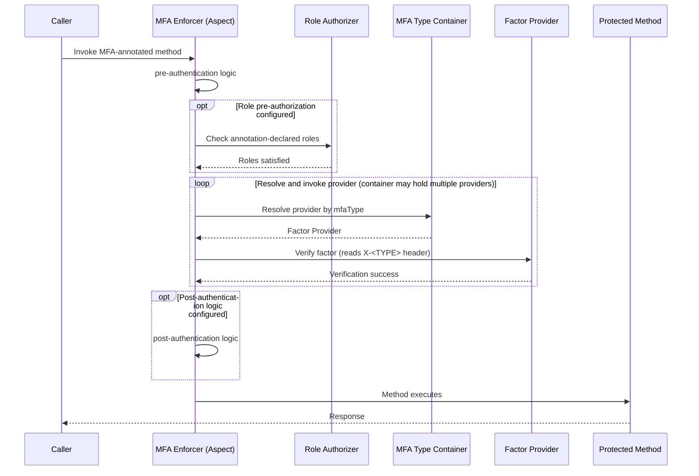
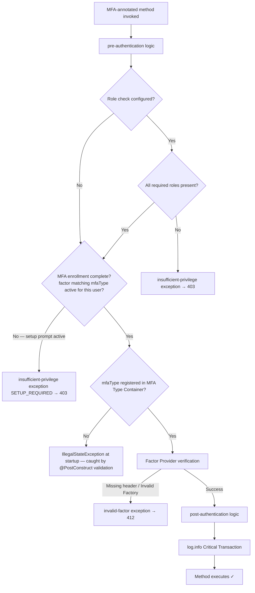

# Critical Transaction MFA Standard

**Extends**: [Base Standalone Application Standard](../MFA_Core/Base_Standalone_Application_Standard.md)

This standard extends the Base Standalone Application Standard with the AOP-based enforcement mechanism for protecting critical transaction operations. It defines how MFA factor verification is wired into the request lifecycle via a method-level interceptor.

---

## 1. Overview Addendum

**Purpose**: Define how PIN, OTP, and TOTP factor verification from the Base Standard is enforced on critical transaction operations via a method-level AOP interceptor. Whether to gate enforcement behind a role check is a design choice left to the implementor.

**Scope**: Spring Boot services using Spring AOP and Spring Security that gate critical operations behind a second factor. <assumption>Requires a fully authenticated principal established by primary authentication.</assumption>

**Definitions**:
*   **MFA Enforcer Aspect**: A method-level AOP interceptor invoked on methods annotated with the MFA marker annotation. Runs pre-authentication logic, optional role pre-authorization, factor verification, post-authentication logic, and critical transaction logging.
*   **MFA Type Container (Optional)**: An optional registry mapping `mfaType` string identifiers to Factor Provider instances. The enforcer resolves the correct provider at runtime from this container. Supports multiple concurrent provider registrations, one per `mfaType`.
*   **Role Authorizer**: An optional component within the MFA Enforcer that evaluates the caller's granted authorities against roles declared on the annotation. Whether to include a Role Authorizer is a design choice.
*   **Critical Transaction Role**: The Spring Security role constant `ROLE_CRITICAL_TRANSACTION`. <design-choice>Whether to require this role before factor verification is a deployment decision. Implementors may require `ROLE_CRITICAL_TRANSACTION`, other annotation-declared roles, both, or no role check at all.</design-choice>
*   **Enrollment Complete**: The factor matching the annotation's `mfaType` is active for the requesting user. Scoped to the specific factor being enforced — a user with a TOTP key is not considered enrolled for a PIN-annotated method, and vice versa.

## 2. Standard Flow Addendum

### 2.4 Happy Path — MFA Enforcement (Verification)

1.  A method annotated with the MFA enforcement annotation (specifying `mfaType` and optional `privileges`) is called.
2.  *(Optional)* The interceptor executes pre-authentication logic.
3.  *(Optional)* If role pre-authorization is configured: the interceptor delegates to the Role Authorizer. If any required roles are missing, an insufficient-privilege exception is thrown and the method does not proceed.
4.  *(Optional)* The interceptor resolves the factor provider for the specified `mfaType` from the MFA Type Container (or invokes a provider directly — see §4.2).
5.  Provider reads the factor value from the request header (`X-<TYPE>`) and verifies per Base Standard §2.3.
6.  *(Optional)* Interceptor executes post-authentication logic.
7.  Method executes.

### 2.5 Failure Paths & Design Choices

*   **Insufficient privileges** *(only when role pre-authorization is configured)*: Caller lacks a required annotation-declared role → insufficient-privilege exception. Method does not proceed.

### 2.6 Flow Diagrams

#### Happy Path — Sequence Diagram

#### Failure Paths — Flowchart

## 3. Contracts Addendum

### 3.1 Inputs / Outputs (Critical Transaction Additions)

**Inputs:**
*   **`mfaType`**: <design-choice>Annotation attribute identifying the factor type to verify (e.g., `"PIN"`, `"TOTP"`). Must correspond to a registered provider in the MFA Type Container.</design-choice>
*   **`privileges`**: <design-choice>Annotation attribute declaring the set of Spring Security roles to enforce if role pre-authorization is enabled. Which roles to require, including whether to use `ROLE_CRITICAL_TRANSACTION`, is a design choice.</design-choice>

**Outputs:**
*   **On success**: The method executes; a critical transaction log line is emitted unconditionally.
*   **On failure**: An exception is thrown (insufficient-privilege, missing-code, or invalid-factor); the method does not execute.

**Assumptions**:
<assumption>A fully authenticated principal is pre-established in the Spring Security context before the aspect fires. If role pre-authorization is configured and no principal exists, the Role Authorizer will see an empty authority list and reject with an insufficient-privilege exception.</assumption>

### 3.2 Error Contract (Critical Transaction Additions)

| Failure Category | Error Category | HTTP Status | Error Type | Retryability |
|:---|:---|:---|:---|:---|
| Insufficient privilege (role missing) | `auth` | `403` | Insufficient Privilege Error | **Terminal** — no user-level retry; caller must be granted the required role. |
| Invalid Factor or Missing Header | `auth` | `412` | Invalid Factor Exception | **Retryable** — Factor can be retried up to max number of retries defined. | 

### 3.3 Audit & Logging Contract Addendum

#### Base Standard

| Trigger Event | Log Level | Log Keys and Values |
|:---|:---|:---|
| Role authorization failed — missing required role or privilege | `WARN` | `event.action`: `CRITICAL_TRANSACTION`; `user.id`: `{user.id}`; `error.message`: `INSUFFICIENT_PRIVILEGE`; `error.code`: `403`; `error.category`: `cert/auth`; `event.outcome`: `failure` |
| Invalid factor or missing header | `WARN` | `event.action`: `CRITICAL_TRANSACTION`; `user.id`: `{user.id}`; `factorType`: `{mfaType}`; `error.message`: `INVALID_FACTOR` \| `MISSING_HEADER`; `error.code`: `412`; `error.category`: `cert/auth`; `event.outcome`: `failure` |
| Configuration error — `mfaType` not registered in MFA Type Container | `ERROR` | `event.action`: `CRITICAL_TRANSACTION`; `factorType`: `{mfaType}`; `error.message`: `UNREGISTERED_MFA_TYPE`; `error.code`: `500`; `error.category`: `system`; `event.outcome`: `failure` |
| Critical transaction executed — MFA enforcement passed | `INFO` | `event.action`: `CRITICAL_TRANSACTION`; `user.id`: `{user.id}`; `method`: `{fully-qualified method}`; `factorType`: `{mfaType}`; `event.outcome`: `success` |

**Prohibited log content** — the following MUST NOT appear in any log line emitted by the aspect:
*   Factor values (PIN digits, TOTP codes, OTP codes).
*   Raw usernames or any PII.

For the full list of required standard log fields, refer to the [App Standard: Structured Logging](../../Appfw-Logging-Standards/Log_Schema.md). The MFA Critical Transaction-specific fields above are required in addition to the standard fields defined there.

### 3.4 Security Contract (Critical Transaction Additions)

#### Base Standard

*   <enforced-constraint>**Enforcement chain cannot be bypassed**: An exception thrown by pre-authentication logic propagates immediately and prevents role checking and factor verification from executing. The method does not execute if any step in the chain throws.</enforced-constraint>
*   <enforced-constraint>**Critical transaction log is unconditional**: The `INFO` log for every successful critical transaction execution cannot be suppressed by pre/post-authentication logic or by the method itself.</enforced-constraint>

### 3.6 Framework & Infrastructure (Critical Transaction Additions)

*   **AOP / Security**: Spring AOP, Spring Security.

## 4. Architectural Design Addendum

### 4.1 Interceptor Execution Model

*   <enforced-constraint>The steps present in the enforcement sequence execute in the order shown. No configured step can be reordered or skipped.</enforced-constraint>
*   <design-choice>**Pre-authentication logic**: Custom logic that runs before role check and factor verification. Optional — omit if no pre-verification work is needed.</design-choice>
*   <design-choice>**Role pre-authorization**: Whether the Role Authorizer (RA) is included is a deployment decision. When included, it runs after pre-authentication logic and before provider resolution.</design-choice>
*   <design-choice>**Post-authentication logic**: Custom logic that runs after successful factor verification and before method execution. Optional — omit if no post-verification work is needed.</design-choice>

### 4.2 MFA Type Container

The MFA Type Container is a `Map<String, MultiFactorAuthenticationProvider>` populated at startup. The enforcer queries it by `mfaType` string to resolve the correct provider per annotated invocation.

<design-choice>**MFA Type Container vs. direct invocation**: Use the MFA Type Container when the application supports many factor types (e.g., `PIN`, `OTP`, and `TOTP`). If the application has one factor type, the aspect can invoke the provider directly without a container lookup, removing the registry indirection.</design-choice>

**Registering providers**: Populate the container via a `@Configuration` class that injects all provider beans and maps each `mfaType` string key to its corresponding provider instance. See Recipe CT3 for an implementation example.

*   <enforced-constraint>If the `mfaType` value from the annotation is not registered in the container, the aspect throws at runtime. There is no fallback or auto-registration. All `mfaType` annotation values MUST have a registered provider at startup.</enforced-constraint>
*   <enforced-constraint>**Annotation `mfaType` startup validation**: The MFA Enforcer Aspect MUST scan all Spring beans at startup and validate that every `mfaType` value declared on `@MultiFactorAuthentication` annotations is registered in the container. If any annotation references an unregistered `mfaType` (e.g. a typo such as `"PILN"` when only `"PIN"` is registered), the application MUST fail to start with a descriptive error identifying the offending method and the `mfaType` value. This prevents misconfigured annotations from deploying silently and failing only at runtime when the annotated method is first invoked.</enforced-constraint>

### 4.3 Synchronous Execution

*   <enforced-constraint>The MFA enforcement aspect executes synchronously in the HTTP request thread. All pre-authentication logic, role check (if configured), provider, post-authentication logic, and logging steps complete before the method returns a response to the caller.</enforced-constraint>

## 5. Test & Validation Addendum

### 5.1 Unit Tests (Critical Transaction Additions)

*   **Role authorization** *(if enabled)*: Confirm rejection when any configured role is missing from the security context. Confirm success when all required roles are present. Confirm enforcement proceeds without a role check when role pre-authorization is not configured.
*   **Interceptor order**: Verify pre-authentication logic executes before role check (if enabled); role check before provider lookup; post-authentication logic after provider; log after post-authentication logic before the method executes.

### 5.2 Integration Tests (Critical Transaction Additions)

*   *(If role pre-authorization enabled)* Verify role privilege check blocks methods when a required role is absent from the security context.
*   Verify the setup-required check returns `true` when the factor matching the annotation's `mfaType` is not yet active for the user (e.g., no PIN record for a PIN-annotated method; no TOTP key for a TOTP-annotated method).
*   **Rate limiting**: Verify that after the configured consecutive-failure threshold (e.g., 10), the next verification attempt is rejected with `429 Too Many Requests` and includes a `Retry-After` header. Verify the failure counter resets on a successful verification.

### 5.3 Test Data Guidance

*   Construct mock Spring Security contexts with required roles present or absent using `SecurityContextHolder` with `UsernamePasswordAuthenticationToken`.
*   Stub the MFA Type Container with a map containing a mock or in-memory Factor Provider for the `mfaType` under test.
*   Simulate pre/post-authentication logic by injecting a test subclass or spy that records invocation order and arguments.
*   To test the setup-prompt path, construct a principal with no active record for the factor type matching the annotation's `mfaType` (e.g., no PIN record for a PIN-annotated method; no TOTP key for a TOTP-annotated method).

### 5.4 Integrator Test Gaps

The following test scenarios are the integrator's responsibility:

*   **Audit event emission**: End-to-end tests confirming that audit events (actor, timestamp, method, outcome) are emitted on both success and failure paths.
*   **End-to-end rate limiting**: Tests confirming that the gateway or application-layer rate limiting enforces the per-user and per-IP thresholds defined in §3.5.
*   **Pre/post-authentication logic**: Tests confirming that any custom pre/post-authentication logic executes as expected in the full Spring context.

## 6. Operational Runbook Addendum

### 6.1 Observable Logs

*   **Critical transaction log line**: Operators can query this log to audit access to every critical operation. Each successful MFA-protected invocation produces exactly one entry.
*   **Insufficient privilege**: `WARN` log emitted when a caller fails role authorization. Includes `username` and the missing role.
*   **Configuration error**: `ERROR` log emitted when the MFA Type Container has no provider for the requested `mfaType`. Indicates a deployment misconfiguration.

### 6.2 Error Mode Classification

| Failure Mode | Recovery Mode | Operator Action |
|:---|:---|:---|
| Unregistered `mfaType` in MFA Type Container | **Startup failure** — the `@PostConstruct` validation in `MultiFactorAuthenticationAspect` detects the mismatch at startup and throws `IllegalStateException` before the application begins serving traffic. The error message identifies the offending method and unregistered value. | Correct the `mfaType` value in the `@MultiFactorAuthentication` annotation or add the missing provider to `MFATypeContainerConfig`. Redeploy. |
| Principal not established before aspect fires | **Manual intervention required** — if role pre-authorization is configured, the Role Authorizer sees an empty authority list and rejects all callers. | Verify the authentication filter chain runs before the AOP aspect in the request processing order. |

### 6.3 Runtime Configuration Requirements

*   **`mfaType` annotation values**: Every `mfaType` value used in `@MultiFactorAuthentication` annotations MUST have a corresponding entry in the MFA Type Container at startup. The `@PostConstruct` validation in `MultiFactorAuthenticationAspect` (Recipe CT1) enforces this — a missing or misspelled `mfaType` causes the application to refuse to start with a descriptive error identifying the offending method, rather than failing silently at the first runtime invocation.
*   **`privileges` annotation values**: If role pre-authorization is enabled, role strings must match the role constants defined in the application's security configuration. A typo in a privilege name will cause silent 403 rejections for all callers of the annotated method.

## 7. Appendix

### Glossary

*   **MFA Enforcer (Aspect)**: A method-level AOP interceptor that enforces MFA verification on annotated methods.
*   **Setup Prompt**: A computed boolean indicating the user should be directed to enroll the specific factor declared on the annotation's `mfaType`. True when the factor matching `mfaType` is not yet active for this user.
*   **Role Authorizer**: An optional component within the MFA Enforcer that evaluates the caller's granted authorities. Whether to use a Role Authorizer is a design choice.
*   **MFA Type Container**: A `Map<String, MultiFactorAuthenticationProvider>` populated at startup. Resolves the correct Factor Provider for each `mfaType` value at runtime. Optional if only one factor type is used.
*   **Critical Transaction Role**: The Spring Security role constant `ROLE_CRITICAL_TRANSACTION`. Whether this role is required before factor verification is a design choice left to the implementor.

### Changelog

*   2026-04-23 — v1.2 MFA Type Container design choice added; post-auth logic made explicitly optional; audit fields extended; "Unified" references corrected to "Base".
*   2026-04-17 — v1.1 role pre-authorization made optional design choice; MFA Handler removed in favour of plain pre/post-authentication logic.
*   2026-04-13 — v1.0 initial standard for AOP-based critical transaction MFA enforcement.

### Standards Referenced

No additional standards referenced beyond the Base Standalone Application Standard. For rate limiting guidance see OWASP Testing Guide (OTG-AUTHN-003 — Testing for Weak Lock Out Mechanism).
