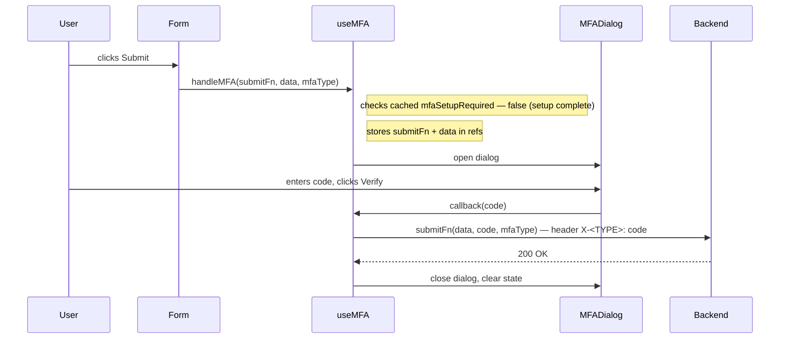
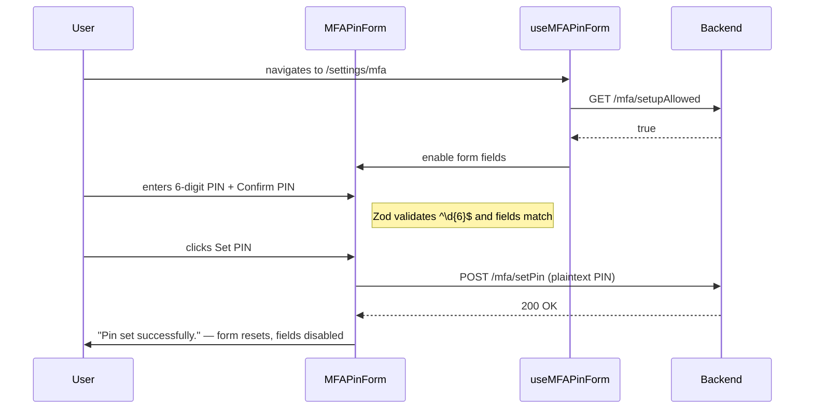
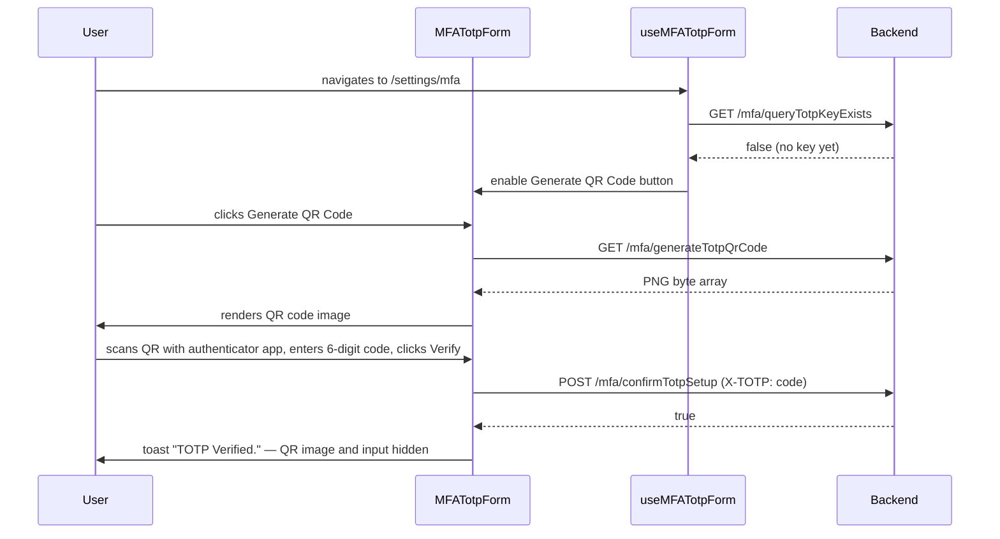
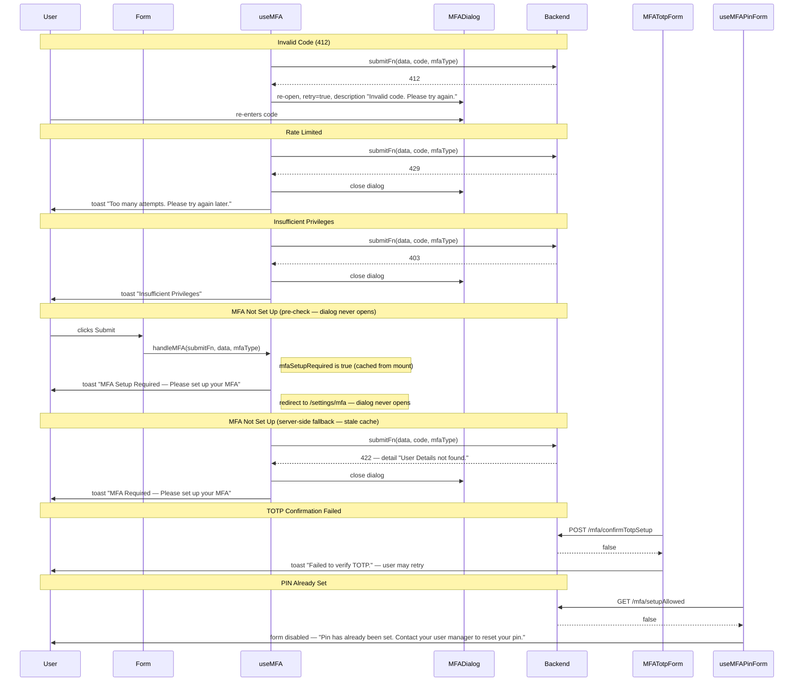

# MFA Frontend – React Module Specification (Standalone)

You are a senior React engineer implementing the MFA frontend module from first principles.

Your job is to generate production-grade, fully wired React code based solely on what is specified in this document — a canonical implementation guide for the MFA frontend module described below.

⚠️ This is not a design discussion or a suggestion list. It is an enforceable implementation standard. Every section is a contract the generated code must satisfy.

**Related backend standard**:
- [Base Standalone Application Standard](../../MFA_Core/Base_Standalone_Application_Standard.md)

## 1. Overview

### 1.1 Purpose

Enables users to set up and verify multi-factor authentication factors (PIN, TOTP). There are three key areas:
* On the settings page, users can provision a PIN and a TOTP authenticator app key.
* On any page that performs a critical transaction, users are prompted to verify their identity with the appropriate factor before the request is sent to the backend.
* A first-login advisory prompt informs users who have not yet completed MFA setup that critical transactions will be blocked until they do.

### 1.2 Scope

Owns the `/settings/mfa` route for factor setup. MFA verification dialogs are rendered inline on any page that contains a critical transaction — they are not route-owned. Session management and auth-guard redirect are out of scope.

## 2. Standard Flow

### 2.1 Happy Path — Critical Transaction Verification



### 2.2 Happy Path — PIN Setup



### 2.3 Happy Path — TOTP Provisioning



### 2.4 Failure Paths




## 3. Components and Types

### 3.1 Types

```typescript
// types.ts

// --- Factor ---
type MfaType = "X-PIN" | "X-TOTP"
type MfaDisplayType = "PIN" | "TOTP"
```

### 3.2 Components

> All state and side effects live in hooks. Components receive everything they need via props derived from hook return values.

| Component | Description | Props | Hook(s) & how linked |
|:---|:---|:---|:---|
| `MFADialog` | Blocking dialog that prompts the user to enter a 6-digit factor code before a critical transaction proceeds. Renders a digit-slot input, Cancel and Verify buttons. | `mfaType: MfaDisplayType`<br>`callback: (code: string) => void`<br>`description?: string`<br>`open: boolean`<br>`setOpen: (open: boolean) => void`<br>`onCancel: () => void`<br>`showSpinner: boolean` | `useMFA` (via `mfaDialogProps`). Parent spreads `mfaDialogProps` onto the component. Clicking **Verify** calls `setMfaCode(code)` from hook → triggers the `useEffect` on `mfaCode` to execute the original method with the MFA header. Clicking **Cancel** calls `onCancel()` (provided by hook; closes dialog and clears retry state). |
| `MFAPinForm` | Form for provisioning a new PIN. Renders PIN and Confirm PIN fields; disables itself and shows an advisory when a PIN is already set. | `pinForm: UseFormReturn<PinFormData>`<br>`handlePinFormSubmit: (data: PinFormData) => void`<br>`isSetupAllowed: boolean`<br>`pinChangeSuccess: boolean`<br>`showSpinner: boolean` | `useMFAPinForm`. On mount, hook calls `GET /mfa/setupAllowed` and sets `isSetupAllowed`, which enables or disables the form. Clicking **Set PIN** calls `handlePinFormSubmit(data)` from hook to post PIN to server. |
| `MFATotpForm` | Form for provisioning a TOTP key. Renders a Generate QR Button, QR code image, a confirmation code input, and Verify button. Generate QR button is always enabled — re-provisioning does not require an OTP gate in standalone. | `handleSubmit: () => void`<br>`imageSrc: string`<br>`showSpinner: boolean`<br>`codeToVerify: string`<br>`setCodeToVerify: (code: string) => void`<br>`verifyTotp: () => void`<br>`isVerified: boolean`<br>`keyExists: boolean` | `useMFATotpForm`. Clicking **Generate QR Code** calls `GET /mfa/generateTotpQrCode` directly. Typing into the confirmation input calls `setCodeToVerify`. Clicking **Verify TOTP** calls `verifyTotpCode()`. |
| `MFAPrompt` | First-login advisory modal shown when the user has not completed MFA setup. Dismissible; does not block navigation or enforce setup. | `open: boolean`<br>`setOpen: (open: boolean) => void`<br>`onClick: () => void` | `useMfaPrompt`. Hook sets `promptOpen = true` on mount if setup is required. Clicking **Close** or **Set Up MFA** calls `setPromptOpen(false)`. |

---

## 5. Hooks


### `useMFA`

**Purpose**: Orchestrates MFA verification for transactions. Stores the originating submit function and form data in refs, manages dialog state, and re-invokes the submit function with the collected factor code.

**How it works**:
- On mount: calls `GET /mfa/requirePinAndTotpSetup` and caches the result as `mfaSetupRequired`.
- `handleMFA` pre-check: if `mfaSetupRequired` is `true`, toasts "MFA Setup Required — Please set up your MFA", redirects to `/settings/mfa`, and returns early — the dialog never opens. This prevents users who have not registered MFA from seeing the verification dialog.
- `requestCallback` stores the original critical transaction function and `dataRef` stores the original function parameters / data.
- User enters code → dialog calls `setMfaCode(code)` via callback → `useEffect` on `mfaCode` fires → calls `submitFn(data, code, mfaType)` with the factor header → resets `mfaCode` to `""`.
- Triggers `handleMFAError` if receives an error back from server:
  - `412`: sets `retry = true`, updates dialog with invalid-code message.
  - `403`: toasts "Insufficient Privileges", closes dialog, no retry.
  - `422` (detail "User Details not found."): toasts "MFA Setup Required", closes dialog, redirects to MFA setup page, no retry. This is a server-side fallback for cases where the cached `mfaSetupRequired` flag is stale (e.g. admin removed MFA after page load).
  - `429`: reads `Retry-After` header (seconds); toasts "Too many attempts. Please try again in {retryAfter}s.", closes dialog, no retry.
  - Non-MFA error: `handleMFAError` returns `false` — caller handles it.

**Returns**
```typescript
{
  mfaDialogProps: MFADialogProps
  handleMFA: (submitFn: MFASubmitFn, data: unknown, mfaType: MfaType) => Promise<void>
  handleMFAError: (error: unknown) => Promise<boolean>
  handleMFASuccess: () => void
  handleMFAFinally: () => void
}
```

---

### `useMFAPinForm`

**Purpose**: Manages PIN setup form state, setup-allowed guard, and PIN submission.

**How it works**:
- On mount: calls `GET /mfa/setupAllowed` — if `false`, form renders disabled.
- Zod resolver: both `pin` and `confirmedPin` must match `^\d{6}$` and be equal; validated on submit only.
- On valid submit: calls `POST /mfa/setPin` with PIN as body; PIN is not retained after the call.
- On success: resets form, sets `isSetupAllowed = false`, sets `pinChangeSuccess = true`.


**Returns**
```typescript
{
  pinForm: UseForm<PinFormData>
  handlePinFormSubmit: (data: PinFormData) => Promise<void>
  isSetupAllowed: boolean
  pinChangeSuccess: boolean
  showSpinner: boolean
}
```

**Notes**
```
- On success: reset form, setIsSetupAllowed(false), setPinChangeSuccess(true). User must not be allowed to submit another PIN once setPinChangeSuccess is true.
- The raw PIN must not be retained in any ref or state after the POST call completes.
- Validation schema (setupPinFormSchema): pin and confirmedPin must both match /^\d{6}$/ and be equal.
```

---

### `useMFATotpForm`

**Purpose**: Manages TOTP provisioning state — QR code image, confirmation code input, verified flag, and key-exists check.

**How it works**:
- `GET /mfa/queryTotpKeyExists` is called once on mount to check if `keyExists`.
- If `keyExists` is `true`, the Generate QR Code button is disabled — re-provisioning is not permitted in standalone. There is no OTP gate to unlock it.
- QR Code PNG response is converted to an object URL via `URL.createObjectURL`, stored as `imageSrc` and displayed to user. The hook revokes the previous object URL on each `imageSrc` change and on unmount via a `useEffect` cleanup.
- `verifyTotpCode` calls `POST /mfa/confirmTotpSetup`: `true` → `isVerified = true`, `keyExists = true`, toast "TOTP Verified."; `false` → toast failure, `codeToVerify` unchanged (user can retry).


**Returns**
```typescript
{
  imageSrc: string
  codeToVerify: string
  setCodeToVerify: (code: string) => void
  verifyTotpCode: () => Promise<void>
  isVerified: boolean
  keyExists: boolean
  showSpinner: boolean
  viewQrCallback: (otp: string, data: unknown) => Promise<void>
}
```

---

### `useMfaPrompt`

**Purpose**: Fetches the MFA setup requirement flag on mount and controls the `MFAPrompt` dialog's open state.

**How it works**:
- On mount: calls `GET /mfa/requirePinAndTotpSetup`; if `true`, sets `promptOpen = true`.
- Prompt is advisory; dismissing calls `setPromptOpen(false)` and does not block navigation.


**Returns**
```typescript
{
  promptOpen: boolean
  setPromptOpen: (open: boolean) => void
}
```

**Notes**
```
- The prompt is advisory only. setPromptOpen(false) on dismiss — do not block navigation.
- No retry or polling — fetch once on mount only.
```

---

## 6. API Contract

### Endpoint: GET /mfa/setupAllowed

```
Purpose:     Check whether the user is permitted to set a new PIN
Headers:     (none beyond default auth)
Responses:
  200 OK     → boolean    Action: setIsSetupAllowed(response)
  4xx/5xx    Action: toast generic error; leave isSetupAllowed as false
```

### Endpoint: POST /mfa/setPin

```
Purpose:     Submit a new PIN for the authenticated user
Headers:     Content-Type: text/plain
Request:     raw PIN string (6 numeric digits)
<assumption>PIN is transmitted as plaintext in the request body; transport-layer security (TLS) is assumed to be in place to protect the PIN in transit.</assumption>
Responses:
  200 OK     → void       Action: reset form, setIsSetupAllowed(false), setPinChangeSuccess(true)
  4xx/5xx    Action: toast "Error setting PIN"
```

### Endpoint: GET /mfa/requirePinAndTotpSetup

```
Purpose:     Determine whether the user needs to complete MFA setup (PIN + TOTP)
Consumers:   useMfaPrompt (advisory prompt), useMFA (pre-check guard)
Responses:
  200 OK     → boolean    Action: useMfaPrompt — if true, setPromptOpen(true)
                                  useMFA — cache as mfaSetupRequired for handleMFA pre-check
```

### Endpoint: GET /mfa/queryTotpKeyExists

```
Purpose:     Check whether the user already has an active TOTP key
Responses:
  200 OK     → boolean    Action: setKeyExists(response), setPromptOpen(!response)
```

### Endpoint: GET /mfa/generateTotpQrCode

```
Purpose:     Generate a TOTP provisioning QR code
Headers:     (none beyond default auth)
Responses:
  200 OK     → PNG byte array    Action: convert to object URL, setImageSrc(url)
  4xx/5xx           Action: toast generic error
```

### Endpoint: POST /mfa/confirmTotpSetup

```
Purpose:     Verify the 6-digit TOTP code against the provisioned key
Request:     { code: string }
Responses:
  200 OK     → boolean    Action: true → setIsVerified(true), toast "TOTP Verified."
                                   false → toast "Failed to verify TOTP."
```

### Required MFA Transaction Endpoint (caller-defined)

```
Purpose:     Any protected backend action requiring a factor header
Headers:     One of: X-PIN: <code> | X-TOTP: <code>
             Only attach when both mfaType and mfaCode are non-empty:
             { ...(mfaType && mfaCode ? { [mfaType]: mfaCode } : {}) }
Responses:
  200 OK     Action: handleMFASuccess() — dialog closes
  412  Action: handleMFAError detects 412 — dialog stays open with retry=true (invalid code)
  403        Action: handleMFAError detects 403 — toast "Insufficient Privileges", dialog closes
  422        Action: handleMFAError detects 422 — toast "MFA Setup required", dialog closes (when detail is "User Details not found.")
  429        Action: handleMFAError detects 429 — reads Retry-After header, toast "Too many attempts. Please try again in {retryAfter}s.", dialog closes
  other      Action: handleMFAError returns false — caller shows generic error
```

---


## 7. Best Practices & Contracts

### 7.1 Validation Contract

**Base Standard**

| Field | Rule | Error Message | Trigger |
|---|---|---|---|
| `pin` | Required; exactly 6 numeric digits (`^\d{6}$`) | "PIN must be exactly 6 digits" | On submit only |
| `confirmedPin` | Must equal `pin` | "PINs do not match" | On submit only |
| `codeToVerify` (TOTP) | Exactly 6 digits, non-empty, must be the correct code as verified with server | "Incorrect Code" | On submit only |

### 7.2 Error Contract

**Base Standard**

| Level | Trigger | UI Treatment | Retryable |
|---|---|---|---|
| MFA not set up (pre-check) | `mfaSetupRequired` is `true` (cached on mount) | Toast + redirect to MFA setup page — dialog never opens | NO |
| Invalid code (412) | Backend rejects or cannot read factor code | `description` prop on MFADialog, `role="alert"` | YES |
| Insufficient privileges (403) | Backend returns 403 | Toast, auto-dismiss 5s | NO |
| MFA not set up (422 fallback) | Backend returns 422 with MFA detail (stale cache) | Toast + redirect to MFA setup page, auto-dismiss 5s | NO |
| Rate limited (429) | Backend returns 429 with `Retry-After` header | Toast "Too many attempts. Please try again in {retryAfter}s.", auto-dismiss 5s | NO |
| Network / 5xx | Fetch throws or 500 | Toast, auto-dismiss 5s | YES |


- Error description on MFADialog must be cleared when the dialog re-opens for a new transaction (retry=false).
- Factor codes must be cleared from dialog local state on every Verify click and on Cancel.


### 7.3 Security Contract

**Base Standard**

- Factor codes must NEVER be stored in localStorage, sessionStorage, or any persistent store.
- MFA session data (e.g. codes, retry state) must not persist beyond the lifetime of the dialog interaction (e.g. after submission).
- PIN values must be cleared from form state on success and on unmount.
- Console.log must never output PINs or TOTP codes.
- Raw API error messages must not be displayed in the UI.
- Submit/Verify button must be disabled immediately on click to prevent double-submit.
- Verify button must be disabled until the input reaches 6 characters.

```tsx
// Submit/Verify button — disable while request is in-flight (showSpinner = true)
<Button type="submit" disabled={showSpinner}>
  {showSpinner ? <Spinner /> : "Submit"}
</Button>

// MFADialog — disable until 6 digits entered or while in-flight
<Button disabled={value.length < 6 || showSpinner} onClick={...}>
  {showSpinner ? <Spinner /> : "Verify"}
</Button>

// MFATotpForm confirmation — disable until 6 digits entered or while in-flight
<Button disabled={codeToVerify.length < 6 || showSpinner} onClick={() => verifyTotp()}>
  Verify
</Button>
```

- Object URLs created for QR images must be revoked on unmount.
- All MFA-related API calls must go through @/lib/api — never raw fetch directly.


---

## 8. Test Contract

### 8.1 Unit Tests (Vitest + React Testing Library)

**Component: `MFADialog`**

```
✓ renders title as "<mfaType> Verification"
✓ does not show ResendOtpButton for any factor type
✓ calls callback with entered code on Verify click
✓ clears input value after Verify click
✓ calls onCancel() on Cancel
✓ shows spinner on Verify button when showSpinner is true
✓ renders description text when description prop is provided
```

**Component: `MFAPinForm`**

```
✓ renders PIN and Confirm PIN fields and Set PIN button
✓ disables all fields and button when isSetupAllowed is false
✓ shows "already set" advisory when isSetupAllowed=false and pinChangeSuccess=false
✓ shows "Pin set successfully." when isSetupAllowed=false and pinChangeSuccess=true
✓ shows field error when PIN does not match /^\d{6}$/
✓ shows field error when PINs do not match
✓ calls handlePinFormSubmit with correct data on valid submit
✓ shows spinner when showSpinner is true
```

**Hook: `useMFA`**

```
✓ calls GET /mfa/requirePinAndTotpSetup on mount and caches result
✓ does not open dialog and redirects to /settings/mfa when mfaSetupRequired is true
✓ opens dialog and stores submitFn when handleMFA is called and mfaSetupRequired is false
✓ invokes submitFn with collected code on useEffect trigger
✓ sets retry=true and reopens dialog on 412 error (invalid code)
✓ sets retry=true and reopens dialog on 412 error (missing factor)
✓ shows toast and closes dialog on 403 error
✓ shows MFA required toast on 422
✓ shows rate-limited toast and closes dialog on 429 error
✓ closes dialog and clears state on handleMFASuccess
✓ sets showSpinner=false on handleMFAFinally
```

**Hook: `useMFAPinForm`**

```
✓ calls GET /mfa/setupAllowed on mount
✓ sets isSetupAllowed=false when endpoint returns false
✓ calls POST /mfa/setPin with Content-Type: text/plain on submit
✓ sets pinChangeSuccess=true and resets form on 200 response
✓ shows error toast on 422 response
```
---

## 9. Architectural Constraints

**[Enforced Constraint]** Business logic, API calls, and state transitions live exclusively in hooks — not in any component.

**[Enforced Constraint]** Factor codes must be cleared from state immediately after use. No factor code survives beyond the Verify callback.


**[Assumption]** An HTTP client instance exists at `@/lib/api` that handles base URL, default auth headers, and response parsing. This module does not configure it.

**[Assumption]** Toast notifications are available via the project's design system. This module does not implement a toast system.


---

## 10. Example Fixtures

```typescript
// Successful PIN setup
const mockSetupAllowedTrue = true
const mockSetupAllowedFalse = false
const mockValidPinForm: PinFormData = { pin: '123456', confirmedPin: '123456' }

// TOTP verification
const mockTotpVerifiedTrue = true
const mockTotpVerifiedFalse = false
const mockQrPngBytes = new Uint8Array([137, 80, 78, 71]) // PNG magic bytes (stub)

// MFA dialog interaction
const mockMfaCode = '123456'
const mockMfaTypePin: MfaType = 'X-PIN'
const mockMfaTypeTotp: MfaType = 'X-TOTP'

// API errors
const mock412Error = { status: 412, data: { code: 'INVALID_FACTOR' } }
const mock412MissingHeader = { status: 412, data: { code: 'MISSING_HEADER' } }
const mock403Error = { status: 403, data: { code: 'FORBIDDEN' } }
const mock422MfaError = { status: 422, data: { detail: 'User Details not found.' } }
const mock429Error = { status: 429, data: { code: 'TOO_MANY_REQUESTS' } }
```
---

## Appendix

### A. Glossary

| Term | Definition |
|---|---|
| Factor | A single MFA method: PIN or TOTP |
| Critical Transaction | A backend-protected action that requires a factor header |
| MFA Dialog | The `MFADialog` component; collects a factor code via a ref-based callback |
| Retry State | `retry=true` in dialog state; triggers an error description on re-open |
| Setup Allowed | `GET /mfa/setupAllowed` result; gates PIN form enablement |
| Object URL | Blob URL created from a PNG byte array response for QR display; must be revoked on unmount |


### . Changelog

| Version | Date | Author | Notes |
|---|---|---|---|
| 1.0 | 2026-04-29 | — | Initial standard |
| 2.0 | 2026-05-22 | — | Refactored from combined standard: Standalone-only, IS_MCC_ENV removed |
