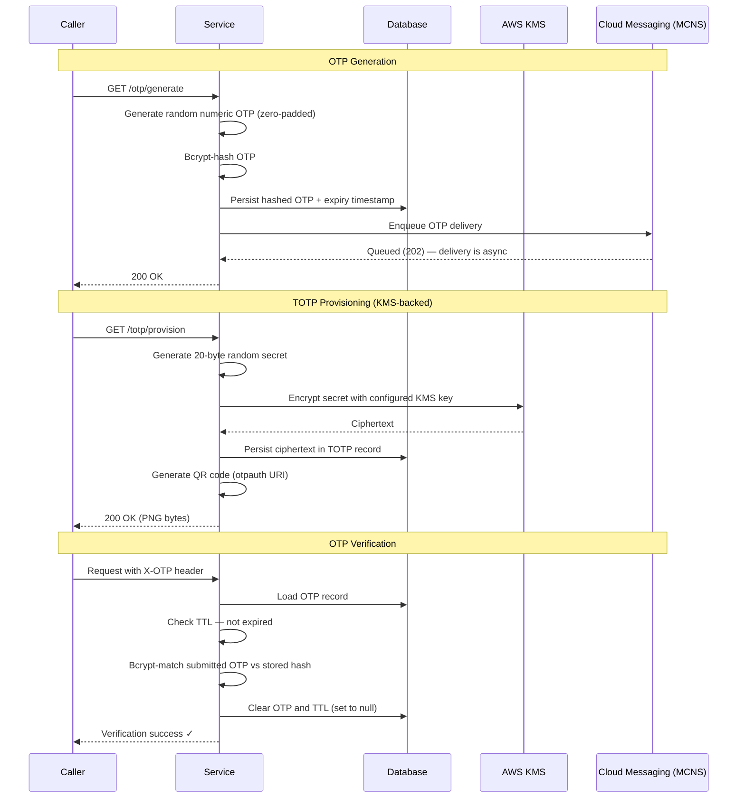
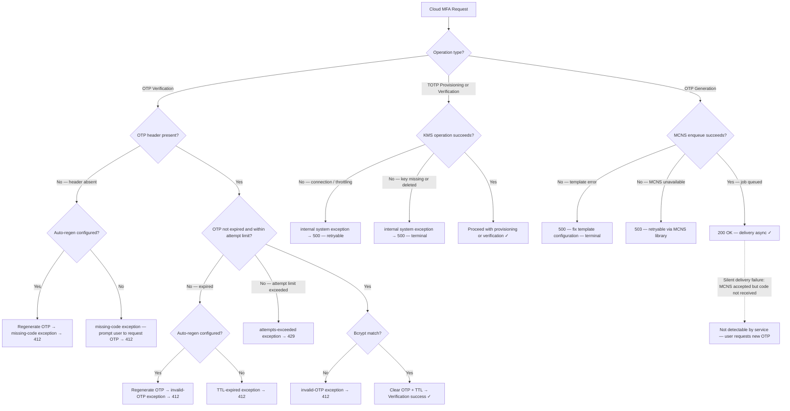

# Cloud MFA Application Standard

**Extends**: [Base Standalone Application Standard](../MFA_Core/Base_Standalone_Application_Standard.md)

All requirements, contracts, and flows from the Base Standalone Application Standard apply. This document adds cloud-specific requirements for services deployed on AWS, covering AWS KMS integration for TOTP secret encryption and the OTP (server-generated one-time password) factor, which depends on cloud messaging infrastructure for delivery.

---

## 1. Overview Addendum

**Purpose**: Define the cloud-specific extensions to the Base Standalone Application Standard for services deployed on AWS. This addendum covers AWS KMS integration for TOTP secret encryption and the OTP factor, which uses a cloud messaging service (MCNS) for one-time password delivery.

**Scope**: Applies to all services covered by the Base standard that are deployed on AWS, use AWS KMS for TOTP secret encryption, and/or implement the OTP factor via a cloud messaging service (e.g. MCNS).

**Definitions**:
*   **OTP**: A server-generated cryptographically random numeric code with a configured TTL, stored as a bcrypt hash. Single-use: deleted on successful verification. Delivered to the user via a cloud messaging service (MCNS).
*   **OTP TTL**: The expiry timestamp persisted alongside the bcrypt-hashed OTP. <enforced-constraint>Records MUST always have a non-null TTL when OTP is set. A null TTL with a non-null OTP causes undefined behaviour in the OTP provider.</enforced-constraint>
*   **MCNS**: The cloud messaging service used to deliver OTP codes to authenticated users. MCNS accepts the delivery job synchronously (the HTTP request thread blocks on the enqueue call), but actual message delivery to the user is asynchronous — the service cannot observe whether the code was received. Refer to the [MCC Notification and Communication Service (MCNS) — Core Integration Standard](../../Appfw-Mcc-Standards/Appfw-Mcns-Standards/MCNS_Core/MCNS_Core_Standard.md) for more information.
*   **KMS**: AWS Key Management Service. Provides a managed encryption key for symmetric encryption of TOTP secrets.

**Assumptions**:
*   <assumption>The service has been onboarded onto MCNS with an approved message template for OTP delivery. MCNS will reject delivery requests from services without an active approved template.</assumption>
*   <assumption>A valid OTP delivery target (phone number or email) is available at OTP generation time — either from the user database or supplied as a request parameter (see §4.4).</assumption>
*   <assumption>Local development uses a KMS-compatible endpoint (LocalStack). The [MCC Project Bootstrap Application Standard](../../Appfw-Project-Bootstrap/Mcc/Mcc_Project_Bootstrap_Application_Standard.md) provides the LocalStack container and an init-script hook; this standard provisions its own KMS key by dropping an init script into that hook — see [Cloud MFA — LocalStack Dev KMS Key Provisioning](MCC_MFA_Reimplementation_Recipes.md), using the alias chosen in Q11a.</assumption>
*   <assumption>The `@SpringBootApplication` entry point (`Application.java`) exists at `shared/app/` (package `com.<org>.<app>.shared.app`) as defined by the [MCC Project Bootstrap Application Standard](../../Appfw-Project-Bootstrap/Mcc/Mcc_Project_Bootstrap_Application_Standard.md). That entry point's `scanBasePackages` discovers this module automatically. If it does not yet exist, implementors must create it per [Bootstrap Recipes Step 4](../../Appfw-Project-Bootstrap/Mcc/Mcc_Project_Bootstrap_Recipes.md) before proceeding — modules cannot be component-scanned without it.</assumption>

## 2. Standard Flow Addendum

### 2.2 Happy Path — OTP Generation (On-Demand)

1.  Authenticated caller submits a GET request to generate OTP.
2.  <enforced-constraint>Service generates a cryptographically random numeric OTP using `SecureRandom`, zero-padded to the configured digit width.</enforced-constraint>
3.  <enforced-constraint>OTP is bcrypt-hashed before persistence. The hash and a non-null expiry timestamp are persisted together. Record is created if absent, updated if present. The plaintext OTP is never written to the database.</enforced-constraint>
4.  <enforced-constraint>OTP is delivered to the user via MCNS. The plaintext OTP must not be returned in the HTTP response body.</enforced-constraint> The delivery target (phone/email) is resolved from the user database or supplied as a parameter — see §4.4.
5.  Response: `200 OK` (void body).

<enforced-constraint>**Sender registration**: The MCNS sender identity (SMS originator or email sender) MUST be registered with the relevant registry before going live. Unregistered senders appear as "Likely SCAM" on recipient devices, causing OTP codes to be ignored.</enforced-constraint>

### 2.3 TOTP Provisioning — KMS Detail

Replaces the abstract step 3 in Unified §2.2:

3.  <enforced-constraint>Secret is encrypted with the configured AWS KMS key before any persistence. Ciphertext is stored in the user's PENDING_TOTP staging record. The plaintext secret is never written to the database.</enforced-constraint>

### 2.4 Failure Paths (Cloud Additions)

*   **Missing OTP header**: Request rejected immediately — no OTP is generated. The frontend is responsible for calling `GET /otp/generate` before submitting any OTP-gated request.
*   **Expired OTP**: Auto-regenerate a new OTP (side effect), then reject with an expired error code. The user receives a fresh code and can retry via the resend control.
*   **Invalid OTP**: Bcrypt mismatch and not expired → invalid-OTP exception.
*   **OTP attempt limit exceeded**: After 3 failed attempts within the TTL period, the OTP is invalidated → user must request a new OTP.
*   **KMS connection / throttling failure**: Transient network issue or KMS rate limit exceeded → internal system exception. Retryable — the next request will re-attempt the KMS call.
*   **KMS key missing or deleted**: Key policy revoked or key deleted → internal system exception. Terminal — requires manual key restoration before TOTP operations can resume.
*   **MCNS template error**: OTP generation request references an unapproved or misconfigured message template → 500. Terminal — requires template correction before delivery can succeed.
*   **MCNS enqueue failure**: MCNS rejects the delivery request immediately (service unavailable, rate limit, etc.) → OTP record is persisted but enqueue failed → 503. Synchronous — the caller receives an error response. Retryable via MCNS library retry (see [MCNS Core Standard](../../Appfw-Mcc-Standards/Appfw-Mcns-Standards/MCNS_Core/MCNS_Core_Standard.md)) or by the user requesting a new OTP.
*   **MCNS silent delivery failure**: MCNS accepted the enqueue request but never delivered the code (e.g. invalid phone number, carrier rejection, downstream queue failure) → OTP record persisted, user never receives the code. Not detectable by the service — the enqueue call returned success. Only discoverable via MCNS delivery receipts (if configured) or by the user requesting a new OTP.

### 2.6 Flow Diagrams

#### Happy Path — Sequence Diagram

#### Failure Paths — Flowchart

## 3. Contracts Addendum

### 3.1 Inputs / Outputs (Cloud Additions)

#### Base Standard

| Operation | Input | HTTP Response | Database Side Effect | External Side Effect |
|:---|:---|:---|:---|:---|
| OTP Generation | None — server-generated. No input from caller. | `200 OK` (void body) | OTP hash (bcrypt) and expiry timestamp persisted. Existing record updated if present. | OTP delivered to user via MCNS. Plaintext OTP is never returned in the response body. |
| OTP Verification (success) | OTP value submitted via `X-OTP` header. Zero-padded decimal, `digits` wide (default 6). | Proceeds to next operation. | `otp` and `otpTtl` set to `null` (single-use — cleared on success). | None. |
| TOTP Provisioning (KMS) | None — caller provides no input; secret is server-generated. | `200 OK` (PNG bytes) | Encrypted ciphertext stored in TOTP record. | KMS encryption call using configured key ARN. |

<enforced-constraint>The plaintext OTP MUST NOT be returned in the response body. Delivery is exclusively via MCNS.</enforced-constraint>

### 3.2 Error Contract Addendum (Cloud Additions)

#### Base Standard

| Failure Category | Error Type | HTTP Status | Error Category | Retryability |
|:---|:---|:---|:---|:---|
| Expired OTP (TTL elapsed) | invalid-OTP exception | `412` | auth | **Retryable** — caller must request a new OTP. If auto-regen is configured, a new OTP is generated as a side effect. |
| Invalid OTP (bcrypt mismatch, not expired) | invalid-OTP exception | `412` | auth | **Retryable** — user may retry (up to 3 attempts per TTL period). |
| OTP attempt limit exceeded | invalid-OTP exception | `429` | auth | **Retryable after new OTP** — user must request a fresh OTP; existing OTP is invalidated. |
| MCNS template error | OTP delivery exception | `500` | app | **Terminal** — fix the MCNS message template configuration. |
| MCNS enqueue failure (service unavailable) | OTP delivery exception | `503` | network | **Retryable** — OTP record is persisted; MCNS rejected the enqueue call synchronously. Retry via MCNS library or user invokes generate endpoint again. |
| MCNS silent delivery failure (accepted but undelivered) | None — service receives no error | N/A | N/A | **Not observable by service** — MCNS accepted the job but delivery failed downstream (e.g. bad phone number, carrier rejection). Detectable only via MCNS delivery receipts or user-initiated OTP retry. |
| KMS connection / throttling failure | internal system exception | `500` | network | **Retryable** — transient; next request re-attempts KMS call. |
| KMS key missing or deleted | internal system exception | `500` | app | **Terminal** — requires manual key restoration; all TOTP operations fail until resolved. |

#### Org Standard

*   <enforced-constraint>Error responses MUST NOT expose internal exception messages, class names, or stack traces to the caller.</enforced-constraint>
*   When a `422` is returned because the user's MFA enrolment is incomplete (e.g. no OTP user details, no TOTP key), the response body MUST include `"detail": "User Details not found."`. The frontend relies on this exact string to distinguish "MFA not set up" from other `422` causes and trigger the setup redirect.
*   `429 Too Many Requests` responses MUST include a `Retry-After` header (integer seconds) so clients can honour the backoff period.

### 3.3 Audit & Logging Contract (Cloud Additions)

#### Base Standard

| Trigger Event | Log Level | Log Keys and Values |
|:---|:---|:---|
| OTP generated and delivered successfully | `INFO` | `event.action`: `OTP_DELIVERY`; `user.id`: `{user.id}`; `event.outcome`: `success` |
| OTP delivery failed — MCNS template error | `ERROR` | `event.action`: `OTP_DELIVERY`; `user.id`: `{user.id}`; `event.outcome`: `failure`; `error.message`: `MCNS_TEMPLATE_ERROR`; `error.code`: `500`; `error.category`: `application` |
| OTP enqueue failed — MCNS unavailable | `ERROR` | `event.action`: `OTP_DELIVERY`; `user.id`: `{user.id}`; `event.outcome`: `failure`; `error.message`: `MCNS_UNAVAILABLE`; `error.code`: `503`; `error.category`: `network` |
| OTP verification success | `INFO` | `event.action`: `OTP_VERIFICATION`; `user.id`: `{user.id}`; `event.outcome`: `success` |
| OTP verification failed — bcrypt mismatch | `WARN` | `event.action`: `OTP_VERIFICATION`; `user.id`: `{user.id}`; `event.outcome`: `failure`; `error.message`: `INVALID_OTP`; `error.code`: `412`; `error.category`: `cert/auth` |
| OTP verification failed — TTL elapsed | `WARN` | `event.action`: `OTP_VERIFICATION`; `user.id`: `{user.id}`; `event.outcome`: `failure`; `error.message`: `EXPIRED_OTP`; `error.code`: `412`; `error.category`: `cert/auth` |
| OTP attempt limit exceeded | `WARN` | `event.action`: `OTP_VERIFICATION`; `user.id`: `{user.id}`; `event.outcome`: `failure`; `error.message`: `ATTEMPT_LIMIT_EXCEEDED`; `error.code`: `429`; `error.category`: `cert/auth` |
| KMS connection / throttling failure | `ERROR` | `event.action`: `KMS_ENCRYPT` \| `KMS_DECRYPT`; `error.message`: `KMS_THROTTLING`; `error.code`: `500`; `error.category`: `network`; `event.outcome`: `failure` |
| KMS key missing or deleted | `ERROR` | `event.action`: `KMS_ENCRYPT` \| `KMS_DECRYPT`; `error.message`: `KMS_KEY_NOT_FOUND`; `error.code`: `500`; `error.category`: `application`; `event.outcome`: `failure` |

**Silent delivery failures are not loggable** — when MCNS accepts the enqueue request but fails to deliver the code (e.g. bad phone number, carrier rejection), the service receives no error signal and cannot emit a log entry for the failure. These failures are only observable via MCNS delivery receipts (if the MCNS integration provides them) or by the user requesting a new OTP.

**Prohibited log content** — the following MUST NOT appear in any log line:
*   Plaintext OTP values. The OTP is delivered via MCNS — logging it would expose a live credential.
*   Encrypted or decrypted TOTP key material (ciphertext or plaintext bytes).

For the full list of required standard log fields, refer to the [App Standard: Structured Logging](../../Appfw-Logging-Standards/Log_Schema.md). The MFA OTP/KMS-specific fields above are required in addition to the standard fields defined there.

### 3.4 Security Contract (Cloud Additions)

#### Base Standard

*   <enforced-constraint>**Hash before persist**: OTPs are bcrypt-hashed before storage. Raw values are never written to the database.</enforced-constraint>
*   <enforced-constraint>**TOTP secret encryption**: TOTP secrets MUST be encrypted using the configured KMS key on provisioning and decrypted only at verification time. Plaintext secrets are never stored.</enforced-constraint>
*   <enforced-constraint>**Random number generation**: `java.security.SecureRandom` MUST be used for OTP generation. `Math.random()` is prohibited.</enforced-constraint>
*   <enforced-constraint>**OTP attempt limit**: A maximum of 3 failed OTP verification attempts (hash mismatches) is permitted within a single TTL period. On the 4th failed attempt the OTP is invalidated and the user must request a new one. The attempt counter MUST be persisted in the database (`otpAttemptCount` on `OTP_USER_DETAILS`) — an in-memory counter resets on restart and does not enforce the limit across request boundaries.</enforced-constraint>
*   <enforced-constraint>**OTP single-use enforcement**: OTPs must be single-use. `otp` and `otpTtl` MUST be set to null immediately after successful verification to prevent replay attacks. Expired OTPs MUST be rejected and treated as invalid.</enforced-constraint>

<design-choice>**OTP TTL duration**: The recommended TTL is 10 minutes. Services should set the TTL short enough to limit the attack window if an OTP is intercepted, but long enough for the user to receive and enter the code. Note that MCNS delivery (especially SMS) can take several minutes — factor this into the TTL. A TTL shorter than expected MCNS latency will cause OTPs to expire before they arrive.</design-choice>

<design-choice>**OTP regeneration throttling**: Services must decide whether users may request a new OTP at any time, or whether regeneration is gated. Options: (a) **Unrestricted regeneration** — simplest; appropriate when MCNS cost and rate limits are not a concern, but exposes a spam vector; (b) **Cooldown period** — enforce a minimum wait between requests (e.g., 60–120 seconds); appropriate when MCNS delivery has noticeable latency. Set the cooldown to be slightly longer than the expected MCNS delivery latency — if MCNS typically takes 2 minutes, a 90-second cooldown discourages impatient re-requests while keeping the user unblocked if the first delivery failed. Increasing the cooldown tightens abuse prevention but frustrates users if delivery is slow. Choose the shortest cooldown that is still longer than typical MCNS latency for your channel.</design-choice>

### 3.5 Framework & Infrastructure (Cloud Additions)

#### Base Standard

*   **Hashing**: bcrypt for OTPs (in addition to PINs).
*   **KMS**: AWS SDK v2 for encrypt/decrypt operations.
*   **Messaging**: Cloud messaging service (e.g. MCNS) for OTP delivery.

## 4. Architectural Design Addendum

### 4.1 OTP Provider Model (Cloud Additions)

The OTP factor extends the provider model defined in the Base Standalone Application Standard (§4.1). 

`OTPAuthenticationProvider` is a concrete implementation of `MultiFactorAuthenticationProvider`, joining `PINAuthenticationProvider` and `TOTPAuthenticationProvider` under the same abstract base.

<design-choice>`OTPAuthenticationProvider` is cloud-specific and only applies to MCC deployments. Services not using MCNS should not register this provider. Which factors are active is a deployment decision — see the Base Standalone Standard §4.1 for provider dispatch rules.</design-choice>

### 4.2 Entity Schema — OTP User Details (Cloud Addition)

OTP state is stored in its own dedicated table (`OTP_USER_DETAILS`). This keeps OTP lifecycle (generation, expiry, single-use clearing) independent.

| Field | Type | Constraint | Description | Label |
|:---|:---|:---|:---|:---|
| `id` | integer | **PK**, auto-generated | Internal record ID. | Enforced Constraint |
| `userId` | string | UNIQUE, Nullable | Chosen user identifier. | Design Choice — chosen identity key. Refer to the [Base Standalone Application Standard](../MFA_Core/Base_Standalone_Application_Standard.md). |
| `otp` | string | Nullable | Bcrypt-hashed current OTP. Set to `null` after successful verification. | Enforced Constraint — null-after-success is mandatory; a non-null OTP after verification indicates a persistence failure. |
| `otpTtl` | timestamp | Nullable | OTP expiry timestamp. Set to `null` after successful verification. | Enforced Constraint — must be non-null whenever `otp` is non-null; a null TTL with a non-null OTP causes undefined behaviour in the OTP provider. |
| `otpAttemptCount` | integer | NOT NULL, default 0 | Count of failed OTP hash-match attempts against the current OTP. Reset to 0 when a new OTP is generated or on success. | Enforced Constraint — persisted; the 3-attempt limit requires this to survive request boundaries. |
| `failedAttempts` | integer | NOT NULL, default 0 | Count of consecutive failed TOTP verifications in the current 1-hour window. | Enforced Constraint |
| `lastFailedAttemptAt` | timestamp | Nullable | Timestamp of the most recent failed TOTP verification. Used to expire the 1-hour window. | Enforced Constraint |
| `lockedAt` | timestamp | Nullable | Set when the account is locked (10+ TOTP failures). `null` means not locked. Cleared by admin. | Enforced Constraint |
| `lastUsedCounter` | long | NOT NULL, default −1 | Counter value (`floor(epoch / period)`) of the last successfully accepted TOTP code. Verification is rejected if the matched counter ≤ this value (RFC 6238 §5.2 replay prevention). Initialised to −1; updated on every successful TOTP verification and on setup confirmation. | Enforced Constraint |

### 4.3 Synchronous vs Asynchronous (Cloud Additions)

*   <enforced-constraint>OTP generation includes a synchronous MCNS enqueue step. The HTTP request thread blocks on the enqueue call (including any library-level retries) — not on actual message delivery, which is asynchronous on the MCNS side. MCNS returns an accepted/queued acknowledgment (e.g. 202); the service treats this as success and returns `200 OK`. If the enqueue call fails after retries are exhausted, the delivery step throws an exception — but the OTP record is already persisted.</enforced-constraint>
*   This produces two distinct failure modes for OTP generation: (1) **Enqueue failure** — MCNS rejects the request synchronously; the caller receives a `503` error and knows delivery was not attempted. (2) **Silent delivery failure** — MCNS accepted the job but never delivered the code to the user; the caller received `200 OK` and the service has no visibility into the failure. Silent delivery failure is only detectable via MCNS delivery receipts (if configured) or by the user requesting a new OTP.
*   <design-choice>**MCNS retry strategy**: The MCNS client library provides configurable retry policies for transient enqueue failures. Configure retries within the library rather than at the application level. Refer to the [MCC Notification and Communication Service (MCNS) — Core Integration Standard](../../Appfw-Mcc-Standards/Appfw-Mcns-Standards/MCNS_Core/MCNS_Core_Standard.md) for retry configuration. If enqueue fails after retries are exhausted, the user may invoke the OTP generation endpoint again to trigger a new delivery attempt.</design-choice>

### 4.4 Architectural Design Choices

<design-choice>**OTP delivery target resolution**: Services must decide how the MCNS delivery target is resolved at OTP generation time. Options: (a) **resolved from the user database** — the service looks up the user's registered phone/email from the user management system; (b) **passed as a request parameter** — the caller supplies the delivery target directly (e.g., during a phone-verification flow before the number is persisted). Choose (b) when the delivery target itself needs to be verified before being stored.</design-choice>

<design-choice>**KMS key type**: Services may choose between AWS Managed Keys (managed by AWS, auto-rotated annually) and Customer Managed Keys (CMK; implementor controls key policy, rotation schedule, and lifecycle). AWS Managed Keys are recommended for most deployments — they provide automatic rotation with no additional configuration and reduce operational overhead. Use a CMK if compliance requirements mandate custom key lifecycle management or audit controls.</design-choice>

<design-choice>**OTP as setup guard**: Services may optionally require OTP verification before allowing a user to set up a PIN or provision a TOTP key. This adds a possession-based check (proving the user can receive messages) before credential setup. If not used, PIN/TOTP setup is protected only by session authentication.</design-choice>

## 5. Test & Validation Addendum

### 5.1 Unit Tests (Cloud Additions)

*   **OTP verify success + deletion**: Confirm OTP and TTL are set to null on success.
*   **OTP verify expired**: Confirm invalid-OTP exception on expired TTL; confirm new OTP is generated as side effect.
*   **OTP missing header**: Confirm missing-code exception when header is empty; confirm new OTP is generated as side effect.
*   **TOTP provisioning — KMS**: Confirm KMS encryption is called with the configured KMS key ARN (KMS key ARN can be configured and stored during test set up. ); confirm QR PNG bytes are non-empty; confirm internal system exception when the KMS client throws.
*   **KMS failure**: Confirm internal system exception when the KMS client throws during encrypt or decrypt.

### 5.2 Integration Tests (Cloud Additions)

*   Full request flow with a valid `X-OTP` header.
*   OTP verification on expired OTP causes rejection and auto generation of new OTP.
*   OTP verification without a valid header causes rejection and auto generation of new OTP.
*   Verify database state: OTP fields null after successful OTP verification.
*   Simulated KMS encrypt/decrypt using deterministic test doubles (fixed byte passthrough).
* KMS failure during TOTP verification throws 500 exception. 

### 5.3 Test Data Guidance (Cloud Additions)

*   Use an in-memory KMS stub, LocalStack, or local mock for CI environments.

### 5.4 Integrator Test Gaps

The following test scenarios are the integrator's responsibility:

*   **MCNS end-to-end delivery**: Tests confirming OTP is successfully delivered to the user via the live MCNS integration (cannot be fully covered by unit stubs).
*   **Audit event emission**: Tests confirming that audit events for OTP generation and KMS access errors include all required fields (actor, timestamp, factor type, target resource, outcome).

## 6. Operational Guidance Addendum

### 6.1 Health Indicators (Cloud Additions)

| Indicator | Check Description | Failure Consequence |
|:---|:---|:---|
| `kms` | KMS key reachability (e.g., DescribeKey on configured ARN) | TOTP setup and verification fail |
| `mcns` | MCNS connectivity | OTP delivery fails |

### 6.2 Configuration Addendum

#### OTP Properties

| Property | Type | Default | Description |
|:---|:---|:---|:---|
| `digits` | integer | `6` | Length of generated OTP. |
| `ttl` | integer | `10` (recommended) | OTP lifetime in minutes. Recommended 10 minutes to accommodate MCNS delivery latency (SMS/email may take several minutes). |

#### KMS / AWS Properties

| Property | Type | Default | Description |
|:---|:---|:---|:---|
| `region` | string | `"ap-southeast-1"` | AWS region for KMS client. |
| `keyArn` | string | — | ARN of the KMS key used for all TOTP secret encryption and decryption. |

#### Deployed-environment configuration (SIT and beyond)

`keyArn`, `region`, and the OTP `issuer` are environment-specific and MUST NOT live as hardcoded literals in the base `application.yml`. Per the [Bootstrap Profile Configuration Contract](../../Appfw-Project-Bootstrap/Mcc/Mcc_Project_Bootstrap_Application_Standard.md#36-profile-configuration-contract), deployed environments populate these via platform environment variables (`MFA_OTP_ISSUER`, `KMS_KEY_ARN`, `KMS_REGION`). The OTP factor's onboarded MCNS template id is not an MFA property — see §1 Definitions and the [MCNS Core Standard](../../Appfw-Mcc-Standards/Appfw-Mcns-Standards/MCNS_Core/MCNS_Core_Standard.md).

For step-by-step implementation, `application-sit.yml` snippets, and `.env.sit.example` configuration, refer to [Cloud MFA Recipes (Recipe C8)](MCC_MFA_Reimplementation_Recipes.md#recipe-c8-deployed-environment-profile-configuration-sit-and-beyond).

### 6.3 Error Mode Classification

| Failure Source | Recovery Mode | Operator Action |
|:---|:---|:---|
| KMS unavailable (transient network) | **Potentially self-healing** — next request retries the KMS call. If KMS becomes reachable, operations resume automatically. | Monitor KMS connectivity; check IAM role permissions and VPC endpoint configuration. |
| KMS unavailable (key policy changed or key deleted) | **Manual intervention required** — all TOTP operations fail until key policy is restored. | Restore the KMS key policy or update the configured key ARN to point to a valid key. |
| MCNS template error | **Manual intervention required** — delivery will fail for all OTP requests until the template is corrected. | Fix the message template in the MCNS console; verify template approval status. |
| MCNS unavailable (transient) | **Potentially self-healing** — MCNS library retries may succeed on the next request. OTP record is already persisted. | Check MCNS service status; verify network connectivity. User may request a new OTP once MCNS is restored. |

## 7. Negative Requirements (Cloud Additions)

| Req ID | Anti-Pattern | Prevention | Reference |
|:---|:---|:---|:---|
| NEG-REQ-05 | OTP record lookup without null/absent guard — unhandled error risk if record missing | Use a safe lookup with a typed exception on absent record | §5.1 |

## 8. Appendix

### Glossary

*   **OTP**: A server-generated cryptographically random numeric code with a configured TTL, stored as a bcrypt hash. Single-use — deleted on successful verification. Delivered to the user via MCNS.
*   **OTP TTL**: The expiry timestamp persisted alongside the bcrypt-hashed OTP. Must be non-null whenever OTP is set.
*   **MCNS**: Cloud messaging service used for OTP delivery.
*   **KMS**: AWS Key Management Service. Provides a managed encryption key for symmetric encryption of TOTP secrets. May be AWS Managed (auto-rotated) or Customer Managed (implementor-controlled).

### Changelog

*   2026-04-23 — v1.1 KMS key type made design choice; auto-regen on expiry made design choice; OTP attempt limit added; MCNS/KMS failures split; delivery target resolution design choice added; sender registry requirement added; audit table extended with error.code/error.category.
*   2026-04-13 — v1.0 initial cloud addendum standard for AWS KMS and OTP factor support.

### Standards Referenced

*   All standards from the Base Standalone Application Standard apply.
