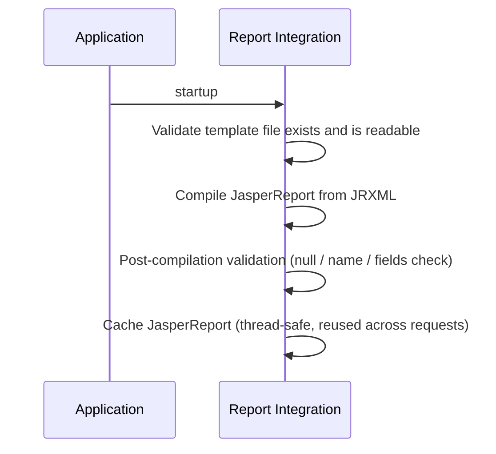
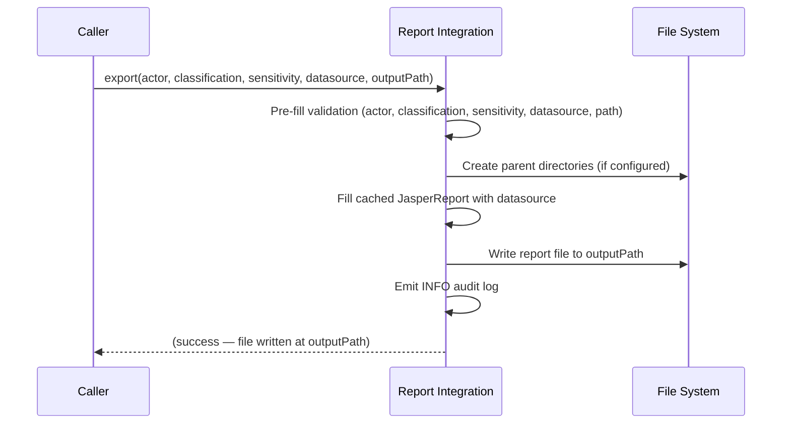
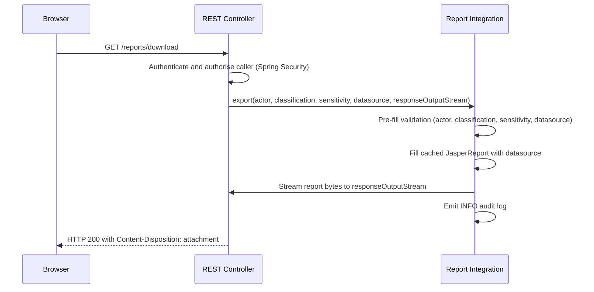
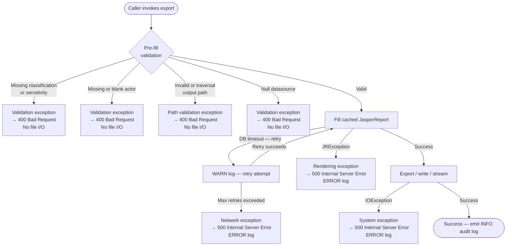

# Report Generation Integration Standard

## 1. Overview

**Purpose**: To define the minimum requirements for integrating report generation into an application service using JasperReports.

**Scope**: Server-side Java applications that generate reports as file artifacts in PDF, XLSX, or CSV format.

**Definitions**:

*   **Report**: A generated document produced from application data, written to disk or streamed in PDF, XLSX, or CSV format.
*   **Template**: A `.jrxml` layout descriptor that defines the structure, bands, and field bindings of a report. Compiled at application startup into a `JasperReport` object and reused across requests.
*   **Datasource**: Input data that populates a report. Integrations must support at least one of: a CSV file path, a database `ResultSet`, or an in-memory collection (e.g., `Map<String, List<Object>>`).
*   **Security Classification and Sensitivity**: A mandatory label on all PDF and XLSX reports that identifies the security classification and sensitivity of the report content. Must be rendered visibly on the report.
*   **Export Format**: One of `PDF`, `XLSX`, or `CSV`. Selected by the caller at export time.


## 2. Standard Flow

### 2.1 Happy Path — File Export

For integrations that write the report to disk. Steps must not be reordered.

**Application startup** (once):



**Per-request export** (every call):



### 2.2 Happy Path — Frontend Download

For integrations that stream the report directly to the HTTP response without writing to disk.



### 2.3 Failure Paths

Failures are fail-fast. No file I/O occurs before pre-fill and path validation has passed. Each failure raises a typed exception that the calling layer maps to an HTTP response.




## 3. Contracts

### 3.1 Inputs / Outputs

#### Base Standard

**Required inputs** — all must be present before any processing begins:

| Input | Type | Validation | Supported Values |
|:---|:---|:---|:--- |
| Report name | `String` | Must not be null or blank |
| Actor | `String` | Must not be null or blank | The identity initiating the export. For user-initiated requests, supply the authenticated user's identifier (e.g. resolved from Spring Security). For system-generated reports (e.g. batch jobs), supply a descriptive system identifier (e.g. `"BATCH_JOB:monthly-sales"`). |
| Security classification | `ReportSecurityClassification` | Must not be null; must be a supported value | `OFFICIAL_OPEN`, `OFFICIAL_CLOSED`, `RESTRICTED`, `CONFIDENTIAL`, `GEMS_SECRET` |
| Sensitivity | `ReportSensitivity` | Must not be null; must be a supported value | `NON_SENSITIVE`, `SENSITIVE_NORMAL`, `SENSITIVE_HIGH` |
| Datasource | `String` / `ResultSet` / `Map<String, List<Object>>` | Must not be null |
| Output path or response stream | `String` / `OutputStream` | Must not be null; path must pass traversal validation if writing to disk |

<enforced-constraint>Classification and sensitivity levels are required for all exports.</enforced-constraint>

**Optional inputs**:

| Input | Type | Default | Validation |
|:---|:---|:---|:---|
| Report title | `String` | None | If provided, must not be blank |

**Datasource handling**:

<design-choice>
**Datasource type**: Choose one or more supported types — CSV file path, JDBC `ResultSet`, or in-memory `Map<String, List<Object>>`. The choice determines which validation rules and lifecycle responsibilities apply (e.g., `ResultSet` callers own connection cleanup).
</design-choice>

These datasource types are recommended:
| Input Type | Notes |
|:---|:---|
| `String` (CSV file path) | First row is treated as the header row. |
| `ResultSet` | The caller owns the `ResultSet` lifecycle and is responsible for closing it after the export call returns. |
| `Map<String, List<Object>>` | Keys are column names; values are row value lists. Short columns are padded with empty strings for trailing rows. All values converted to `String` for rendering. |


<enforced-constraint>CSV datasources must comply with RFC 4180: consistent column counts, quoted fields containing commas or newlines, CRLF line endings, and no trailing commas unless an empty trailing field is intentional.</enforced-constraint>

**Outputs and side effects**:

**Output artifact**: A file written to disk at the validated output path, or bytes streamed directly to an HTTP response — depending on the integration pattern chosen.

<design-choice>**Directory creation**: Decide whether the integration may create parent directories automatically if they do not exist, or whether it must only write to pre-existing directories.
</design-choice>

<design-choice>**Export format scope**: Decide which of PDF, XLSX, and CSV the integration must support. Format can be also caller-selected at export time, but the integration must declare which formats are valid. Requests for unsupported formats must be rejected before fill.
</design-choice>

<design-choice>**Output destination**: For frontend download use cases, decide whether reports are written to disk or streamed directly to the HTTP response. Both patterns may be supported simultaneously if required.
</design-choice>

<design-choice>**S3 backup**: Decide whether generated reports must be backed up to S3 after local write. If yes: define the bucket, prefix, and retention policy. Log backup creation per Section 3.3. S3 backup is recommended for `RESTRICTED`+ reports in environments without durable local storage.
</design-choice>

<design-choice>**Local file cleanup**: Decide whether generated report files are deleted after serving or retained. If retained, define a retention period and implement automated cleanup.
</design-choice>

**Visual presentation defaults (PDF and XLSX)**

The following are recommended defaults for visual consistency across reports. Implementors may adjust these to suit project or agency branding, but should document any deviations.

<design-choice>**Header row styling**: Column header rows should be visually distinct from data rows — for example, a contrasting background colour, bold text, or both. This applies to the column header band in PDF and the column header row (row 2) in XLSX.</design-choice>

<design-choice>**Font consistency**: Use a single font family throughout a report. Avoid mixing serif and sans-serif fonts within the same report. Choose a font that supports the full character set required by the report's data.</design-choice>

<design-choice>**Cell padding**: Data cells should include sufficient internal padding so that text does not touch cell borders or adjacent cell content. A minimum of 2–4 points of padding on all sides is recommended.</design-choice>

<design-choice>**Text alignment**: Align text values to the left and numeric values to the right. Column headers should follow the alignment of their data column. Centre alignment may be used for short labels or status values where appropriate.</design-choice>

<design-choice>**Row separation**: Rows should be visually distinguishable — using light gridlines, alternating row background colours, or sufficient vertical spacing. At least one separation method should be applied.</design-choice>

<design-choice>**Classification tag styling**: The classification and sensitivity tag in page headers and footers should be visually prominent — for example, bold, uppercase, or a larger font size than body text — so it is not overlooked when the report is printed or shared.</design-choice>

<enforced-constraint>**Partial file cleanup on export failure**
*   If an export fails after the output file has been opened or partially written, the incomplete file must be deleted before the exception propagates. Partial files must not be left on disk — they may be mistaken for complete reports and contain incomplete or corrupt classified content.
</enforced-constraint>

---

### 3.2 Error Contract

#### Base Standard

Integrations must signal failures using typed exceptions. The calling layer (e.g., a REST controller) must map these to HTTP responses.

| Trigger | Error Category | Error Type | HTTP Status | Retryable |
|:---|:---|:---|:---|:---|
| Missing or invalid input (null datasource) | `data` | `ReportValidationException` | `400 Bad Request` | No — caller must fix input |
| Template compilation failure | `app` | `JRException` | N/A — application startup failure; context must not start | No — fix template and redeploy |
| Export rendering failure | `app` | `JRException` | `500 Internal Server Error` | Investigate — check datasource |
| Disk I/O error | `network` | `IOException` | `500 Internal Server Error` | Possibly — operator action required |
| Transient database timeout | `network` | `SQLException` | `500 Internal Server Error` | Yes — exponential backoff (1 s, 2 s, 4 s; max 3 attempts) |
| Missing classification or sensitivity (PDF/XLSX) | `security` | `ReportValidationException` | `400 Bad Request` | No — caller must fix input |
| Missing or blank actor | `data` | `ReportValidationException` | `400 Bad Request` | No — caller must supply actor |
| Invalid or traversal output path | `security` | `InvalidFilePathException` | `400 Bad Request` | No — caller must fix input |

---

### 3.3 Audit and Logging Contract

#### Base Standard

<enforced-constraint>
Every log entry emitted by the report integration must include the following fields, in addition to the standard fields required by the AppFW Logging Guide (timestamp, correlation ID, actor hash, etc.).


**Field schema**:

| Field Key | Value |
|:---|:---|
| `file.name` | Name of the report being generated |
| `file.extension` | Export format — `PDF`, `XLSX`, or `CSV` |
| `event.outcome` | `success`, `failure`, or `partial` |
| `event.action` | The operation step that produced this entry (see Trigger table below) |
| `user.id` | The identifier of the user generating the report. |

Prohibited log content: PII, database credentials, connection strings, raw user details. User details must never appear in logs or audit events in raw form.

An event must be emitted for every trigger below. No export operation may complete or fail silently.

| Trigger | Log Level | What to Log |
|:---|:---|:---|
| Pre-fill Validation failure (e.g. no report name, duplicate column names) | `WARN` | `event.action=REPORT_PRE_FILL`, `event.outcome=failure` |
| Template compilation failure — `JRException` during startup | `ERROR` | `event.action=REPORT_PRE_FILL`, `event.outcome=failure` |
| Validation failure (e.g. column headers don't match datasource) | `WARN` | `event.action=REPORT_FILL`, `event.outcome=failure` |
| Database timeout — retry attempt before max retries reached | `WARN` | `event.action=REPORT_FILL`, `event.outcome=partial` |
| Export rendering failure — `JRException` during fill or export | `ERROR` | `event.action=REPORT_FILL`, `event.outcome=failure` |
| Database timeout — max retries exhausted | `ERROR` | `event.action=REPORT_FILL`, `event.outcome=failure` |
| File written to local directory — on successful disk write | `INFO` | `event.action=REPORT_EXPORT`, `event.outcome=success` |
| Disk I/O error | `ERROR` | `event.action=REPORT_EXPORT`, `event.outcome=failure` |
| Backup created in S3 — on successful S3 upload (if configured) | `INFO` | `event.action=REPORT_BACKUP`, `event.outcome=success` |
| Successful export — on file write or stream completion | `INFO` | `event.action=REPORT_EXPORT`, `event.outcome=success` |


**Classification-based additional fields** — include these in addition to the base field schema for higher-classified reports:

**`RESTRICTED` and above — add:**

| Field Key | Value |
|:---|:---|
| `report.classification` | Classification value (e.g. `RESTRICTED`) |
| `report.sensitivity` | Sensitivity value (e.g. `SENSITIVE_NORMAL`) |
| `file.path` | Sanitised output path (if any) |

**`CONFIDENTIAL` and above — additionally add:**

| Field Key | Value |
|:---|:---|
| `report.fields_accessed` | Datasource field names accessed, comma-separated (not values) — at `FILL` step only |

</enforced-constraint>

### 3.4 Security Contract

#### Base Standard

<enforced-constraint>**Path traversal prevention (OWASP A03:2021)**
*   Output paths must be validated before any file I/O occurs.
*   URL-decode the path first to expose encoded traversal sequences (e.g. `%2e%2e`).
*   Reject any path containing `..` anywhere in the decoded string.
*   Reject any path containing characters outside `[\w\-./\\ ]`.
*   Resolve the caller-supplied path against the configured base directory (`Paths.get(baseDir).resolve(outputPath).normalize()`). Reject if the resolved path does not start with the normalised base — this catches both absolute path injection and any residual traversal.
</enforced-constraint>

<enforced-constraint>**Injection prevention (OWASP A03:2021)**
*   If using JasperReports text fields: reject any text that contains `$P{`, `$V{`, or `$F{` expressions to prevent Jasper expression injection.
</enforced-constraint>

<enforced-constraint>**Transport**
*   Generated report files must not be served over unencrypted HTTP.
</enforced-constraint>


<enforced-constraint>**Template path — caller supply prohibited**
*   JRXML template paths must be fixed at deployment time via application configuration or classpath resources. Template paths must never be accepted from callers at request time. Accepting a caller-supplied template path would allow arbitrary file read from the server filesystem.
</enforced-constraint>

<design-choice>**Access control**: Decide who is permitted to trigger a report export. Options include: any authenticated user, role-restricted (e.g., `ROLE_REPORTS`), or MFA-verified session only. Enforce via Spring Security method security (`@PreAuthorize`) or a dedicated MFA check before invoking the export. See the AppFW MFA Standard for MFA enforcement requirements.
</design-choice>
#### Org Standard

<enforced-constraint>**Classification and sensitivity guards**
*   Every report must declare a security classification and sensitivity level before export.
*   The classification label must be rendered visibly on the report. For PDF: in the header and footer of every page. For XLSX: as a dedicated classification row — see multi-sheet XLSX contract below. For CSV: in the filename (see CSV output filename encoding below).
*   Export must be rejected if classification or sensitivity is not provided.
</enforced-constraint>

<enforced-constraint>**Multi-sheet XLSX contract**

Every XLSX export — whether single-sheet or multi-sheet — must satisfy the following on every sheet:

*   **Row 1 — Classification row**: The classification and sensitivity tag must appear as the first row, in a single cell spanning the full column width. The tag format is `<CLASSIFICATION> — <SENSITIVITY>` (e.g. `OFFICIAL CLOSED — SENSITIVE NORMAL`). This row must appear on every sheet, including sheets added in a multi-sheet export. For programmatic design, embed the tag in the `columnHeader` band as the first element so it repeats on each sheet; do not rely on the title band, which renders only on the first sheet.
*   **Row 2 — Column header row**: Column header labels must appear immediately below the classification row (row 2). Column headers must not be omitted.
*   **Sheet naming**: Sheet names must be caller-supplied and descriptive. Default names (`Sheet1`, `Sheet2`, etc.) are not permitted. Sheet names must not exceed 31 characters (the maximum permitted by the XLSX specification). For multi-sheet exports, each sheet must have a unique name.
</enforced-constraint>

<enforced-constraint>**CSV output filename encoding**
*   The integration must construct the CSV output filename from the classification, report name, and current date in the form `<CLASSIFICATION>_<name>_<YYYYMMDD>.csv` (e.g. `RESTRICTED_report_20260605.csv`). The caller must not supply the filename — callers supply only the output directory. This ensures the classification is always visible from the filesystem and cannot be omitted or misnamed by the caller.
</enforced-constraint>
<design-choice>*   For JRXML templates, classification and sensitivity values must reach the template via one of two mechanisms: injected as fill parameters (e.g. `$P{CLASSIFICATION}`, `$P{SENSITIVITY}`) or embedded as static text directly in the template. Passing them as datasource fields is not permitted — datasource fields are row-scoped and will not render reliably in header and footer bands.</design-choice>

**Template and asset deployment**

<enforced-constraint>Images must be embedded in the JRXML template at design time. Images must not be injected at runtime via fill parameters or datasource fields. Runtime image injection bypasses the validation performed at template compilation and cannot be verified as safe.
</enforced-constraint>

<enforced-constraint>**Storage and retention**
*   Reports classified `RESTRICTED` or above must be written to access-controlled file system directories.</enforced-constraint>
<design-choice>*   Retention policy enforcement (e.g. automated deletion after 30 days) is the responsibility of the integrating application.</design-choice>


## 4. Implementation Approaches

> **Note**: JRXML is the default and most commonly used approach. Choose programmatic design only when the report's column schema varies per call and cannot be expressed in a fixed template — see Section 4.2 and `Report_Programmatic_Design_Standard.md` for guidance.

### 4.1 JRXML Template
<enforced-constraint>
The template must be validated as readable before compilation is attempted.
</enforced-constraint>

<enforced-constraint>**Startup compilation — fail fast**
*   Template compilation must occur at application startup (e.g. in a `@PostConstruct` method), not on first request.
*   If compilation throws a `JRException`, the exception must be logged at `ERROR` and rethrown. The Spring application context must not finish starting — a failed compilation is a deployment error, not a runtime error.
*   A compilation failure must never be caught and silently deferred to request time. Swallowing the exception and falling back to a null or placeholder report is not permitted.
</enforced-constraint>

<design-choice>
It is recommended to compile the `JasperReport` once at application startup and cache it. Compilation is expensive; the compiled object is thread-safe for concurrent fill calls and is not recompiled per request.
</design-choice>

<design-choice>
Classification and sensitivity may be injected as fill parameters or embedded as static text in the template. Parameters are preferred when the classification may vary per report instance.
</design-choice>

### 4.2 Programmatic Design

<design-choice>
Build a `JasperDesign` in code when no `.jrxml` file is available or when the report's column schema varies per call.
</design-choice>

Requirements specific to programmatic design — including column metadata, pre-compilation validation, `JasperDesign` construction, band layout, JIT compilation per request, and column width constraints — are defined in `Report_Programmatic_Design_Standard.md`.

### 4.3 Runtime Context — Actor Identity

<design-choice>
The actor is always a required caller-supplied parameter — the integration does not resolve identity itself. Choose the appropriate actor value based on the invocation context:

*   **User-initiated requests**: the calling layer (e.g. REST controller) resolves the authenticated user's identifier from Spring Security (`SecurityContextHolder`) before invoking export, and passes it as the `actor` parameter.
*   **System-generated reports** (e.g. batch jobs, scheduled tasks): the caller passes a descriptive system identifier such as `"BATCH_JOB:monthly-sales"` or `"SCHEDULER:end-of-day"`.

Document the actor identifier format used by the integrating application.
</design-choice>

<design-choice>The actor identifier type (e.g., SSO ID, employee number, email address, job name) is determined by the integrating application's context. Document the chosen format.</design-choice>

<enforced-constraint>
Actor values in logs and audit events must be handled based on type:

*   **Human actor** (resolved from Spring Security — SSO ID, employee number, email, etc.) — hash before logging using `hashUserId()` (see the AppFW Logging Guide). The raw value must never appear in logs.
*   **System actor** (non-PII, identified by an uppercase prefix followed by a colon, e.g. `BATCH_JOB:monthly-sales`, `SCHEDULER:end-of-day`) — log as plain text. No hashing required.
</enforced-constraint>


## 5. Test Requirements

All tests listed below are the integrator's responsibility to author and maintain. No test coverage is provided by the report library itself.

For programmatic design unit tests, see `Report_Programmatic_Design_Standard.md` Section 6.

### 5.1 Required Unit Tests — JRXML

For JRXML, the template is compiled once at application startup. There is no per-request compilation step, so validation occurs at **pre-fill time** — before the datasource is merged with the compiled `JasperReport`.

**Pre-fill validation**:
*   Missing or null classification or sensitivity (PDF/XLSX/CSV) → pre-fill validation rejected.
*   Null datasource → pre-fill validation rejected.
*   Null or blank actor → pre-fill validation rejected.
*   Path traversal in output path → pre-fill validation rejected.
*   Invalid output path characters → pre-fill validation rejected.

**Post-compilation validation** (runs at startup against the cached `JasperReport`):
*   Null or nameless `JasperReport` → startup validation rejected.
*   `JasperReport` with no declared fields → startup validation rejected.
*   Template compilation throws `JRException` → `ERROR` log emitted; exception rethrown from `@PostConstruct`; Spring application context fails to start. No HTTP response is produced — verify this is a startup failure, not a `500` at request time.

**HTTP controller**:
*   `ReportValidationException` → `400 Bad Request` response (includes missing or blank actor).
*   `JRException` → `500 Internal Server Error` response.
*   `IOException` → `500 Internal Server Error` response.

### 5.2 Required Integration Tests — JRXML

*   Full PDF export to disk: valid JRXML template compiled at startup, classification and sensitivity injected as fill parameters, valid datasource; confirm user UUID hash in audit log; confirm file written and classification tag appears in page header and footer.
*   Full XLSX export: valid template, valid user identity; confirm user UUID hash in audit log.
*   Full CSV export: valid datasource and column definitions; confirm file written; confirm filename encodes classification and date.
*   Classification embedded as static text in template: confirm tag appears in PDF header and footer without fill parameters.
*   Frontend download: report streamed to HTTP response; confirm `Content-Disposition: attachment` header present; confirm no file written to disk.
*   Multi-sheet XLSX: two sheets produced in one file; each sheet name is caller-supplied and non-default; row 1 of each sheet contains the classification and sensitivity tag; row 2 of each sheet contains the column header labels; data rows begin at row 3.
*   Concurrent export: multiple simultaneous fill calls with the same cached `JasperReport`; confirm output files are independent and correct.

### 5.3 Test Data Guidelines

*   Use small deterministic datasets (< 1000 rows) for unit and integration tests.
*   Use realistic data shapes but avoid real PII.
*   Never use real user identifiers in test fixtures. Use synthetic names like `"testuser"`.
*   Include CSV test files covering: valid headers, missing columns, empty file.
*   Use an in-memory or local JDBC database (e.g., H2) for `ResultSet` tests.


## 6. Operational Guidance

### 6.1 Runtime Configuration and Secrets

All required properties and secrets must be supplied at application startup. No report export is attempted before configuration is validated.

| Property | Sensitive | Supply Mechanism | Description |
|:---|:---|:---|:---|
| `report.outputDirectoryPath` | No | Application config (`application.yaml`) | Base directory for all generated report files |
| Database credentials | Yes | Environment variable or secrets manager | Required if `ResultSet` datasource is used |
| Filesystem ACL / KMS key | Yes | Environment variable or secrets manager | Required for output directories used for `RESTRICTED`+ reports |
| JRXML template classpath location | No | Application config or classpath resource | Location of deployed template files — see Section 3.4 security constraint |
| S3 bucket and prefix | No | Application config | Required if S3 backup is configured |
| S3 credentials | Yes | Environment variable or secrets manager | Required if S3 backup is configured |

Configure the base output directory via:

```yaml
report:
  outputDirectoryPath: /var/reports/generated
```

Construct output paths by joining the base directory, a subfolder, and a filename. Validate the resulting path before use.

### 6.2 Health Indicators

| Indicator | Check | Failure Consequence |
|:---|:---|:---|
| `filesystem` | Write permission and available space at the output directory | All file exports fail |
| `db` | Database connectivity (if `ResultSet` datasource is used) | Database-backed reports fail |
| `templates` | Template file existence and readability | Template-based exports fail at compile step |
| `s3` | S3 bucket accessibility (if S3 backup is configured) | Backup step fails; local write may still succeed |

### 6.3 Metrics to Capture

| Metric | Alert Threshold | Action |
|:---|:---|:---|
| Export duration (p99) | > 10 seconds | Review datasource size; check DB query performance. If p99 consistently exceeds 10 seconds, consider moving export to an async pipeline (e.g. a background job that writes to disk and notifies the caller) rather than blocking the request thread. |
| Export success rate | < 99% | Inspect logs for error spike by category |
| Disk space available | < 10% | Free space; check for runaway output files |

### 6.4 Error Recovery

| Error Type | Recovery |
|:---|:---|
| Transient database timeout | Retry with exponential backoff (1 s, 2 s, 4 s; max 3 attempts). |
| Template compilation failure | Fix template and redeploy — not retryable. |
| Disk full | Free space; retry export — requires operator action. |
| Output directory permissions denied | Fix file permissions — not self-healing. |
| S3 upload failure | Retry with backoff; alert if backup cannot be completed for `RESTRICTED`+ reports. |


## 7. Class Inventory

<enforced-constraint>Report infrastructure classes must map 1:1 to the recipes in this standard and its programmatic augmentation. Do not introduce report infrastructure classes that are not a direct implementation of a named recipe. Application-specific classes (entities, DTOs, services that call the report layer) are outside this scope.</enforced-constraint>


## 8. Appendix

### Standards Referenced

*   **RFC 4180** — CSV file format. CSV datasources must comply with RFC 4180 (consistent column counts, optional headers).
*   **ISO/IEC 29500 (ECMA-376)** — XLSX exports must be compatible with Microsoft Excel and standard spreadsheet tools.
*   **JDBC 4.0+** — `ResultSet` datasource type follows the standard JDBC specification.
*   **OWASP A03:2021 — Injection**: Prevent Jasper expression injection and path traversal attacks via file path validation.
*   **OWASP A01:2021 — Broken Access Control**: Authorization checks are the responsibility of the integrating application.

### Glossary

*   **Band** — A horizontal region of a JasperReports layout (e.g., page header, detail, page footer). Each band is rendered at a defined point in the report lifecycle.
*   **Classification label** — The visible security marking rendered on every page of a PDF report and in the header row or sheet metadata of an XLSX report.
*   **Fill** — The step in which JasperReports merges a compiled `JasperReport` with a datasource, producing a `JasperPrint` object ready for export.
*   **Post-compilation validation** — Validation of the compiled `JasperReport` object (null check, name check, field count) after compilation and before fill.
*   **Pre-fill validation** — Validation of caller-supplied inputs (classification, sensitivity, datasource, output path, user identity) before the datasource is merged with the compiled `JasperReport`.
*   **Template** — See Section 1 Definitions.

### Changelog

*   2026-06-26 — v1.3 Section 7 (Class Inventory) added: report infrastructure classes must map 1:1 to named recipes; Appendix renumbered to Section 8.
*   2026-04-16 — v1.2 XML tagging added (ENFORCED\_CONSTRAINT, DESIGN\_CHOICE, ASSUMPTION) throughout Sections 3–4; frontend download happy path added (Section 2.2); error categories updated to `app`/`security`/`network`/`system`; audit contract updated with classification-based depth and expanded triggers; logging contract triggers aligned with audit contract; log levels table added; ECS-style field keys added (`file.name`, `file.type`, `event.outcome`, `event.action`); non-fatal datasource trigger removed; retry WARN/ERROR split added; image runtime injection enforced constraint added; integrator design decisions section added (Section 4.4); S3 backup guidance added throughout.
*   2026-04-14 — v1.1 restructured per compliance report: Section 2 reduced to flow diagrams; elaborations moved to Sections 3 and 4; Sections 3.1, 3.4 added; Section 5 test framing updated; Section 6.1 Runtime Configuration added; Glossary added.
*   2026-03-30 — v1.0 initial extraction from the report generation dependency library.
