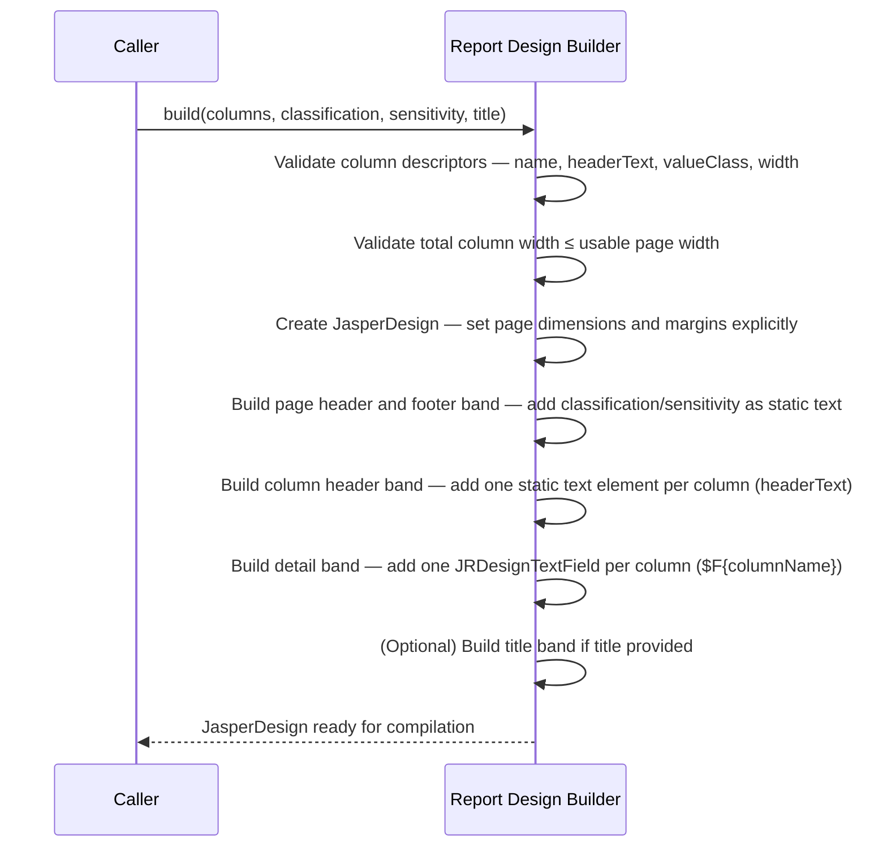
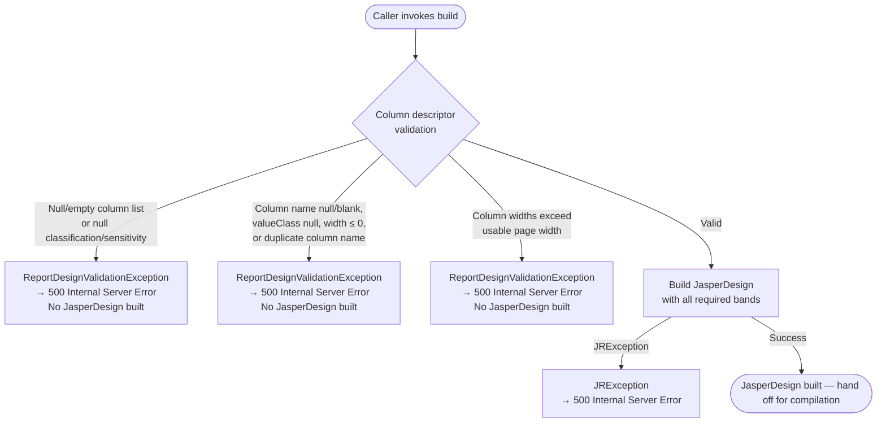

# Report Generation — Programmatic Design Standard

## 1. Overview

**Purpose**: To define requirements specific to building a `JasperReport` entirely in code, without a `.jrxml` template file. This document augments `Report_Core_Standards.md`. All base requirements (format support, security classification, output path validation, audit, error handling, and operational guidance) apply and are not repeated here.

**Scope**: Integrations that choose the programmatic design approach described in `Report_Core_Standards.md` Section 4.2.

**Definitions**:

*   **JasperDesign**: The in-memory object model that describes a report's structure — page dimensions, bands, field declarations, and elements. Built in code and compiled to a `JasperReport`.
*   **JasperReport**: The compiled, immutable report object produced from a `JasperDesign`. Compiled per request (JIT) — the column schema is determined by the caller at call time, so a single compiled report cannot be reused across requests with different column sets.
*   **Column descriptor**: The column metadata contract — carries the column name (binding key for the datasource field), header label, value class, and rendered width.

<design-choice>**When to use programmatic design**:

Programmatic design is appropriate **only** when the report's column schema (which fields exist and how many) varies per call. This includes:

*   **User-configurable reports** — the caller selects which columns to include at runtime.
*   **Generic or ad-hoc data export** — columns are derived from a query result, search response, or API payload supplied at call time.
*   **Multi-tenant or multi-schema reports** — different callers supply different column sets for the same report endpoint.
*   **Pivot or transposed reports** — columns are derived from data values (e.g., months, categories) resolved at request time.

**When to use JRXML instead (preferred for all fixed schemas)**:

If the column set is known at build time — even if the data changes per request — **use JRXML**. JRXML templates are easier to maintain, can be modified without a code change, and support complex banding, grouping, sub-reports, and chart elements that are difficult to express in code. A fixed column schema implemented programmatically is a maintainability liability with no benefit.
</design-choice>

## 2. Standard Flow

### 2.1 Happy Path — JasperDesign Construction

The following sequence describes how a `JasperDesign` is built from column descriptors. Steps must not be reordered. Compilation, fill, and export steps are defined in `Report_Core_Standards.md` Section 2 and are not repeated here.

### 2.2 Failure Paths

Validation is fail-fast — no `JasperDesign` is constructed on any validation failure.

## 3. Contracts

### 3.1 Inputs / Outputs

#### Additional Required Inputs

These inputs are specific to programmatic design and extend the base required inputs defined in `Report_Core_Standards.md` Section 3.1.

| Input | Type | Validation |
|:---|:---|:---|
| Column list | `List<ColumnDescriptor>` | Must not be null or empty |
| Each column — `columnName` | `String` | Must not be null or blank; must be unique within the list; must match datasource field name exactly |
| Each column — `headerText` | `String` | Must not be null or blank |
| Each column — `valueClass` | `Class<?>` | Must not be null; must match the datasource field type |
| Each column — `width` | `int` | Must be greater than zero |
| Sum of column widths | — | Must not exceed usable page width (`PAGE_WIDTH − left margin − right margin`) |

#### Optional Inputs

| Input | Type | Default | Notes |
|:---|:---|:---|:---|
| Title text | `String` | None | If provided, rendered in a title band above the column header. |

#### Datasource Field Matching

<enforced-constraint>Declared column names in `ReportColumn` must match the column header name in the datasource exactly. Failure to do so will result in a validation failure either during pre-fill (for in-memory datasource), or during the fill (for CSV, Database Table datasource). </enforced-constraint>

**Map datasource**: Validate at pre-build time that the map contains a key for every declared `columnName`. A missing key is a validation failure — raise `ReportDesignValidationException`.

**CSV datasource**: Field name matching between declared column name and CSV header row cannot be validated before fill time. A field name mismatch will surface as a `JRException` at fill time.

**ResultSet datasource**: Field name matching cannot be validated before fill time. A mismatch will raise a `JRException` at fill — this is handled by the base error contract.

---

### 3.2 Error Contract

Extends the base error contract in `Report_Core_Standards.md` Section 3.2. All base exception types and HTTP mappings apply.

Additional failure modes specific to programmatic design:

| Error | Error Category | Error Type | HTTP Status | Retryable |
|:---|:---|:---|:---|:---|
| Column with null `columnName` or `valueClass` | `application` | `ReportDesignValidationException` | `500 Internal Server Error` | No — fix column definitions |
| Column width zero or negative | `application` | `ReportDesignValidationException` | `500 Internal Server Error` | No — fix column definitions |
| Column widths exceed usable page width | `application` | `ReportDesignValidationException` | `500 Internal Server Error` | No — fix column definitions |
| Duplicate column names causing `JasperDesign` field conflict | `application` | `ReportDesignValidationException` | `500 Internal Server Error` | No — fix column definitions |
| Null classification or sensitivity | `application` | `ReportDesignValidationException` | `500 Internal Server Error` | No — fix column definitions |
| Map datasource missing key for declared column | `application` | `ReportDesignValidationException` | `500 Internal Server Error` | No — fix column definitions |

Column descriptors are defined by the application layer, not by the end user. A `ReportDesignValidationException` signals a developer or configuration error — the calling code has constructed an invalid column set. This maps to `500 Internal Server Error`.

---
### 3.3 Audit and Logging Contract

<enforced-constraint>Any `ReportDesignValidationException` thrown at request time must be logged at `WARN`. The following report-specific fields apply:

| Field | Values |
| :--- | :--- |
| `file.name` | Name of report. |
| `event.action` | `REPORT_PRE_FILL` |
| `error.message` | Details of design error. |

This is in addition to the complete list of fields in AppFW Logging Guide.</enforced-constraint>

---

### 3.4 Security Contract

Extends the base security contract in `Report_Core_Standards.md` Section 3.4.

**Classification before compilation**

<enforced-constraint>For PDF exports, classification and sensitivity must be set in the `JasperDesign` as static text elements in the page header and footer bands **before compilation**. A design compiled without them is non-compliant and must not be used for PDF export.</enforced-constraint>

## 4. JasperDesign Construction

### 4.1 Page Layout

**Applies to**: PDF only. Page dimensions are a PDF concept — XLSX and CSV exports ignore page layout settings.

<enforced-constraint>
Page dimensions and margins must be set explicitly on the `JasperDesign`. Do not rely on library defaults.
</enforced-constraint>

<design-choice>
The choice of the report layout setting is up to the implementor. For landscape or non-A4, dimensions must be set explicitly and documented. Standard A4 portrait — 595 × 842 points, with 20-point margins on all sides (usable width: 555 pt). 
</design-choice>

### 4.2 Required Bands

<enforced-constraint>The column header and detail bands are required for all formats. Page header and footer bands are required for PDF only.</enforced-constraint>

| Band | Applies to | Requirement |
|:---|:---|:---|
| **Page header** | PDF only | Must contain the classification and sensitivity tag as a static text element spanning the full usable width. |
| **Page footer** | PDF only | Must contain the classification and sensitivity tag as a static text element spanning the full usable width. |
| **Column header** | All formats | Must contain one static text element per column using `headerText` as the label. |
| **Detail** | All formats | Must contain one text field per column referencing `$F{columnName}`. |

A title band is optional. If provided, it must not exceed 60 points in height.

*   Text field dimensions must not overlap within the detail band.

### 4.3 Field Declarations

<enforced-constraint>One `JRDesignField` must be declared per column. Field name must match the column descriptor's `columnName` exactly — this is the binding key at fill time.
</enforced-constraint>

<enforced-constraint>The integrator must ensure the `valueClass` types match between the field declaration and datasource. A mismatch would cause a type coercion error at fill time.
</enforced-constraint>

### 4.4 Classification Rendering

<enforced-constraint>
For PDF exports, classification and sensitivity must be embedded in the page header and footer bands as static text before compilation. The tag must be a static text element — not a dynamic expression — so it cannot be suppressed or overridden by datasource content.
</enforced-constraint>

<design-choice>Tag format example: `OFFICIAL CLOSED — SENSITIVE NORMAL`. The exact format is an implementor decision — document it and apply it uniformly across all reports.
</design-choice>

### 4.5 Paragraph Content

Reports may include free-text narrative content — such as an introductory paragraph, a summary statement, or a disclaimer — in addition to the tabular data in the detail band. Paragraph content is not row-scoped and must not be placed in the detail band.

**Bands suitable for paragraph content:**

| Band | Rendered | Use for |
|:---|:---|:---|
| **Title** | Once, before column header | Report title or introduction |
| **Summary** | Once, after all detail rows | Concluding remarks, totals narrative, disclaimer |
| **Group header / footer** | Per data group (if grouping is configured) | Section heading or group summary text |

**Static paragraph** — text that does not change per request. Use `JRDesignStaticText`. Static text elements are not evaluated as expressions and are safe for trusted constant strings.

**Dynamic paragraph** — text supplied at fill time via a fill parameter. Use `JRDesignTextField` with a `$P{}` expression. Declare the parameter on the `JasperDesign` and supply it in the fill parameters map at fill time.

<enforced-constraint source="Security — injection prevention (OWASP A03:2021)">
All caller-supplied string inputs must be validated before use. Reject any string containing `$P{`, `$V{`, or `$F{` to prevent expression injection into the rendered output. This applies to both column names and paragraph text.
</enforced-constraint>

<design-choice>
Set `setStretchWithOverflow(true)` on any `JRDesignTextField` used for paragraph content so that long text expands the element vertically rather than being clipped at the fixed element height.
</design-choice>

## 5. Test Requirements

All tests listed below are the integrator's responsibility to author and maintain. These extend the base test requirements in `Report_Core_Standards.md` Section 5 — all base JRXML unit tests, integration tests, and test data guidelines defined there still apply.

For test data guidelines, refer to `Report_Core_Standards.md` Section 5.3. In addition, programmatic design tests must use deterministic column definitions (fixed names, types, and widths) for reproducible layout tests, and must include column-width boundary cases (exactly at the usable page width limit, and one unit over).

### 5.1 Additional Unit Tests

| Scenario | Expected Outcome |
|:---|:---|
| Null or empty column list | Rejected — `ReportDesignValidationException` |
| Column with null `columnName` | Rejected — `ReportDesignValidationException` |
| Column with null `valueClass` | Rejected — `ReportDesignValidationException` |
| Column with zero or negative width | Rejected — `ReportDesignValidationException` |
| Column widths summing to exceed usable page width | Rejected — `ReportDesignValidationException` |
| Duplicate column names | Rejected — `ReportDesignValidationException` |
| Map datasource missing key for declared column | Rejected — `ReportDesignValidationException` |
| CSV datasource with headers not matching declared columns | `JRException` thrown at fill time |
| Classification null | Rejected — `ReportDesignValidationException` |
| Sensitivity null | Rejected — `ReportDesignValidationException` |

### 5.2 Additional Integration Tests

| Scenario | Verification |
|:---|:---|
| Full PDF export: three columns, valid inputs | File written; page header and footer contain classification tag |
| Full PDF export: single-column design | File written; no layout overflow |
| Column widths at exactly the usable page width limit | File written; no overflow |
| Two concurrent requests with different column sets, each compiled JIT | Both output files independent and correct; no field binding errors |

### 5.3 Classification Tag Verification

Integration tests for PDF output must assert that the classification tag appears in both the page header and page footer. Where the test framework does not support PDF content inspection, assert at minimum that the `JasperPrint` page header and footer bands contain a static text element with the expected tag string.

## 6. Appendix

### Standards Referenced

*   `Report_Core_Standards.md` — base report generation standard; all requirements apply.
*   `Report_Programmatic_Design_Recipes.md` — implementation recipes showing how to fulfil these requirements in code.
*   **JasperReports `JasperDesign` API** — authoritative reference for band types, field declarations, and element layout.
*   **OWASP A03:2021 — Injection**: `$F{}` expressions must only reference validated column names. Do not construct expression strings from unvalidated caller input.

### Changelog

*   2026-04-16 — v1.2 renamed to `Report_Programmatic_Design_Standard.md`; happy path rewritten to focus on JasperDesign construction only (compilation/fill/export deferred to core); all error statuses updated to 500, category `application`, type `ReportDesignValidationException`; `$F{}` injection risk expanded with code example in Sections 3.3 and 4.5; CSV datasource header mismatch added as WARN log trigger in Section 3.1 and 3.2; `ReportColumn` replaced with column descriptor terminology; `ENFORCED_CONSTRAINT`/`DESIGN_CHOICE`/`ASSUMPTION` XML tags applied to Sections 4 and 5.
*   2026-04-14 — v1.1 restructured to match core standard shape: Section 2 replaced with Mermaid flow diagrams; elaborations reorganised into Sections 3–5; Enforced Constraint / Design Choice / Assumption labels added to Section 4; tests consolidated under integrator ownership.
*   2026-04-07 — v1.0 extracted from `Report_Core_Standards.md`; programmatic-specific requirements expanded.
