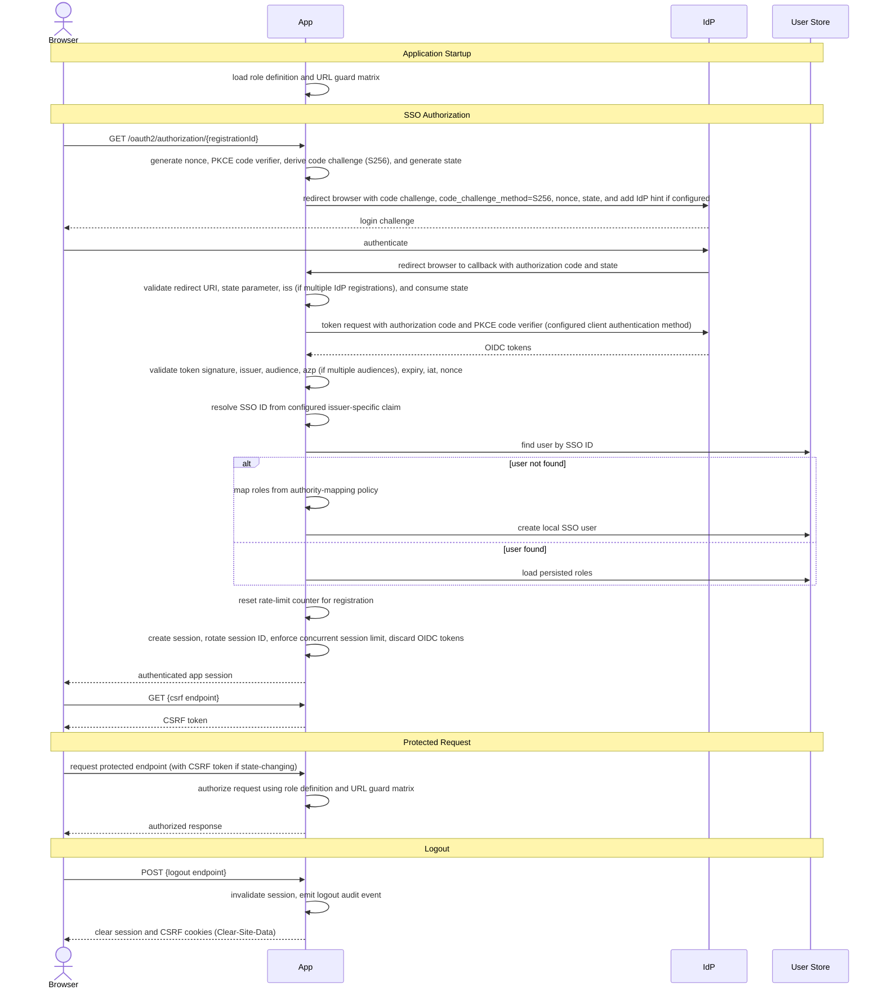

# App Standard: SSO User Access Control

## 1. Overview

### Purpose

This guide defines the minimum application behavior for Single Sign-On (SSO)-based user access control in server-side web applications, where an external OAuth 2.0 or OpenID Connect (OIDC) provider handles authentication and the application manages authorization through locally owned roles and persisted user data. It establishes a strict separation between authentication and authorization, ensuring that external token claims never directly grant application privileges, and encompasses enforceable controls across SSO authentication, role-based authorization, session and request security, and security audit logging. The guide aligns with OAuth 2.0 (Request for Comments RFC 6749), OpenID Connect Core, Proof Key for Code Exchange (PKCE, RFC 7636), National Institute of Standards and Technology (NIST) SP 800-63B-4 (2025), and Open Web Application Security Project (OWASP) security best practices.

### Scope

This guide applies to internal server-side web applications that:

- Delegate user authentication to an external OIDC-compatible identity provider via the OAuth 2.0 authorization code flow with PKCE.
- Enforce OAuth 2.0 callback protection, including exact-match redirect URI validation, single-use state parameter validation, and rate limiting against callback flooding.
- Validate OIDC tokens, including signature, issuer, audience, nonce, and expiry, before establishing an application session.
- Resolve the authenticated SSO identity from issuer-specific claims and provision local authorization records on first login to support role-based access control.
- Enforce authorization through application-owned role definitions and a URL guard matrix, with a deny-by-default posture independent of external token scopes or claims.
- Establish server-side sessions after SSO login, rotating the session identifier at authentication, discarding external tokens from the active session, and enforcing idle timeout, absolute timeout, and concurrent session limits.
- Require Cross-Site Request Forgery (CSRF) token validation for all state-changing requests.
- Apply Hypertext Transfer Protocol (HTTP) security headers, secure cookie attributes, and Cross-Origin Resource Sharing (CORS) controls on all responses.
- Emit security audit events for authentication outcomes, authorization failures, and local authorization record changes.
- Restrict users to reading only their own local authorization record through a dedicated self-read endpoint.

### Definitions

**Identity Setup**

- `Identity provider (IdP)`: The external OAuth 2.0 or OIDC system that authenticates the user and issues identity tokens.
- `Registration ID`: A logical identifier that maps an authorization request to the correct OAuth2/OIDC provider configuration, used in the entry-point URI `/oauth2/authorization/{registrationId}`.
- `SSO ID`: The stable external identifier used to link an IdP user to the local application record, derived from the configured issuer-specific claim (e.g., `sub` or a custom claim defined per registration).

**OAuth2 Flow Protection**

- `PKCE (Proof Key for Code Exchange)`: An OAuth 2.0 extension (RFC 7636) that binds the authorization request to the token exchange using a cryptographic challenge, preventing authorization code interception attacks.
- `OIDC nonce`: A unique, one-time use value sent in the authorization request and validated on token reception to prevent token replay attacks.
- `OAuth state parameter`: A cryptographically random value generated by the application, included in the authorization request, and echoed back by the IdP in the callback, used to prevent CSRF attacks on the callback endpoint, and consumed exactly once.

**Token Format and Validation**

- `JWT (JSON Web Token)`: A compact, URL-safe token format (RFC 7519) used for OIDC ID tokens and private key client assertions.
- `JWKS (JSON Web Key Set)`: A JSON structure (RFC 7517) containing an identity provider's public keys, used to verify JWT token signatures.
- `Audience (aud) claim`: A JWT claim identifying the intended recipient of the token. The application's client ID must appear in this claim, and tokens not addressed to this client are rejected.

**Callback Security**

- `Redirect URI validation`: Server-side verification that an incoming callback URL matches a registered allowed URI exactly. Substring and prefix matching are not permitted.
- `Mix-up attack`: An attack where a callback intended for one authorization server is misrouted to a different one, applicable when the application is configured with multiple IdP registrations.

**Session Management**

- `Session translation`: The process of converting a validated OIDC token exchange into a server-side HTTP session, with the external token discarded and the session identifier rotated.
- `Session fixation`: An attack where an adversary forces or predicts a user's session identifier before authentication and reuses it after login, mitigated by rotating the session identifier immediately after successful authentication.

**Authorization Model**

- `Authority mapper`: The component that determines the set of application roles granted to the authenticated user on first login. Sources include IdP claims (group memberships, organizational attributes), external data sources (MPDS, HR systems, LDAP), or default role assignment. Authorization decisions use locally stored roles, never external token scopes directly.
- `Role definition`: The configuration-owned mapping of role names to granted application privileges. The role definition file is the sole source of truth for role existence and privilege assignment.
- `Deny-by-default`: An authorization posture where every endpoint is denied unless an explicit rule in the URL guard matrix or role definition grants access.

## 2. Standard Flow

### Happy Path

1. The application loads the role definition and URL guard matrix, initializing configured roles before serving traffic.
2. The client starts SSO by requesting `/oauth2/authorization/{registrationId}`.
3. The application generates a cryptographically random nonce, PKCE code verifier, and OAuth state parameter. The code challenge is derived from the verifier using S256. The verifier, nonce, and state are stored in session state.
4. The application redirects the browser to the IdP authorization endpoint with the code challenge, code challenge method (S256), nonce, state, and identity provider hint if configured.
5. The IdP authenticates the user and redirects the browser to the application callback with an authorization code and state parameter.
6. The application validates the incoming redirect URI and state parameter against their stored values, then consumes the state. When multiple IdP registrations are configured, the application also validates the `iss` parameter in the authorization response against the expected issuer before processing the authorization code.
7. The application exchanges the authorization code and PKCE code verifier for tokens using the configured client authentication method (e.g., client secret or private key JWT).
8. The application validates the OIDC token: signature (using the issuer's public keys), issuer (`iss`), audience (`aud`), authorized party (`azp`) if multiple audiences are present, expiry (`exp`), issued-at (`iat`), and nonce.
9. The application resolves the SSO ID from the configured issuer-specific claim.
10. The application checks whether a local user already exists for that SSO ID.
11. If the user exists, the application loads the persisted roles from the local store.
12. If the user does not exist, create local authorization record with no local credentials, authentication mode marked as SSO, and roles mapped by authority-mapping policy. Emit audit event recording new user creation with SSO identity and assigned roles.
13. On successful login, reset failed callback rate-limit counter for the registration to zero. Emit authentication success audit event.
14. Create new server-side session, rotate session identifier, enforce configured concurrent session limit, and discard OIDC tokens from active session. Emit audit event recording session creation and identifier rotation.
15. The client retrieves a CSRF token from the CSRF token endpoint and includes it in subsequent state-changing requests.
16. The server authorizes requests using the local role definition and URL guard matrix. Authorization denials are emitted as audit events.
17. The authenticated user's self-read endpoint returns only their own local record.
18. The client initiates logout. The application invalidates the server-side session, emits a logout audit event, and clears the session and CSRF cookies from the response.

### Failure Paths

**Note:** All failure scenarios emit audit events recording the specific failure type and context (see Section 3.3 Audit Contract for details).

1. Callback request exceeding per-endpoint rate limit is rejected with `429 Too Many Requests` and `Retry-After` header.
2. IdP authentication failures or errors in authorization response (e.g., `access_denied`, `server_error`) terminate the flow and invalidate any existing local session.
3. Callback validation failures abort the flow before processing authorization code: malformed/mismatched redirect URI, invalid state parameter (missing, mismatched, or consumed), or (when multiple IdP registrations configured) missing/mismatched `iss` parameter.
4. Authorization code presented more than once is rejected. No session created on replayed code. *(Spring Security default)*
5. Token exchange failures (including PKCE code verifier mismatch) do not create a session.
6. Token signature validation failure rejects token without creating session. Includes cases where JWKS endpoint is unreachable or returns unrecognized key ID (`kid`).
7. Token with invalid issuer (`iss`), audience (`aud`), authorized party (`azp`), nonce, expiry (`exp`), or issued-at (`iat`) is rejected without creating session.
8. Incoming OIDC claims lacking a usable SSO ID (e.g., missing `afcas.uuid` for MCC or `sub` for standard providers) prevent local authorization record creation. The application must throw an `OAuth2AuthenticationException` to abort the login flow, ensuring no session is created and the user is redirected to a generic error page (e.g., `/login?error`).
9. Local role mapping policy unable to assign valid role set rejects authorization for protected endpoints. Note: Authority mapping must complete synchronously before session creation. However, if the mapping relies on an external service (e.g., MPDS) and that service is unreachable, a safe default role (e.g., `ROLE_USER`) may be assigned to allow the login flow to complete, provided the default role strictly restricts access.
10. Second successful login by same user invalidates prior session.
11. Requests to protected endpoints without required privileges rejected with `403 Forbidden`.
12. Requests with expired or invalid session redirected to configured invalid-session path (or framework default).
13. State-changing requests without valid CSRF token rejected. *(Spring Security default)*
14. Attempts to create, update, or delete roles via REST APIs rejected (even for administrators). Role definition file remains sole source of truth.
15. Logout request against an expired or invalid session handled gracefully. Because logout retains CSRF protection and the CSRF token is session-bound, such a request returns 401/403 rather than 200; the SPA treats this as an already-terminated session, clears local state, and redirects to the login page so the user never sees an error page.

### Decision Logic

- External authentication proves identity, but local configuration and local persistence determine authorization.
- Rate-limit counters are per-registration-ID to prevent denial of service (DoS) via issuer rotation. The counter is reset to zero on a successful token validation.
- The `iss` parameter in the authorization response must be validated against the expected issuer before processing the authorization code. This is especially critical when multiple IdP registrations are configured to prevent issuer mix-up attacks.
- Authorization codes are single-use. A replayed code must be rejected before any session is created.
- Token signature validation is mandatory and must use issuer-provided public keys.
- Token claims validation must always include issuer, audience, expiry, issued-at, and nonce. The authorized party (`azp`) claim must be validated when multiple audiences are present. Any claim failure rejects the token without creating a session.
- A session must not be created unless all validations pass: redirect URI and state, authorization code exchange, PKCE verifier, token signature, token claims, and SSO ID resolution.
- The application must resolve SSO identity from the configured issuer-specific claim. The claim used must be explicitly defined per IdP registration.
- First-seen SSO identities trigger creation of a local authorization record for role management. Subsequent logins load the persisted authorization record and enforce the existing role set.
- New users are assigned a baseline `USER` role by default. This ensures deny-by-default authorization while allowing role elevation through explicit mapping policies.
- The local role definition file is authoritative for role existence and privilege mapping.
- The URL guard matrix is authoritative for path and method authorization.

### Sequence Diagram



## 3. Best Practices & Contracts

### 3.1 Inputs / Outputs

- SSO entry-point endpoint accepts requests for a given IdP registration and returns a redirect (HTTP 302) to the IdP authorization endpoint.
- OAuth 2.0 callback endpoint accepts requests with authorization code and state parameter, returns HTTP 302 redirect to an authenticated application path on successful validation.
- *[Enforced Constraint]* CSRF token endpoint accepts authenticated requests and returns a valid CSRF token in JSON format. The application must strictly use the **Synchronizer Token Pattern** bound to the HTTP Session. The **Double Submit Cookie** pattern is strictly prohibited, as stateless CSRF cookies weaken the security of our stateful architecture.
- Protected application endpoints accept requests with a valid session cookie. State-changing requests (POST, PUT, DELETE) must include a valid CSRF token.
- Protected endpoints return HTTP 200 with the requested resource for authorized requests.
- Protected endpoints return HTTP 401 Unauthorized for requests with missing or invalid session cookies.
- Protected endpoints return HTTP 403 Forbidden for authenticated requests lacking required roles.
- Self-read endpoint accepts authenticated requests and returns the caller's user record with assigned roles in JSON format.
- Logout endpoint returns HTTP 200 with Set-Cookie headers to clear session and CSRF cookies (or Clear-Site-Data header) for a valid, CSRF-protected request. Logout keeps CSRF protection, so a request against an already-expired session (whose session-bound token is gone) returns 401/403; the SPA handles this gracefully by clearing local state and redirecting to login. (Keeping CSRF on logout and the token in the session — rather than exempting logout or moving to a cookie — aligns with the OWASP CSRF and Session Management guidance in References.)

### 3.2 Error Contract

**General Principles:**
- Error responses must not expose internal implementation details: do not return IdP-specific error descriptions, internal registration IDs, token claim values, or JSON Web Key Set (JWKS) metadata to clients. Standard error codes (e.g., from RFC 6749) may be returned.
- Validation and authentication failures must complete in consistent time to prevent timing attacks on validation logic.
- Server errors (5xx) must not expose internal details, service names, implementation versions, or stack traces to clients.

**Callback and Request Validation:**
- Callback validation failures (redirect URI mismatch, invalid/missing state, invalid issuer, missing/malformed authorization code) return `400 Bad Request` before processing the authorization code.
- Callback rate limit exceeded returns `429 Too Many Requests` with `Retry-After` header.
- A replayed authorization code must be rejected before any session is created, returning `400 Bad Request`.
- SSO callback responses must not distinguish between existing and first-time SSO identities to prevent enumeration of registered identities.

**Token Exchange and Validation:**
- If the IdP returns an authentication error response (e.g., `access_denied`, `server_error`), the application must terminate the flow, invalidate any prior local session, and return `400 Bad Request` to the client with an abstracted error message (not raw IdP description).
- Token exchange failures (exchanging authorization code for token, including PKCE code verifier mismatch) must not result in a session being created. Return `400 Bad Request` for auth failures and `502 Bad Gateway` if the IdP token endpoint is unavailable.
- Token validation failures (validating the received token's signature, issuer, audience, nonce, expiry, issued-at) return `401 Unauthorized` without creating a session. This includes signature validation failures (JWKS unreachable or key ID not found), issuer mismatch, audience/authorized party mismatch, and temporal claim failures.
- If the incoming OIDC claims lack a usable SSO ID (e.g., missing `afcas.uuid` for MCC or `sub` for standard providers), the application must throw an `OAuth2AuthenticationException`. The framework must catch this to abort the login flow, prevent local authorization record creation, and redirect the user to a generic error page (e.g., `/login?error`) without creating an authenticated session.

**Session Management:**
- Browser requests with expired, invalid, or invalidated sessions must redirect to the configured invalid-session path (or application default) with `302 Found` status and `Clear-Site-Data: "cache", "cookies", "storage"` header. The redirect target must not require authentication (typically a login page or re-auth endpoint). Non-browser API requests with invalid/missing sessions return `401 Unauthorized`.

**Request Authorization:**
- State-changing requests with a missing or invalid CSRF token must be rejected with `403 Forbidden`.
- Authorization failures for authenticated users lacking required roles must return `403 Forbidden`.
- Role creation, update, and deletion via API must be rejected with `403 Forbidden`.
- The self-read endpoint must return `403 Forbidden` whether the requested user does not exist or the caller is not authorized to read it, preventing user enumeration.

### 3.3 Audit Contract

**Authentication Events:**
- Successful SSO login (including IdP registration ID and issuer)
- Failed SSO login after IdP returns authentication error (including error code and issuer)
- Missing or invalid SSO ID in OIDC claims

**Authorization Events:**
- Authorization failures for protected application endpoints (`403 Forbidden`)
- Rejected role API operations (create, update, delete attempts via REST)

**Session Management Events:**
- Session creation (authenticated session established after successful SSO login)
- Session invalidation due to timeout (idle or absolute timeout)
- Session invalidation due to concurrent login enforcement (prior session terminated when user logs in elsewhere)
- Successful logout (session invalidation due to explicit user logout)

**Rate Limiting Events:**
- Callback endpoint rate-limit breaches per registration ID (`429 Too Many Requests`)
- Rate-limit counter reset on successful token validation

**Record Management Events:**
- Local authorization records created on first SSO login (attributed to the triggering SSO identity and assigned roles)
- Role mapping policy failures during user creation (unable to assign valid role set to new SSO identity)
- Local authorization records deleted (admin-initiated or automatic cleanup, if applicable)

**Token & Callback Events:**
- Callback validation failures, including redirect URI mismatch, invalid/missing state, invalid issuer, and missing/malformed authorization code
- Authorization code replay attempts
- Token exchange endpoint errors, including `invalid_grant`, `invalid_client`, and `server_error`
- Token signature validation failures (JWKS unreachable, key ID not found, signature mismatch)
- Token claims validation failures (issuer, audience, nonce, expiry, issued-at mismatches)
- CSRF validation failures on state-changing requests

**Data Retention:**
- Audit events must be retained for a minimum of `90` days to support security incident investigation.
- If a centralized Security Information and Event Management (SIEM) system is available, the retention target is `12` months.
- The application must retain enough user metadata to correlate local records with external SSO identities, including the issuer and SSO ID claim.

### 3.4 Logging Contract

**General Requirements:**

- All "Audit Events" (Section 3.3) must be implemented as structured logs following the [Structured Logging Schema](../../Appfw-Logging-Standards/Log_Schema.md).
- Mandate the use of **SLF4J 2.0+ / Spring Boot 3.4+ fluent API** (`log.atInfo()...log()`) for all security-relevant logging.
- **Metadata Separation:** Technical tags and audit metadata must be passed via `.addKeyValue()`, keeping the `message` field as a concise, human-readable sentence.
- Use ECS (Elastic Common Schema) standard fields:
  - `event.action`: The action being performed (e.g., `user-authentication`, `user-provisioning`).
  - `event.outcome`: The result (`success`, `failure`).
  - `user.id`: The system-generated user identifier (UUID). Using the UUID in cleartext is PII-safe, prevents IDOR, and enables straightforward database lookup for debugging.
- Include `trace.id` and a hashed session identifier for correlation.

**Example:**
```java
log.atInfo()
   .setMessage("SSO user provisioned successfully")
   .addKeyValue("user.id", user.getId())
   .addKeyValue("event.action", "user-provisioning")
   .addKeyValue("event.outcome", "success")
   .log();
```

**What NOT to Log:**

- Raw tokens (access tokens, refresh tokens, ID tokens), client assertions, CSRF tokens, or OIDC claims containing sensitive values.
- Raw (unhashed) session identifiers; use one-way hashing instead (as specified in General Requirements).
- IdP error descriptions or raw error responses that may expose internal IdP configuration.

**Log Levels:**

- `INFO`: Successful security state transitions, including successful login, logout, session creation, successful authorization, and multi-factor authentication (MFA) challenges or setup events.
- `WARN`: Failed security operations including:
  - Failed authentication attempts (including IdP failures)
  - Callback validation failures (redirect URI, state, issuer mismatches)
  - Rate limit rejections (include registration ID and triggering issuer)
  - CSRF validation failures
  - Authorization denials (`403 Forbidden` with user.id, path, and HTTP method)
  - Token validation failures (signature, issuer, nonce, expiry mismatches)
  - Failed MFA attempts (if MFA is enforced)
- `ERROR`: Authentication system failures (database unavailable, JWKS fetch failures, IdP unavailability), unrecoverable token validation errors, or critical security policy violations.

**Timestamp Format:**

- All timestamps must use ISO 8601 UTC format (e.g., `2025-03-19T14:30:00Z`) for consistency across systems and compliance with standards.

**Privacy and Data Protection:**

- Minimize Personally Identifiable Information (PII) in logs. 
- Mandate the use of system-generated `user.id` (UUIDs) for standard logging. Raw usernames or emails (PII) must not be logged in cleartext. For authentication entry points where the UUID is not yet resolved, omit user identity entirely and rely on `session.hash` and `trace.id` for correlation.
- Ensure logging practices comply with data protection regulations (GDPR, local privacy laws) and audit retention policies.

**Log Aggregation and Centralization:**

- All logs must be aggregated to a centralized logging or SIEM system for analysis, correlation, and incident response.
- Logs must not be deleted from application systems once forwarded to centralized system to prevent log tampering and meet compliance requirements (e.g., audit trail integrity, regulatory mandates).

### 3.5 Security Contract

**Callback Security:**

*Authorization Flow:*
- Use authorization code flow with PKCE only for browser-based SSO (RFC 6749, OIDC Core).
- Do not use implicit grant (exposes tokens in URLs) or Resource Owner Password Credentials grant (requires password disclosure).
- Private key JWT client authentication: Client assertion must align with RFC 7523 (secure identification without shared secrets).
- PKCE code challenge method: Use S256 only; do not use `plain`. PKCE prevents both authorization code interception and injection attacks.
- State parameter: Generate as cryptographically random value (minimum 128 bits), validate on callback, consume once. Track consumed values via database or in-memory registry with TTL-based cleanup to prevent reuse.
- Authorization codes: Treat as single-use. Reject any reuse of the same code across any login attempt. Track redeemed codes via database or cache with TTL-based cleanup.
- Multi-IdP mix-up prevention: Either use a distinct redirect URI per IdP registration, OR validate the `iss` (issuer) parameter in the authorization response matches the expected issuer (RFC 9207); at least one method is required.

*Redirect URI Validation:*
- Callback redirect URIs must be registered in OAuth2 client configuration and use HTTPS scheme only (no HTTP).
- Incoming callback URIs must match registered URIs exactly (no substring matching) before processing authorization code.

*Rate Limiting:*
- Callback endpoints must be rate-limited to `10-60` successful authorizations per OAuth client registration per minute:
  - `10-30/min`: Stricter limits for sensitive or lower-traffic registrations
  - `60/min`: Permissive limits for high-volume legitimate traffic (adjust based on actual usage patterns)
  - Respond with `429 Too Many Requests` and a `Retry-After` header when the limit is breached.

*Input Validation on Callback Parameters:*
- Authorization code: Validate format and non-empty; reject malformed/missing with `400 Bad Request` before token exchange.
- State parameter: Validate presence and exact match against stored value; reject missing/mismatched with `400 Bad Request`.
- Error parameters: Parse per OAuth 2.0 spec; terminate flow and return only a generic error message to the client without exposing IdP error details (prevent info disclosure).
- Extract callback parameters from query string only; URL-decode before use.

**OIDC Token Validation and Security:**

*Token Signature Validation:*
- Validate signature using issuer's JWKS with algorithm whitelisting (e.g., RS256; reject `none` and `HS256`).
- Use constant-time comparison when validating token signatures to prevent timing-based leakage.
- On signature validation failure with unrecognized key ID (`kid`), retry JWKS fetch up to 3 times with exponential backoff (1 second, 2 seconds, 4 seconds). If all retries fail, reject the token and emit ERROR-level audit event. Do NOT accept tokens with unrecognized `kid` even if cached keys exist (prevents downgrade attacks).
- If JWKS fetch fails for more than 5 minutes consecutively, emit critical alert to operations (indicates sustained IdP connectivity issue requiring manual intervention).

*Token Claims Validation:*
- Validate `iss` (issuer) matches configured expected issuer exactly.
- Validate `aud` (audience) either includes the application's client ID or is absent (some issuers omit this claim in ID tokens; verify this for your configured issuer).
- Validate `azp` (authorized party) when multiple audiences present.
- Validate `exp` (expiry) and reject expired tokens.
- Validate `iat` (issued-at) is present and not excessively future-dated; allow reasonable clock skew tolerance (e.g., 60 seconds) to account for minor time differences between systems.
- Nonce: Generate as 128+ bit random value, store before redirect, validate on reception, then discard (prevent replay).

*OpenID Connect Userinfo Endpoint (optional):*
- Use only if ID token lacks required claims for identity resolution or role mapping.
- Fetch over HTTPS using access token (`Authorization: Bearer` header) after token validation, before session creation.
- Validate userinfo response signature (if signed), HTTPS transport, and `sub` claim matches ID token.
- Request minimal scopes (`openid`, `profile`, `email` only as needed).
- Validate all claims before mapping; reject on missing or conflicting values between ID token and userinfo.
- Do not cache responses beyond the ID token's expiry time.
- On error: abort login and return generic error (do not expose IdP state).

**SSO Identity Resolution and Authority Mapping:**
- On first login, create a local user record with `ssoId` from the ID token's `sub` (subject) claim (or userinfo if needed).
- Assign roles to the new record using the authority-mapping policy. Authority mapping determines initial role assignment through one or more of the following strategies:
  - **IdP claims-based**: Extract group memberships, organizational roles, or custom claims from ID token/userinfo and map to application roles
  - **External data source integration**: Query external systems (e.g., MPDS, HR systems, LDAP) using the SSO ID to retrieve organizational attributes (department, position, clearance level) and map to application roles
  - **Default role assignment**: Assign baseline `USER` role to all new users, requiring subsequent manual role elevation
  - **Hybrid approach**: Combine IdP claims with external data sources for comprehensive role determination
- Authority mapping must complete before session creation. If mapping fails (external system unavailable, no role can be determined), handle according to fail-safe policy: either deny login or assign minimal default role with audit event.
- **Role synchronization strategy**: Determine when roles are updated from IdP claims or external sources:
  - **One-time mapping** (recommended): Extract roles once on first login, store locally, never automatically update from IdP. Role changes require manual intervention or batch synchronization. Provides local autonomy and avoids per-login overhead.
  - **Refresh on every login**: Re-extract roles from IdP claims/external sources on every authentication. IdP/external system is source of truth. Ensures rapid role propagation but couples availability to external systems.
  - **Manual/batch synchronization**: Admins or scheduled batch jobs trigger role refresh from IdP. Provides explicit control over role updates with audit trail.

**MCC Singpass Integration (for MCC environments):**
- **PKCE Mandate**: MCC SSO strictly uses the OAuth 2.0 authorization code flow with PKCE (Proof Key for Code Exchange) using the S256 challenge method to prevent authorization code interception.
- For applications requiring Singpass authentication via MCC, refer to MCC Singpass onboarding guide for registration via MTM.
- The application must use a dedicated registration ID (e.g., `mcc-sso-login`) for MCC SSO integration. While this ID can be customized, the resulting redirect URI (e.g., `{baseUrl}/login/oauth2/code/{registrationId}`) must be correctly onboarded and whitelisted with MCC SSO via MTM.
- MCC Singpass returns a token containing an `afcas.uuid` claim that serves as the unique identifier and can be used to retrieve user information from MPDS.
- To enable MPDS integration, include `mpds` scope during MCC Singpass registration at MTM.
- Use the `afcas.uuid` from the Singpass token to query MPDS for organizational attributes (department, position, clearance level) to support authority mapping.
- MPDS API calls require OAuth2 client credentials flow (application-to-application authentication, not user token propagation).
- Authority mapping flow: Singpass authentication → Extract `afcas.uuid` from token → Query MPDS using client credentials + `afcas.uuid` → Map MPDS attributes to application roles.
- **MPDS Fallback & UX Handling**: If MPDS is unreachable during this synchronous flow, the application may assign a restrictive default role (e.g., `ROLE_USER`) to allow session creation rather than completely blocking the login. The frontend SPA must read this assigned role (e.g., via a `/api/auth/me` endpoint) and display a graceful UX notification (e.g., "Your profile data is temporarily unavailable, some features are restricted") so the user understands why their access is degraded.

**Post-Login Redirect Validation:**
- If the application accepts a post-login redirect parameter (e.g., `redirect_uri`, `return_to`, or saved requested URL), validate that the target is an internal application path, not an external domain, to prevent open redirect attacks.
- Use allowlist validation of internal paths (e.g., starts with `/` and does not contain `//` or `@`). Do not use deny-list validation.
- If validation fails or no redirect is specified, default to application home page or role-specific landing page.
- Never redirect to external URLs based on user-supplied parameters.

**Session Lifecycle:**

*Session Creation and Configuration:*
- Use server-side sessions only.
- Rotate session identifier immediately after successful authentication (prevents session fixation).
- If mid-session privilege changes take effect without re-authentication, rotate session identifier when privileges change. If roles load once at login, this rotation is not required.
- Generate session IDs using CSPRNG with minimum 64-bit entropy.
- Configure session cookies: `HttpOnly=true`, `Secure=true`, `SameSite=Lax`.
- Do not set `Max-Age` or `Expires` on session cookies; they must expire when the browser closes.

*Timeout Enforcement:*
- Idle timeout: Invalidate sessions if last request exceeds configured threshold (default: 15 minutes).
- Absolute timeout: Invalidate sessions if time since authentication exceeds configured threshold (default: 8 hours), regardless of activity.
- Remove expired/invalidated sessions from persistent storage (database, cache) to prevent reuse.
- Redirect expired session requests to invalid-session path with `302 Found` and `Clear-Site-Data: "cache", "cookies", "storage"`.

*Concurrent Session Limits:*
- Enforce per-user concurrent session limit (default: 1).
- On exceeding limit: invalidate the session with **earliest creation time** (not least-recently-used) to prevent attackers keeping stale sessions alive.
- In clustered deployments: use distributed session store for consistent enforcement.

*Logout:*
- Invalidate local session immediately; prevent reuse.
- Clear session and CSRF cookies using `Set-Cookie` with empty value and past expiration.
- Include `Clear-Site-Data: "cache", "cookies", "storage"` header.
- Apply CSRF token validation to prevent cross-site logout attacks.

**Request Security:**

*Cross-Origin Resource Sharing (CORS):*
- Callback endpoint: Do not allow cross-origin requests (omit CORS headers). Callback is an internal authentication endpoint that must only accept same-origin requests.
- CORS policy must use explicit allowlist of origins. Wildcard origins (`*`) prohibited.
- Authenticated endpoints must restrict CORS to configured frontend origins only.
- `allowCredentials=true` only when combined with explicit origin allowlisting.

*Timing Attack Mitigation:*
- Use constant-time comparison for all security-sensitive values (session IDs, CSRF tokens, state, authorization codes) to prevent timing-based leakage of secrets during comparison operations.

*HTTP Security:*
- Enforce on every response: `Strict-Transport-Security` (HTTPS enforcement), `X-Content-Type-Options: nosniff` (MIME sniffing), `X-Frame-Options: DENY` (clickjacking), `Content-Security-Policy: default-src 'self'` (script injection), `Referrer-Policy: no-referrer` (info leakage).
- `Cache-Control: no-store` on responses with sensitive authentication data.
- Apply advanced hardening headers on every response: `X-Permitted-Cross-Domain-Policies: none` (Flash/PDF requests), `Permissions-Policy` (camera, microphone, geolocation restrictions), `Cross-Origin-Opener-Policy: same-origin-allow-popups` (window isolation), `Cross-Origin-Embedder-Policy: require-corp` (process isolation).

**Post-Authentication Authorization:**

*Role-Based Authorization:*
- Authorization must use locally stored roles, never external IdP token scopes or claims.
- Authorization must validate URL path, HTTP method (URL guard matrix), and resource ownership to prevent IDOR attacks. Verify authenticated user has permission to access specific resources identified by path/query parameters or request body.
- Role management APIs must be read-only. Block all create, update, and delete operations to prevent privilege escalation.
- Apply CSRF token validation to all state-changing requests.

*Self-Read Endpoint:*
- Verify that the authenticated caller's identity matches the requested record, returning `403 Forbidden` for any mismatch to prevent unauthorized access to other users' records.
- Return only the caller's own record with minimal fields necessary for the application's authorization needs.
- Do not cache responses to ensure immediate reflection of profile or role changes.

**Data Isolation and Minimization:**
- When multiple IdP registrations are configured, each must use distinct, non-overlapping SSO ID claims. Create separate local authorization records for the same user logging in via different registrations.
- Extract only identity and role-derivation claims to minimize PII storage and comply with GDPR data minimization principles.

## 4. Architectural Design

### Prerequisites

- *[Prerequisite]* An external OIDC-compatible identity provider is available and correctly registered with required client credentials and JWK material.
- *[Prerequisite]* A relational database is available for storing local authorization records, roles, and sessions.
- *[Prerequisite]* The infrastructure secures all inbound traffic over TLS. The application does not manage TLS or certificates directly.
- *[Prerequisite]* Integrators run dependency vulnerability scans before deployment and maintain a patching SLA.


### Runtime Context

- *[Enforced Constraint]* The application delegates authentication to an external OIDC issuer using the OAuth 2.0 authorization code flow with PKCE.
- *[Enforced Constraint]* Application sessions are server-side and identified through session cookies.
- *[Enforced Constraint]* Clients must obtain a CSRF token from a dedicated endpoint before making state-changing requests (POST, PUT, DELETE).
- *[Enforced Constraint]* HTTP security headers are set by application code, not delegated to infrastructure.
- *[Enforced Constraint]* OIDC token validation must occur synchronously before session creation, validating signature, issuer, audience, nonce, and expiry.
- *[Enforced Constraint]* Rate limiting is implemented at the application layer for the OAuth2 callback endpoint.
- *[Enforced Constraint]* Authorization request and callback endpoints must follow standard OAuth 2.0 (RFC 6749) and OpenID Connect (OIDC Core) parameter names, request/response formats, and status codes.

### State Model

- *[Enforced Constraint]* The application creates and persists a local user record for each unique external SSO identity.
- *[Enforced Constraint]* Roles are stored locally and enforced by the application.
- *[Enforced Constraint]* SSO users have no local credentials; the identity provider handles all authentication.

### Separation of Concerns

- *[Enforced Constraint]* All application endpoints are denied by default. Access is permitted only through an explicit matching rule in the URL guard matrix or role definition.
- *[Enforced Constraint]* User identity is obtained from the IdP; authorization decisions are made using the local role model.
- *[Enforced Constraint]* Authority mapping (transforming identity claims into application roles) must be configurable and explicitly implemented by the application.

### Multi-IdP Support and Claims Handling

- *[Enforced Constraint]* Each IdP registration must use distinct, non-overlapping identity claims configured explicitly per registration.
- *[Enforced Constraint]* Same user authenticating via different IdP registrations results in separate local user records.
- *[Enforced Constraint]* Account linking across registrations requires explicit user action or administrator intervention.
- *[Enforced Constraint]* Extract only identity and role-derivation claims. Do not persist unnecessary user attributes.

### Token Handling and Application Authorization

- *[Enforced Constraint]* ID tokens are used only for session establishment and identity claims, then discarded.
- *[Enforced Constraint]* Application authorization decisions are based solely on local session identity and roles, not token scopes or claims.
- *[Enforced Constraint]* If refresh tokens are issued by the IdP and stored for API-to-API calls, they must be stored server-side only (database or secure session store), never in client-side storage. Refresh tokens must not extend local session lifetime beyond configured timeouts. Failed refresh token requests cause immediate session invalidation and require re-authentication. Access tokens must have lifetime ≤30 minutes.

### OAuth2/OIDC Flow Security

- *[Enforced Constraint]* PKCE code verifiers must be minimum 43 characters with 256-bit entropy (S256 method only; plain is prohibited), stored server-side, and discarded after successful token exchange.
- *[Enforced Constraint]* Nonces must be generated with minimum 128-bit entropy, stored server-side before the authorization redirect, and consumed immediately after token validation.
- *[Enforced Constraint]* State parameters must be generated with minimum 128-bit entropy, stored server-side, consumed after callback validation, and tracked in a registry scoped to the browser session and IdP registration to prevent reuse.
- *[Enforced Constraint]* Authorization codes are single-use and tracked in a registry scoped to the IdP registration. A replayed code must be rejected, the associated session invalidated, and the attempt logged.
- *[Enforced Constraint]* On user-initiated logout, invalidate local session and clear session cookies. Notifying IdP is optional. If IdP supports back-channel logout, validate logout tokens and terminate corresponding sessions. Back-channel logout should be triggered by IdP on explicit logout and security events (password reset, account suspension/lock, credential revocation, MFA device reset/compromise, privilege changes). Terminate all affected sessions immediately upon receiving validated logout tokens.

### State Management and Error Handling

- *[Enforced Constraint]* Error responses must not expose internal state, IdP configuration, or claim values. Authentication failures must not distinguish between "user not found" and "invalid credentials".
- *[Enforced Constraint]* IdP error responses must be translated to application-specific codes before returning to clients. Detailed errors are logged internally only.
- *[Enforced Constraint]* IdP metadata must be fetched from the `.well-known/openid-configuration` endpoint at startup or on first use, cached with a 24-hour TTL, and refreshed immediately on JWKS key validation failure. Application startup must fail if metadata fetch fails.
- *[Enforced Constraint]* Clock skew tolerance (default 30 seconds) must be applied when validating token time-based claims (expiry and issued-at). Tokens issued in the future beyond the configured tolerance must be rejected.
- *[Enforced Constraint]* All state management operations (nonce generation, state validation, code tracking, session creation, and rate limit checks) must use atomic operations or database transactions to prevent race conditions.
- *[Enforced Constraint]* Concurrent logins must be serialized: the existing session must be invalidated before a new one is created.
- *[Enforced Constraint]* Rate-limit counters must reset on successful token validation.
- *[Enforced Constraint]* Multi-node deployments must use a distributed shared session store. Session state (nonce, state, code verifier) must be replicated across all nodes.

### Compliance

This section describes how integrators can implement different Federation Assurance Levels (FAL) from NIST SP 800-63B-4.

- *[Prerequisite]* Identity Assurance Level (IAL) and Authenticator Assurance Level (AAL) are determined by the IdP. This guide's baseline is FAL1.
- *[Enforced Constraint]* If AAL2 or higher is required, the application must verify MFA evidence in the `acr` or `amr` claim and reject logins for tokens lacking it.
- *[Enforced Constraint]* If session freshness enforcement is required, the application must compare the token's `auth_time` claim against a configured maximum age and force re-authentication if exceeded.

### Audit and Observability

- *[Enforced Constraint]* On successful login, the application must record the authentication event and session context.
- *[Enforced Constraint]* On failed login, the application must invalidate any existing local session and record the failure event.

## 5. Test & Validation Standard

### Role and Authorization Tests

- Role definitions are loaded at application startup.
- Duplicate role definitions fail fast at startup.
- Role definition changes affect generated authorization reports.
- Role-protected endpoints return `200` for authorized callers and `403` for unauthorized callers.
- Attempts to create, update, or delete roles via API are rejected with `403`.
- The self-read endpoint returns only the current authenticated user.
- Non-administrators cannot access other users' records via any endpoint.
- Endpoints not explicitly configured in the URL guard matrix are denied by default for all roles.

### SSO Authentication and Auto-Provisioning Tests

- Successful SSO token acquisition from the IdP returns a valid bearer token.
- Invalid SSO credentials fail without returning a bearer token.
- The application resolves the principal identifier from the configured issuer-specific claim.
- First-seen SSO users result in a local authorization record being created with SSO metadata and mapped roles.
- Existing SSO users reuse persisted local roles on later logins.
- A second successful login by the same user invalidates the prior local session.

### CSRF Protection Tests

- A dedicated CSRF token endpoint exists and returns a valid token.
- The CSRF token endpoint does not cache responses.
- Requests with invalid or missing CSRF tokens are rejected with `403 Forbidden`.
- Read-only requests (GET, HEAD) do not require CSRF tokens.
- State-changing requests (POST, PUT, PATCH, DELETE) require a valid CSRF token.

### Session Management Tests

- Successful login establishes an authenticated session with a valid session ID.
- Session ID is rotated after successful authentication (session fixation prevention).
- Session state persists to enforce concurrent session limits across requests and restarts.
- Idle session timeout forces re-authentication after configured inactivity period (default: 15 minutes).
- Absolute session timeout forces re-authentication regardless of activity after configured lifetime (default: 8 hours).
- Logout invalidates the local session.
- Logout on an already-expired or invalid session must be handled gracefully by the client. Because logout retains its session-bound CSRF protection, the server will correctly return a `401` or `403`. **Do not "fix" this by exempting the logout endpoint from CSRF protection.** Instead, the SPA must catch this response (typically via a global interceptor), clear local state, and redirect to the login page without displaying an error to the user.
- Session cookies do not include `Max-Age` or `Expires` attributes.
- Session cookie name does not expose the underlying server technology.
- Session identifier is regenerated after an in-session role or privilege change.

### OIDC Token Validation Tests

- OIDC nonce is generated before authorization request and validated on token reception.
- OIDC token with valid signature is accepted and session created.
- Token with invalid signature is rejected.
- Token with mismatched issuer is rejected.
- Token with nonce mismatch is rejected.
- Token with expired expiry is rejected.
- Token audience (`aud`) claim validation succeeds or is properly omitted per issuer rules.

### Redirect URI Validation Tests

- Redirect URI mismatch is rejected before authorization-code exchange.
- Callback redirect URIs must match registered URIs exactly.

### OAuth 2.0 Flow Integrity Tests

- Requests using the implicit grant type are rejected by the application.
- Requests using the ROPC grant type are rejected by the application.
- The `state` parameter in the authorization request is validated on callback receipt.
- A callback received with a missing or reused `state` value is rejected before processing the authorization code.
- An authorization code presented a second time is rejected.
- When multiple IdP registrations are configured, a callback from one registration cannot be accepted as a valid callback for another (mix-up defense).

### Callback Rate Limiting Tests

- Callback endpoint returns `429` with `Retry-After` when rate limit is exceeded.
- Rate limit counters reset on successful token validation.

### Security Headers and CORS Tests

- HTTP security headers are present on all responses: Strict-Transport-Security, X-Content-Type-Options, X-Frame-Options, Content-Security-Policy, Referrer-Policy.
- Additional security headers are enforced: X-Permitted-Cross-Domain-Policies: none, Permissions-Policy (with restrictive feature policies), Cross-Origin-Opener-Policy: same-origin-allow-popups, Cross-Origin-Embedder-Policy: require-corp.
- Cookie attributes (`HttpOnly`, `Secure`, `SameSite=Lax`) are set correctly.
- `Cache-Control: no-store` is present on responses carrying session tokens or authentication data.
- The logout response includes `Clear-Site-Data: "cache", "cookies", "storage"`.
- CORS preflight requests from allowed origins succeed with appropriate headers.
- CORS requests from non-allowed origins are rejected.
- CORS configuration uses an explicit allowlist. Wildcard origins are not permitted.

### OpenID Connect Userinfo Endpoint Tests

- If the userinfo endpoint is used, it is fetched over HTTPS with the access token after ID token validation.
- The subject (`sub`) claim in the userinfo response matches the ID token's `sub` claim.
- Userinfo responses that fail signature validation (if signed) or claim validation are rejected.
- Userinfo endpoint failures (network errors, HTTP errors, invalid JSON) abort login and return a generic error.
- Claims extracted from the ID token and userinfo endpoint are combined correctly for role mapping.
- Only necessary scopes (`openid`, `profile`, `email`) are requested via the userinfo endpoint.
- Userinfo responses are not cached longer than the ID token's expiry.
- Conflicting claim values between ID token and userinfo response cause login failure.

### Token Lifetime and Secure Storage Tests

- Access tokens with lifetime exceeding 30 minutes are rejected by the application.
- ID tokens are used only to establish the session and extract claims, never for API authorization.
- Tokens are not stored in client-side storage (localStorage, sessionStorage).
- Tokens are not logged in application logs or error messages.
- Tokens do not appear in URLs or HTTP headers visible to client-side JavaScript.

### Multi-IdP and Account Linking Tests

- When multiple IdP registrations are configured, each uses a distinct, non-overlapping SSO ID claim.
- The same user logging in via different IdP registrations results in separate local authorization records.
- Attempting to link accounts across registrations requires explicit user action or administrator intervention.
- Local authorization records created via one registration are not reused for another registration.

### Attribute Mapping and Claim Resolution Tests

- The configured issuer-specific claim is correctly extracted and used as the SSO ID.
- Claim-to-role mapping via the authority mapper produces expected role assignments.
- First-seen users receive the default role assignment as defined by the authority mapper.
- Changes to the authority mapper configuration affect new logins, not existing sessions.
- Only identity and role-derivation claims are extracted from the IdP. Unnecessary attributes are not persisted.

### Back-Channel Logout Tests

- If the IdP supports back-channel logout, logout tokens are validated for signature, issuer, audience, and expiration.
- Logout tokens missing a session ID (`sid`) or subject (`sub`) claim are rejected.
- Back-channel logout requests from the IdP correctly identify and terminate the corresponding local session.
- Back-channel logout does not require user interaction and occurs even if the user agent is offline.
- Failed back-channel logout requests are logged and do not cause session termination to fail on the client side.

### Refresh Token Handling Tests

- If refresh tokens are issued by the IdP, they are used only to obtain new access tokens for resource server calls.
- Refresh tokens do not extend the local session lifetime beyond configured limits.
- Expired or invalidated refresh tokens do not grant new access tokens.
- Failed refresh token requests cause immediate session invalidation and require re-authentication.
- Refresh tokens are never stored in client-side storage (localStorage, sessionStorage).
- Refresh tokens do not appear in logs, error messages, or URLs.

### Multi-Factor Authentication (MFA) Tests

- If MFA is enforced, the application validates the presence of MFA evidence in the IdP token (e.g., `acr` or `amr` claims).
- Tokens lacking MFA evidence are rejected if MFA is required, with login failure.
- Sessions marked with MFA evidence are tracked and logged distinctly from non-MFA sessions.
- Session timeout policies reflect MFA assurance level (if configured differently).
- MFA binding (if enforced) invalidates the session if the authenticator changes or becomes unavailable.
- MFA compromise recovery mechanisms (disable, reset) are available through the IdP or out-of-band channel.
- MFA events (setup, challenge, validation, failure) are logged at appropriate levels (INFO for success, WARN for failures).

### OAuth2/OIDC Flow Parameter Validation Tests

**PKCE Implementation:**
- Code verifier is generated with minimum 43 characters from URL-safe character set (A-Z, a-z, 0-9, `-`, `_`, `.`, `~`).
- Code challenge is computed using SHA-256 hash (S256 method): `Base64URL(SHA256(code_verifier))`.
- Code verifier is stored in server-side session state before authorization redirect and consumed immediately after token exchange.
- If code verifier is missing or cannot be retrieved, token exchange is rejected without creating a session.
- The `plain` code challenge method is never used; only S256 is permitted.

**Nonce Management:**
- Nonce is generated with minimum 128 bits of entropy before authorization request.
- Nonce is stored in server-side session state before authorization redirect and validated exactly on token reception.
- Nonce reuse is prevented: a second request with the same nonce is rejected.
- If nonce is missing from session or does not match token claim, token is rejected without creating a session.
- Nonce is scoped to the browser session to prevent injection attacks across sessions.

**State Parameter Management:**
- State parameter is generated with minimum 128 bits of entropy from URL-safe character set.
- State is stored in server-side session state before authorization redirect and consumed immediately after validation in callback.
- Consumed state values are tracked in a registry to prevent reuse across different sessions.
- State reuse is rejected: if a state value is presented a second time, the callback is rejected.
- State is scoped to the registration ID to prevent cross-registration state attacks, with TTL-based cleanup of consumed states.

**Authorization Code Tracking:**
- Authorization codes are treated as single-use; presented codes are tracked in a registry.
- If an authorization code is presented more than once, the application rejects it and logs the replay attempt.
- Authorization codes have a TTL matching the code lifetime (typically 10 minutes); expired codes are rejected.
- Code tracking prevents authorization code interception attacks and codes are scoped to the registration ID to prevent cross-registration reuse.

### Error Handling and Information Disclosure Tests

- Authorization failures return generic error codes and messages (e.g., `400 Bad Request`, `401 Unauthorized`) without exposing internal state.
- IdP-specific error descriptions are not returned to clients; IdP errors are translated to application-specific codes.
- Authentication failures do not distinguish between "user not found" and "invalid credentials" to prevent user enumeration.
- Token validation failures return `401 Unauthorized` without exposing which claim failed (signature, issuer, nonce, etc.).
- Detailed error information (IdP errors, stack traces, internal state) is logged internally for debugging, never exposed to clients.
- Callback validation failures return `400 Bad Request` without revealing whether the failure was redirect URI, state, or issuer validation.

### Concurrent Session Limits Tests

- The application enforces a per-user concurrent session limit (default 1 session).
- When a new login exceeds the limit, the oldest or previous session is immediately invalidated.
- Concurrent session enforcement is applied consistently across clustered deployments using a distributed session store.
- Multiple sessions for the same user are prevented from being active simultaneously.
- After concurrent session limit enforcement, the new session is valid and old sessions are inaccessible.
- Session invalidation due to concurrent limit is logged and audit-tracked.

### Session Timeout Enforcement Tests

- Idle session timeout is enforced on every request: if time since last request exceeds configured threshold (default 15 minutes), session is invalidated.
- Absolute session timeout is enforced independently: if time since authentication exceeds configured threshold (default 8 hours), session is invalidated regardless of activity.
- Expired sessions are removed from persistent storage (database, cache) to ensure permanent invalidation.
- Requests on expired sessions are redirected to the configured invalid-session path with `302 Found` status.
- `Clear-Site-Data: "cache", "cookies", "storage"` header is included in redirect response for expired sessions.
- Session timeout is applied consistently across clustered deployments.
- Session expiration is audit-logged with user ID, session ID, and timeout type (idle or absolute).

### Token Revocation Tests

- All tokens (ID tokens, access tokens, refresh tokens) associated with an invalidated or logged-out session are revoked or marked as invalid.
- Token revocation is checked during validation: on token presentation, application verifies token has not been revoked.
- Revocation registry is maintained with TTL at least as long as maximum token lifetime.
- After logout or session invalidation, tokens are immediately added to revocation registry.
- Revoked tokens are rejected with `401 Unauthorized` if presented.
- Revocation registry cleanup removes expired tokens to prevent unbounded growth.

## 6. Operational Runbook

### Observable Signals

**Authentication and Sessions:**
- Monitor authentication success, authentication failure, and logout success (INFO level).
- Monitor OIDC token validation failures (signature, issuer, expiry) at WARN level.
- Monitor callback redirect URI mismatches and `429` rate limit hits on the callback endpoint.
- Monitor session invalidations (forced single-session enforcement, timeouts, concurrent limit enforcement).
- Monitor newly created local authorization records for unusual spikes (provisioning policy issues).
- Monitor session ID rotation on successful authentication and CSRF token endpoint usage.

**OAuth2/OIDC Security Controls:**
- Monitor OAuth2/OIDC parameter validation failures (authorization code replay/reuse, state parameter missing/reused, nonce missing/mismatched, PKCE verifier mismatch).
- Monitor access token lifetime violations (exceeding 30-minute maximum).
- Monitor back-channel logout token validation failures (signature, issuer, audience, missing session ID).

**IdP Integration and Metadata:**
- Monitor JWKS and issuer metadata fetch failures. Alert on refresh failures for `.well-known/openid-configuration` and JWKS endpoints.
- Monitor multi-IdP registration mismatch attempts and account linking conflicts (when multiple IdPs are configured).

**Authorization and Roles:**
- Monitor authorization denials (`403 Forbidden`) with username, path, HTTP method.
- Monitor role assignment and removal events.
- Monitor role definition or URL guard matrix reload events and validation failures.

**Security and Compliance:**
- Monitor dependency-scan CVE findings above a configurable severity threshold before deployment.

**Detection and Alerting Patterns:**

Recommended alerting strategies (configure thresholds and patterns based on organization risk profile):
- Alert on multiple failed authentication attempts from the same source within a time window (e.g., 5+ failures in 10 minutes).
- Alert on successful login from unexpected location or new device not previously used by the principal (requires geolocation or device fingerprinting capabilities; optional if not implemented).
- Alert on authorization denials for administrative accounts or sensitive endpoints (`403 Forbidden` to privileged users).
- Alert on abnormal patterns such as rapid successful logins from multiple geographies, unusual role assignments, or bulk authorization denials.

### Manual vs Self-Healing

**Self-Healing (Automatic Recovery):**
- Session timeout (idle or absolute) and concurrent session limit violations: Users automatically re-authenticate on next request.
- Session fixation is automatically prevented by rotating the session ID at authentication time.
- First-seen SSO users receive a local authorization record with default role mapping on successful login.
- Callback rate-limit counters are automatically reset on successful token validation.
- JWKS key rotation is handled transparently: on signature validation failure, JWKS is refreshed immediately and key validation retried without user intervention.
- Clock skew tolerance allows minor timing drift; tokens validated within skew bounds are accepted automatically.
- Replayed authorization codes, nonces, and state parameters are rejected automatically; no manual recovery needed.
- Session migration on node failure: session state is available from the distributed store and requests are routed to an available node.

**Manual Intervention Required:**
- **IdP Integration:** IdP registration, redirect URI, or JWKS endpoint misconfiguration requires manual correction. Client authentication failures (expired credentials) also require credential rotation.
- **OAuth2/OIDC Configuration:** PKCE algorithm misconfiguration (not S256), token signature algorithm whitelist issues, nonce/state/code TTL misconfiguration, access token lifetime exceeding 30 minutes, and clock skew tolerance too tight all require configuration adjustment.
- **Authorization:** Missing or misconfigured role definitions and role-based authorization matrix issues (overly permissive or restrictive) require manual review and correction.
- **Back-Channel Logout:** Missing or mismatched session ID claims in logout tokens prevent logout completion; IdP or local configuration must be corrected.
- **Session and Storage:** Distributed session store replication lag, database persistence failures, and concurrent session enforcement inconsistencies require database/replication issue resolution.
- **Multi-IdP Configuration:** Overlapping SSO ID claims across registrations risk account confusion and require manual review and correction.
- **Rate Limiting and CORS:** Overly strict callback rate limits block legitimate users; overly permissive limits fail to mitigate DoS. CORS misconfigurations expose the application to cross-origin attacks.
- **Concurrency Issues:** Race conditions in session creation or code tracking may create duplicate sessions; requires atomic operation verification and potential code fixes.

### External Failure Sources

**Identity Provider Connectivity:**
- IdP outages, unavailable issuer metadata (`.well-known/openid-configuration`), or unreachable authorization/token/JWKS endpoints block new logins and session creation.
- JWKS key rotation delayed or unsupported signature algorithms block token validation. Caching provides fallback for previously cached keys only.
- IdP token endpoint returns malformed response or client authentication fails (expired credentials).

**Clock Synchronization:**
- Clock skew between application and IdP exceeding configured tolerance causes valid tokens to be rejected.

**Session and State Management:**
- Session database outages block authorization record creation, role retrieval, session persistence, and concurrent session enforcement.
- Session store replication lag (JDBC/Redis) causes inconsistent concurrent session enforcement across nodes.
- State/nonce/code registry unavailability blocks callback validation and new logins.

**Network and Resource Exhaustion:**
- Callback endpoint network saturation, DoS attacks, or high-latency networks prevent session creation or state persistence.
- Database connection pool exhaustion or performance degradation under high concurrency blocks authorization and session creation.
- Distributed session store unavailability prevents state availability on all nodes.

**Configuration Issues:**
- CORS misconfiguration or inaccessible role definition/URL guard matrix files.

### Pre-Production Integration Validation

**IdP Integration:**
- Validate exact provider metadata, redirect URIs, scopes, and client-authentication mode with target IdP.
- Validate that OIDC token signature validation uses issuer's JWKS and handles key rotation correctly.
- Validate that redirect URI validation is exact-match, not substring-based.

**OAuth2/OIDC Flow:**
- Validate that implicit grant and ROPC grant are not enabled in any registered OAuth2 client configuration.
- Validate that nonce is unique per request and consumed exactly once.
- Validate that `state` parameter validation is enforced; missing or reused state values are rejected.
- Validate that mix-up attack defenses are in place when multiple IdP registrations are active (distinct redirect URIs or `iss` parameter validation per RFC 9207).

**Token Handling and Security:**
- Validate that OIDC token signature validation and access token lifetime validation (max 30 minutes) work correctly.
- Validate that tokens are stored only in secure server-side storage (HttpOnly cookies), never in client-side storage or logs.
- Validate that `Cache-Control: no-store` and `Clear-Site-Data: "cache", "cookies", "storage"` headers are present on authenticated responses and logout responses.

**Session and Configuration:**
- Validate that session persistence works correctly for concurrent session limit enforcement across restarts.
- Validate production cookie settings (`Secure`, `HttpOnly`, `SameSite`) in deployed environment.
- Validate rate limiter behavior under distributed deployment.
- Validate CORS configuration prevents access from unexpected origins.

**Authorization and Multi-IdP:**
- Validate that authority mapper produces expected role assignments for first-seen and returning users.
- When multiple IdP registrations are active, validate that each uses distinct SSO ID claim and cross-registration account linking is prevented.
- Validate that claim-to-identity mapping correctly resolves the SSO ID from issuer-specific claims.

**Back-Channel Logout (if enabled):**
- Validate that logout tokens are correctly validated for signature, issuer, audience, expiration, and session ID claims.

**Dependencies:**
- Run OWASP Dependency-Check or equivalent as CI gate; confirm zero critical CVE findings before release.

### Test Data Guidance

- Use non-production realms, client IDs, and synthetic identities for test environments.
- Use deterministic fixtures for issuer claims such as `sub`, custom claim identifiers, and email.
- Never print raw access tokens, refresh tokens, or client assertions in test logs.
- Generate test OIDC tokens with same structure and signature format as production tokens.
- Use fixed clocks or controllable system time for session timeout and token expiry tests.
- For multi-IdP testing, use distinct test registrations with non-overlapping SSO ID claims to verify account separation.
- For authority mapper testing, create test fixtures that exercise claim-to-role mapping logic and verify default role assignment.
- For back-channel logout testing, use IdP test endpoints that emit valid logout tokens with correct signature and claims.
- For token storage testing, verify that test frameworks do not inadvertently expose tokens in logs, stack traces, or debug output.

### Required Runtime Configuration

**Identity Provider Integration:**
- OAuth2 client registration details (client ID, client secret or JWK material, client authentication mode)
- Provider metadata URLs (issuer URL, token endpoint, JWKS endpoint, logout endpoint for back-channel logout)
- Redirect URIs and registration IDs
- Issuer-specific claim mapping rules (configurable per IdP registration)
- Authority mapper configuration for claim-to-role transformation
- Account linking policy for multi-IdP scenarios (separate records vs explicit linking)

**Session Management:**
- Session store backend selection (JDBC, Redis, in-memory)
- Session idle timeout (default: 15 minutes) and absolute timeout (default: 8 hours)
- Maximum concurrent sessions per user (default: 1)
- Cookie attributes (`Secure`, `HttpOnly`, `SameSite`) and session cookie name (must not expose underlying server technology)
- Invalid-session redirect path (configurable)
- Rate limiter backend (in-memory, Redis, or distributed)
- Callback rate limit (default: 10 authorizations per registration per minute)

**Data Storage:**
- Datasource configuration (database connection, connection pool, credentials)
- Session state storage backend (nonce, state, code verifier) and cleanup intervals
- Audit log storage backend and retention period (minimum 90 days)

**Authorization and Configuration:**
- Role definition file or configuration source
- URL guard matrix file or configuration source
- CSRF token endpoint path (e.g., `/csrf-token`)
- Attribute minimization policy (which IdP attributes to extract and persist locally)

**Security Headers and CORS:**
- CORS allowed-origin allowlist (no wildcard `*`)
- HTTP security header values (HSTS max-age, X-Content-Type-Options, X-Frame-Options, CSP directives, Referrer-Policy)

**Observability:**
- Audit event fields (`user.id`, timestamp, action, target resource, outcome, IP address, session ID, issuer/registration ID)
- Structured logging format and required fields (correlation ID, principal ID, source IP)
- Log level configuration (INFO for success, WARN for validation failures, ERROR for exceptions)
- Audit log access control and encryption at rest
- Dependency vulnerability scan tool (OWASP Dependency-Check or equivalent) and CVE severity threshold

## 7. References

OAuth 2.0 and OpenID Connect:
- [RFC 6749: The OAuth 2.0 Authorization Framework](https://tools.ietf.org/html/rfc6749)
- [OpenID Connect Core 1.0](https://openid.net/specs/openid-connect-core-1_0.html)
- [RFC 7009: OAuth 2.0 Token Revocation](https://datatracker.ietf.org/doc/html/rfc7009)
- [RFC 7517: JSON Web Key (JWK)](https://tools.ietf.org/html/rfc7517)
- [RFC 7519: JSON Web Token (JWT)](https://tools.ietf.org/html/rfc7519)
- [RFC 7523: JSON Web Token (JWT) Profile for OAuth 2.0 Client Authentication and Authorization Grants](https://tools.ietf.org/html/rfc7523)
- [RFC 7636: Proof Key for Code Exchange (PKCE)](https://tools.ietf.org/html/rfc7636)
- [OAuth 2.0 Security Best Practices](https://datatracker.ietf.org/doc/html/draft-ietf-oauth-security-topics)
- [RFC 9207: OAuth 2.0 Authorization Server Issuer Identification](https://datatracker.ietf.org/doc/html/rfc9207)
- [RFC 9555: OIDC Back-Channel Logout](https://openid.net/specs/openid-connect-backchannel-1_0.html)

HTTP and Security Standards:
- [RFC 9110: HTTP Semantics](https://datatracker.ietf.org/doc/html/rfc9110)
- [RFC 5234: Augmented BNF for Syntax Specifications](https://tools.ietf.org/html/rfc5234)

NIST Guidelines:
- [NIST SP 800-63B-4: Digital Identity Guidelines - Authentication and Authenticator Management (2025)](https://csrc.nist.gov/pubs/sp/800/63/b/4/final)

OWASP Security Guidelines:
- [OWASP Cross-Site Request Forgery Prevention Cheat Sheet](https://cheatsheetseries.owasp.org/cheatsheets/Cross-Site_Request_Forgery_Prevention_Cheat_Sheet.html)
- [OWASP Session Management Cheat Sheet](https://cheatsheetseries.owasp.org/cheatsheets/Session_Management_Cheat_Sheet.html)
- [OWASP Authentication Cheat Sheet](https://cheatsheetseries.owasp.org/cheatsheets/Authentication_Cheat_Sheet.html)
- [OWASP HTTP Security Response Headers Cheat Sheet](https://cheatsheetseries.owasp.org/cheatsheets/HTTP_Response_Headers_for_Security.html)
- [OWASP Authorization Cheat Sheet](https://cheatsheetseries.owasp.org/cheatsheets/Authorization_Cheat_Sheet.html)
- [OWASP API Security Top 10 (2023)](https://owasp.org/API-Security/editions/2023/en/0xa2-broken-authentication/)
- [OWASP Secure Headers Project](https://owasp.org/www-project-secure-headers/)
- [OWASP Top 10:2025](https://owasp.org/Top10/2025/)
- [OWASP Dependency-Check](https://owasp.org/www-project-dependency-check/)
