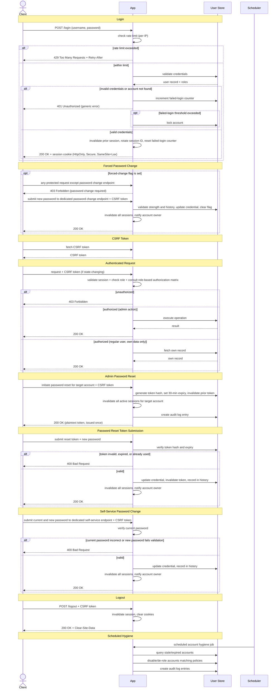

# App Standard: Standalone User Access Control

## 1. Overview

### Purpose

This guide defines the minimum application behavior for standalone, session-based user access control where the application manages the complete user account lifecycle. It establishes enforceable controls for authentication, role-based authorization, user administration, and account security enforcement, without relying on an external identity provider. The standard aligns with NIST SP 800-63B-4 (2025) and OWASP security best practices.

### Scope

This guide applies to internal web applications that:

- Authenticate users against a locally managed user store using username and password.
- Expose HTTP APIs for user administration and read-only access to role definitions.
- Manage user accounts, passwords, and account lifecycle within the application.
- Provide a token-based password reset flow for account recovery, including single-use token generation, expiry enforcement, and session invalidation on successful reset.
- Run scheduled jobs to enforce account hygiene, including disabling inactive accounts, expiring stale credentials, and revoking roles from long-inactive users.
- Use server-side sessions and cookies instead of bearer tokens for the main login flow.
- Enforce account security controls, including login rate limiting and account lockout after repeated failed authentication attempts.
- Return consistent response bodies, status codes, and response times across all authentication-related flows to prevent account enumeration.
- Emit security audit events for authentication outcomes, administrative actions, and account state changes.
- Restrict regular users to accessing only their own account data, while reserving all user management functions for administrators.

### Definitions

- `Current user`: A user with an active, authenticated session.
- `Managed user`: A user account provisioned and managed by an administrator.
- `Role definition`: A configuration that maps role names to their associated privileges.
- `Role-based authorization matrix`: A configuration that maps roles to their allowed API paths and HTTP methods.
- `Inactive account`: An account that has not been accessed for longer than the configured inactivity period.
- `Deleted-user tombstone`: A read-only archive record of a deleted user account, retained to support audit traceability.
- `Failed login counter`: A counter tracking consecutive failed login attempts for a user account.
- `Account lockout`: A temporary restriction preventing authentication after exceeding the configured threshold of consecutive failed login attempts.
- `Absolute session timeout`: The maximum time a session can remain active, regardless of user activity.

## 2. Standard Flow

### Happy Path

1. On startup, the application loads the role definition and role-based authorization matrix before serving traffic.
2. The application creates or syncs configured roles from the role definition.
3. The application may load pre-configured development-only accounts for local testing. These must not be present in production.
4. The client submits username and password to the login endpoint over TLS.
   - *Spring Boot: `POST /login` (or custom endpoint) accepts `application/x-www-form-urlencoded` form parameters (`username` and `password`) by default. Accepting a JSON request body requires a custom `AuthenticationFilter`.*
5. The server validates credentials against the user store:
   - If invalid, the login fails, the failed-login counter increments, and a generic error is returned (to prevent account enumeration).
   - If valid, a new session is created (invalidating any previous session for that user), the session ID is rotated, and an authenticated session cookie is issued.
6. A successful login resets the failed-login counter to zero.
   - *Spring Boot: Spring Security rotates the session ID automatically on successful authentication. Persisting session state to the database requires Spring Session with a JDBC store configured separately (e.g., `spring-session-jdbc`).*
7. If the authenticated user is flagged for a required password change (first login or administrator-initiated), the application restricts access to all endpoints except the password change endpoint until the change is completed. If the change is not completed within the configured grace period (e.g., 30 days for most cases, longer for organisations with extended leave policies), the account is disabled automatically.
   - *Spring Boot: Track the forced-change flag on the user record and enforce it via a `OncePerRequestFilter` placed after the authentication filter. The filter checks the flag on each authenticated request and returns `403` with a specific error code for all endpoints except the password change endpoint. Avoid using `isCredentialsNonExpired()` on `UserDetails` for this, as Spring Security rejects the credentials before a session is created, blocking access to the password change endpoint itself.*
8. The client fetches a CSRF token from the dedicated CSRF endpoint and includes it with all state-changing requests.
   - *Spring Boot: Create a custom endpoint that injects `CsrfToken` via Spring Security and returns it in the response body. The client includes the token in the `X-CSRF-TOKEN` header for state-changing requests.*
9. For each incoming request, the server:
   - Validates the session.
   - Checks the caller's role and privileges.
   - Consults the role-based authorization matrix to authorize the requested path and HTTP method.
   - Rejects unauthorized requests with `403 Forbidden`.
   - *Spring Boot: Use Spring Security's `SecurityFilterChain` with `@PreAuthorize` annotations to enforce authorization. Add `@EnableMethodSecurity` to a `@Configuration` class to activate method-level security.*
10. User administrators have access to account management endpoints (user CRUD, password reset).
11. An administrator initiates a password reset for a target account:
    - The application generates a cryptographically random, single-use reset token with a 30-minute expiry and stores the token hash against the account.
    - The plaintext token is returned to the administrator exactly once and must not be logged or cached.
    - The user submits the plaintext token with the desired new password.
    - The application verifies the token hash, validates password strength and history, updates the credential, invalidates all active sessions for that account, and notifies the account owner.
    - *Spring Boot: Generate the token using `SecureRandom`. Store a SHA-256 hash of the token using `MessageDigest.getInstance("SHA-256")` rather than a slow adaptive hash. The token is already a high-entropy random value and does not require the cost of a password hash. Invalidate sessions via `SessionRegistry`.*
12. Regular users can only read their own account data through a dedicated read-only endpoint. They cannot access other users' data or perform administrative operations.
    - *Spring Boot: Prefer passing the authenticated user's ID directly into the repository query to avoid loading data that may then be rejected. `@PostAuthorize` is an alternative but executes the query before the access check runs.*
13. An authenticated user may change their own password through the dedicated self-service endpoint:
    - The user submits their current password and the desired new password.
    - The application verifies the current password, validates password strength and history, updates the credential, invalidates all active sessions, and notifies the account owner.
    - *Spring Boot: Verify the current password with `PasswordEncoder.matches()`, update the credential, then call `sessionRegistry.getAllSessions(principal, false)` and expire each session individually. When using Spring Session with JDBC, use `SpringSessionBackedSessionRegistry` in place of `SessionRegistryImpl` to ensure session invalidation works across all instances.*
14. When a user initiates logout, the application invalidates the server-side session, clears session and CSRF cookies, and returns a `Clear-Site-Data` response header to instruct the browser to clear cache, cookies, and storage. A logout request on an already-expired or invalid session returns 401/403 (logout keeps its session-bound CSRF token, which is gone once the session expires); the SPA handles this gracefully by clearing local state and redirecting to login, so the user never sees an error page. (Keeping CSRF on logout and the token in the session — rather than exempting logout or moving to a cookie — aligns with the OWASP CSRF and Session Management guidance in References.)
    - *Spring Boot: Spring Security's default logout handler invalidates the session and can clear cookies via `deleteCookies()` in `SecurityFilterChain`. To additionally return the `Clear-Site-Data` header, extend this with a custom logout success handler.*
15. Scheduled jobs run daily (or at configured intervals) to review account state and enforce hygiene policies:
    - Disable accounts inactive longer than the configured threshold.
    - Revoke roles from long-inactive accounts.
    - *Spring Boot: Use `@Scheduled` with ShedLock for distributed job coordination to prevent duplicate execution across instances. Spring Batch is an alternative for high-volume scenarios requiring chunk-oriented processing, restart, and retry capabilities.*

### Failure Paths

1. Login with invalid credentials is rejected with `401 Unauthorized`, and any existing session is invalidated.
2. If failed logins exceed the configured threshold, the account is locked for the configured duration. A locked account cannot log in until the lock expires (to prevent mass-lockout denial-of-service) or an administrator unlocks it.
3. A login request that exceeds the rate limit is rejected with `429 Too Many Requests` and a `Retry-After` header indicating when the client may retry, as recommended by RFC 9110 (HTTP Semantics).
4. A login attempt on an account auto-disabled due to grace period expiry is rejected with `401 Unauthorized` using the same generic error as other login failures, to prevent account enumeration.
5. Requests with malformed or oversized input (e.g., username exceeding maximum length, invalid email format, request body exceeding configured size) are rejected with `400 Bad Request` before any business logic is executed.
6. Login or any state-changing request without a valid CSRF token is rejected with `403 Forbidden`.
7. Requests to protected endpoints without the required privilege are rejected with `403 Forbidden`.
8. A second login by the same user invalidates the earlier session. The old session can no longer get a usable CSRF token or make authenticated calls.
9. When the session expires, the caller is redirected to the configured invalid-session path, or the framework default if none is set.
   - *Spring Boot: The default redirect target is the login page (e.g., `/login?expired`) when using form login, or the auto-generated login page if no custom login page is configured.*
10. Attempts to create, update, or delete roles over REST are rejected, even for administrators. The role definition file is the only source of truth.
11. User creation is rejected when:
    - The username already exists.
    - The username exists in deleted-user tombstones.
    - The email address is already in use.
12. User update is rejected when:
    - The target user does not exist.
    - The username changes.
    - An administrator attempts to lock an account by setting a lock field in the generic user update request rather than using the dedicated lock endpoint.
    - A user tries to unlock their own account.
    - A user tries to change their own roles through the admin update flow.
    - A password change is attempted through the generic update flow.
    - *Sensitive security operations must use dedicated endpoints rather than the generic update flow, as recommended by OWASP Access Control guidelines.*
13. User deletion is rejected if the caller tries to delete their own account.
14. Password reset is rejected for accounts not managed locally by the application.
15. Batch password reset is rejected when the request exceeds the configured maximum payload size.
16. An expired or already-used password reset token is rejected. A new reset flow must be started.
17. A self-service password change is rejected when the current password provided does not match the account's stored credential.
18. A password reset or self-service password change is rejected when the new password does not meet the configured strength requirements or has been used previously within the configured password history window. A specific error must be returned indicating which rule was violated.
19. When a self-service password change succeeds, any pending unused password reset tokens for that account are immediately invalidated.
20. When a new password reset token is issued for an account that already has a pending unused token, the previous token is immediately invalidated. Only the most recently issued token is valid at any time.
21. A password reset token submission that exceeds the configured rate limit is rejected with `429 Too Many Requests` and a `Retry-After` header.
22. When a scheduled hygiene job disables an account, any active session for that account becomes invalid. The next request on that session must be rejected as unauthenticated.

### Decision Logic

- The role definition (configuration file or source) controls which roles exist. Roles must not be created, modified, or deleted through API endpoints. Read access to role definitions is permitted only for authorized roles.
- The role-based authorization matrix controls authorization for each API endpoint and HTTP method per role.
- Users cannot perform create, update, or delete operations on their own account via the admin update endpoint. Only read operations on their own data are permitted.
- Password changes must always use a dedicated, separate password-reset flow, never through generic user profile updates.
- All users created by administrators must be flagged to change their password on first login. If they do not comply within the configured grace period (e.g., 30 days), their account must be disabled automatically.
- Failed login counters are tracked per account, not per IP address, to prevent brute-force bypass via IP rotation.
- Rate limiting on authentication endpoints is applied per account to prevent brute-force attacks (multiple attempts on one account) and credential-stuffing attacks (where attackers use stolen credentials from other services to attempt login).
- All authentication-related endpoints must return consistent response bodies, status codes, and response times regardless of whether the account exists, to prevent account enumeration.
- Password reset tokens are single-use and expire after a maximum of 30 minutes. A new token immediately invalidates any previously issued token for the same account.
- CSRF tokens are required for all state-changing requests. Read-only requests do not require a CSRF token.
- A successful password reset must invalidate all existing sessions for that account, forcing the user to re-authenticate.
- A self-service password change by an authenticated user must verify the current password before accepting the new one, even when the user has an active session.
- When an administrator re-enables a disabled account, the account must be flagged for a mandatory password change before the user can access the application.
- An administrator-initiated password reset for a locked account is permitted. The reset token is issued and the lock is not automatically cleared. The account remains locked until the lock expires or the administrator explicitly unlocks it.

### Sequence Diagram



## 3. Best Practices & Contracts

### 3.1 Inputs / Outputs

- Login must accept username and password over TLS. All state-changing requests (POST, PUT, PATCH, DELETE) with cookie-backed sessions must require a valid CSRF token to prevent Cross-Site Request Forgery attacks. Read-only requests (GET) do not require CSRF tokens.
- All user-supplied input must be validated for length, format, and character set before processing. Reject invalid input with `400 Bad Request`.
- *[Enforced Constraint]* A dedicated endpoint must be exposed to return the current CSRF token for browser clients. The endpoint must not cache the response. The application must strictly use the **Synchronizer Token Pattern** bound to the HTTP Session (e.g., `HttpSessionCsrfTokenRepository`). The **Double Submit Cookie** pattern (e.g., `CookieCsrfTokenRepository`) is strictly prohibited, as stateless CSRF cookies weaken the security of our stateful architecture.
- An admin-initiated password reset must return the newly generated plaintext token exactly once in the response body. Treat it like a password: do not log it, cache it, or expose it again after the response is sent.
- A self-service password change endpoint must require the caller to supply their current password before accepting the new one, even when the caller has an active session.

### 3.2 Error Contract

- Authorization failures must map to `403 Forbidden`.
- Validation failures must return a 4xx response with a stable, machine-readable error body.
- Expired or invalid sessions must force re-authentication.
- All authentication-related failure responses (invalid credentials, locked account, non-existent user, disabled account) must return identical HTTP status codes, response bodies, and response timing across login, password reset, and user registration flows. This prevents account enumeration and timing-based attacks (OWASP Authentication Cheat Sheet).

**Role Management Errors:**
- `role <operation> not allowed` (`403 Forbidden`): User lacks authorization to create, update, or delete roles.

**User Management Errors:**
- `user exist` (`400 Bad Request`): Username or email is already in use.
- `username change not allowed` (`400 Bad Request`): Username modification is not permitted.
- `request body with list of more than {max} entries is not allowed` (`400 Bad Request`): Batch operation exceeds configured size limit.

**Authentication and Session Errors:**
- `account locked` (`401 Unauthorized`): Login attempt against a locked account. Responses must be identical to invalid credential responses. Log details internally to prevent account enumeration.
- `account cannot authenticate` (`401 Unauthorized`): Catch-all for disabled or locked accounts. The specific reason must not be revealed to the caller.
- `too many requests` (`429 Too Many Requests`): The rate limit has been exceeded. The response must include the `Retry-After` header.
- `password reset token expired or invalid` (`400 Bad Request`): The provided token has expired or was already redeemed.

**Endpoint Authorization Constraints:**
- Attempts to mutate `currentUser` through create, update, or delete endpoints must fail with `403 Forbidden`.
- Attempts to change another user's password through the generic user update endpoint must fail.
- Self-delete and self-unlock through the admin flow must fail.
- Session timeout and forced single-session invalidation require the user to start a new login flow.

### 3.3 Audit Contract

**Auditable Events:**

All audit events must include:
- Timestamp
- Username or principal ID
- Outcome
- Request path, HTTP method, and correlation ID (when available)

The following events must be audited:
- Successful login, failed login, and successful logout
- Account lockout transitions (locked, unlocked)
- User account operations (create, unlock, update, delete) attributable to the acting administrator
- Password reset token issuance and redemption
- Password changes (both admin-initiated and self-service)
- Role assignments and changes
- Security header configuration changes
- Administrative user deletion (must preserve a tombstone record with deleted user details and deletion timestamp)

**Data Retention:**

- Audit events must be retained for a minimum of `90` days to support security incident investigation.
- The application must ensure audit events are stored durably for the retention period. This can be achieved through local database storage or by routing events to an external logging system.

### 3.4 Logging Contract

**General Requirements:**

- All "Audit Events" (Section 3.3) must be implemented as structured logs following the [Structured Logging Schema](../../Appfw-Logging-Standards/Log_Schema.md).
- Mandate the use of **SLF4J 2.0+ / Spring Boot 3.4+ fluent API** (`log.atInfo()...log()`) for all security-relevant logging.
- **Metadata Separation:** Technical tags and audit metadata must be passed via `.addKeyValue()`, keeping the `message` field as a concise, human-readable sentence.
- Use ECS (Elastic Common Schema) standard fields:
  - `event.action`: The action being performed (e.g., `user-authentication`, `access-control`).
  - `event.outcome`: The result (`success`, `failure`).
  - `user.id`: The system-generated user identifier (UUID). Using the UUID in cleartext is PII-safe, prevents IDOR, and enables straightforward database lookup for debugging.
- Include `trace.id` and a hashed session identifier for correlation.

**Example:**
```java
log.atInfo()
   .setMessage("User account unlocked successfully")
   .addKeyValue("user.id", user.getId())
   .addKeyValue("event.action", "access-control")
   .addKeyValue("event.outcome", "success")
   .log();
```

**What NOT to Log:**

- Raw passwords, password reset token plaintext, CSRF tokens, raw session identifiers, OTP values, or authentication challenge responses.
- Password reset token hashes.

**Log Levels:**

- `INFO`: Successful login, logout, password changes (admin-initiated and self-service), password reset token issuance and redemption, and successful administrative user operations (create, update, delete, unlock, role changes).
- `WARN`: Failed login attempts, account lockout transitions (with triggering user.id UUID if resolved, or omitting user identity and relying on `session.hash` and `trace.id` for correlation if not), rate limit breaches (with endpoint), authorization failures (`403 Forbidden` with user.id, path, HTTP method, and correlation ID), and failed administrative attempts.
- `ERROR`: Authentication system failures (database unavailable, service errors), unrecoverable authentication errors, or critical security policy violations.

**Privacy and Data Protection:**

- Minimize Personally Identifiable Information (PII) in logs. 
- Mandate the use of system-generated `user.id` (UUIDs) for standard logging. Raw usernames or emails (PII) must not be logged in cleartext. For authentication entry points where the UUID is not yet resolved, omit user identity entirely and rely on `session.hash` and `trace.id` for correlation.
- Ensure logging practices comply with data protection regulations (GDPR, local privacy laws) and audit retention policies.

### 3.5 Security Contract

**Core Principles:**

- Use server-side sessions and rotate the session ID after login to prevent session fixation, in accordance with OWASP session management guidance.
- Require CSRF token validation on all data-modifying requests, in accordance with OWASP CSRF guidance.

**Session Management:**

- Default maximum concurrent sessions per user: `1`.
- Default session timeout: `15m` unless explicitly overridden.
- Default absolute session lifetime: `8` hours.
- Session and CSRF cookies must be cleared on logout. The server must also invalidate the session state to prevent further use of that session token.
- All session and CSRF cookies must be explicitly configured with the following attributes to prevent session theft and CSRF attacks:
  - `HttpOnly=true` — Prevents JavaScript from accessing the cookie; blocks XSS-based session theft.
  - `Secure=true` — Ensures cookies are transmitted only over HTTPS; prevents man-in-the-middle disclosure.
  - `SameSite=Lax` — Prevents the browser from sending cookies with cross-site requests; mitigates CSRF and cross-origin information leakage.

**Password Policy:**

- Store passwords using a slow, adaptive password hash (prefer Argon2id or scrypt. BCrypt is acceptable for existing systems).
- Password history retention must be enforced. Default password history length: `3`.
- A successful self-service password change must invalidate any pending unused password reset tokens for that account.
- Administrative password reset must generate a 12-character random password containing at least:
  - One lowercase letter.
  - One uppercase letter.
  - One digit.
  - One special character from the set of printable non-alphanumeric ASCII characters (for example: `!@#$%^&*()-_=+[]{}|;:,.<>?`).

**Account Lockout:**

- Implement account lockout after repeated failed authentication attempts to reduce brute-force attacks, in accordance with OWASP Blocking Brute Force Attacks guidance.
- Default account lockout threshold: `5` consecutive failed logins.
- Default lockout duration: `20` minutes with automatic lift. Administrator-initiated unlock is also allowed through the existing admin unlock endpoint. No email-based self-service unlock is required.
- Lockout counter must reset to zero on successful authentication.

**Account Hygiene Defaults:**

- First-login password change grace period: `30` days.
- Inactivity disablement: `90` days.
- Role revocation for inactive users: `180` days.

**Rate Limiting:**

- Rate limit on `/login`: `10` attempts per account per minute. When exceeded, return `429 Too Many Requests` with a `Retry-After` header indicating when the client may retry.
- Password reset endpoints (token issuance and token redemption) must also enforce rate limiting to prevent brute-force attacks on password reset tokens.

**Data Access Control:**

- A dedicated user account endpoint must return only the authenticated user's own record.
- Role assignments must be configured and managed by role administrators only. Users cannot assign themselves or others to roles through the application.
- User management endpoints must be restricted to user administrators or roles explicitly granted access through the role-based authorization matrix.

**HTTP Security:**

- Enforce HTTP security headers on every response at the application level using the framework's built-in security configuration to reduce clickjacking, MIME sniffing, and cross-origin data leakage. Infrastructure-level header injection is complementary but not a substitute. Example enforced headers: `Strict-Transport-Security`, `X-Content-Type-Options: nosniff`, `X-Frame-Options: DENY`, `Content-Security-Policy: default-src 'self'`.
- CORS policy must be declared through the application's centralized security configuration using an explicit allowlist of origins. Per-endpoint CORS overrides that expand the set of allowed origins are not permitted. Example: `allowCredentials=true` only for explicitly whitelisted origins. Wildcard origins (`*`) are prohibited.
- On logout, return the `Clear-Site-Data` HTTP header to instruct browsers to clear cached data, cookies, and storage: `Clear-Site-Data: "cache","cookies","storage"`.

## 4. Architectural Design

### Authentication and Security Design

- *[Enforced Constraint]* The application authenticates users via server-side sessions, with session IDs managed through cookies.
- *[Enforced Constraint]* Sessions enforce both idle timeout (after inactivity) and absolute timeout (maximum session lifetime).
- *[Enforced Constraint]* Logout invalidates server session state and clears session-related cookies.
- *[Enforced Constraint]* Failed login triggers per-account lockout after exceeding a threshold.
- *[Enforced Constraint]* Password reset uses separate endpoints: one for admin-initiated token issuance and one for user-facing token redemption.
- *[Enforced Constraint]* CSRF tokens from a dedicated endpoint are required for data mutation.
- *[Design Choice]* Rate limiting is enforced on critical endpoints at the application level. Infrastructure-level controls are supplementary and do not replace this enforcement.

### Data Persistence

- *[Enforced Constraint]* User account records and role definitions are persisted in a relational database.
- *[Enforced Constraint]* Deleted users are retained in the database through soft-delete to maintain the audit trail.
- *[Enforced Constraint]* Session state is persisted to enforce concurrent session limits across requests and restarts.

### Separation of Concerns

- *[Design Choice]* HTTP methods and resource paths define the authorization contract boundary.
- *[Design Choice]* Administrators access full user records; regular users access only their own record through a dedicated endpoint.
- *[Enforced Constraint]* Role provisioning is configuration-driven, while user records are database-driven.
- *[Enforced Constraint]* Generic user update is separate from password reset.
- *[Enforced Constraint]* Scheduler runs are serialized per job name to prevent duplicate processing.

## 5. Test & Validation Standard

### Role and Authorization Tests

- Role definitions are loaded at application startup.
- Duplicate role definitions fail fast at startup.
- Attempts to mutate role definitions via API endpoints fail with `403 Forbidden` (roles are read-only; role definition is configuration-driven).
- Role mapping changes in the configuration take effect on next application load, changing which API paths are accessible to each role.
- Authorization is enforced by HTTP method and resource path. Each HTTP method (GET, POST, PUT, DELETE) on a protected endpoint is independently authorized.
- Role-protected endpoints return `200/201` for authorized callers, `403 Forbidden` for callers without the required role.
- All user management endpoints reject non-administrators with `403 Forbidden`, including requests on their own account.

### Authentication and Session Tests

- Successful login establishes an authenticated session with a new session ID, invalidating any prior session for that user, and each re-authentication produces a different session token.
- Session state persists to the database to enforce concurrent session limits across requests and application restarts.
- Idle session timeout forces re-authentication after configured inactivity period (default: 15 minutes).
- Absolute session timeout forces re-authentication regardless of activity after configured lifetime (default: 8 hours).
- Logout invalidates server-side session state and clears session-related cookies.
- Logout on an already-expired or invalid session must be handled gracefully by the client. Because logout retains its session-bound CSRF protection, the server will correctly return a `401` or `403`. **Do not "fix" this by exempting the logout endpoint from CSRF protection.** Instead, the SPA must catch this response (typically via a global interceptor), clear local state, and redirect to the login page without displaying an error to the user.

### CSRF Protection Tests

- A dedicated CSRF token endpoint exists and returns a valid token in response body.
- The CSRF token endpoint does not cache responses (Cache-Control headers prevent caching).
- CSRF tokens are required for state-changing requests (POST, PUT, PATCH, DELETE) and not required for read-only requests (GET, HEAD).
- Requests with invalid or missing CSRF tokens are rejected with `403 Forbidden`.
- Previously redeemed CSRF tokens are rejected on subsequent attempts.

### Account Lockout and Rate Limiting Tests

- Failed login attempts increment the per-account counter, locking the account when the configured threshold (default: 5 consecutive failed logins) is reached. Successful login resets the counter to zero.
- Lockout persists across restarts, expires automatically after the configured duration (default: 20 minutes), and can be manually lifted by an administrator via the dedicated unlock endpoint.
- Login and password reset endpoints enforce per-account rate limiting, returning `429 Too Many Requests` with `Retry-After` header when exceeded.
- Rate limiter and session persistence behave consistently under distributed deployment.

### Password Reset Tests

- Password reset uses separate endpoints for admin-initiated token issuance and user-facing token redemption.
- Admin-initiated password reset generates a cryptographically random, single-use token, with the plaintext returned in the response body only once.
- Password reset tokens expire after 30 minutes, are stored as a hash, and issuing a new token immediately invalidates any prior pending one for the same account.
- Password reset token submission fails with `400 Bad Request` when token is expired or already redeemed.
- Successful password reset invalidates all prior sessions for that account, forcing re-authentication.

### Self-Service Password Change Tests

- Self-service password change requires the current password and is rejected when it does not match the stored credential.
- Self-service password change with correct current password succeeds and invalidates all existing sessions for that account.
- New passwords in both password reset and self-service change must meet password strength requirements and not match password history (default: 3 prior passwords).

### User Administration Tests

- User creation fails with `400 Bad Request` when the username already exists (including in deleted-user tombstones) or the email is already in use.
- User creation succeeds and flags the new user for mandatory password change on first login (grace period: 30 days).
- User update is rejected when attempting to change the username or lock an account via the generic update endpoint (a dedicated lock endpoint must be used instead).
- User deletion fails with `403 Forbidden` when user attempts to delete their own account.
- Deleted users are retained in the database as soft-delete records with tombstone markers to maintain audit trail.

### User Data Access Control Tests

- A dedicated read-only endpoint returns only the caller's own record, with requests for other users rejected with `403 Forbidden`.
- Administrators access full user records with all fields, while regular users cannot access other users' records via any endpoint.

### Account Hygiene Tests

- First-login users are flagged for mandatory password change and disabled if not completed within the configured grace period (default: 30 days).
- A re-enabled account is flagged for mandatory password change before access is granted.
- Accounts are disabled after configured inactivity period (default: 90 days).
- Roles are revoked from long-inactive accounts after configured duration (default: 180 days).
- Batch job disablement invalidates any active sessions for the affected account.
- Scheduler runs are serialized per job name to prevent duplicate processing.

### Input Validation Tests

- User-supplied input exceeding maximum length or with invalid format (e.g., invalid email, non-alphanumeric username) is rejected with `400 Bad Request`.
- Request bodies and password reset batch requests exceeding configured maximum size or entry limits are rejected with `400 Bad Request`.

### Security Headers and CORS Tests

- HTTP security headers are present on all responses: Strict-Transport-Security, X-Content-Type-Options, X-Frame-Options, Content-Security-Policy.
- Session and CSRF cookies have the Secure, HttpOnly, and SameSite=Lax attributes set.
- CORS preflight requests from allowed origins succeed with appropriate headers.
- CORS requests from non-allowlisted origins are rejected, and wildcard origins are not permitted.
- On logout, Clear-Site-Data header is returned to instruct browsers to clear cached data, cookies, and storage.

### Error Handling and Account Enumeration Prevention Tests

- All authentication-related failure responses return identical HTTP status codes, response bodies, and response timing regardless of account state, to prevent enumeration.
- Authentication failure responses use machine-readable error codes but do not expose the specific reason (e.g., account does not exist vs. account locked) to prevent information leakage.
- Validation errors specify which rule was violated (e.g., password history, password strength) via error response.
- Error response bodies conform to the documented schema in all environments.

### Logging and Audit Tests

- INFO-level events are logged for: successful login and logout, password changes (admin-initiated and self-service), password reset token issuance and redemption, and user administrative operations (create, update, delete, unlock, role changes).
- WARN-level events are logged for: failed login attempts, account lockout transitions, rate limit breaches, authorization failures, and failed administrative attempts.
- Logs never contain plaintext passwords, CSRF tokens, session IDs, or password reset tokens.
- Audit trail is retained for minimum 90 days.
- Account owners are notified when password is changed, account is locked, or password reset is completed.

### Dependency Security Checks

- OWASP Dependency-Check is run as a CI gate, blocking release if critical CVEs are detected.

### Test Data Guidance

- Use deterministic, synthetic usernames and emails (e.g., `testuser123@test.example.com`). Do not use real personal data.
- Use fixed clocks or controllable system time for inactivity and grace period tests.
- Never log plaintext password reset tokens unless explicitly redacted and short-lived.
- Generate test tokens with same entropy and format as production tokens.

## 6. Operational Runbook

### Observable Signals

**Authentication and Sessions:**
- Monitor login, logout, and failed login events.
- Monitor `429 Too Many Requests` rate limit hits on login and password reset endpoints.
- Monitor account lockout counts and automatic lifts. Spikes indicate brute-force or credential-stuffing attacks.
- Monitor failed-to-successful login ratios per account to detect potential compromise.
- Monitor repeated session invalidations and timeout events (idle vs absolute) to identify unusual patterns.

**User Administration and Account Hygiene:**
- Monitor user creation, update, delete, unlock, and role assignment events.
- Monitor counts of users flagged for mandatory password change and disabled users.
- Monitor password reset and change events, batch job execution, and role revocation failures.

**Security and Compliance:**
- Monitor `403 Forbidden` authorization failures.
- Monitor CSRF token endpoint access rates for unexpected spikes.
- Alert on account owner notification delivery failures.
- Alert on dependency-scan CVE findings above configured severity threshold before deployment.

### Manual vs Self-Healing

**Self-Healing (Automatic Recovery):**
- Session timeout (idle or absolute) and concurrent session limit violations: Users automatically re-authenticate on next request.
- Account lockout automatic lift after configured duration (default: 20 minutes).
- Account hygiene automated disablement and role revocation by scheduled jobs.
- Password reset token expiry and lockout counter reset on successful login are automatic.

**Manual Intervention Required:**
- Duplicate or misconfigured role definitions: Configuration fault requiring manual correction and restart.
- Misconfigured role-based authorization matrix: Overly permissive or restrictive access requires manual correction.
- Unexpected mass disablement or role removal: Requires investigation and manual reversal.
- Mass or coordinated account lockouts: Indicates potential attack; manual investigation required before bulk unlocks.
- Notification delivery failures: Account owners not alerted of security events; requires investigation of notification service and manual follow-up.
- Expired or compromised dependencies with CVEs: Requires code rebuild and redeploy.
- Session persistence failures: Database recovery required to restore user sessions.

### External Failure Sources

**Database and Persistence:**
- Database outages block authentication, authorization, session persistence, and batch processing.
- Session state persistence failure: Concurrent session limits cannot be enforced.
- Lockout state in-memory only: Lost on restart; attackers can reset attempt counts.
- Password hash or tombstone storage failures: Password changes blocked or audit trail compromised.

**Batch Job and Scheduler:**
- Scheduler serialization failures: Duplicate batch execution causes duplicate notifications and state inconsistency.
- Account hygiene batch failures or misconfigured job schedules: Inactive accounts not disabled, credentials not expired, roles not revoked.

**Configuration and Authorization:**
- Misconfigured role definitions or authorization matrix: Access too permissive or restrictive.
- Overly permissive CORS or missing CSRF protection: Exposes application to cross-origin attacks.
- Missing or misconfigured HTTP security headers: Responses may expose the application to XSS, clickjacking, or MIME sniffing.

**Session and Authentication:**
- Session timeout configuration errors: Overly short timeouts degrade user experience; overly long timeout increases session theft risk.
- Insufficient cookie security attributes: Missing `HttpOnly`, `Secure`, or `SameSite` attributes expose sessions to XSS, MITM, or CSRF.
- Password policy not enforced or account lockout not persisted: Passwords reused or lockout counters reset on restart.

**Notifications:**
- Notification mechanism unavailable: Account owners not notified of password changes, lockouts, or password resets, leaving security events undetected.

### Required Runtime Configuration

**Core Authentication and Authorization:**
- API base path (e.g., `/api/v1`) externalized via application properties.
- Role definition source (defines roles and privileges)
- Role-based authorization matrix source (maps roles to allowed HTTP methods and paths)
- CORS allowed-origin allowlist (no wildcard `*` permitted)

**Session Management:**
- Session idle timeout (default: `15` minutes)
- Session absolute timeout (default: `8` hours)
- Maximum concurrent sessions per user (default: `1`)
- Session state persistence backend (e.g., JDBC session store configuration)

**Account Lockout and Rate Limiting:**
- Account lockout threshold (default: `5` consecutive failed logins)
- Account lockout duration (default: `20` minutes)
- Login endpoint rate limit (default: `10` attempts per account per minute)
- Password reset endpoints rate limit (token issuance and redemption)

**Password Policy:**
- Password hashing algorithm (prefer Argon2id or scrypt; BCrypt acceptable for existing systems)
- Password history length (default: `3`)
- Password minimum strength requirements (minimum length)
- Password reset token expiry (default: `30` minutes)
- Admin-generated password requirements: 12-character minimum with lowercase, uppercase, digit, and special character

**Account Hygiene Batch Jobs:**
- First-login password change grace period (default: `30` days)
- Inactivity disablement threshold (default: `90` days)
- Role revocation for inactive users (default: `180` days)
- Batch job schedules and timezone configuration
- Scheduler implementation with distributed locking (e.g., ShedLock)

**Data Storage:**
- Datasource configuration (database connection, connection pool, credentials)
- Optional development-only seed accounts (must not be present in production)

**HTTP Security and CORS:**
- HTTP security headers: `Strict-Transport-Security`, `X-Content-Type-Options: nosniff`, `X-Frame-Options: DENY`, `Content-Security-Policy: default-src 'self'`
- Cookie security attributes: `HttpOnly=true`, `Secure=true`, `SameSite=Lax`
- Clear-Site-Data header for logout: cache, cookies, storage

**Notifications:**
- Account notification mechanism (email, SMS, in-app) for password changes, lockouts, password reset completions
- Notification delivery retry policy and failure handling

**Observability and Compliance:**
- Audit log retention backend and retention period (minimum 90 days)
- Dependency vulnerability scan tool (OWASP Dependency-Check or equivalent)
- Dependency scan schedule and CVE severity threshold for alerts

## 7. References

HTTP and Security Standards:
- [RFC 9110: HTTP Semantics](https://datatracker.ietf.org/doc/html/rfc9110)

NIST Guidelines:
- [NIST SP 800-63B-4: Digital Identity Guidelines - Authentication and Authenticator Management (2025)](https://csrc.nist.gov/pubs/sp/800/63/b/4/final)

OWASP Security Guidelines:
- [OWASP Cross-Site Request Forgery Prevention Cheat Sheet](https://cheatsheetseries.owasp.org/cheatsheets/Cross-Site_Request_Forgery_Prevention_Cheat_Sheet.html)
- [OWASP Session Management Cheat Sheet](https://cheatsheetseries.owasp.org/cheatsheets/Session_Management_Cheat_Sheet.html)
- [OWASP Password Storage Cheat Sheet](https://cheatsheetseries.owasp.org/cheatsheets/Password_Storage_Cheat_Sheet.html)
- [OWASP Authentication Cheat Sheet](https://cheatsheetseries.owasp.org/cheatsheets/Authentication_Cheat_Sheet.html)
- [OWASP Forgot Password Cheat Sheet](https://cheatsheetseries.owasp.org/cheatsheets/Forgot_Password_Cheat_Sheet.html)
- [OWASP Blocking Brute Force Attacks](https://owasp.org/www-community/controls/Blocking_Brute_Force_Attacks)
- [OWASP Credential Stuffing Prevention Cheat Sheet](https://cheatsheetseries.owasp.org/cheatsheets/Credential_Stuffing_Prevention_Cheat_Sheet.html)
- [OWASP HTTP Security Response Headers Cheat Sheet](https://cheatsheetseries.owasp.org/cheatsheets/HTTP_Response_Headers_for_Security.html)
- [OWASP Authorization Cheat Sheet](https://cheatsheetseries.owasp.org/cheatsheets/Authorization_Cheat_Sheet.html)
- [OWASP API Security Top 10 (2023)](https://owasp.org/API-Security/editions/2023/en/0xa2-broken-authentication/)
- [OWASP Secure Headers Project](https://owasp.org/www-project-secure-headers/)
- [OWASP Top 10:2025](https://owasp.org/Top10/2025/)
- [OWASP Dependency-Check](https://owasp.org/www-project-dependency-check/)
ww-project-secure-headers/)
- [OWASP Top 10:2025](https://owasp.org/Top10/2025/)
- [OWASP Dependency-Check](https://owasp.org/www-project-dependency-check/)
