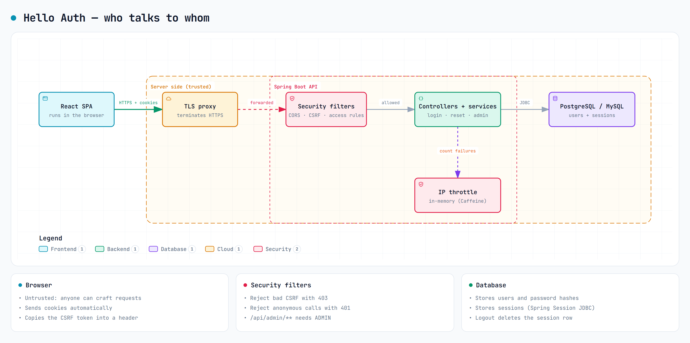
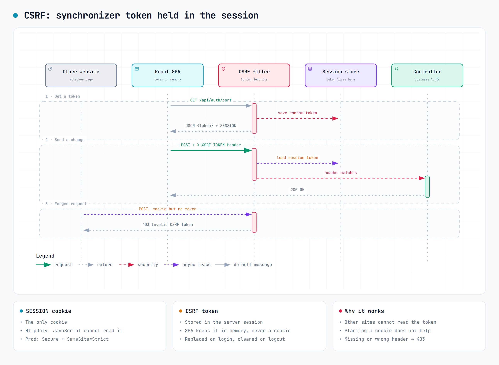
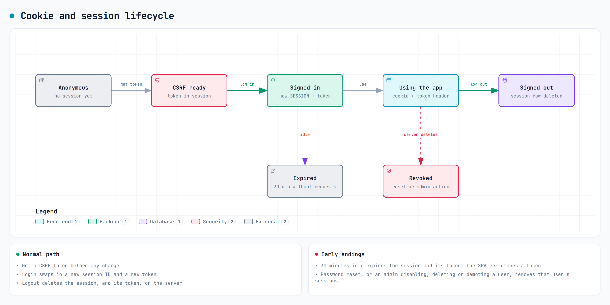
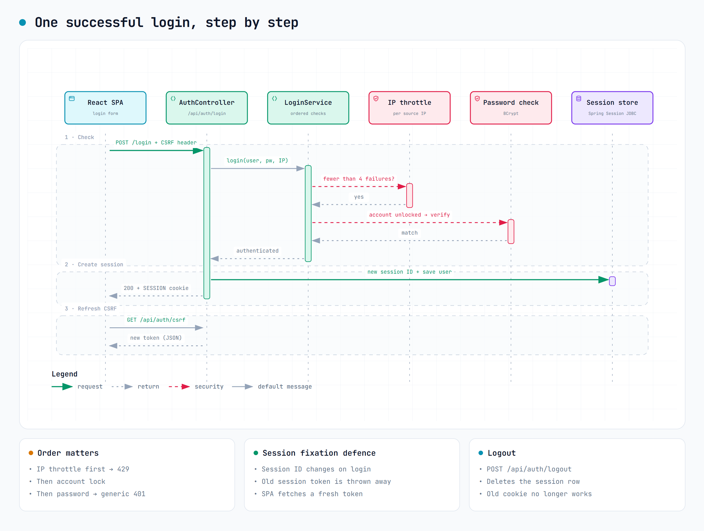
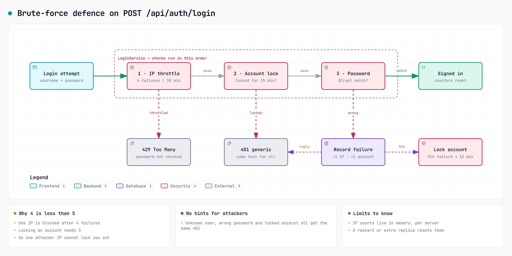
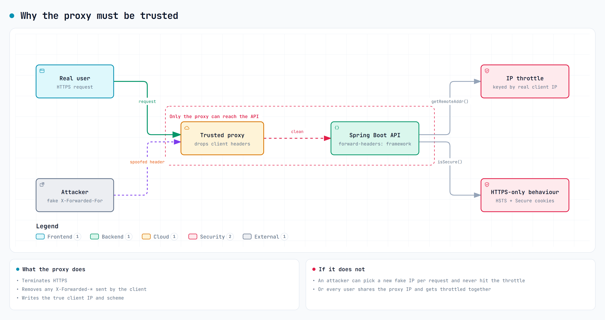
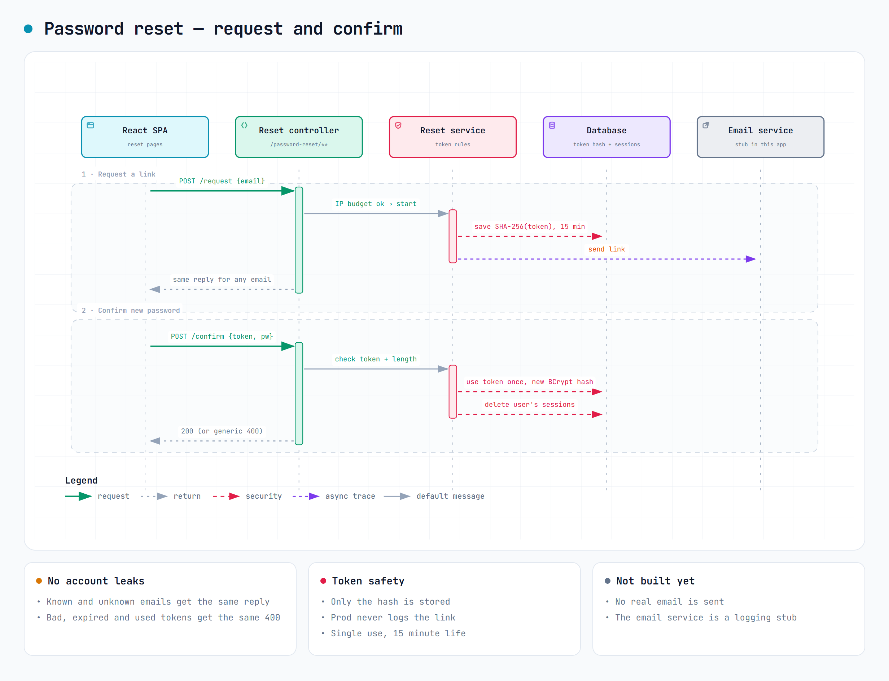

# Hello Auth — Introduction.

A walk through how Hello Auth's React frontend and Spring Boot backend keep logins, cookies and requests safe.

**Snapshot:** 2026-09-27 · revision `01efc8ed1560e409ba66a89ff835391ac6c4e101`.

**Scope:** A guided introduction, not a full audit. Reviewed against the current working tree, including uncommitted changes, based on the recorded HEAD revision. We start from SecurityConfig.java and application-prod.yml, then follow the code they drive. Official standards and guidance were checked online; no production system was exercised. The standards mappings below are assessments, not certifications.

**How to read each panel:** the junior asks, the senior answers, a diagram shows the flow, and the bullets add detail. "In the code" means we read it in the source. "Deployment" and "Not known" mean it depends on how the app is run. Each panel ends with what to keep intact and links to the source.

## 01 · Start with the big picture

> **JUNIOR DEV:** Can two config files tell us if the app is secure?

**SENIOR DEV:** They tell us the rules, not the whole story. The React app runs in the browser and sends cookies to the Spring Boot API. Spring Security filters every request first. Then controllers and services do the real work: login, throttling, password reset and admin actions. Sessions live in the database.

*How a request travels from the browser to the database.* [Open the interactive diagram](artifacts/introduction/diagrams/trust-boundaries.html)

- In the code: SecurityConfig sets up the filters. AuthController saves the login. application-prod.yml overrides the defaults when the prod profile is on.
- Not covered by these files: the proxy, database permissions and the headers sent by whatever hosts the frontend. Those need their own checks.

**What to preserve:** Treat the config as a map, not a certificate. A comment in the code explains intent; it does not prove the deployed system matches it.

**Source anchors:** [SecurityConfig.java:80](<backend/src/main/java/com/example/helloauth/config/SecurityConfig.java#L80>) · [application-prod.yml:34](<backend/src/main/resources/application-prod.yml#L34>) · [AuthController.java:89](<backend/src/main/java/com/example/helloauth/auth/AuthController.java#L89>) · [api.ts:11](<frontend/src/lib/api.ts#L11>)

## 02 · Config order is not filter order

> **JUNIOR DEV:** Do the HttpSecurity calls run top to bottom, like a pipeline?

**SENIOR DEV:** No. Each call configures a block, and Spring Security decides where each filter goes. Moving cors() above headers() changes nothing at runtime. What matters: a bad CSRF token is rejected before your controller ever runs.

**In short:** Pick the matching filter chain → Run security filters → Check access rules → Controller (only if allowed)

- In the code: the main chain turns on CORS, SPA-style CSRF, security headers, path rules and logout. A separate dev-only chain for the H2 console runs first.
- Good to know: only the first chain that matches a request handles it.
- In the code: the CSRF block sets a session-backed token repository and the XOR request handler. The same repository bean is shared with login (rotate) and logout (clear).

**What to preserve:** Do not switch to csrf.spa(): it swaps in the cookie-based repository. When you add filters, check the real filter list (for example with Spring Security debug logging) instead of guessing from code order.

**Source anchors:** [SecurityConfig.java:80](<backend/src/main/java/com/example/helloauth/config/SecurityConfig.java#L80>) · [SecurityConfig.java:247](<backend/src/main/java/com/example/helloauth/config/SecurityConfig.java#L247>) · [SecurityConfig.java:155](<backend/src/main/java/com/example/helloauth/config/SecurityConfig.java#L155>)

## 03 · Public does not mean unchecked

> **JUNIOR DEV:** If an endpoint is permitAll, what can still reject me?

**SENIOR DEV:** CSRF, input validation and service rules still apply. The public list is short: register, login, csrf, me, and everything under /api/auth/password-reset/**. /api/admin/** needs the ADMIN role. /actuator/health is public. Everything else needs a login.

- In the code: /api/auth/me is public at the filter level, but the controller itself returns 401 if you are not signed in.
- Watch out: /api/auth/password-reset/** is a wildcard. Any new endpoint added under it is public automatically.
- In the code: AdminService adds its own rules. Admins cannot change their own account, and disabling, deleting or demoting a user ends that user's sessions.
- In the code: ERROR dispatches are explicitly permitted. The fallback is authenticated(), not denyAll(): new routes allow any signed-in user unless given a narrower rule.

**What to preserve:** When adding a route, check both the filter rules and the service rules. Never widen the public list to /api/auth/**.

**Source anchors:** [SecurityConfig.java:110](<backend/src/main/java/com/example/helloauth/config/SecurityConfig.java#L110>) · [AuthController.java:138](<backend/src/main/java/com/example/helloauth/auth/AuthController.java#L138>) · [AdminService.java:62](<backend/src/main/java/com/example/helloauth/admin/AdminService.java#L62>) · [PasswordResetController.java:19](<backend/src/main/java/com/example/helloauth/passwordreset/PasswordResetController.java#L19>) · [ApiExceptionHandler.java:86](<backend/src/main/java/com/example/helloauth/auth/ApiExceptionHandler.java#L86>)

## 04 · One cookie, one token in memory

> **JUNIOR DEV:** Where does the CSRF token live, and why not in a cookie?

**SENIOR DEV:** The application session cookie is SESSION, an opaque identifier that JavaScript cannot read. It identifies anonymous sessions as well as signed-in ones. The CSRF secret lives in the server session. GET /api/auth/csrf returns an XOR-masked representation; the SPA keeps it in memory and echoes it as X-XSRF-TOKEN on changes. Spring unmasks and validates it against the stored secret. This implements OWASP’s Synchronizer Token pattern. Untrusted origins cannot read the token through the browser’s origin controls; XSS or an overly permissive CORS policy can defeat that boundary.

*Synchronizer token: fetched from the session, held in memory, sent in a header.* [Open the interactive diagram](artifacts/introduction/diagrams/csrf-cookies.html)

*What happens to the session and its CSRF token over time.* [Open the interactive diagram](artifacts/introduction/diagrams/session-lifecycle.html)

- In the code: in prod, SESSION is Secure, HttpOnly and SameSite=Strict. The default (non-prod) setting is Secure=false and SameSite=Lax. Sessions expire after 30 minutes without a request.
- Why not a cookie: with a token cookie (naive double-submit), an attacker who can write cookies on your domain, for example from a sibling subdomain, could plant a known value. A token kept only on the server cannot be planted. HttpOnly still does not stop injected script from sending requests, so preventing XSS still matters.
- In the code: an expired session loses its token. A mutation with a stale token gets 403 "Invalid CSRF token"; the SPA fetches a token and retries once. Authentication is not restored: protected routes can then return 401. GET /api/auth/csrf creates an anonymous session when needed.
- Deployment: SameSite=Strict blocks cross-site cookies even when CORS allows the origin and fetch includes credentials. Separate HTTPS subdomains can be cross-origin but same-site; a frontend on a different site will not work with this cookie policy.

**What to preserve:** Keep the token out of cookies, localStorage and URLs. Test HTTPS, SameSite and credentialed CORS together, because the SESSION cookie must still reach the API.

**Source anchors:** [SecurityConfig.java:247](<backend/src/main/java/com/example/helloauth/config/SecurityConfig.java#L247>) · [SecurityConfig.java:288](<backend/src/main/java/com/example/helloauth/config/SecurityConfig.java#L288>) · [application.yml:1](<backend/src/main/resources/application.yml#L1>) · [api.ts:11](<frontend/src/lib/api.ts#L11>)

## 05 · Follow one login

> **JUNIOR DEV:** Who actually creates the signed-in session?

**SENIOR DEV:** AuthController hands the username and password to LoginService. It runs three checks in order: IP throttle, account lock, then password (BCrypt). If all pass, the controller gives the session a new ID, saves the signed-in user to the session store, and returns 200. The SPA then fetches a fresh CSRF token.

*One successful login, step by step.* [Open the interactive diagram](artifacts/introduction/diagrams/login.html)

*What stops password guessing.* [Open the interactive diagram](artifacts/introduction/diagrams/rate-limit.html)

- Why a new session ID: it stops session fixation, where an attacker plants a session ID before you log in.
- Failure responses: throttled login returns 429. Wrong password, unknown user and locked account all return the same 401. A missing or wrong CSRF token returns 403. A signed-in user without ADMIN is denied on admin routes.
- Logout: POST /api/auth/logout deletes the session on the server. Note that the SPA clears its own state even if that call fails, so the server session can survive until it expires.

**What to preserve:** Keep the session-ID change before saving the login. Hiding the UI is not logging out; only the server call ends the session.

**Source anchors:** [AuthController.java:89](<backend/src/main/java/com/example/helloauth/auth/AuthController.java#L89>) · [LoginService.java:80](<backend/src/main/java/com/example/helloauth/auth/LoginService.java#L80>) · [SecurityConfig.java:223](<backend/src/main/java/com/example/helloauth/config/SecurityConfig.java#L223>) · [SecurityConfig.java:201](<backend/src/main/java/com/example/helloauth/config/SecurityConfig.java#L201>) · [SecurityConfig.java:133](<backend/src/main/java/com/example/helloauth/config/SecurityConfig.java#L133>) · [auth-context.tsx:80](<frontend/src/auth/auth-context.tsx#L80>) · [HelloController.java:16](<backend/src/main/java/com/example/helloauth/HelloController.java#L16>) · [ApiExceptionHandler.java:86](<backend/src/main/java/com/example/helloauth/auth/ApiExceptionHandler.java#L86>)

## 06 · Prod is a profile, not a guarantee

> **JUNIOR DEV:** Which settings win when the app starts?

**SENIOR DEV:** application.yml is the base. When the prod profile is active, application-prod.yml overrides it. Environment variables and command-line arguments override both. The frontend is different: VITE_API_BASE is baked in when you build the SPA, so changing it later on the server does nothing.

**In short:** application.yml → application-prod.yml → Env vars / CLI args → Bind, validate, start

- In the code: prod turns off the H2 console and embedded database, lets Liquibase own the schema, and has Hibernate only validate it.
- Watch out: the dev-only H2 chain is switched on by the dev profile, not by 'not prod'. If someone activates dev and prod together, the dev chain is still there. Make the deployment pin the profile list.
- Not known from these files: the real deployment overrides, the database engine in use, TLS setup and frontend hosting.

**What to preserve:** Review the effective configuration, including which profiles are active. Keep credentials out of source code, screenshots and logs.

**Source anchors:** [application.yml:1](<backend/src/main/resources/application.yml#L1>) · [application-prod.yml:34](<backend/src/main/resources/application-prod.yml#L34>) · [AppProperties.java:12](<backend/src/main/java/com/example/helloauth/config/AppProperties.java#L12>) · [HelloAuthApplication.java:8](<backend/src/main/java/com/example/helloauth/HelloAuthApplication.java#L8>) · [api.ts:11](<frontend/src/lib/api.ts#L11>) · [SecurityConfig.java:155](<backend/src/main/java/com/example/helloauth/config/SecurityConfig.java#L155>)

## 07 · Missing settings fail in different ways

> **JUNIOR DEV:** Does every missing environment variable stop the app from starting?

**SENIOR DEV:** No. Two validators stop startup on purpose. ProdAdminCredentialsValidator rejects a blank admin username or password, or a password shorter than app.password-min-length (12 by default). SecurityTunablesValidator rejects an IP failure limit that is not lower than the account lockout limit. Other settings simply behave differently when blank.

- Database: DB_URL, DB_USERNAME and DB_PASSWORD have no defaults, but no validator checks them. A bad value fails later, in different ways, when the app tries to connect.
- Blank but allowed: empty APP_CORS_ALLOWED_ORIGINS rejects cross-origin browser requests under the CORS policy; same-origin access remains possible. It is not a firewall. Empty APP_RESET_LINK_BASE_URL does not stop startup or turn off password reset.
- Watch out: the admin is only created if no admin exists yet. Changing APP_ADMIN_PASSWORD later does not change an existing admin's password.

**What to preserve:** Keep three cases apart: 'the app refuses to start', 'a feature does not work' and 'nothing checks this'. Consider adding validation for production URLs.

**Source anchors:** [ProdAdminCredentialsValidator.java:25](<backend/src/main/java/com/example/helloauth/config/ProdAdminCredentialsValidator.java#L25>) · [SecurityTunablesValidator.java:22](<backend/src/main/java/com/example/helloauth/config/SecurityTunablesValidator.java#L22>) · [application-prod.yml:34](<backend/src/main/resources/application-prod.yml#L34>) · [AdminSeeder.java:54](<backend/src/main/java/com/example/helloauth/admin/AdminSeeder.java#L54>) · [EmailService.java:39](<backend/src/main/java/com/example/helloauth/passwordreset/EmailService.java#L39>) · [ProdProfileTests.java:29](<backend/src/test/java/com/example/helloauth/ProdProfileTests.java#L29>) · [StartupConfigValidationTests.java:34](<backend/src/test/java/com/example/helloauth/StartupConfigValidationTests.java#L34>)

## 08 · The proxy must be trusted

> **JUNIOR DEV:** Why does a proxy setting matter for login security?

**SENIOR DEV:** In prod the API believes the Forwarded and X-Forwarded-* headers. They tell it whether the original request was HTTPS and what the client's IP was. The IP throttle uses that IP, and HTTPS-only behaviour such as HSTS depends on the scheme. So the proxy must remove any of these headers sent by the client and write the real values.

*Why the proxy in front of the API must be trusted.* [Open the interactive diagram](artifacts/introduction/diagrams/proxy-trust.html)

- Deployment: only the proxy should be able to reach the API. The YAML setting does not check where headers came from.
- In the code: defaults throttle after 4 IP failures and lock accounts after 5 failures for 15 minutes. Counters reset after a gap greater than 10 minutes between recorded failures, not a precise rolling window. Register and reset requests share a separate 20-per-IP budget with the same quiet-gap behavior.
- Limits: IP counts are kept in memory on each server. A restart or a second replica resets them, and there is a known race under concurrent requests. Do not treat the 4 < 5 rule as a cluster-wide guarantee.

**What to preserve:** Treat proxy trust and rate-limit storage as deployment decisions. Test with multiple instances before promising limits across the whole system.

**Source anchors:** [application-prod.yml:34](<backend/src/main/resources/application-prod.yml#L34>) · [IpThrottleService.java:54](<backend/src/main/java/com/example/helloauth/auth/IpThrottleService.java#L54>) · [LoginService.java:80](<backend/src/main/java/com/example/helloauth/auth/LoginService.java#L80>) · [SecurityTunablesValidator.java:22](<backend/src/main/java/com/example/helloauth/config/SecurityTunablesValidator.java#L22>) · [application.yml:1](<backend/src/main/resources/application.yml#L1>)

## 09 · Headers only protect their own response

> **JUNIOR DEV:** Does the API's Referrer-Policy protect the frontend reset page?

**SENIOR DEV:** No. The API sends a strict CSP, a referrer policy and a permissions policy, but those apply only to the API's own responses. The React app is a separate page with its own headers, set by whatever serves it. That host needs its own policy, especially for the reset page, whose URL contains the token.

- In the code: the API CSP is default-src 'none'; frame-ancestors 'none'. Good defence for a JSON API, but not a replacement for XSS protection in the frontend.
- Good to know: strict-origin-when-cross-origin hides the path and query from other sites, but same-origin requests still see the full URL, token included.

**What to preserve:** Check API headers, frontend page headers and proxy behaviour separately.

**Source anchors:** [SecurityConfig.java:103](<backend/src/main/java/com/example/helloauth/config/SecurityConfig.java#L103>) · [EmailService.java:39](<backend/src/main/java/com/example/helloauth/passwordreset/EmailService.java#L39>)

## 10 · "Link sent" does not mean an email was sent

> **JUNIOR DEV:** The page says a reset link was sent. Is that true in prod?

**SENIOR DEV:** Not yet. The reply is the same whether or not the email exists, which reduces enumeration through response text; equal response timing is not established. But EmailService is only a stub that writes to the log, and in prod it does not even log the link. There is no real email sender yet.

*Password reset: request a link, then confirm.* [Open the interactive diagram](artifacts/introduction/diagrams/password-reset.html)

- In the code: the token uses 32 random bytes, only its SHA-256 hash is stored, and it expires after 15 minutes. Confirming validates token and password length, atomically claims the unused token, saves the BCrypt hash and invokes deletion of the user’s sessions.
- Watch out: prod hides the token, but the stub still logs the recipient's email address. No token in the log does not mean no personal data in the log.
- Correction: @Transactional covers the service, but Spring Session JDBC documents REQUIRES_NEW for session operations. No transaction override was found. Sharing a database does not make password/token changes and session deletions atomic; rollback behavior needs verification. See the standards table.

**What to preserve:** Never enable token logging to work around missing email. Keep token consumption and password update transactional, retain session invalidation, and verify its separate transaction behavior.

**Source anchors:** [EmailService.java:39](<backend/src/main/java/com/example/helloauth/passwordreset/EmailService.java#L39>) · [PasswordResetService.java:109](<backend/src/main/java/com/example/helloauth/passwordreset/PasswordResetService.java#L109>) · [PasswordResetController.java:19](<backend/src/main/java/com/example/helloauth/passwordreset/PasswordResetController.java#L19>) · [application-prod.yml:34](<backend/src/main/resources/application-prod.yml#L34>)

## Standards and guidance implemented

Checked against official sources online on **2026-09-27** and assessed against the current working tree. OWASP cheat sheets are recommendations; RFCs and web specifications define protocols; Spring documentation describes framework behavior. A mapping below does not establish full compliance or production security. Values such as 12 characters, 30 minutes and 4/5 failures are application choices.

| Control | Standard or guidance | Implementation and assessment |
| --- | --- | --- |
| CSRF | [OWASP Synchronizer Token pattern](https://cheatsheetseries.owasp.org/cheatsheets/Cross-Site_Request_Forgery_Prevention_Cheat_Sheet.html#synchronizer-token-pattern) | `SecurityConfig.csrfTokenRepository()` uses `HttpSessionCsrfTokenRepository`; `/api/auth/csrf` delivers a token representation; `api.ts` holds it in memory and sends `X-XSRF-TOKEN`. Implements the stateful synchronizer pattern. OWASP also recognizes signed double-submit cookies; not every cookie-based alternative has the naive pattern’s weakness. |
| Token masking and lifecycle | [Spring Security CSRF](https://docs.spring.io/spring-security/reference/servlet/exploits/csrf.html) | `XorCsrfTokenRequestAttributeHandler` masks exposed tokens to mitigate BREACH-style compression leakage, then unmasks submitted values. Masking is not encryption or per-request rotation of the stored secret. Authentication clears the secret, bootstrap obtains a new one, and logout clears it. |
| Credentialed CORS | [WHATWG Fetch: CORS protocol](https://fetch.spec.whatwg.org/#http-cors-protocol), a Living Standard | `corsConfigurationSource()` configures explicit origins, methods and headers with `allowCredentials=true`; `api.ts` defaults to `credentials: include`. Credentialed responses require an explicit origin, not `*`. CORS does not authenticate callers, act as a firewall, or override `SameSite`. |
| Cookie attributes | [RFC 6265: Secure and HttpOnly](https://www.rfc-editor.org/rfc/rfc6265.html#section-4.1.2) and [6265bis cookie revision draft: SameSite](https://datatracker.ietf.org/doc/html/draft-ietf-httpbis-rfc6265bis) | Production sets `Secure`, `HttpOnly`, `SameSite=Strict`; `sessionCookieCustomizer()` applies these to Spring Session. SameSite is in the revision draft, not the original RFC. Cross-origin HTTPS subdomains can be same-site; an SPA on a different site cannot use this Strict session cookie even if CORS allows it. |
| Session fixation and expiry | [OWASP Session Management](https://cheatsheetseries.owasp.org/cheatsheets/Session_Management_Cheat_Sheet.html) | `AuthController` invokes `ChangeSessionIdAuthenticationStrategy` before saving authentication; logout invalidates the session; `application.yml` sets 30m idle expiry. Implements ID renewal and server-side expiry/invalidation. No absolute session lifetime is configured; 30m is not a universal OWASP requirement. |
| Authorization | [OWASP Authorization](https://cheatsheetseries.owasp.org/cheatsheets/Authorization_Cheat_Sheet.html): least privilege and checks on every request | Explicit public routes, `hasRole("ADMIN")`, and `AdminService` self-action guards implement role-based access and service restrictions. Alignment with deny-by-default guidance is partial: `authenticated()` allows any signed-in user onto new routes unless narrowed; `password-reset/**` is public and ERROR dispatches are permitted. |
| Password storage | [OWASP Password Storage](https://cheatsheetseries.owasp.org/cheatsheets/Password_Storage_Cheat_Sheet.html#bcrypt) and [Spring BCryptPasswordEncoder](https://docs.spring.io/spring-security/reference/api/java/org/springframework/security/crypto/bcrypt/BCryptPasswordEncoder.html) | `new BCryptPasswordEncoder()` uses Spring’s documented default cost 10, meeting OWASP’s minimum bcrypt cost. OWASP prefers Argon2id for new systems and reserves bcrypt for legacy use. Registration/reset DTOs permit 128 characters rather than enforcing bcrypt’s 72-byte limit; verify oversized-input behavior against the resolved library. |
| Password policy and guessing resistance | [OWASP Authentication](https://cheatsheetseries.owasp.org/cheatsheets/Authentication_Cheat_Sheet.html) | Default minimum length 12, IP threshold 4, account threshold 5 and 15m lockout are local choices. `LoginService` orders throttle, account and credential checks; the controller gives generic credential failures. Partial alignment: current guidance considers passwords below 15 characters weak without MFA, and this login has no MFA. Per-process IP state, concurrency and unverified response timing limit the guarantees. |
| Password recovery | [OWASP Forgot Password](https://cheatsheetseries.owasp.org/cheatsheets/Forgot_Password_Cheat_Sheet.html) | `PasswordResetService` uses 32 random bytes, hashed storage, 15m expiry and atomic single-use consumption; the controller returns a generic message and applies an IP budget. Core token controls are present, but real email delivery is missing and uniform response timing is not established. The reset page needs its own policy to prevent referrer leakage. |
| Credential-safe logging | [OWASP Logging: data to exclude](https://cheatsheetseries.owasp.org/cheatsheets/Logging_Cheat_Sheet.html#data-to-exclude) | `log-reset-link=false` suppresses the reset credential in production. `EmailService` still logs the email address. This aligns with excluding credentials on this path, not a complete logging/privacy assessment. |
| CSP and framing | [W3C CSP Level 3](https://www.w3.org/TR/CSP3/) (Working Draft) and [RFC 7034: X-Frame-Options](https://www.rfc-editor.org/rfc/rfc7034.html) (Informational) | The main chain sets `default-src 'none'; frame-ancestors 'none'` and retains Spring’s default `X-Frame-Options: DENY`. `frame-ancestors` needs its own directive; it does not inherit `default-src`. The dev H2 chain uses SAMEORIGIN. API policy does not secure a separately hosted SPA document. |
| Referrer disclosure | [W3C Referrer Policy](https://www.w3.org/TR/referrer-policy/#referrer-policy-strict-origin-when-cross-origin) | `strict-origin-when-cross-origin` limits permitted cross-origin referrers to the origin, suppresses HTTPS-to-HTTP downgrade referrers, but can retain path/query for same-origin requests. This API header does not set the reset page’s policy. |
| Browser features | [W3C Permissions Policy](https://www.w3.org/TR/permissions-policy/) (draft) | `camera=(), microphone=(), geolocation=()` uses empty allow-lists to disable these features in applicable document contexts. Browser support varies; headers on JSON API responses do not configure the separate frontend document. |
| HSTS | [RFC 6797](https://www.rfc-editor.org/rfc/rfc6797.html) and [Spring security headers](https://docs.spring.io/spring-security/reference/servlet/exploits/headers.html) | The main chain retains Spring’s default HSTS writer for secure requests. Production forwarding affects the detected scheme. HSTS instructs browsers to use HTTPS after secure contact; this config does not terminate TLS or establish preload enrollment. Proxy trust and actual headers need deployment verification. |
| Caching and MIME sniffing | [RFC 9111: no-store](https://www.rfc-editor.org/rfc/rfc9111.html#section-5.2.2.5), [WHATWG Fetch: nosniff](https://fetch.spec.whatwg.org/#x-content-type-options-header), [Spring defaults](https://docs.spring.io/spring-security/reference/servlet/exploits/headers.html) | The main chain retains default cache restrictions and `X-Content-Type-Options: nosniff` unless overridden. Spring’s `X-XSS-Protection: 0` disables a legacy filter; it is not an XSS prevention standard. Response headers were not measured. |
| Proxy metadata | [RFC 7239: Forwarded](https://www.rfc-editor.org/rfc/rfc7239.html) and [Spring forwarded-header handling](https://docs.spring.io/spring-framework/reference/web/webmvc/filters.html#filters-forwarded-headers) | `forward-headers-strategy=framework` processes `Forwarded` and conventional `X-Forwarded-*`; throttling uses `getRemoteAddr()`. RFC 7239 does not standardize `X-Forwarded-*` or authenticate these claims. A trusted boundary proxy must strip incoming values and direct backend access must be restricted. |
| Structured errors | [RFC 9457: Problem Details](https://www.rfc-editor.org/rfc/rfc9457.html), which obsoletes RFC 7807 | The CSRF handler emits `application/problem+json` with `type`, `title`, `status`, `detail`. It deviates from guidance: `about:blank` SHOULD use the status phrase (`Forbidden`) as title, whereas the SPA recognizes `Invalid CSRF token`. A distinct problem type would better express CSRF semantics. Other denials need not use this body. |
| Profiles and startup checks | [Spring Boot externalized configuration](https://docs.spring.io/spring-boot/reference/features/external-config.html) | Production disables H2 and embedded fallback, uses Liquibase plus Hibernate validation, and externalizes credentials. Validators enforce admin presence/minimum length and threshold ordering. These are Spring mechanisms and local hardening decisions, not a named security certification; overrides and simultaneous dev/prod profiles remain possible. |
| Session persistence and transactions | [Spring Session JDBC transactions](https://docs.spring.io/spring-session/reference/configuration/jdbc.html#customizing-how-spring-session-jdbc-uses-transactions) | Reset invokes `SessionInvalidationService` inside a transactional service, but Spring documents `REQUIRES_NEW` for JDBC session operations. No transaction override was found in application source. The earlier claim that password/token changes and session deletions share one atomic transaction is unsupported; rollback behavior requires verification. |

## Configuration reference

| Setting | Shipped value / contract | Failure or limitation |
| --- | --- | --- |
| Active profiles | prod must be on; dev is separate | Nothing stops dev and prod being on together. |
| DB_URL / DB_USERNAME / DB_PASSWORD | Required in prod; no defaults | Not validated; a bad value fails when connecting. |
| APP_ADMIN_USERNAME / APP_ADMIN_PASSWORD | Blank by default in prod | Startup rejects blank values or passwords below app.password-min-length (default 12). |
| APP_ADMIN_EMAIL | Defaults to admin@localhost | Admin is skipped if the name or email is already taken. |
| APP_CORS_ALLOWED_ORIGINS | Blank in prod | Cross-origin browser requests rejected when blank; same-origin access remains possible. |
| APP_RESET_LINK_BASE_URL | Blank in prod | Not validated; email is still a stub. |
| app.password-reset.log-reset-link | false in prod, true by default | Keeps reset tokens out of prod logs. |
| app.ip-throttle.max-failures / app.lockout.max-failures | 4 / 5 | App refuses to start if throttle >= lockout. |
| spring.session.timeout | 30m | Idle timeout, not a maximum session length. |
| VITE_API_BASE | Set at frontend build time; default http://localhost:8080 | Rebuild the SPA to change it. |

## Endpoint access reference

Every application endpoint plus logout and health. Changes (POST, PATCH, DELETE) need a CSRF token even on public endpoints. The dev-only H2 console is not listed. Passing the filter rules does not mean the handler will accept the request.

| Method | Path | Boundary policy | Additional condition |
| --- | --- | --- | --- |
| POST | /api/auth/register | Public + CSRF | Body validated, per-IP budget, registration rules |
| POST | /api/auth/login | Public + CSRF | IP throttle, lock and password checks; 401 or 429 |
| GET | /api/auth/csrf | Public | Returns an XOR-masked representation of the session CSRF token in JSON |
| GET | /api/auth/me | Handler checks identity | 401 when not signed in |
| POST | /api/auth/password-reset/request | Public + CSRF | Body validated, per-IP budget, same reply for any email |
| POST | /api/auth/password-reset/confirm | Public + CSRF | Token and new-password checks |
| POST | /api/auth/logout | Logout filter + CSRF | Deletes the session; no controller needed |
| GET | /api/hello | Authenticated | Greets the signed-in user |
| GET | /api/admin/users | ROLE_ADMIN | Lists users (no password hashes) |
| PATCH | /api/admin/users/{id}/status | ROLE_ADMIN + CSRF | Not on yourself; disabling ends sessions |
| PATCH | /api/admin/users/{id}/role | ROLE_ADMIN + CSRF | Not on yourself; demoting ends sessions |
| DELETE | /api/admin/users/{id} | ROLE_ADMIN + CSRF | Not on yourself; removes sessions and account |
| GET | /actuator/health | Public | The only actuator endpoint exposed |

## Technology orientation

Versions come from backend/pom.xml and frontend/package-lock.json. Versions managed by the Spring Boot BOM were not looked up.

| Technology | Version evidence | Role |
| --- | --- | --- |
| Java | 21 declared target | Backend language; installed runtime not established |
| Spring Boot | 4.1.1 declared parent | MVC, external configuration and auto-configuration |
| Spring Security | BOM-managed; resolved version not verified | Filter chain, BCrypt, authentication and CSRF |
| Spring Session JDBC | BOM-managed; resolved version not verified | Server-side session persistence; configured in application.yml |
| Caffeine | BOM-managed; resolved version not verified | Process-local IP budgets in IpThrottleService |
| Liquibase / Hibernate | BOM-managed; resolved versions not verified | Migration and schema-validation configuration |
| React / Vite | 19.3.0 / 8.3.0 lockfile | AuthContext UI state / build-time API address |

## Short glossary

| Term | Meaning |
| --- | --- |
| Authentication | Proving who you are (logging in). |
| Authorization | Deciding what you are allowed to do. |
| CSRF | Cross-site request forgery: another site tricks your browser into sending a request. A validated session-bound token mitigates it; XSS can bypass it. |
| CORS | Browser rule for which other origins may read API responses. Not a login check or a firewall. |
| HttpOnly / Secure / SameSite | Cookie flags: JavaScript cannot read it / only sent over HTTPS / cross-site sending depends on the SameSite value (Strict in prod). |
| Rate limiting | Capping failed attempts per IP or per account to slow down password guessing. |
| Profile | A named set of Spring settings (dev, prod) switched on at startup. |

## Further reading

Official documentation for background. Links checked 2026-09-27.

- [Spring Security filter architecture](https://docs.spring.io/spring-security/reference/servlet/architecture.html) — How filters are ordered and chains are chosen.
- [Spring Security CSRF](https://docs.spring.io/spring-security/reference/servlet/exploits/csrf.html) — Session-stored tokens, login and logout.
- [Spring Boot externalized configuration](https://docs.spring.io/spring-boot/reference/features/external-config.html) — Which property source wins.
- [Spring Session JDBC](https://docs.spring.io/spring-session/reference/configuration/jdbc.html) — Storing sessions in the database.
- [Spring Framework forwarded headers](https://docs.spring.io/spring-framework/reference/web/webmvc/filters.html#filters-forwarded-headers) — Why the proxy must remove client-sent forwarded headers.

## Coverage and review limits

- **Security chain, profiles, startup validators: inspected.** Current working-tree source reviewed; revision is base HEAD.
- **Login, admin guards, reset, browser cookie transport: partial.** Representative paths inspected for this introduction; not a full audit.
- **Tests: partial.** ProdProfileTests and StartupConfigValidationTests read, not executed.
- **Infrastructure, live proxy, production database, frontend host headers: not-inspected.** Deployment not exercised; no runtime security claims.
- **Remaining nine-topic playbook scope: not-applicable.** User requested an enhanced security/configuration introduction, not a complete playbook.

Representative source excerpts are in [evidence.json](artifacts/introduction/evidence.json). Nothing here was tested against a running system: no backend tests, live proxy or production database.

To regenerate this file and the comic reader, run `node artifacts/introduction/build.mjs`. Standards mappings are maintained in `artifacts/introduction/standards.md`; chapter text is in `artifacts/introduction/content.json`. Diagram sources are in `artifacts/introduction/diagrams/*.json` (Archify). Open `artifacts/introduction/index.html` in a browser; no server is needed.
