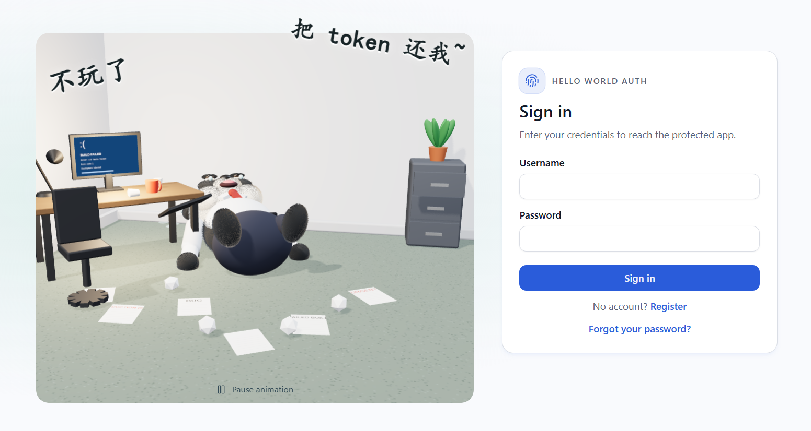
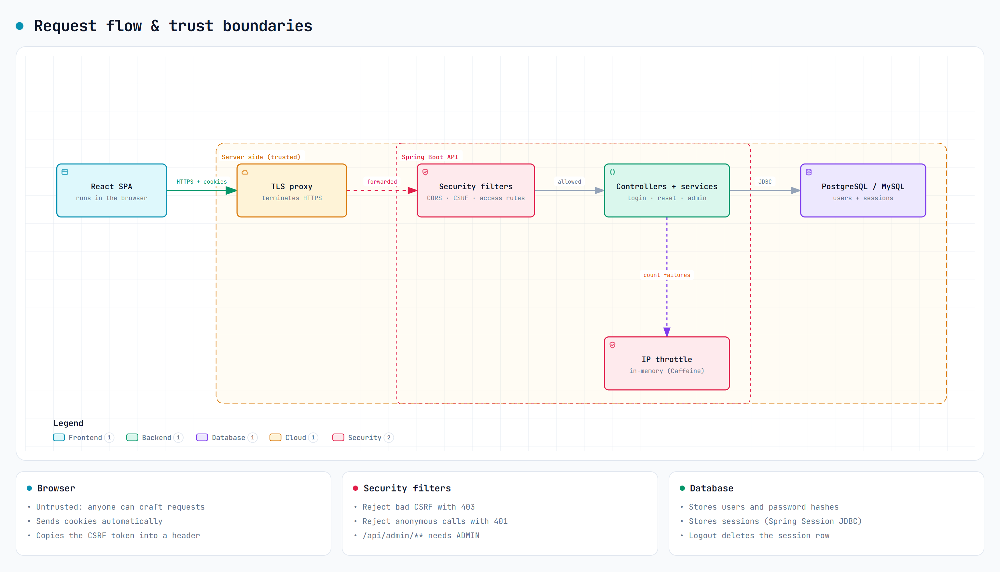
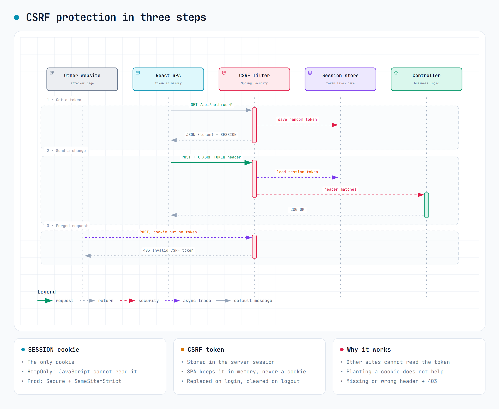
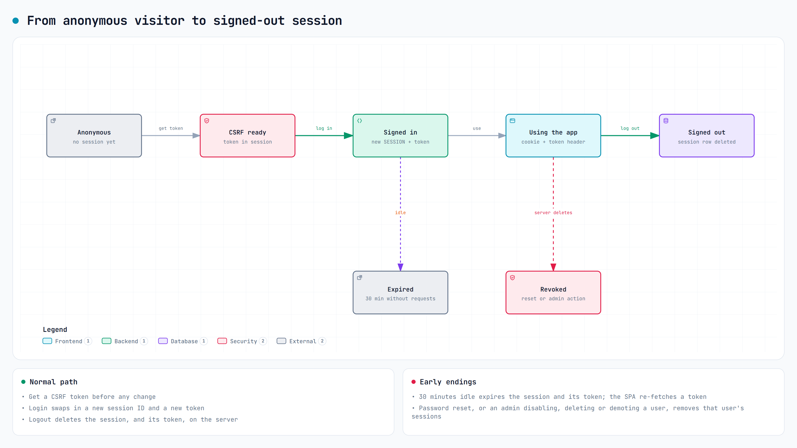
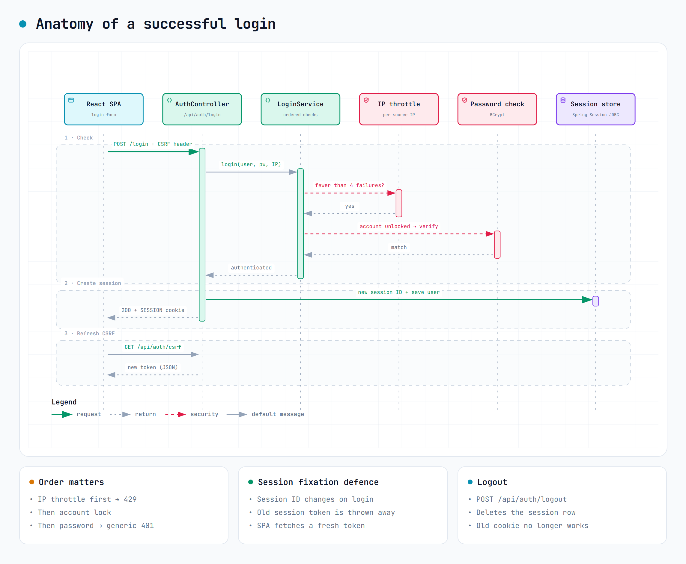
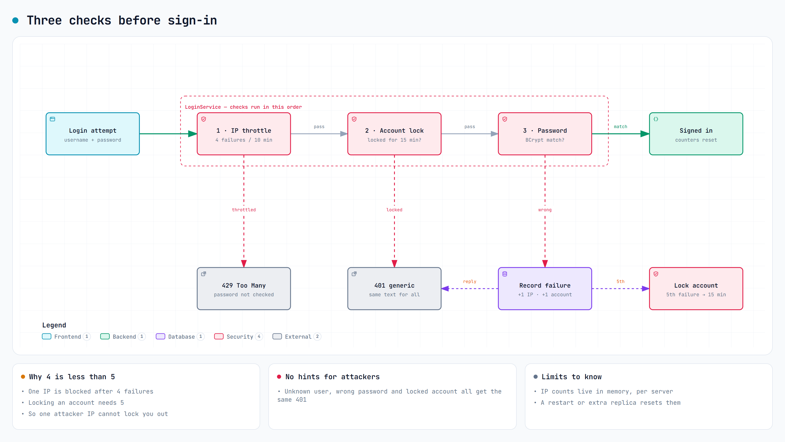
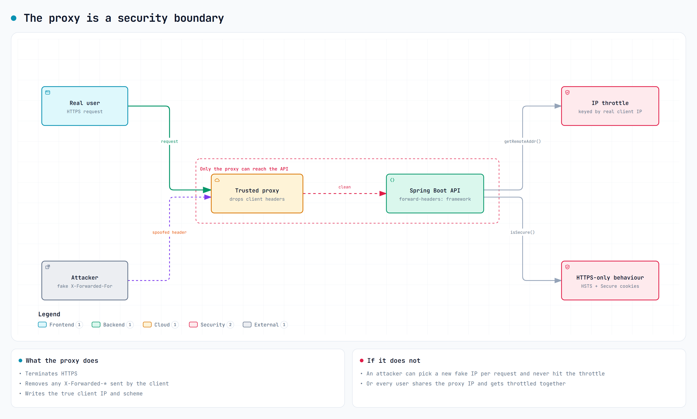
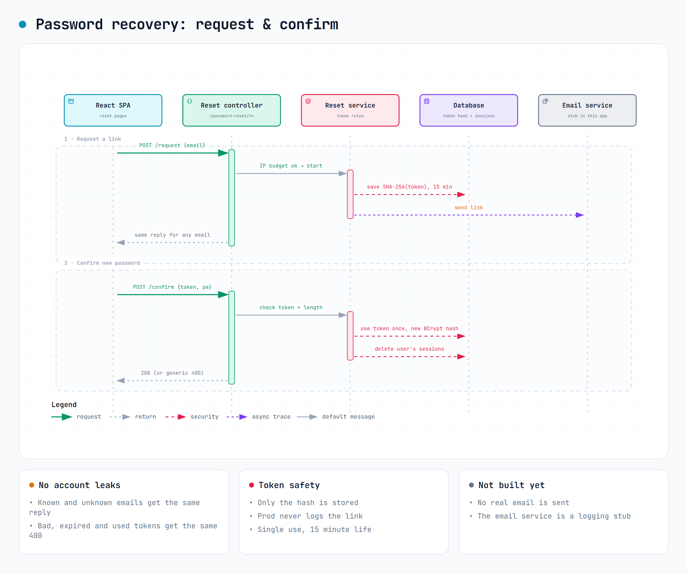

# Hello Auth security and configuration guide

This guide explains how the Hello Auth React frontend and Spring Boot backend protect sign-in, session cookies and state-changing requests. Read it before you change the security configuration, add a route or prepare a deployment.

  

[Open the illustrated reader (HTML)](artifacts/introduction/index.html) · [Configuration reference](#14-configuration-reference) · [Endpoint access reference](#15-endpoint-access-reference) · [Standards alignment](#13-standards-alignment)

| Page metadata | |
| --- | --- |
| Status | Draft |
| Content owner | To be assigned |
| Last reviewed | 27 September 2026 |
| Base revision | `01efc8ed1560e409ba66a89ff835391ac6c4e101` |

## Contents

1. [Introduction](#1-introduction)
2. [System architecture](#2-system-architecture)
3. [Security filter chain](#3-security-filter-chain)
4. [Access control](#4-access-control)
5. [Sessions and CSRF protection](#5-sessions-and-csrf-protection)
6. [Login and brute-force protection](#6-login-and-brute-force-protection)
7. [Configuration profiles and precedence](#7-configuration-profiles-and-precedence)
8. [Startup validation](#8-startup-validation)
9. [Reverse proxy trust](#9-reverse-proxy-trust)
10. [HTTP response headers](#10-http-response-headers)
11. [Password recovery](#11-password-recovery)
12. [Open items](#12-open-items)
13. [Standards alignment](#13-standards-alignment)
14. [Configuration reference](#14-configuration-reference)
15. [Endpoint access reference](#15-endpoint-access-reference)
16. [Technology stack](#16-technology-stack)
17. [Glossary](#17-glossary)
18. [Review coverage and limits](#18-review-coverage-and-limits)
19. [Next steps](#19-next-steps)
20. [Maintaining this guide](#20-maintaining-this-guide)

---

## 1. Introduction

Hello Auth is a single-page application (SPA) with a session-based Spring Boot API. The API authenticates users with a username and password, stores sessions in the database, and protects every state-changing request with a cross-site request forgery (CSRF) token.

This guide describes the security controls in the code, the assumptions they make about the deployment, and the rules to keep when you change them.

### Scope

This guide is an introduction, not a full security audit. The review started from `SecurityConfig.java` and `application-prod.yml` and followed the code they drive. It covered the current working tree, including uncommitted changes, on top of the base revision listed above.

Official standards and guidance were checked online. No production system was exercised. The standards mappings are assessments, not certifications.

### Evidence labels

Each section labels its findings so that you can tell confirmed behaviour from assumptions.

| Label | Meaning |
| --- | --- |
| In the code | Behaviour confirmed by reading the source or configuration. |
| Deployment | Behaviour that depends on how the application is hosted. |
| Not known | Information outside the files reviewed. |
| Not verified | A likely behaviour that needs a test to confirm. |
| Watch out | A behaviour that can surprise a maintainer or weaken a control. |

Other labels, such as "Good to know", identify the topic of a point.

## 2. System architecture

The React SPA runs in the browser and sends requests with cookies to the Spring Boot API. Spring Security filters every request before it reaches a controller. Controllers and services then handle login, throttling, password reset and administration. User accounts and sessions are stored in the database.

*Figure 1. Trust boundaries between the browser, proxy, API and database.* [Open the interactive request-flow diagram (HTML)](artifacts/introduction/diagrams/trust-boundaries.html)

Text description of figure 1

The SPA sends HTTPS requests with cookies to a TLS proxy, which forwards them to the Spring Boot API. Inside the API, security filters (CORS, CSRF and access rules) run before controllers and services. Controllers count login failures in an in-memory IP throttle and use JDBC to reach the database, which stores users and sessions. The diagram labels the database PostgreSQL or MySQL; the engine in use is not known from the files reviewed.

### Main components

| Component | Responsibility |
| --- | --- |
| React SPA | Renders the interface, holds the CSRF token in memory and sends credentialed requests. |
| TLS proxy | Terminates HTTPS and forwards requests to the API. Its configuration is outside this repository. |
| `SecurityConfig` | Defines the filter chains, CORS, CSRF, headers, access rules and logout. |
| `AuthController` and `LoginService` | Authenticate the user and save the signed-in session. |
| `application-prod.yml` | Overrides the default settings when the `prod` profile is active. |
| Database | Stores users, password-reset tokens and Spring Session records. |

### What the configuration does not show

- **Not known:** the security configuration files do not describe the proxy, the database permissions or the headers set by whatever hosts the frontend. Each of these needs its own check.

### Guidance for changes

Treat the configuration as a map of the intended rules, not as evidence that the deployed system follows them. A code comment records intent; it does not prove that the running system matches it.

Source references

[SecurityConfig.java:80](<backend/src/main/java/com/example/helloauth/config/SecurityConfig.java#L80>) · [application-prod.yml:34](<backend/src/main/resources/application-prod.yml#L34>) · [AuthController.java:89](<backend/src/main/java/com/example/helloauth/auth/AuthController.java#L89>) · [api.ts:11](<frontend/src/lib/api.ts#L11>)

## 3. Security filter chain

The `HttpSecurity` calls in `SecurityConfig` do not run from top to bottom like a pipeline. Each call configures a block, and Spring Security decides where each resulting filter sits in the chain. Moving `cors()` above `headers()` in the source therefore changes nothing at runtime.

Spring Security fixes the order that matters. For example, the CSRF filter rejects a request with an invalid token before any controller runs.

### Request processing order

1. Spring Security selects the first filter chain that matches the request.
2. The security filters in that chain run, including CORS and CSRF.
3. The access rules decide whether the request is allowed.
4. The controller runs only if the request is allowed.

### Configured chains

- **In the code:** the main chain enables cross-origin resource sharing (CORS), SPA-style CSRF protection, security headers, path rules and logout.
- **In the code:** a separate chain for the H2 database console exists only in the `dev` profile and is evaluated first.
- **Good to know:** only the first matching chain handles a request.
- **In the code:** the CSRF block uses a session-backed token repository and the XOR request handler. Login, which rotates the token, and logout, which clears it, share the same repository bean.

### Guidance for changes

- Do not switch to `csrf.spa()`. That method replaces the session-backed repository with a cookie-based one.
- When you add a filter, inspect the actual filter list, for example with Spring Security debug logging, rather than inferring the order from the source.

Source references

[SecurityConfig.java:80](<backend/src/main/java/com/example/helloauth/config/SecurityConfig.java#L80>) · [SecurityConfig.java:247](<backend/src/main/java/com/example/helloauth/config/SecurityConfig.java#L247>) · [SecurityConfig.java:155](<backend/src/main/java/com/example/helloauth/config/SecurityConfig.java#L155>)

## 4. Access control

Access is decided in two places: the filter-level path rules in `SecurityConfig` and the checks inside controllers and services. A route marked `permitAll` is public at the filter level, but CSRF checks, input validation and service rules still apply to it.

### Path rules

| Path | Filter-level rule |
| --- | --- |
| `/api/auth/register`, `/api/auth/login`, `/api/auth/csrf`, `/api/auth/me` | Public |
| `/api/auth/password-reset/**` | Public (wildcard) |
| `/actuator/health` | Public |
| `/api/admin/**` | Requires the `ADMIN` role |
| ERROR dispatches | Explicitly permitted |
| Any other route | Requires a signed-in user (`authenticated()`) |

### Key points

- **In the code:** `/api/auth/me` is public at the filter level, but the controller returns 401 when no user is signed in.
- **Watch out:** `/api/auth/password-reset/**` is a wildcard. Any new endpoint added under that path becomes public automatically.
- **In the code:** `AdminService` adds its own rules. An administrator cannot change their own account. Disabling, deleting or demoting a user ends that user's sessions.
- **In the code:** the fallback rule is `authenticated()`, not `denyAll()`. Any signed-in user can reach a new route unless you give it a narrower rule.

### Guidance for changes

- When you add a route, check both the filter rules and the service rules.
- Never widen the public list to `/api/auth/**`.

Source references

[SecurityConfig.java:110](<backend/src/main/java/com/example/helloauth/config/SecurityConfig.java#L110>) · [AuthController.java:138](<backend/src/main/java/com/example/helloauth/auth/AuthController.java#L138>) · [AdminService.java:62](<backend/src/main/java/com/example/helloauth/admin/AdminService.java#L62>) · [PasswordResetController.java:19](<backend/src/main/java/com/example/helloauth/passwordreset/PasswordResetController.java#L19>) · [ApiExceptionHandler.java:86](<backend/src/main/java/com/example/helloauth/auth/ApiExceptionHandler.java#L86>)

## 5. Sessions and CSRF protection

The application uses one cookie, `SESSION`, and keeps the CSRF secret on the server. This design implements the OWASP Synchronizer Token pattern.

### Session cookie

`SESSION` is an opaque identifier that JavaScript cannot read. It identifies anonymous sessions as well as signed-in ones.

| Setting | `prod` profile | Other profiles |
| --- | --- | --- |
| `Secure` | true | false |
| `HttpOnly` | true | true |
| `SameSite` | `Strict` | `Lax` |
| Idle timeout | 30 minutes | 30 minutes |

### How the CSRF token works

1. The SPA calls `GET /api/auth/csrf`. The API stores a random secret in the server-side session and returns an XOR-masked copy of it in JSON.
2. The SPA keeps the masked token in memory and sends it in the `X-XSRF-TOKEN` header on every state-changing request.
3. Spring Security unmasks the header value and compares it with the stored secret.
4. A request with a missing or wrong token receives 403 "Invalid CSRF token".

The browser's same-origin rules stop untrusted origins from reading the token. Cross-site scripting (XSS) or an overly permissive CORS policy can defeat that protection.

*Figure 2. The CSRF token is fetched from the session, held in memory and sent in a header.* [Open the interactive CSRF token diagram (HTML)](artifacts/introduction/diagrams/csrf-cookies.html)

Text description of figure 2

First, the SPA calls `GET /api/auth/csrf`. The CSRF filter saves a random token in the session store and returns it in JSON along with the `SESSION` cookie. Next, the SPA sends a change with the token in the `X-XSRF-TOKEN` header. The filter loads the session token and, when the header matches, passes the request to the controller, which returns 200. Finally, a forged request from another website carries the cookie but no token, and the filter returns 403 "Invalid CSRF token".

### Session lifecycle

*Figure 3. States of a session and its CSRF token over time.* [Open the interactive session lifecycle diagram (HTML)](artifacts/introduction/diagrams/session-lifecycle.html)

Text description of figure 3

A visitor starts anonymous, with no session. `GET /api/auth/csrf` stores a token in a session. `POST /api/auth/login` creates a new `SESSION` and token. The user then sends the cookie and token header with every change. `POST /api/auth/logout` deletes the session row. From the signed-in state, 30 minutes without requests expires the session. A password reset or administrator action revokes it on the server.

### Why the token is not stored in a cookie

The naive double-submit pattern places the CSRF token in a cookie. An attacker who can write cookies on your domain, for example from a sibling subdomain, could then plant a known value. A token held only on the server cannot be planted.

`HttpOnly` does not stop injected script from sending requests, so XSS prevention remains necessary.

### Key points

- **In the code:** an expired session loses its token. A change sent with a stale token receives 403 "Invalid CSRF token". The SPA then fetches a new token and retries once.
- **In the code:** the retry does not restore authentication, so a protected route can then return 401. `GET /api/auth/csrf` creates an anonymous session when needed.
- **Deployment:** `SameSite=Strict` blocks cross-site cookies even when CORS allows the origin and the request includes credentials. Separate HTTPS subdomains can be cross-origin but still same-site. A frontend hosted on a different site will not work with this cookie policy.

### Guidance for changes

- Keep the CSRF token out of cookies, `localStorage` and URLs.
- Test HTTPS, `SameSite` and credentialed CORS together. The `SESSION` cookie needs to reach the API in every combination you deploy.

Source references

[SecurityConfig.java:247](<backend/src/main/java/com/example/helloauth/config/SecurityConfig.java#L247>) · [SecurityConfig.java:288](<backend/src/main/java/com/example/helloauth/config/SecurityConfig.java#L288>) · [application.yml:1](<backend/src/main/resources/application.yml#L1>) · [api.ts:11](<frontend/src/lib/api.ts#L11>)

## 6. Login and brute-force protection

`AuthController` creates the signed-in session. It passes the username and password to `LoginService`, which runs three checks in order.

1. **IP throttle:** the client IP must have fewer than 4 recent failures.
2. **Account lock:** the account must not be locked.
3. **Password:** the BCrypt password hash must match.

If all three checks pass, the controller gives the session a new ID, saves the signed-in user to the session store and returns 200. The SPA then fetches a fresh CSRF token.

*Figure 4. The steps of one successful login.* [Open the interactive login diagram (HTML)](artifacts/introduction/diagrams/login.html)

Text description of figure 4

The SPA posts to `/api/auth/login` with the CSRF header. `AuthController` calls `LoginService`, which confirms the IP has fewer than 4 recent failures, confirms the account is unlocked and verifies the BCrypt password. The controller then saves a new session ID and the user to the session store, and returns 200 with the `SESSION` cookie. The SPA requests a new token from `GET /api/auth/csrf`.

### Session fixation protection

The new session ID prevents session fixation, an attack in which someone plants a known session ID in the victim's browser before the victim signs in.

### Failure responses

| Condition | Response |
| --- | --- |
| IP throttled | 429; the password is not checked |
| Wrong password, unknown user or locked account | The same generic 401 |
| Missing or wrong CSRF token | 403 |
| Signed-in user without the `ADMIN` role on an admin route | Access denied |

### Throttling and lockout

*Figure 5. The controls that limit password guessing.* [Open the interactive rate-limit diagram (HTML)](artifacts/introduction/diagrams/rate-limit.html)

Text description of figure 5

A login attempt passes the IP throttle, the account lock and the password check in that order. A throttled IP receives 429, and the password is not checked. A locked account receives the generic 401. A wrong password records a failure against both the IP and the account, returns the same 401, and locks the account for 15 minutes on the fifth failure. Because an IP is blocked after 4 failures, one attacker IP cannot lock an account on its own.

A wrong password records a failure against both the IP address and the account. The fifth account failure locks the account for 15 minutes. Because the IP limit (4) is lower than the account limit (5), a single IP address cannot lock an account on its own. Section 9 describes the limits of this guarantee.

### Logout

`POST /api/auth/logout` deletes the session on the server. The SPA clears its own state even if that call fails, so the server session can survive until it expires.

### Guidance for changes

- Keep the session ID change before the step that saves the authentication.
- Hiding the interface does not sign the user out. Only the server call ends the session.

Source references

[AuthController.java:89](<backend/src/main/java/com/example/helloauth/auth/AuthController.java#L89>) · [LoginService.java:80](<backend/src/main/java/com/example/helloauth/auth/LoginService.java#L80>) · [SecurityConfig.java:223](<backend/src/main/java/com/example/helloauth/config/SecurityConfig.java#L223>) · [SecurityConfig.java:201](<backend/src/main/java/com/example/helloauth/config/SecurityConfig.java#L201>) · [SecurityConfig.java:133](<backend/src/main/java/com/example/helloauth/config/SecurityConfig.java#L133>) · [auth-context.tsx:80](<frontend/src/auth/auth-context.tsx#L80>) · [HelloController.java:16](<backend/src/main/java/com/example/helloauth/HelloController.java#L16>) · [ApiExceptionHandler.java:86](<backend/src/main/java/com/example/helloauth/auth/ApiExceptionHandler.java#L86>)

## 7. Configuration profiles and precedence

The backend resolves settings in layers. Each later source overrides the earlier ones.

1. `application.yml` provides the base settings.
2. `application-prod.yml` overrides them when the `prod` profile is active.
3. Environment variables and command-line arguments override both files.
4. Spring binds and validates the result, then starts the application.

The frontend works differently. `VITE_API_BASE` is fixed when you build the SPA, so changing it later on the server has no effect.

### What the `prod` profile changes

- **In the code:** `prod` turns off the H2 console and the embedded database, lets Liquibase manage the schema and sets Hibernate to validate the schema only.
- **Watch out:** the `dev` profile enables the H2 console chain; the absence of `prod` does not. If `dev` and `prod` are active together, the H2 chain is still present. Pin the profile list in the deployment.
- **Not known:** the files reviewed do not show the actual deployment overrides, the database engine, the Transport Layer Security (TLS) setup or the frontend hosting.

### Guidance for changes

- Review the effective configuration, including the list of active profiles.
- Keep credentials out of source code, screenshots and logs.

Source references

[application.yml:1](<backend/src/main/resources/application.yml#L1>) · [application-prod.yml:34](<backend/src/main/resources/application-prod.yml#L34>) · [AppProperties.java:12](<backend/src/main/java/com/example/helloauth/config/AppProperties.java#L12>) · [HelloAuthApplication.java:8](<backend/src/main/java/com/example/helloauth/HelloAuthApplication.java#L8>) · [api.ts:11](<frontend/src/lib/api.ts#L11>) · [SecurityConfig.java:155](<backend/src/main/java/com/example/helloauth/config/SecurityConfig.java#L155>)

## 8. Startup validation

Not every missing setting stops the application from starting. A missing value has one of three outcomes: startup fails, a feature does not work, or nothing checks the value.

### Settings that stop startup

| Validator | Rejects |
| --- | --- |
| `ProdAdminCredentialsValidator` | A blank admin username or password, or a password shorter than `app.password-min-length` (12 by default). |
| `SecurityTunablesValidator` | An IP failure limit that is not lower than the account lockout limit. |

### Settings that fail later or are not checked

- **Database:** `DB_URL`, `DB_USERNAME` and `DB_PASSWORD` have no defaults, and no validator checks them. A bad value fails when the application first connects, and the error depends on which value is wrong.
- **CORS origins:** an empty `APP_CORS_ALLOWED_ORIGINS` makes the CORS policy reject cross-origin browser requests. Same-origin access still works, so this setting is not a firewall.
- **Reset link base URL:** an empty `APP_RESET_LINK_BASE_URL` neither stops startup nor disables password reset.
- **Watch out:** the seeder creates the admin account only if no admin exists yet. Changing `APP_ADMIN_PASSWORD` later does not change an existing admin's password.

### Guidance for changes

Keep the three outcomes distinct when you document or test a setting. Consider adding validation for production URLs.

Source references

[ProdAdminCredentialsValidator.java:25](<backend/src/main/java/com/example/helloauth/config/ProdAdminCredentialsValidator.java#L25>) · [SecurityTunablesValidator.java:22](<backend/src/main/java/com/example/helloauth/config/SecurityTunablesValidator.java#L22>) · [application-prod.yml:34](<backend/src/main/resources/application-prod.yml#L34>) · [AdminSeeder.java:54](<backend/src/main/java/com/example/helloauth/admin/AdminSeeder.java#L54>) · [EmailService.java:39](<backend/src/main/java/com/example/helloauth/passwordreset/EmailService.java#L39>) · [ProdProfileTests.java:29](<backend/src/test/java/com/example/helloauth/ProdProfileTests.java#L29>) · [StartupConfigValidationTests.java:34](<backend/src/test/java/com/example/helloauth/StartupConfigValidationTests.java#L34>)

## 9. Reverse proxy trust

In the `prod` profile, the API trusts the `Forwarded` and `X-Forwarded-*` headers. These headers tell the API whether the original request used HTTPS and which IP address the client used.

Two controls depend on these values. The IP throttle uses the client address, and HTTPS-only behaviour, such as HTTP Strict Transport Security (HSTS) and `Secure` cookies, depends on the detected scheme. The proxy therefore needs to remove any forwarding headers sent by the client and write the real values.

*Figure 6. Why the API depends on a trusted proxy.* [Open the interactive proxy trust diagram (HTML)](artifacts/introduction/diagrams/proxy-trust.html)

Text description of figure 6

A real user and an attacker who sends a fake `X-Forwarded-For` header both reach the trusted proxy. The proxy terminates HTTPS, drops client-sent forwarding headers, writes the true client IP and scheme, and forwards a clean request to the Spring Boot API. The API passes `getRemoteAddr()` to the IP throttle and `isSecure()` to HSTS and `Secure` cookies. Only the proxy can reach the API. Without this arrangement, an attacker can use a new fake IP for each request and never reach the throttle limit. Alternatively, every user shares the proxy's IP and is throttled together.

### Rate-limit behaviour

| Budget | Default limit | Effect |
| --- | --- | --- |
| Login failures per IP | 4 | Further logins from that IP receive 429. |
| Login failures per account | 5 | The account is locked for 15 minutes. |
| Registration and reset requests per IP | 20 | Shared budget across both endpoints. |

Counters reset after a gap of more than 10 minutes between recorded failures. This is not a precise rolling window.

### Limits

- **Deployment:** only the proxy should be able to reach the API. The YAML setting does not check where the headers came from.
- **In the code:** each server keeps IP counts in memory. A restart or a second replica resets them.
- **In the code:** a known race condition affects concurrent requests. Do not treat the 4 < 5 rule as a cluster-wide guarantee.

### Guidance for changes

Treat proxy trust and rate-limit storage as deployment decisions. Test with multiple instances before you promise limits across the whole system.

Source references

[application-prod.yml:34](<backend/src/main/resources/application-prod.yml#L34>) · [IpThrottleService.java:54](<backend/src/main/java/com/example/helloauth/auth/IpThrottleService.java#L54>) · [LoginService.java:80](<backend/src/main/java/com/example/helloauth/auth/LoginService.java#L80>) · [SecurityTunablesValidator.java:22](<backend/src/main/java/com/example/helloauth/config/SecurityTunablesValidator.java#L22>) · [application.yml:1](<backend/src/main/resources/application.yml#L1>)

## 10. HTTP response headers

The API sends a strict Content Security Policy (CSP), a referrer policy and a permissions policy. These headers apply only to the API's own responses.

The React app is a separate document, and whatever serves it sets its headers. That host needs its own policy. The reset page matters most, because its URL contains the reset token.

### Key points

- **In the code:** the API CSP is `default-src 'none'; frame-ancestors 'none'`. This is a strong default for a JSON API, but it does not replace XSS protection in the frontend.
- **Good to know:** `strict-origin-when-cross-origin` hides the path and query from other sites. Same-origin requests still receive the full URL, including the token.

### Guidance for changes

Check the API headers, the frontend page headers and the proxy behaviour separately.

Source references

[SecurityConfig.java:103](<backend/src/main/java/com/example/helloauth/config/SecurityConfig.java#L103>) · [EmailService.java:39](<backend/src/main/java/com/example/helloauth/passwordreset/EmailService.java#L39>)

## 11. Password recovery

The reset request returns the same reply whether or not the email address exists. This makes it harder to discover accounts from the response text. Equal response timing has not been established.

The application has no real email sender yet. `EmailService` is a stub that writes to the log, and in `prod` it does not log the reset link. A "link sent" message in production therefore does not mean an email was sent.

*Figure 7. The two stages of a password reset: request a link, then confirm.* [Open the interactive password reset diagram (HTML)](artifacts/introduction/diagrams/password-reset.html)

Text description of figure 7

To request a link, the SPA posts an email address. The reset controller checks the IP budget, and the reset service saves a SHA-256 hash of the token with a 15-minute expiry. The service then asks the email stub to send the link, and the controller returns the same reply for any email address. To confirm, the SPA posts the token and new password. The service checks the token and password length, uses the token once, saves the new BCrypt hash and deletes the user's sessions. The controller returns 200, or a generic 400.

### Token handling

- **In the code:** the token uses 32 random bytes. Only its SHA-256 hash is stored, and it expires after 15 minutes.
- **In the code:** on confirmation, the service validates the token and password length, atomically claims the unused token, saves the new BCrypt hash and deletes the user's sessions.

### Known gaps

- **Watch out:** `prod` hides the token, but the stub still logs the recipient's email address. A log without tokens can still contain personal data.
- **Not verified:** `@Transactional` covers the reset service, but Spring Session JDBC documents `REQUIRES_NEW` for session operations, and no transaction override was found. Sharing a database therefore does not make the password and token changes atomic with the session deletions. Rollback behaviour needs testing; see the session persistence row in [standards alignment](#13-standards-alignment).

### Guidance for changes

- Never enable token logging to work around the missing email sender.
- Keep token consumption and the password update in one transaction.
- Keep session invalidation, and verify how its separate transaction behaves.

Source references

[EmailService.java:39](<backend/src/main/java/com/example/helloauth/passwordreset/EmailService.java#L39>) · [PasswordResetService.java:109](<backend/src/main/java/com/example/helloauth/passwordreset/PasswordResetService.java#L109>) · [PasswordResetController.java:19](<backend/src/main/java/com/example/helloauth/passwordreset/PasswordResetController.java#L19>) · [application-prod.yml:34](<backend/src/main/resources/application-prod.yml#L34>)

## 12. Open items

These items were identified in the code during the review and remain unresolved.

| Item | Current state | Section |
| --- | --- | --- |
| Email delivery | `EmailService` is a logging stub; no email is sent. | [11](#11-password-recovery) |
| Email addresses in logs | The stub logs the recipient address in every profile. | [11](#11-password-recovery) |
| Reset transaction behaviour | Session deletion runs in a separate transaction; rollback behaviour is untested. | [11](#11-password-recovery) |
| BCrypt 72-byte limit | Registration and reset DTOs accept 128 characters without enforcing the limit. | [13](#13-standards-alignment) |

## 13. Standards alignment

Official sources were checked online on 27 September 2026 and compared with the current working tree. OWASP cheat sheets are recommendations, RFCs and web specifications define protocols, and Spring documentation describes framework behaviour.

A mapping in these tables does not establish full compliance or production security. Values such as 12 characters, 30 minutes and 4/5 failures are choices made by this application.

### Sessions, CSRF and CORS

| Control | Reference | Implementation and assessment |
| --- | --- | --- |
| CSRF | [OWASP Synchronizer Token pattern](https://cheatsheetseries.owasp.org/cheatsheets/Cross-Site_Request_Forgery_Prevention_Cheat_Sheet.html#synchronizer-token-pattern) | `SecurityConfig.csrfTokenRepository()` uses `HttpSessionCsrfTokenRepository`. `/api/auth/csrf` returns a token representation, and `api.ts` holds it in memory and sends `X-XSRF-TOKEN`. This implements the stateful synchronizer pattern. OWASP also recognises signed double-submit cookies, so not every cookie-based alternative has the naive pattern's weakness. |
| Token masking and lifecycle | [Spring Security CSRF](https://docs.spring.io/spring-security/reference/servlet/exploits/csrf.html) | `XorCsrfTokenRequestAttributeHandler` masks exposed tokens to reduce BREACH-style compression leakage, then unmasks submitted values. Masking is not encryption, and it does not rotate the stored secret per request. Authentication clears the secret, the bootstrap call obtains a new one, and logout clears it. |
| Credentialed CORS | [WHATWG Fetch: CORS protocol](https://fetch.spec.whatwg.org/#http-cors-protocol) (Living Standard) | `corsConfigurationSource()` configures explicit origins, methods and headers with `allowCredentials=true`. `api.ts` defaults to `credentials: include`. Credentialed responses require an explicit origin, not `*`. CORS does not authenticate callers, act as a firewall or override `SameSite`. |
| Cookie attributes | [RFC 6265: Secure and HttpOnly](https://www.rfc-editor.org/rfc/rfc6265.html#section-4.1.2) and [RFC 6265bis draft: SameSite](https://datatracker.ietf.org/doc/html/draft-ietf-httpbis-rfc6265bis) | Production sets `Secure`, `HttpOnly` and `SameSite=Strict`, and `sessionCookieCustomizer()` applies them to Spring Session. SameSite is defined in the revision draft, not the original RFC. Cross-origin HTTPS subdomains can be same-site. An SPA on a different site cannot use this Strict session cookie, even if CORS allows it. |
| Session fixation and expiry | [OWASP Session Management](https://cheatsheetseries.owasp.org/cheatsheets/Session_Management_Cheat_Sheet.html) | `AuthController` invokes `ChangeSessionIdAuthenticationStrategy` before saving authentication. Logout invalidates the session, and `application.yml` sets a 30-minute idle expiry. This implements ID renewal and server-side expiry and invalidation. No absolute session lifetime is configured, and 30 minutes is not a universal OWASP requirement. |
| Session persistence and transactions | [Spring Session JDBC transactions](https://docs.spring.io/spring-session/reference/configuration/jdbc.html#customizing-how-spring-session-jdbc-uses-transactions) | Reset invokes `SessionInvalidationService` inside a transactional service, but Spring documents `REQUIRES_NEW` for JDBC session operations. No transaction override was found in the application source. Password and token changes are therefore not shown to be atomic with session deletions, and rollback behaviour needs verification. |

### Authorisation, passwords and recovery

| Control | Reference | Implementation and assessment |
| --- | --- | --- |
| Authorisation | [OWASP Authorization Cheat Sheet](https://cheatsheetseries.owasp.org/cheatsheets/Authorization_Cheat_Sheet.html): least privilege and checks on every request | Explicit public routes, `hasRole("ADMIN")` and the `AdminService` self-action guards implement role-based access and service restrictions. Alignment with deny-by-default guidance is partial: `authenticated()` lets any signed-in user reach new routes unless narrowed, `password-reset/**` is public, and ERROR dispatches are permitted. |
| Password storage | [OWASP Password Storage](https://cheatsheetseries.owasp.org/cheatsheets/Password_Storage_Cheat_Sheet.html#bcrypt) and [Spring BCryptPasswordEncoder](https://docs.spring.io/spring-security/reference/api/java/org/springframework/security/crypto/bcrypt/BCryptPasswordEncoder.html) | `new BCryptPasswordEncoder()` uses Spring's documented default cost of 10, which meets OWASP's minimum bcrypt cost. OWASP prefers Argon2id for new systems and reserves bcrypt for legacy use. Registration and reset data transfer objects (DTOs) permit 128 characters and do not enforce bcrypt's 72-byte limit. Verify oversized-input behaviour against the resolved library version. |
| Password policy and guessing resistance | [OWASP Authentication](https://cheatsheetseries.owasp.org/cheatsheets/Authentication_Cheat_Sheet.html) | The default minimum length of 12, IP threshold of 4, account threshold of 5 and 15-minute lockout are local choices. `LoginService` runs the throttle, account and credential checks in order, and the controller returns generic credential failures. Alignment is partial: current guidance considers passwords under 15 characters weak without multi-factor authentication (MFA), and this login has no MFA. Per-process IP state, concurrency and unverified response timing limit these guarantees. |
| Password recovery | [OWASP Forgot Password](https://cheatsheetseries.owasp.org/cheatsheets/Forgot_Password_Cheat_Sheet.html) | `PasswordResetService` uses 32 random bytes, hashed storage, a 15-minute expiry and atomic single-use consumption. The controller returns a generic message and applies an IP budget. The core token controls are present, but real email delivery is missing and uniform response timing has not been established. The reset page needs its own referrer policy to prevent token leakage. |
| Credential-safe logging | [OWASP Logging: data to exclude](https://cheatsheetseries.owasp.org/cheatsheets/Logging_Cheat_Sheet.html#data-to-exclude) | `log-reset-link=false` keeps the reset credential out of production logs. `EmailService` still logs the email address. This aligns with excluding credentials on this path; it is not a complete logging or privacy assessment. |

### Response headers

| Control | Reference | Implementation and assessment |
| --- | --- | --- |
| CSP and framing | [W3C CSP Level 3](https://www.w3.org/TR/CSP3/) (Working Draft) and [RFC 7034: X-Frame-Options](https://www.rfc-editor.org/rfc/rfc7034.html) (Informational) | The main chain sets `default-src 'none'; frame-ancestors 'none'` and keeps Spring's default `X-Frame-Options: DENY`. `frame-ancestors` needs its own directive because it does not inherit from `default-src`. The dev H2 chain uses `SAMEORIGIN`. The API policy does not protect a separately hosted SPA document. |
| Referrer disclosure | [W3C Referrer Policy](https://www.w3.org/TR/referrer-policy/#referrer-policy-strict-origin-when-cross-origin) | `strict-origin-when-cross-origin` limits cross-origin referrers to the origin and suppresses referrers on HTTPS-to-HTTP downgrades. It can keep the path and query for same-origin requests. This API header does not set the reset page's policy. |
| Browser features | [W3C Permissions Policy](https://www.w3.org/TR/permissions-policy/) (draft) | `camera=(), microphone=(), geolocation=()` uses empty allow-lists to disable these features in applicable document contexts. Browser support varies. Headers on JSON API responses do not configure the separate frontend document. |
| HSTS | [RFC 6797](https://www.rfc-editor.org/rfc/rfc6797.html) and [Spring security headers](https://docs.spring.io/spring-security/reference/servlet/exploits/headers.html) | The main chain keeps Spring's default HSTS writer for secure requests, and production header forwarding affects the detected scheme. HSTS tells browsers to use HTTPS after a secure first contact. This configuration does not terminate TLS or enrol the site for preload. Proxy trust and the actual headers need verification in the deployment. |
| Caching and MIME sniffing | [RFC 9111: no-store](https://www.rfc-editor.org/rfc/rfc9111.html#section-5.2.2.5), [WHATWG Fetch: nosniff](https://fetch.spec.whatwg.org/#x-content-type-options-header) and [Spring default headers](https://docs.spring.io/spring-security/reference/servlet/exploits/headers.html) | The main chain keeps the default cache restrictions and `X-Content-Type-Options: nosniff` unless overridden. Spring's `X-XSS-Protection: 0` disables a legacy browser filter; it is not an XSS prevention standard. Response headers were not measured. |

### Deployment and error handling

| Control | Reference | Implementation and assessment |
| --- | --- | --- |
| Proxy metadata | [RFC 7239: Forwarded](https://www.rfc-editor.org/rfc/rfc7239.html) and [Spring forwarded-header handling](https://docs.spring.io/spring-framework/reference/web/webmvc/filters.html#filters-forwarded-headers) | `forward-headers-strategy=framework` processes `Forwarded` and the conventional `X-Forwarded-*` headers, and throttling uses `getRemoteAddr()`. RFC 7239 does not standardise `X-Forwarded-*` or authenticate these claims. For the values to be reliable, a trusted boundary proxy needs to strip incoming values, and direct access to the backend needs to be blocked. |
| Structured errors | [RFC 9457: Problem Details](https://www.rfc-editor.org/rfc/rfc9457.html), which obsoletes RFC 7807 | The CSRF handler emits `application/problem+json` with `type`, `title`, `status` and `detail`. It departs from the RFC, which says an `about:blank` problem SHOULD use the status phrase (`Forbidden`) as its title; the SPA instead recognises the title `Invalid CSRF token`. A distinct problem type would express CSRF failures more clearly. Other denials do not need to use this body. |
| Profiles and startup checks | [Spring Boot externalized configuration](https://docs.spring.io/spring-boot/reference/features/external-config.html) | Production disables H2 and the embedded database fallback, uses Liquibase with Hibernate validation, and externalises credentials. Validators enforce admin presence, minimum password length and threshold ordering. These are Spring mechanisms and local hardening decisions, not a named security certification. Overrides and simultaneous `dev` and `prod` profiles remain possible. |

## 14. Configuration reference

| Setting | Shipped value or contract | Failure mode or limitation |
| --- | --- | --- |
| Active profiles | Production expects `prod`; `dev` is separate. | Nothing stops `dev` and `prod` from being active together. |
| `DB_URL`, `DB_USERNAME`, `DB_PASSWORD` | Required in `prod`; no defaults. | Not validated; a bad value fails when the application connects. |
| `APP_ADMIN_USERNAME`, `APP_ADMIN_PASSWORD` | Blank by default in `prod`. | Startup rejects blank values and passwords shorter than `app.password-min-length` (default 12). |
| `APP_ADMIN_EMAIL` | Defaults to `admin@localhost`. | The seeder skips the admin if the name or email is already taken. |
| `APP_CORS_ALLOWED_ORIGINS` | Blank in `prod`. | When blank, cross-origin browser requests are rejected; same-origin access still works. |
| `APP_RESET_LINK_BASE_URL` | Blank in `prod`. | Not validated; email sending is still a stub. |
| `app.password-reset.log-reset-link` | `false` in `prod`; `true` by default. | Keeps reset tokens out of production logs. |
| `app.ip-throttle.max-failures`, `app.lockout.max-failures` | 4 and 5. | Startup fails if the throttle limit is greater than or equal to the lockout limit. |
| `spring.session.timeout` | 30m | Idle timeout, not a maximum session length. |
| `VITE_API_BASE` | Set at frontend build time; default `http://localhost:8080`. | Rebuild the SPA to change it. |

## 15. Endpoint access reference

This table lists every application endpoint, plus logout and health. The dev-only H2 console is not listed.

State-changing requests (POST, PATCH and DELETE) need a CSRF token, including on public endpoints. A request that passes the filter rules can still be rejected by the handler.

| Method | Path | Filter-level policy | Additional conditions |
| --- | --- | --- | --- |
| POST | `/api/auth/register` | Public + CSRF | Body validated, per-IP budget, registration rules |
| POST | `/api/auth/login` | Public + CSRF | IP throttle, lock and password checks; 401 or 429 |
| GET | `/api/auth/csrf` | Public | Returns an XOR-masked copy of the session CSRF token in JSON |
| GET | `/api/auth/me` | Handler checks identity | 401 when not signed in |
| POST | `/api/auth/password-reset/request` | Public + CSRF | Body validated, per-IP budget, same reply for any email |
| POST | `/api/auth/password-reset/confirm` | Public + CSRF | Token and new-password checks |
| POST | `/api/auth/logout` | Logout filter + CSRF | Deletes the session; no controller involved |
| GET | `/api/hello` | Authenticated | Greets the signed-in user |
| GET | `/api/admin/users` | `ROLE_ADMIN` | Lists users without password hashes |
| PATCH | `/api/admin/users/{id}/status` | `ROLE_ADMIN` + CSRF | Not on your own account; disabling ends sessions |
| PATCH | `/api/admin/users/{id}/role` | `ROLE_ADMIN` + CSRF | Not on your own account; demoting ends sessions |
| DELETE | `/api/admin/users/{id}` | `ROLE_ADMIN` + CSRF | Not on your own account; removes sessions and the account |
| GET | `/actuator/health` | Public | The only exposed actuator endpoint |

## 16. Technology stack

Versions come from `backend/pom.xml` and `frontend/package-lock.json`. Versions managed by the Spring Boot bill of materials (BOM) were not resolved.

| Technology | Version evidence | Role in Hello Auth |
| --- | --- | --- |
| Java | 21 (declared target) | Backend language; the installed runtime was not checked. |
| Spring Boot | 4.1.1 (declared parent) | MVC, external configuration and auto-configuration. |
| Spring Security | BOM-managed; not verified | Filter chain, BCrypt, authentication and CSRF. |
| Spring Session JDBC | BOM-managed; not verified | Server-side session persistence, configured in `application.yml`. |
| Caffeine | BOM-managed; not verified | Process-local IP budgets in `IpThrottleService`. |
| Liquibase and Hibernate | BOM-managed; not verified | Schema migration and validation. |
| React and Vite | 19.3.0 and 8.3.0 (lockfile) | `AuthContext` UI state and the build-time API address. |

## 17. Glossary

| Term | Meaning |
| --- | --- |
| Authentication | Proving who you are, for example by signing in. |
| Authorisation | Deciding what an authenticated user is allowed to do. |
| CORS | Cross-origin resource sharing: the browser rule that decides which other origins can read API responses. It is not a login check or a firewall. |
| CSRF | Cross-site request forgery: another site causes your browser to send a request with your cookies. A validated, session-bound token mitigates it; XSS can bypass that token. |
| HttpOnly, Secure, SameSite | Cookie attributes. `HttpOnly` stops JavaScript reading the cookie. `Secure` sends it only over HTTPS. `SameSite` controls whether it is sent on cross-site requests (`Strict` in `prod`). |
| Profile | A named set of Spring settings, such as `dev` or `prod`, activated at startup. |
| Rate limiting | Capping failed attempts per IP address or per account to slow password guessing. |
| SPA | Single-page application; here, the React frontend that runs in the browser. |
| XSS | Cross-site scripting: an attacker's script runs inside your page with the user's access. |

## 18. Review coverage and limits

| Area | Coverage | Notes |
| --- | --- | --- |
| Security chain, profiles and startup validators | Inspected | Current working-tree source; the revision identifies the base HEAD. |
| Login, admin guards, password reset and cookie transport | Partial | Representative paths inspected; not a full audit. |
| Tests | Partial | `ProdProfileTests` and `StartupConfigValidationTests` were read but not run. |
| Infrastructure, live proxy, production database and frontend host headers | Not inspected | No deployment was exercised, so this guide makes no runtime security claims. |
| Other playbook topics | Not applicable | The request covered security and configuration only, not a complete nine-topic playbook. |

Representative source excerpts are in the [source evidence index (JSON)](artifacts/introduction/evidence.json). Nothing in this guide was tested against a running system.

## 19. Next steps

- **Before you change `SecurityConfig` or add a route:** reread [section 3](#3-security-filter-chain) and [section 4](#4-access-control), then update the [endpoint access reference](#15-endpoint-access-reference).
- **Before you deploy:** confirm the items this review could not check. These include proxy header handling and network access to the API, the active profile list, database settings, frontend host headers, and HTTPS, `SameSite` and CORS working together.
- **To close the open items:** see [section 12](#12-open-items).

### Further reading

Links checked on 27 September 2026.

- [Spring Security filter architecture](https://docs.spring.io/spring-security/reference/servlet/architecture.html): how filters are ordered and chains are selected.
- [Spring Security CSRF](https://docs.spring.io/spring-security/reference/servlet/exploits/csrf.html): session-stored tokens, login and logout.
- [Spring Boot externalized configuration](https://docs.spring.io/spring-boot/reference/features/external-config.html): which property source takes precedence.
- [Spring Session JDBC](https://docs.spring.io/spring-session/reference/configuration/jdbc.html): storing sessions in the database.
- [Spring Framework forwarded headers](https://docs.spring.io/spring-framework/reference/web/webmvc/filters.html#filters-forwarded-headers): why the proxy needs to remove client-sent forwarding headers.

## 20. Maintaining this guide

The illustrated reader is at `artifacts/introduction/index.html`; open it in a browser without a server.

Running `node artifacts/introduction/build.mjs` regenerates the reader and writes a Markdown edition to `introduction.md`. Chapter text comes from `artifacts/introduction/content.json`, and the standards table comes from `artifacts/introduction/standards.md`. The build does not write `README.md` or this file, so copy edits across by hand.

Diagram sources are the Archify JSON files in `artifacts/introduction/diagrams/`.
