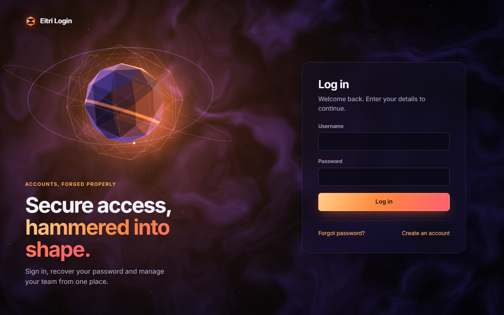
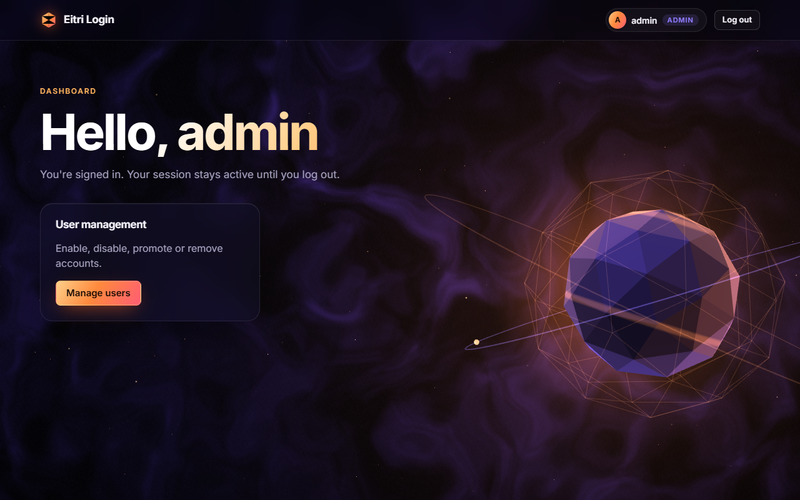
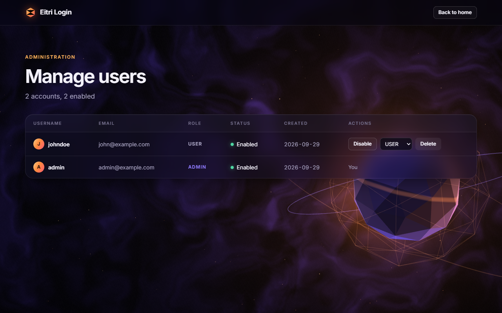
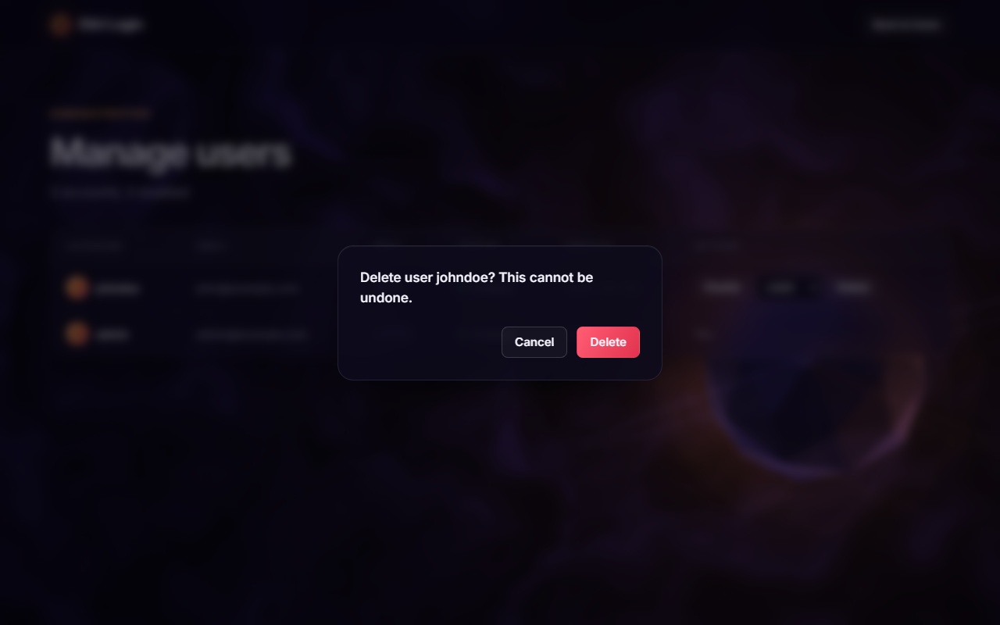
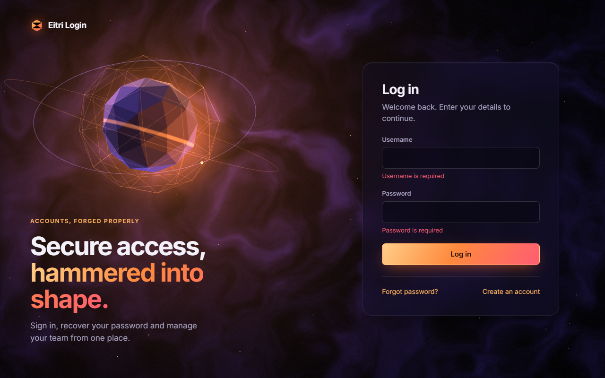

<div align="center">


<p>
  <a href="#quick-start">Quick start</a> ·
  <a href="#take-the-tour">Tour</a> ·
  <a href="#how-it-works">How it works</a> ·
  <a href="#security-you-can-observe">Security</a> ·
  <a href="#how-it-was-built">How it was built</a> ·
  <a href="#for-developers">For developers</a>
</p>

</div>

Eitri Login is a small "Hello World" login app built to a production-style security baseline. It exists to
test how well an AI coding harness (Eitri) can build a real feature set from written user stories: almost
all of the code was produced by AI agents working from the Gherkin stories in [`stories/`](stories).

You can register, log in, reset a forgotten password, and, as an admin, manage every account. Behind
that simple surface are server-side sessions, CSRF protection, account lockout, IP throttling and
an audit log. Every acceptance scenario is linked to an automated test.

> [!WARNING]
> Eitri is for local development and experimentation only. Data lives in memory, emails are
> written to the log instead of being sent, and local runs use plain HTTP. Don't deploy it.

<table>
  <tr>
    <td align="center"><br><sub>Log in</sub></td>
    <td align="center"><br><sub>Personal greeting</sub></td>
  </tr>
  <tr>
    <td align="center"><br><sub>Admin user management</sub></td>
    <td align="center"><br><sub>Confirmed deletes</sub></td>
  </tr>
</table>

## Quick start

You need **JDK 21+** and **Node.js 24+**. Maven comes bundled with the backend.

**1. Start the API** (http://localhost:8080):

```sh
cd backend
./mvnw spring-boot:run        # PowerShell: .\mvnw.cmd spring-boot:run
```

**2. Start the web app** (http://localhost:5173) in a second terminal:

```sh
cd frontend
npm install
npm run dev
```

**3. Open http://localhost:5173** and log in with one of the built-in accounts:

| Username  | Password                  | Role  | Email               |
| --------- | ------------------------- | ----- | ------------------- |
| `johndoe` | `Password123!`            | USER  | `john@example.com`  |
| `admin`   | `dev-only-admin-password` | ADMIN | `admin@example.com` |

Both accounts are recreated on every backend start, and anything you change is wiped when the
backend stops. They are local placeholders only. Outside local development there are no default
accounts (see [Configuration](#configuration)).

## Take the tour

### 1. Log in

Open `/login` and sign in as `johndoe`. A few things to try along the way:

- Submit with empty fields. You get inline errors, and no request is sent.
- Enter a wrong password. You get one generic "Invalid username or password" banner, the same one
  an unknown username gets, so the page never reveals which accounts exist.
- Start typing and the error clears straight away.

<table>
  <tr>
    <td align="center"><br><sub>Inline validation</sub></td>
    <td align="center"><br><sub>Generic failure banner</sub></td>
  </tr>
</table>

Once you're in, the landing page greets you by username. Reload the page and you stay logged in,
because the session lives on the server and the browser only holds a cookie.


### 2. Create an account

Follow **Create an account** on the login page. Pick a username, an email and a password of at least
12 characters. New accounts always get the USER role, and you're sent back to log in.


### 3. Reset a forgotten password

No real email is sent. The reset link is written to the backend terminal instead.


1. On `/forgot-password`, enter `john@example.com`.
2. In the backend terminal, find a line like this:

   ```
   ... c.e.passwordreset.LoggingEmailService : Password reset email (stub, not sent) email.reset_link="http://localhost:5173/reset-password?token=..."
   ```

3. Open that link and choose a new password.

Reset links work once and expire after 30 minutes. A successful reset logs that user out everywhere.

### 4. Manage users as an admin

Log in as `admin` and choose **Manage users**. For every other account you can:

- **Disable / Enable** it. A disabled user is refused on their very next request.
- **Change its role** between USER and ADMIN.
- **Delete** it, after confirming in a dialog.

Your own row has no actions, so an admin can't lock themselves out.

## How it works

### Architecture

The web app and the API run on separate origins. The browser calls the API directly with
credentials, and the API only accepts calls from the web app's origin.

<p align="center">
  <picture>
    <source media="(prefers-color-scheme: dark)" srcset="assets/diagrams/architecture-dark.svg">
    
  </picture>
</p>

| Part     | Stack                                                                    |
| -------- | ------------------------------------------------------------------------ |
| Frontend | React 19, TypeScript, Vite, React Router, Vitest + Testing Library        |
| Backend  | Spring Boot 4.1, Java 21, Spring Security, Spring Session JDBC, JPA       |
| Data     | H2 in memory, Flyway migrations, BCrypt password hashes                   |

### Pages and who can see them

The page redirects are for convenience. The API enforces the same rules on every request.

<p align="center">
  <picture>
    <source media="(prefers-color-scheme: dark)" srcset="assets/diagrams/pages-dark.svg">
    
  </picture>
</p>

- A logged-in user who opens a logged-out page is sent to `/`.
- A logged-out visitor who opens `/` or `/admin/users` is sent to `/login`.
- A USER who opens `/admin/users` is sent to `/`.
- Any other URL shows a "Page not found" page.

### What happens when you log in

<p align="center">
  <picture>
    <source media="(prefers-color-scheme: dark)" srcset="assets/diagrams/login-sequence-dark.svg">
    
  </picture>
</p>

The loading state on the form lasts at least 400 ms, even when the API answers faster, so the
page never flickers.

### Account lockout

<p align="center">
  <picture>
    <source media="(prefers-color-scheme: dark)" srcset="assets/diagrams/lockout-dark.svg">
    
  </picture>
</p>

Separately, 20 failed logins from one IP address within 15 minutes block that IP with `429`,
whatever usernames it tried. That throttle is checked before any password, so it can't be used to
lock someone else's account.

### Data model

<p align="center">
  <picture>
    <source media="(prefers-color-scheme: dark)" srcset="assets/diagrams/data-model-dark.svg">
    
  </picture>
</p>

Spring Session keeps logged-in sessions in `SPRING_SESSION` and `SPRING_SESSION_ATTRIBUTES`, and
Flyway records applied migrations in `flyway_schema_history`. To look inside, open the H2 console at
http://localhost:8080/h2-console with JDBC URL `jdbc:h2:mem:eitri`, user `sa` and an empty password.

### API

All endpoints are JSON under `/api/v1`. Errors always look like `{"message": "..."}`.

| Who             | Endpoints                                                                                                 |
| --------------- | --------------------------------------------------------------------------------------------------------- |
| Anyone          | `GET /csrf` · `POST /auth/login` · `POST /auth/register` · `POST /auth/password-reset/request` · `POST /auth/password-reset/confirm` · `GET /actuator/health` |
| Logged-in users | `GET /auth/me` · `GET /hello` · `POST /auth/logout`                                                       |
| Admins only     | `GET /admin/users` · `PATCH /admin/users/{id}/status` · `PATCH /admin/users/{id}/role` · `DELETE /admin/users/{id}` |

Anything else is refused. A protected endpoint called without a session returns `401` (never a
redirect), and a USER calling an admin endpoint gets `403`.

## Security you can observe

| Protection         | What you'll see                                                                                   |
| ------------------ | ------------------------------------------------------------------------------------------------- |
| Generic failures   | Wrong password, unknown user, locked and disabled accounts all get the same `401` message          |
| Account lockout    | 5 wrong passwords within 15 minutes lock the account for 15 minutes                                |
| IP throttling      | 20 failed logins from one IP within 15 minutes return `429` with `Retry-After`                     |
| Sessions           | HttpOnly `SESSION` cookie, rotated at login, ends after 15 min idle or 8 h total                   |
| One session a user | Logging in elsewhere ends your previous session                                                    |
| Live permissions   | Disabling, demoting or deleting a user takes effect on their very next request                     |
| CSRF               | Every change needs an `X-CSRF-TOKEN` header; the web app handles it for you                        |
| CORS               | Only the web app's origin may call the API with credentials; other origins get `403`               |
| Headers            | Strict `Content-Security-Policy`, `X-Frame-Options: DENY`, `nosniff`, `Permissions-Policy`, and HSTS over HTTPS |
| Passwords          | At least 12 characters, stored as BCrypt hashes only                                               |
| Audit log          | Logins, lockouts, resets and admin actions go to `backend/logs/audit.ndjson`, without passwords, tokens or emails |

<details>
<summary><b>More on sessions, CSRF, logging and proxies</b></summary>

- **Sessions.** Stored server-side with Spring Session JDBC. The cookie is HttpOnly and
  `SameSite=Lax`, and `Secure` outside local development. After login the password hash is erased
  from the session principal, so it is never written to the session tables. Each request reloads the
  account, which is why admin changes apply immediately.
- **CSRF.** A synchronizer token held in the server-side session, served by `GET /api/v1/csrf` with
  `Cache-Control: no-store`. There is no CSRF cookie. The web app fetches the token before its first
  change request, keeps it in memory, and after a `403` fetches a fresh one and retries once.
- **Cross-origin setup.** `localhost:5173` and `localhost:8080` count as the same site, so the
  `SameSite=Lax` cookie still flows. A real deployment would need both on one registrable domain
  (for example `app.example.com` and `api.example.com`) over HTTPS.
- **Audit events.** Each line is ECS JSON with `event.action` and `event.outcome`:
  `user-authentication`, `account-lockout`, `rate-limit`, `user-logout`, `session-expired`,
  `password-reset-request`, `password-reset-complete`, `user-enable`, `user-disable`,
  `user-role-change` and `user-delete`. Accounts are named by username and id. Admin actions name
  both the admin (`actor.*`) and the target (`target.*`). A login for an unknown username names no
  account, so whatever was typed never reaches the log.
- **Application logs.** Plain text locally, ECS JSON otherwise. An incoming W3C `traceparent`
  header supplies the trace ID. Only `GET /actuator/health` is exposed, with details hidden.
- **Trusted proxies.** `X-Forwarded-For` and `X-Forwarded-Proto` are honoured only from
  `server.tomcat.remoteip.internal-proxies` (loopback by default), so a client can't dodge the IP
  throttle or forge its audited address.

</details>

## How it was built

The requirements are Gherkin feature files, and the agents built the app from them:

- [`stories/assessment/assessment-prd.md`](stories/assessment/assessment-prd.md) is the product brief.
- `stories/assessment/story1.feature` to `story13.feature` turn each brief story into acceptance
  scenarios.

| Story | What it asks for                           | Where to see it                                              |
| ----- | ------------------------------------------ | ------------------------------------------------------------ |
| 1     | Register with username, email and password | `/register`                                                  |
| 2     | Log in, including the login form behaviour | `/login` as `johndoe`                                        |
| 3     | Account lockout and IP throttling          | Enter a wrong password 5 times, then the right one           |
| 4     | Log out so the session can't be reused     | **Log out** on `/`                                           |
| 5     | Personalised greeting that survives reload | "Hello, johndoe" on `/`, then reload                         |
| 6     | Request a password reset by email          | `/forgot-password`                                           |
| 7     | Set a new password with the reset link     | `/reset-password?token=...`                                  |
| 8     | Admin sees all users                       | `/admin/users` as `admin`                                    |
| 9     | Admin enables or disables users            | **Enable / Disable** on `/admin/users`                       |
| 10    | Admin changes user roles                   | Role picker on `/admin/users`                                |
| 11    | Admin deletes users                        | **Delete** on `/admin/users`                                 |
| 12    | First admin created automatically          | The `admin` account exists on every fresh start              |
| 13    | Cross-cutting security rules               | Session cookie, CSRF, CORS, security headers and audit log   |

The stories write endpoints as `/api/...`. The app serves them under `/api/v1/...`.

### Every scenario is traced to a test

Each scenario carries an ID tag such as `@story2-ac3`. A test claims a scenario by putting the ID,
qualified by the story's folder, in its name:

```ts
it('[assessment/story2-ac8] blocks blank fields without a login request', ...)   // Vitest
```

```java
@DisplayName("[assessment/story2-ac2] wrong password returns the generic 401")      // JUnit
```

<p align="center">
  <picture>
    <source media="(prefers-color-scheme: dark)" srcset="assets/diagrams/traceability-dark.svg">
    
  </picture>
</p>

Run it from `frontend/` with `npm run trace`. It currently reports **88 of 88 scenarios covered**.
The check fails when a scenario has no test, a test names an unknown ID, or a scenario's tag doesn't
match its position in the file. A scenario tagged `@wip` may stay untested.

## Configuration

Local runs need no configuration. The `dev` profile supplies everything, including the seed
accounts. Outside `dev` and `test` there are no defaults for secrets, and startup fails if they're
missing.

| Variable                                        | Purpose                                                           |
| ----------------------------------------------- | ----------------------------------------------------------------- |
| `ADMIN_USERNAME`, `ADMIN_EMAIL`, `ADMIN_PASSWORD` | First admin, created only while no admin exists                 |
| `SESSION_HASH_KEY`                              | Secret for the HMAC-SHA256 session hash used in audit logs        |
| `PASSWORD_RESET_LINK_BASE_URL`                  | Web app origin used in reset links                                |
| `VITE_API_ORIGIN`                               | API origin baked into the web app build (`npm run build` needs it) |
| `AUDIT_LOG_PATH`, `AUDIT_LOG_MAX_FILE_SIZE`, `AUDIT_LOG_MAX_HISTORY` | Audit log file, rotation size and days kept (defaults `logs/audit.ndjson`, `10MB`, `7`) |
| `APP_VERSION`, `APP_ENVIRONMENT`                | Reported as `service.version` and `service.environment` in logs   |

## For developers

<details>
<summary><b>Project layout</b></summary>

```
backend/                     Spring Boot API (Maven wrapper included)
  src/main/java/com/eitri/
    config/                  cross-cutting config: security, error handling
    auth/                    accounts, login, sessions (AccountService is its public API)
    registration/ passwordreset/ greeting/ admin/   one package per feature
  src/main/resources/
    application.yml          secure defaults
    application-dev.yml      local relaxations (H2 console, plain-text logs)
    db/migration/            Flyway schema migrations
    db/dev-migration/        seed data for the dev and test profiles
frontend/                    React web app
  src/app/routes.tsx         route table
  src/features/<feature>/    pages, components and API calls per feature
  src/shared/api/http.ts     apiFetch(): credentials and CSRF handling
  scripts/traceability.mjs   scenario-to-test check (scans the whole repo)
stories/                     Gherkin acceptance criteria
assets/                      README images (diagrams/ is generated)
docs/diagrams/               Mermaid sources and themes for the README diagrams
```

The README diagrams are SVGs rendered from `docs/diagrams/*.mmd` in a light and a dark variant, so
they follow the reader's GitHub theme. After editing a source, run `node docs/diagrams/render.mjs`
from the repository root to regenerate them.

</details>

<details>
<summary><b>Tests and checks</b></summary>

```sh
# backend/
./mvnw verify                       # unit + integration tests, 80% coverage gate, traceability
./mvnw verify -Dtrace.skip          # the same without the traceability check
./mvnw test -Dtest=FooTest          # one unit test
./mvnw -Pdependency-scan verify     # opt-in OWASP dependency scan (needs network access)

# frontend/
npm run test:coverage               # Vitest with an 80% coverage gate
npm run typecheck                   # tsc --noEmit
npm run lint                        # oxlint
npm run format:check                # Prettier
npm run audit:code                  # fallow dead-code and complexity audit
npm run trace                       # scenario-to-test traceability
```

Backend unit tests are `*Test`, integration tests are `*IT`. Frontend tests sit next to the code as
`*.test.ts(x)`. The coverage report is at `backend/target/site/jacoco/index.html`.

</details>

## Known limitations

- Data is in memory only and resets on every backend restart.
- Emails are not sent. Reset links only appear in the backend log.
- Local runs use plain HTTP. A real deployment would need HTTPS.
- The IP login throttle is held in memory, per running backend.
- The UI is dark-only; there is no light theme.
