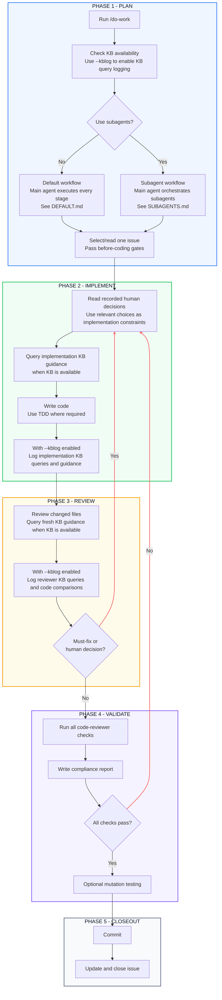

# Do Work Skill Overview

## Purpose

To apply coding best practices throughout our implementation loop while preserving the main agent’s context window through role-specific subagents, we built `/do-work` by extending Matt Pocock’s `/implement` workflow.

## How It Works

It loads task-relevant guidance from a **knowledge base** when available, and in subagent mode uses **role-specific subagents** to preserve the main agent’s context window.

It orchestrates **Plan → Implement → Review → Validate → Closeout** until must-fix findings are resolved and all quality gates pass.

The skill is split for **progressive disclosure**. Agents choose and read only the files needed for the current mode or role.

> **Note:** Pass an issue number to target a specific issue, and add `--kblog` to generate a full KB query log: `/do-work issue <number> --kblog`. See [Logs and Reports](#logs-and-reports) for details.

## Main Flow

`/do-work` supports two execution modes: [DEFAULT.md](DEFAULT.md) and [SUBAGENTS.md](SUBAGENTS.md).

In default mode, the main agent executes every workflow stage.

In subagent mode, the main agent coordinates subagents for implementation, review, and validation, preserving its context window.

Both modes follow the flow below.



## File Map

### Workflow

These files define the `/do-work` entry point and its default and subagent execution paths.

| File | Role |
| --- | --- |
| [SKILL.md](SKILL.md) | Entry point. Checks KB availability, enables the full KB query log when `--kblog` is requested, and selects the default or subagents mode. |
| [DEFAULT.md](DEFAULT.md) | Default workflow. The main agent prepares, implements, reviews, validates, commits, and closes out. |
| [SUBAGENTS.md](SUBAGENTS.md) | Subagent workflow. The main agent orchestrates implementation, review, and validation subagents, preserving its own context window. |

### Subagent Roles

In subagent mode, the main agent delegates implementation, review, and optional mutation testing to role-specific subagents, preserving its context window. Each subsection groups a role with its instructions and supporting files.

#### Implementer

| File | Role |
| --- | --- |
| [implementer/implementer.md](implementer/implementer.md) | Primary spawn instructions for the implementer subagent. Selects or resolves one issue, passes before-coding gates, implements, applies relevant prior human decisions, and fixes reviewer or validation blockers. |
| [implementer/rag.md](implementer/rag.md) | KB query rules for implementation. |
| [implementer/log.md](implementer/log.md) | Adds implementation KB queries and retrieved guidance to the full KB query log when `--kblog` is enabled. |

#### Reviewer

| File | Role |
| --- | --- |
| [reviewer/reviewer.md](reviewer/reviewer.md) | Primary spawn instructions for the reviewer subagent. Independently reviews the changed files and returns must-fix findings or human decisions. |
| [reviewer/rag.md](reviewer/rag.md) | KB query rules for review. |
| [reviewer/log.md](reviewer/log.md) | Adds review KB queries, retrieved guidance, and code comparisons to the full KB query log when `--kblog` is enabled; also records reviewer findings and human decisions. |

#### Mutation Testing

| File | Role |
| --- | --- |
| [skills/mutation-testing/SKILL.md](../mutation-testing/SKILL.md) | Optional mutation-testing skill. It runs in a dedicated subagent in subagent mode and in the main agent in default mode. |

### Common

`common/` contains helper instructions shared by both execution modes. Each mode reads only the helpers it needs for the current step.

| File | Role |
| --- | --- |
| [common/prepare-work.md](common/prepare-work.md) | Implementer helper for issue selection, source reading, and before-coding gates. |
| [common/gitignore.md](common/gitignore.md) | Checks and updates `.gitignore` before committing. |
| [common/tdd.md](common/tdd.md) | Thin wrapper around Matt Pocock's `/tdd` skill with do-work-specific seam and AFK constraints. |
| [common/kb-router.md](common/kb-router.md) | Maps framework and API evidence to KB/RAG query lanes, using planned changes during implementation and actual code changes during review—for example, `useQuery` selects the `TanStack Query` lane. |
| [common/log-state.md](common/log-state.md) | JSON source of truth for the full KB query log generated by `--kblog`, used to render the Markdown and HTML outputs. |
| [common/decision-memory.md](common/decision-memory.md) | Reuses and records human decisions. |
| [common/closeout.md](common/closeout.md) | Final issue update, tracker state, and summary steps. |
| [common/render-do-work-log.py](common/render-do-work-log.py) | Renders JSON logs into Markdown comments and local HTML. |

### Adjacent Skills

`/do-work` calls nearby skills for KB retrieval, review, and committing instead of duplicating their instructions.

| Skill | Used for |
| --- | --- |
| [skills/query-kb/SKILL.md](../query-kb/SKILL.md) | AWS Bedrock KB retrieval for implementer and reviewer RAG. |
| [skills/code-reviewer/SKILL.md](../code-reviewer/SKILL.md) | Quality, security, framework, and compliance review. |
| [skills/git-commit-skill/SKILL.md](../git-commit-skill/SKILL.md) | Final commit guidelines. |

## Workflow Details

### Query KB

#### Query interface

The [query-kb skill](../query-kb/SKILL.md) accepts these forms:

```text
/query-kb QUERY
/query-kb QUERY --id KB_ID
/query-kb QUERY --tag KEY=VALUE
/query-kb --check
```

KB selection follows this order:

| Priority | Configuration source | KB selection | Used when |
| --- | --- | --- | --- |
| 1 | Explicit KB ID or tag selector | `--id KB_ID` or `--tag KEY=VALUE` | An explicit selector is passed. |
| 2 | KB tag environment variables | `BEDROCK_KB_TAG_KEY` and `BEDROCK_KB_TAG_VALUE` | No selector is passed. |
| 3 | Built-in default tag | `nonchunk-kb=true` | No selector or environment variables are provided. |

A tag must identify exactly one knowledge base.

To configure the tag used when no selector is passed, export the environment variables before starting the coding agent:

```bash
export BEDROCK_KB_TAG_KEY="your-tag-key"
export BEDROCK_KB_TAG_VALUE="your-tag-value"
export AWS_REGION="your-aws-region"
```

`AWS_REGION` controls the region and defaults to `us-east-1`.

Arguments are passed through to the underlying Python script `query-bedrock-kb.py`.

#### Use in `/do-work`

`/do-work` starts by running `/query-kb --check` to check KB availability. If retrieval is unavailable, the workflow continues without KB queries.

When AWS Bedrock KB retrieval is available, the implementer queries guidance from the code it expects to change, and the reviewer makes fresh queries from the resulting changes.

---

### Human Decision Loop

Reviewer findings can include `Human Decision Needed` when the correct fix depends on product, architecture, or team preference.

`/do-work` checks [common/decision-memory.md](common/decision-memory.md) first. If no prior decision applies, it uses grilling, records the answer in `docs/agents/reviewer-decisions.md`, and routes the chosen action with the next correction pass.

Prior human decisions are passed back into implementation as approach constraints, not new feature scope.

---

### Logs And Reports

`/do-work` records reviewer findings and human decisions by default. When KB retrieval is available, pass `--kblog` to generate a full KB query log containing implementation and review queries, retrieved guidance, and code comparisons. When `--kblog` is enabled or the reviewer records KB-backed findings or human decisions, `/do-work` posts or updates a GitHub issue comment. The comment presents the evidence in collapsed, per-round tables, while the local HTML report provides the complete run view.

Do-work logs are stored as JSON under `artifacts/do-work/json/`. The renderer writes GitHub Markdown comments under `artifacts/do-work/md/` and a local HTML report under `artifacts/do-work/`. Code-reviewer writes a separate compliance report under `artifacts/code-reviewer/` using the same issue filename slug.

| Path | Purpose |
| --- | --- |
| `artifacts/do-work/json/` | Source log state. |
| `artifacts/do-work/md/` | GitHub issue comment bodies. |
| `artifacts/do-work/*.html` | Local human-readable do-work reports. |
| `artifacts/code-reviewer/<issue-number>-<issue-slug>-compliance.html` | Code-reviewer compliance reports. |

## Adapt to Your Stack

The defaults target TypeScript/React and Java/Spring Boot/Maven. For another stack, update only the parts that apply:

| File | What to change |
| --- | --- |
| [skills/build-check/SKILL.md](../build-check/SKILL.md) | Add the stack's format, compile or type-check, test, coverage, and build commands. |
| [skills/code-reviewer/SKILL.md](../code-reviewer/SKILL.md) | In `Registered Checks`, remove reviewers you do not use and add review skills for the new framework. |
| [common/kb-router.md](common/kb-router.md) | Add the stack's guides to the AWS Bedrock KB, then map its files and APIs to matching query prefixes. |
| [common/gitignore.md](common/gitignore.md) | Under `Patterns by Technology`, add files and folders the stack should ignore. |
| [mutation-testing/references/tool-adapters.md](../mutation-testing/references/tool-adapters.md) | Optional: if the stack uses an unsupported mutation tool, add how to run it. |
