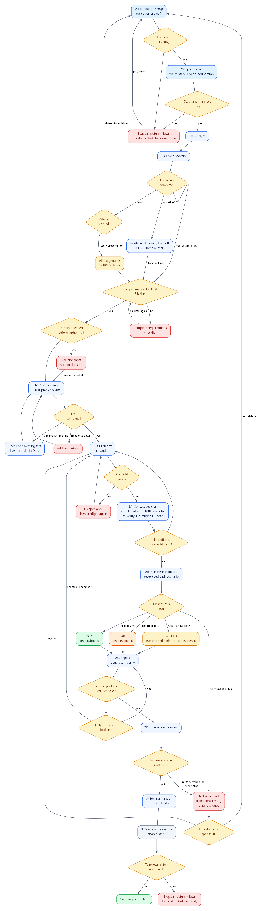

# Story E2E campaign workflow

This is the plain-English overview. The agent follows `SKILL.md` for the exact rules.

## 0. Foundation setup — once per project

Make the test environment trustworthy before testing a feature: a safe reset, working test accounts, browser setup, and one small smoke test. A story campaign uses this foundation; it does not repair it.

At the start of **every** campaign, warm the app stack and verify the frozen foundation manifest. The setup is one-time; checking that it has not drifted is not.

## 1. Author preparation

### 1A. Analyze

Read the user story and split every requested user-visible outcome into the individual things a user should be able to observe. A Given/When screen check is setup, not another acceptance claim, unless the story explicitly asks for it. This becomes the private **requirements checklist** (`story-analysis.json`) used to make sure a multi-part acceptance criterion is not treated as one vague test.

### 1B. Live discovery

Use the real app to learn the actual controls, labels, and paths. Source code may help with setup, but it does not prove what the user sees.

For a story with four or more acceptance criteria, discovery ends by writing a concise, validated handoff of the live facts. A fresh author uses it for the next two phases. Smaller stories may remain in one author context.

### 1C. Author

Write the Playwright scenarios. Each test states the data, user role, visible outcome, and which acceptance criterion it proves.

Just before writing the final spec, ask one short human question only if two reasonable readings of an acceptance criterion produce different live outcomes and the story/UI cannot settle the meaning. Otherwise record any material assumption and continue.

### 1D. Preflight and handoff

Check that the tests really match the story before spending time on final evidence. The phase timer records boundaries automatically; do not edit timing files. Record the exact client context count: below 100k, the author may execute evidence; at 100k or above, freeze the story analysis and specs and hand them to a fresh executor.

## 2. Evidence execution

### 2A. Verify the handoff

Check the frozen files and preflight result. In fresh-executor mode, the executor does not rely on the author’s chat summary; in same-context mode, the author performs the campaign acceptance audit.

### 2B. Run evidence

Run the tests against a clean, controlled environment. Record trace, video, screenshots, and the real result.

### 2C. Verify the report

Generate the Allure report and check that the evidence is fresh, complete, and
opens correctly through the stable all-campaign report portal.

### 2D. Review

Compare the actual result with the acceptance criteria. A passing test is not enough unless it proves the requested user-visible outcome.

Record the report and review timing entries, then write the campaign-local `handoff.md` so the coordinator can validate the finished story without trusting a chat summary.

## 3. Teardown and restore

Tear down only the environment created for this campaign and restore the normal shared development environment.

## If something fails

### During author preparation

| Step | Problem | What happens next? |
| --- | --- | --- |
| 1C. Author | The story has two reasonable meanings that change the verdict, and neither the story nor the live app resolves it. | Ask the human one short decision question, record it, then author the spec. |
| 1B. Live discovery | The app or reusable test setup cannot be reached. | Stop this campaign. A later foundation task repairs it; do not invent a story-specific workaround. |
| 1B. Live discovery | A required story-specific precondition cannot be established. | Plan a genuine skipped scenario for that clause, continue with the remaining clauses, and capture the actual blocker during the final run. |
| 1C. Author | One required live fact is missing. | Check that fact live, record it in the spec's Data, then continue; do not redo broad discovery. |
| 1C. Author | Test details are missing. | Add them, then continue to 1D Preflight. |

### During evidence execution and cleanup

| Step | Problem | What happens next? |
| --- | --- | --- |
| 2A. Verify handoff | The frozen files or repeated preflight do not match. | Return to 1D. Do not run browser evidence. |
| 2B. Run evidence | A product surface is reachable but differs from the story. | Keep a genuine **FAIL** and continue through report and review. |
| 2B. Run evidence | A required setup cannot be established. | Keep a genuine **SKIPPED** with visible blocker evidence, then continue through report and review. |
| 2B. Run evidence | The harness or test is faulty. | Diagnose once on a disposable environment. A foundation defect returns to 0; a test/spec fix returns to 1D. |
| 2C. Report | Only report generation or serving is broken. | Fix and regenerate the report from the same fresh results. |
| 2C. Report | Evidence is stale, incomplete, or fails the evidence contract. | Return to 1D and create a fresh final-evidence run. |
| 2D. Review | The result does not actually prove every acceptance claim. | Return to 1D, strengthen the spec, and create fresh final evidence. |
| 3. Cleanup | Paired teardown cannot safely identify the process/resource. | Stop this campaign. A later foundation task investigates; never broadly kill or delete resources. |

## Ownership

| Role | Owns |
| --- | --- |
| Foundation owner | A separate later harness-maintenance task—not a third campaign agent. It owns shared setup, reset, auth helpers, and smoke tests. |
| Coordinator | Chooses the next story and independently checks the campaign-local final handoff and evidence. |
| Discoverer | For 4+ AC stories: story understanding, live discovery, and validated discovery handoff. |
| Author | Spec authoring and preflight from the discovery handoff; small stories may also do discovery. |
| Fresh executor | Used at 100k+ author context for final evidence and report verification. |
