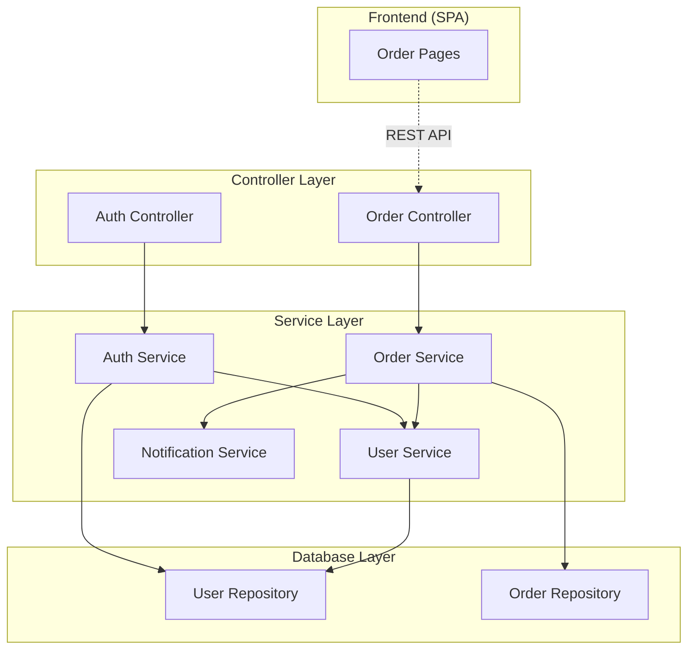

# Technical Architecture Document Generator

Deep-scans a project codebase and produces `docs/tech-architecture.md` (source) and `docs/tech-architecture.html` (styled, via `md-to-html.py`). Re-run to refresh — all data is point-in-time.

| # | Section | What it captures |
|---|---------|-----------------|
| 1 | Architecture Narrative | Module summary, interaction diagrams, execution flows |
| 2 | Software Module Catalog | Each module's purpose, public API, parameters |
| 3 | Technology Decisions | ADRs with design alternatives and rationale |
| 4 | Database Design | ER diagrams, entity definitions, major data structures |
| 5 | Dependency Inventory | All dependencies with versions and licences |
| 6 | Vulnerability Findings | Output from `/dependency-vuln-scan` |

---

## Workflow

Resolve workflow files and scripts relative to this skill directory, not the repo root.

### Step 1 — Determine Project Root

Find the nearest ancestor of cwd with a dependency manifest (`package.json`, `pom.xml`, `build.gradle`, `build.gradle.kts`) or `.git`. If none found, use cwd and warn. Output goes in `docs/` relative to project root.

### Step 2 — Deep-Scan Codebase (Sections 1 & 2)

#### 2a — Discover Feature Modules

Identify logical groupings of source files: directory-based (`auth/`, `orders/`), prefix-based (`authController.ts`, `authService.ts`), framework modules (`@Module()`, `@Configuration`), entry points (`main.*`, `index.*`), monorepo packages.

#### 2b — Extract Module Details

For each module: name, source files, public API (exported functions/methods/classes/hooks), parameters and return types.

#### 2c — Map Inter-Module Dependencies

Trace imports and function calls to determine which modules depend on each other, how they connect, and primary execution paths (request lifecycle, event flows, background processes, initialisation).

#### 2d — Generate Diagrams

1. **Module interaction diagram** (`graph TD`) — use `subgraph` blocks for layers (Controller, Service, Database). Frontend in a separate subgraph with dashed arrows (`-.->`) labelled with interface mechanism.

Example:
~~~

~~~

2. **Execution flow diagram** (`sequenceDiagram`) — how modules collaborate for a representative use case.

### Step 3 — Discover Technology Decisions (Section 3)

Smart-scan for ADRs: `docs/adr/*.md`, `adr/*.md`, `docs/decisions/*.md`, `docs/architecture/decisions/*.md`, `doc/adr/*.md`, `architecture/decisions/*.md`.

For each decision: title, status, date, at least two design choices considered (with pros/cons), the chosen option, and rationale for why it won. Map to dependencies where possible.

If no ADR documents exist, infer key decisions from the codebase (framework, database, auth approach) and document the likely alternatives and rationale.

### Step 4 — Document Database Design (Section 4)

Scan for ORM models/entities, migrations, SQL files, schema definitions (`.graphql`, `.proto`, JSON Schema), seed data. For each entity: fields, types, constraints, relationships, indexes. Generate Mermaid `erDiagram` that includes all columns with their types and key markers (PK, FK, UK) inside each entity block. Document major data structures (DTOs, API shapes, event payloads). If no database artefacts found, note absence.

### Step 5 — Extract Dependency Inventory (Section 5)

Read dependency manifests (`package.json`, `pom.xml`, `build.gradle`/`.kts`) including workspace packages for monorepos. For each: name, version, production vs dev, licence (from `node_modules/*/package.json` or Maven Central; "Unknown" if unresolvable).

### Step 6 — Run Vulnerability Scan (Section 6)

Invoke `/dependency-vuln-scan` via the Skill tool. Extract: vulnerability ID, severity, affected package, fixed version, description. If unavailable, include stub with manual scan instructions and continue.

### Step 7 — Assemble the Markdown Document

Combine all data into `docs/tech-architecture.md`:

```markdown
# Technical Architecture Document
> Generated: <ISO 8601 timestamp>
> Project: <project name from manifest or directory name>

## 1. Architecture Narrative

### 1.1 System Overview
<prose from manifest description or README>

### 1.2 Module Summary
| Module | Source Files | Description |
|--------|-------------|-------------|

### 1.3 Module Interaction Diagram
<Mermaid graph TD>

### 1.4 Module Interactions
<prose: what flows between modules, which functions bridge them, why>

### 1.5 Execution Flow
<prose: request lifecycle, event flows, background processes, initialisation>

### 1.6 Execution Flow Diagrams
<Mermaid sequenceDiagram(s)>

## 2. Software Module Catalog

#### <Module Name>
- **Source Files:** <file paths>
- **Purpose:** <one- or two-sentence description>
- **Dependencies:** <other modules>

**Module Interactions:**
<how and why this module interacts with each dependency>

| Function / Method | Parameters | Returns | Description |
|-------------------|------------|---------|-------------|

## 3. Technology Decisions

### 3.1 Decision Index
| ID | Title | Status | Date | Related Dependencies |
|----|-------|--------|------|---------------------|

### 3.2 Decision Details

#### <Decision Title>
- **Status:** <Accepted / Proposed / Superseded>
- **Date:** <date>

| Option | Description | Pros | Cons |
|--------|-------------|------|------|
| Option A | <description> | <pros> | <cons> |
| Option B | <description> | <pros> | <cons> |

**Chosen Option:** <option>
**Rationale:** <why this option was chosen over the alternatives>

## 4. Database Design

### 4.1 Entity-Relationship Diagram
<Mermaid erDiagram — include all columns with types and key markers (PK, FK, UK) inside each entity block>

### 4.2 Major Data Structures
| Structure | Type | Used By | Description |
|-----------|------|---------|-------------|

## 5. Dependency Inventory

### 5.1 Production Dependencies
| Package | Version | Licence | Purpose |
|---------|---------|---------|---------|

### 5.2 Development Dependencies
| Package | Version | Licence | Purpose |
|---------|---------|---------|---------|

### 5.3 Summary
- Total production / development dependencies
- Licence distribution

## 6. Vulnerability Findings

### 6.1 Summary
- Critical: N | High: N | Medium: N | Low: N

### 6.2 Findings
| Severity | ID | Package | Installed | Fixed | Description |
|----------|-----|---------|-----------|-------|-------------|

### 6.3 Remediation
<if scanner unavailable, manual instructions>
```

### Step 8 — Convert to HTML

```bash
python3 tech-arch-doc/md-to-html.py docs/tech-architecture.md docs/tech-architecture.html
```

Uses only Python standard library.

### Step 9 — Report Results

Print summary: output paths, module count, entity count, dependency counts, ADR count, vulnerability summary, warnings.

---

## Rules

- Output goes in `docs/` relative to project root
- Markdown is source of truth; HTML is derived
- Do not modify project source files — read-only skill
- If a scanner is unavailable, document it and continue
- `md-to-html.py` uses only Python standard library
- If a section has no artefacts, include the heading with a note explaining absence
