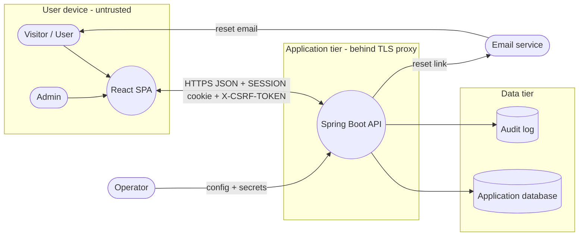
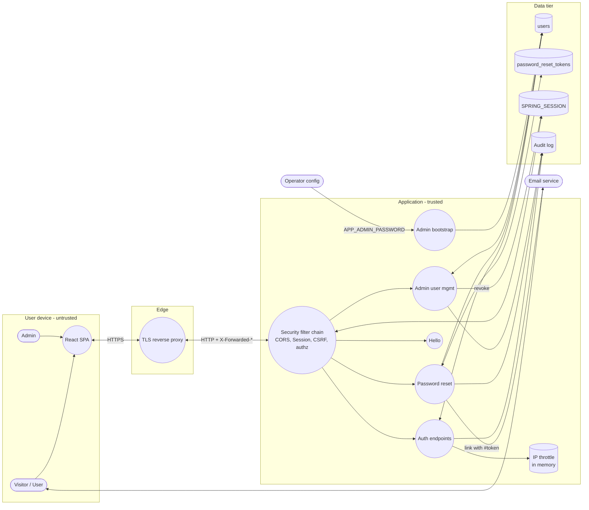

# Threat Model: Hello Auth

**Scope:** branch `seahjunsheng`. Built from [`prd/assessment-prd.md`](../../prd/assessment-prd.md), [`docs/design.md`](../design.md) and the code.
**Method:** STRIDE per element, with LINDDUN for personal data.
**Model file:** [`hello-auth.threat-model.json`](hello-auth.threat-model.json), in OWASP Threat Dragon v2 format. Open it in Threat Dragon (desktop or web) to view and edit the diagrams or export a PDF.
**Status:** first iteration, drafted with AI assistance, not yet reviewed. Revisit when the architecture changes.

**Totals:** 58 threats. 36 are mitigated and 22 are open (1 High, 7 Medium, 14 Low).

## Scope

| | |
|---|---|
| **System** | React SPA (own origin) calling a Spring Boot REST API (own origin) with CORS and credentials. Server-side sessions are stored in the database via Spring Session JDBC. |
| **Assets** | Passwords (stored as BCrypt hashes), session IDs, CSRF tokens, password reset tokens, usernames and email addresses (personal data), role and enabled flags, lockout state, audit trail, the bootstrap admin credential. |
| **External dependencies** | TLS-terminating reverse proxy, H2 (dev) or PostgreSQL (prod), an email provider (stubbed in dev), static hosting for the SPA, a log platform. |
| **Compliance** | IM8 (see `artifacts/im8-compliance-report-*.md`) and PDPA for personal data. |
| **Out of scope (PRD)** | JWT, MFA, real email delivery, containers/CI/CD/hosting, local HTTPS. |

**Trust boundaries**

1. **User device ↔ edge:** everything from the browser is untrusted. This covers the SPA, cookies and headers.
2. **Edge ↔ application:** the proxy terminates TLS, and only it may set `X-Forwarded-*`.
3. **Application ↔ data tier:** JDBC with application credentials.
4. **Application ↔ email provider:** outbound reset links leave the system.
5. **USER ↔ ADMIN privilege:** a logical boundary inside the API, enforced by URL rules and `@PreAuthorize`.

## Data flow diagrams

### Level 0: system context

### Level 1: API decomposition

## Open threats: mitigation plan

| # | Severity | Element | Threat | Planned control | Owner | Timeline |
|---|---|---|---|---|---|---|
| 9 | High | Admin | **Admin account takeover without MFA** (Spoofing). A phished or guessed admin password grants full user management. | Lockout, IP throttling, the 12-character minimum and session revocation on password reset reduce the risk. MFA / step-up for ADMIN is explicitly out of the PRD's scope (also IM8 ac-2); add TOTP or WebAuthn for admins before a real deployment. | Product owner | Before production |
| 2 | Medium | Spring Boot API | **Vulnerable third-party dependency** (Tampering). A known CVE in a Spring, Hibernate, H2, PostgreSQL driver, React or Vite dependency is exploited. | Current releases were chosen (Spring Boot 4.1.1, React 19.3, Vite 8) and npm audit reports 0 vulnerabilities. Add automated SCA (dependency-vuln-scan / Dependabot) to CI and patch on a schedule. | Platform | Before production |
| 3 | Medium | Operator → Spring Boot API | **Secrets exposed through environment configuration** (Information disclosure). DATABASE_PASSWORD and APP_ADMIN_PASSWORD are plain environment variables and can leak through process listings, orchestrator dumps or CI logs. | No secret has a default in the repository and startup fails without them. Source them from AWS Secrets Manager or Vault, restrict who can read the deployment environment, and rotate the bootstrap admin password after first start. | Platform | Before production |
| 5 | Medium | Spring Boot API | **Volumetric denial of service** (Denial of service). Floods of requests exhaust threads, database connections or CPU (every login costs a BCrypt comparison). | The app limits failed logins per IP and reset requests per IP, but has no global rate limit. Put a WAF or gateway rate limit and a request-size limit in front of the API. | Platform | Before production |
| 7 | Medium | Visitor / User | **Credential stuffing / password spraying across many IPs** (Spoofing). A botnet tries breached passwords against many accounts, staying under the per-IP limit. | Per-account lockout caps guesses per account (5 per 15 minutes) and the password minimum is 12 characters. MFA is out of the PRD's scope. Next steps: check new passwords against a breached-password list and add a gateway/WAF bot defence. | Backend | Next iteration |
| 17 | Medium | TLS reverse proxy | **Weak TLS configuration at the edge** (Information disclosure). Outdated protocols or ciphers at the proxy weaken transport security. | Out of the application's control: enforce TLS 1.2+ with modern ciphers, HTTP-to-HTTPS redirect and CA-signed certificates at the proxy. | Platform | Before production |
| 27 | Medium | Auth endpoints | **Attacker locks out a legitimate user** (Denial of service). Five wrong passwords from a single source lock the victim's account for 15 minutes (the per-IP limit is 20). | Lockout is temporary, cleared by password reset, and a throttled IP cannot extend it. Stricter option: throttle an (IP, username) pair below the lockout threshold so only several sources together can lock an account; trade-off documented in docs/design.md. | Product owner | Decide before submission |
| 50 | Medium | Audit log | **Audit log tampering or loss** (Tampering). An attacker or operator edits or deletes audit lines; logs on local stdout are lost. | Ship ECS JSON logs to an append-only central store with restricted delete rights and a retention policy. | Platform | Before production |
| 4 | Low | Spring Boot API → Email service | **Reset email read in transit or in the mailbox** (Information disclosure). Email is not end-to-end encrypted; anyone who can read the recipient's mail can use the reset link. | Accepted residual risk: the token is single-use, expires after 30 minutes, newer requests revoke older links, and the account owner can reset again. Use a provider that enforces TLS for SMTP. | Platform | With the real EmailService |
| 13 | Low | React SPA | **Clickjacking the SPA** (Tampering). The SPA is framed by a malicious site to trick clicks (for example on admin Delete). | The API sends frame-ancestors 'none' and X-Frame-Options DENY; the SPA's meta CSP cannot carry frame-ancestors. The web server hosting dist/ must send the headers configured in vite.config.ts preview. | Platform | Before production |
| 21 | Low | Security filter chain | **Session hijacking window** (Spoofing). A stolen or unattended session stays usable while it is kept active, because sessions have no absolute lifetime. | Server sessions expire after 15 minutes idle and the SPA signs out after 15 minutes without input (useIdleTimeout); the cookie is HttpOnly/Secure/SameSite=Strict; logout, password reset, disable, role change and delete revoke sessions. Remaining: add an absolute session lifetime (for example 8 hours). | Backend | Next iteration |
| 30 | Low | Auth endpoints | **Account enumeration through registration** (Information disclosure). 409 conflicts reveal that a username or email is registered. | Required by the PRD (clear conflict error). Limit it with a registration rate limit or CAPTCHA. | Backend | Next iteration |
| 31 | Low | Auth endpoints | **Automated mass registration** (Denial of service). Bots create large numbers of accounts. | No registration throttle yet. Add a per-IP limit (reuse AttemptThrottle) and bot protection at the gateway. | Backend | Next iteration |
| 33 | Low | IP throttle (in memory) | **Throttle state not shared across instances** (Tampering). With several API instances, each keeps its own counters, multiplying the per-IP allowance; a restart resets them. | Move to a shared store (Redis / Bucket4j) before running more than one instance. | Platform | When scaling out |
| 41 | Low | Admin user management | **Two admins disable or demote each other concurrently** (Denial of service). Both requests pass the self-check and succeed, leaving no enabled admin. | Recoverable without database edits (restart with unused APP_ADMIN_USERNAME/EMAIL). To close it, lock both actor and target rows in a fixed order and re-check the actor inside the transaction. | Backend | Next iteration |
| 44 | Low | Admin bootstrap | **Default or weak admin credential** (Spoofing). The bootstrap admin keeps the operator-supplied password indefinitely. | There is no default password, the policy is enforced and startup fails without one. The password is not forced to change at first login (IM8 ac-6): rotate it via password reset after first start, or add a forced-change flag. | Backend | Next iteration |
| 48 | Low | SPRING_SESSION | **Tampered session data deserialized** (Tampering). Spring Session JDBC stores attributes with Java serialization; anyone able to write SPRING_SESSION_ATTRIBUTES could plant a malicious serialized object. | Requires database write access. Keep the app's DB account least-privileged and the DB network-isolated; optionally switch Spring Session to a JSON (Jackson) serializer. | Platform | Before production |
| 53 | Low | Visitor / User → Spring Boot API | **Registration reveals whether an email is registered** (Detectability). Anyone can learn that a person has an account by trying to register their email. | Required by the PRD. Rate-limit registration; login and reset do not leak existence. | Product owner | Accepted |
| 54 | Low | Spring Boot API → Admin | **Admins see every user's email address** (Disclosure of information). The admin list returns all emails, more than most admin tasks need. | PRD Story 8 requires the email in the list. Consider masking with an explicit, audited reveal. | Product owner | Next iteration |
| 55 | Low | Audit log | **Audit records link usernames to IP addresses** (Linkability). Security logs let usernames be linked to network locations over time. | Needed for security monitoring. Define a retention period and restrict log access; emails and unknown usernames are never logged. | Platform | Before production |
| 56 | Low | Visitor / User | **No privacy notice at collection** (Unawareness). Users are not told how their email and sign-in activity are used and retained. | Add a short privacy notice on the registration page (PDPA notification). | Frontend | Before production |
| 57 | Low | users | **No retention or self-service deletion** (Non-compliance). Accounts and personal data are kept indefinitely; users cannot delete their own account. | Define retention; admins can delete accounts today. Add self-service deletion/export if required. | Product owner | Next iteration |

## All threats by diagram and element

### Level 0 - System context (STRIDE)

| # | Element | Type | Threat | Status | Severity | Mitigation / evidence |
|---|---|---|---|---|---|---|
| 1 | React SPA (browser) → Spring Boot API | Information disclosure | **Credentials or session cookie intercepted in transit**. An attacker on the network reads passwords or the SESSION cookie in transit between the browser and the API. | Mitigated | High | TLS terminated at the proxy in prod; session cookie Secure with the __Host- prefix (application-prod.yml, SessionCookieConfig); HSTS sent on HTTPS by Spring Security defaults. Local dev over HTTP is the PRD's accepted gap. |
| 2 | Spring Boot API | Tampering | **Vulnerable third-party dependency**. A known CVE in a Spring, Hibernate, H2, PostgreSQL driver, React or Vite dependency is exploited. | Open | Medium | Current releases were chosen (Spring Boot 4.1.1, React 19.3, Vite 8) and npm audit reports 0 vulnerabilities. Add automated SCA (dependency-vuln-scan / Dependabot) to CI and patch on a schedule. |
| 3 | Operator → Spring Boot API | Information disclosure | **Secrets exposed through environment configuration**. DATABASE_PASSWORD and APP_ADMIN_PASSWORD are plain environment variables and can leak through process listings, orchestrator dumps or CI logs. | Open | Medium | No secret has a default in the repository and startup fails without them. Source them from AWS Secrets Manager or Vault, restrict who can read the deployment environment, and rotate the bootstrap admin password after first start. |
| 4 | Spring Boot API → Email service | Information disclosure | **Reset email read in transit or in the mailbox**. Email is not end-to-end encrypted; anyone who can read the recipient's mail can use the reset link. | Open | Low | Accepted residual risk: the token is single-use, expires after 30 minutes, newer requests revoke older links, and the account owner can reset again. Use a provider that enforces TLS for SMTP. |
| 5 | Spring Boot API | Denial of service | **Volumetric denial of service**. Floods of requests exhaust threads, database connections or CPU (every login costs a BCrypt comparison). | Open | Medium | The app limits failed logins per IP and reset requests per IP, but has no global rate limit. Put a WAF or gateway rate limit and a request-size limit in front of the API. |
| 6 | Application database | Information disclosure | **Database contents stolen**. An attacker with read access to the database or a backup obtains credentials or reset tokens. | Mitigated | High | Passwords are BCrypt (cost 12, minimum 12 characters); reset tokens are stored only as SHA-256 hashes of 256 random bits; no plaintext secrets are stored. Encryption at rest and network isolation of the database are deployment controls. |

### Level 1 - API decomposition (STRIDE)

| # | Element | Type | Threat | Status | Severity | Mitigation / evidence |
|---|---|---|---|---|---|---|
| 7 | Visitor / User | Spoofing | **Credential stuffing / password spraying across many IPs**. A botnet tries breached passwords against many accounts, staying under the per-IP limit. | Open | Medium | Per-account lockout caps guesses per account (5 per 15 minutes) and the password minimum is 12 characters. MFA is out of the PRD's scope. Next steps: check new passwords against a breached-password list and add a gateway/WAF bot defence. |
| 8 | Visitor / User | Repudiation | **User denies performing an action**. A user claims they did not sign in, reset a password or register. | Mitigated | Low | AUDIT log records USER_REGISTERED, LOGIN_SUCCEEDED/FAILED, LOGOUT and PASSWORD_RESET_* with username and IP (AuditLoggingIntegrationTests). |
| 9 | Admin | Spoofing | **Admin account takeover without MFA**. A phished or guessed admin password grants full user management. | Open | High | Lockout, IP throttling, the 12-character minimum and session revocation on password reset reduce the risk. MFA / step-up for ADMIN is explicitly out of the PRD's scope (also IM8 ac-2); add TOTP or WebAuthn for admins before a real deployment. |
| 10 | Admin | Repudiation | **Admin denies a privileged change**. An admin claims they did not disable, demote or delete an account. | Mitigated | Medium | USER_ENABLED / USER_DISABLED / USER_ROLE_CHANGED (from/to) / USER_DELETED are logged with actor and target, plus ADMIN_ACTION_REJECTED for self-actions. |
| 11 | React SPA | Information disclosure | **XSS steals the session**. Injected script reads the session cookie or acts as the user. | Mitigated | High | The session cookie is HttpOnly; React escapes all output and there are no HTML sinks; the build ships a strict CSP with no unsafe-inline/eval. Residual: script running in the page could still call the API with the in-memory CSRF token, so CSP and output encoding remain essential. |
| 12 | React SPA | Information disclosure | **Error details shown to users**. A rendering error or console output reveals internal details. | Mitigated | Low | An error boundary renders a generic message only; console output is limited to development builds and stripped from production bundles. |
| 13 | React SPA | Tampering | **Clickjacking the SPA**. The SPA is framed by a malicious site to trick clicks (for example on admin Delete). | Open | Low | The API sends frame-ancestors 'none' and X-Frame-Options DENY; the SPA's meta CSP cannot carry frame-ancestors. The web server hosting dist/ must send the headers configured in vite.config.ts preview. |
| 14 | React SPA | Spoofing | **Open redirect after sign-in**. A crafted 'from' location sends users to an attacker site after login. | Mitigated | Low | GuestOnly only follows same-app paths (safeRedirectTarget rejects '//host' and absolute URLs). |
| 15 | React SPA | Information disclosure | **Reset token leaks from the URL**. The token in the reset link leaks through Referer headers, server logs or browser history. | Mitigated | Medium | The token travels in the URL fragment (never sent to servers), the page removes it from the address bar after reading it, and index.html sets referrer policy no-referrer. |
| 16 | TLS reverse proxy → Security filter chain | Spoofing | **Spoofed X-Forwarded-For evades the IP throttle**. An attacker sends their own X-Forwarded-For so every attempt appears to come from a new IP. | Mitigated | Medium | The app uses request.getRemoteAddr(). In prod, server.forward-headers-strategy=native makes Tomcat honour X-Forwarded-For only from internal proxy addresses; dev ignores the header entirely. |
| 17 | TLS reverse proxy | Information disclosure | **Weak TLS configuration at the edge**. Outdated protocols or ciphers at the proxy weaken transport security. | Open | Medium | Out of the application's control: enforce TLS 1.2+ with modern ciphers, HTTP-to-HTTPS redirect and CA-signed certificates at the proxy. |
| 18 | Security filter chain | Spoofing | **Cross-site request forgery**. A malicious site makes the victim's browser perform a state-changing request with the ambient session cookie. | Mitigated | High | Synchronizer-token CSRF on every POST/PATCH/DELETE including login and logout (SecurityConfig, CsrfTokenRepository in the session); SameSite=Strict cookie; tests assert 403 without a token. |
| 19 | Security filter chain | Information disclosure | **Other origins read the CSRF token or API data**. A malicious origin calls GET /api/auth/csrf with credentials and reads the token. | Mitigated | High | CORS allow-list of exact origins (wildcards rejected at startup) with credentials; other origins get 403 (WebSecurityIntegrationTests.corsRejectsOtherOrigins). |
| 20 | Security filter chain | Spoofing | **Session fixation**. An attacker plants a session ID before the victim logs in and then reuses it. | Mitigated | High | Session ID changes at login (ChangeSessionIdAuthenticationStrategy in SessionLogin); CSRF token rotated (LoginIntegrationTests.loginChangesTheSessionIdToPreventFixation). |
| 21 | Security filter chain | Spoofing | **Session hijacking window**. A stolen or unattended session stays usable while it is kept active, because sessions have no absolute lifetime. | Open | Low | Server sessions expire after 15 minutes idle and the SPA signs out after 15 minutes without input (useIdleTimeout); the cookie is HttpOnly/Secure/SameSite=Strict; logout, password reset, disable, role change and delete revoke sessions. Remaining: add an absolute session lifetime (for example 8 hours). |
| 22 | Security filter chain | Elevation of privilege | **Unauthenticated or non-admin access to protected endpoints**. A USER or anonymous caller reaches /api/admin/** or other protected endpoints. | Mitigated | High | URL rules end in denyAll(); /api/admin/** needs ROLE_ADMIN and the controller adds @PreAuthorize; roles come only from the server-side session (AdminIntegrationTests.userRoleGets403OnEveryAdminEndpoint). |
| 23 | Security filter chain | Repudiation | **Probing leaves no audit trail**. Probing for admin endpoints or forged cross-site requests goes unnoticed. | Mitigated | Low | Every 403 (role or CSRF failure) is audited as ACCESS_DENIED with actor, IP, method and path (ProblemJsonSecurityHandlers; AuditLoggingIntegrationTests). 401s are not audited because anonymous page loads produce them. A request correlation ID is not yet propagated. |
| 24 | Security filter chain | Information disclosure | **Error responses leak internals**. Stack traces or exception messages reveal implementation details. | Mitigated | Medium | server.error.include-message/stacktrace=never; every error is an RFC 9457 problem with curated text; unexpected errors return a generic 500; only actuator health is exposed. |
| 25 | Auth endpoints | Information disclosure | **Username enumeration through login**. Responses or timing reveal whether a username exists, is locked or disabled. | Mitigated | Medium | One 401 body for unknown user, wrong password, locked and disabled; every path does one BCrypt comparison (dummy hash for unknown/locked). Residual: known accounts add a small database write. |
| 26 | Auth endpoints | Spoofing | **Online password guessing against one account**. An attacker guesses a user's password, including with parallel requests. | Mitigated | High | Lockout after 5 consecutive failures within 15 minutes, for 15 minutes; attempts are reserved under a row lock so 20 parallel guesses evaluate exactly 5 (LockoutIntegrationTests). |
| 27 | Auth endpoints | Denial of service | **Attacker locks out a legitimate user**. Five wrong passwords from a single source lock the victim's account for 15 minutes (the per-IP limit is 20). | Open | Medium | Lockout is temporary, cleared by password reset, and a throttled IP cannot extend it. Stricter option: throttle an (IP, username) pair below the lockout threshold so only several sources together can lock an account; trade-off documented in docs/design.md. |
| 28 | Auth endpoints | Spoofing | **BCrypt 72-byte truncation**. BCrypt ignores bytes past 72, so a long password plus any suffix would match. | Mitigated | Medium | Passwords over 72 bytes are rejected at registration/reset and never match at login (LoginIntegrationTests.passwordBeyondBcryptsLimitNeverMatchesByTruncation). |
| 29 | Auth endpoints | Elevation of privilege | **Mass assignment of role at registration**. A client sends role=ADMIN or enabled flags in the registration body. | Mitigated | High | RegisterRequest only binds username, email and password; the service always creates role USER. |
| 30 | Auth endpoints | Information disclosure | **Account enumeration through registration**. 409 conflicts reveal that a username or email is registered. | Open | Low | Required by the PRD (clear conflict error). Limit it with a registration rate limit or CAPTCHA. |
| 31 | Auth endpoints | Denial of service | **Automated mass registration**. Bots create large numbers of accounts. | Open | Low | No registration throttle yet. Add a per-IP limit (reuse AttemptThrottle) and bot protection at the gateway. |
| 32 | IP throttle (in memory) | Denial of service | **Throttle memory exhaustion**. Requests from many distinct IPs grow the throttle map without bound. | Mitigated | Low | Caffeine cache bounded to 100,000 keys with expiry after the window. |
| 33 | IP throttle (in memory) | Tampering | **Throttle state not shared across instances**. With several API instances, each keeps its own counters, multiplying the per-IP allowance; a restart resets them. | Open | Low | Move to a shared store (Redis / Bucket4j) before running more than one instance. |
| 34 | Password reset | Information disclosure | **Account enumeration through reset requests**. Different responses or timing reveal whether an email is registered. | Mitigated | Medium | Always 202 with the same body; lookup, token issue and email run asynchronously so timing is identical (PasswordResetIntegrationTests.responseIsIdenticalWhetherOrNotTheEmailIsRegistered). |
| 35 | Password reset | Spoofing | **Reset token guessing or reuse**. An attacker guesses a token, replays a used one, or redeems it twice concurrently. | Mitigated | High | 256-bit random tokens; SHA-256 hash stored; 30-minute expiry; single use enforced under a row lock; a new request deletes older unused tokens (PasswordResetIntegrationTests). |
| 36 | Password reset | Denial of service | **Email flooding a victim's inbox**. Repeated reset requests flood a victim with emails. | Mitigated | Low | 5 requests per IP per 15 minutes (429 + Retry-After). Residual: distributed requests; add a per-account cap if abuse appears. |
| 37 | Password reset | Elevation of privilege | **Old sessions survive a password reset**. An attacker who stole a session keeps access after the victim resets the password. | Mitigated | High | All sessions of the user are deleted after commit (SessionRevoker; PasswordResetIntegrationTests.resetInvalidatesEveryExistingSessionOfTheUser). |
| 38 | Password reset → Email service | Information disclosure | **Reset link written to logs**. The dev email stub logs the full reset link, a live credential. | Mitigated | Medium | Required by the PRD's stub; LoggingEmailService is @Profile("!prod") so production cannot start without a real EmailService. |
| 39 | Admin user management | Elevation of privilege | **Demoted admin keeps admin rights**. Authorities cached in an existing session outlive a role change. | Mitigated | High | Role change, disable and delete revoke the target's sessions after commit (AdminIntegrationTests.roleChangesTakeEffectImmediately). |
| 40 | Admin user management | Denial of service | **Admin locks everyone out**. An admin disables, demotes or deletes their own account and no admin remains. | Mitigated | Medium | Self-actions are rejected with 409; bootstrap seeds a new admin when no enabled admin exists. |
| 41 | Admin user management | Denial of service | **Two admins disable or demote each other concurrently**. Both requests pass the self-check and succeed, leaving no enabled admin. | Open | Low | Recoverable without database edits (restart with unused APP_ADMIN_USERNAME/EMAIL). To close it, lock both actor and target rows in a fixed order and re-check the actor inside the transaction. |
| 42 | Admin user management | Repudiation | **Admin views of personal data go unrecorded**. GET /api/admin/users returns every email address. | Mitigated | Low | Each listing is audited as USER_LIST_VIEWED with actor, IP, page and size. |
| 43 | Hello | Information disclosure | **Greeting reflects attacker-controlled input**. The username is echoed back and could carry script. | Mitigated | Low | Usernames are restricted to [A-Za-z0-9._-]; the response is text/plain with nosniff and CSP default-src 'none'; React escapes it. |
| 44 | Admin bootstrap | Spoofing | **Default or weak admin credential**. The bootstrap admin keeps the operator-supplied password indefinitely. | Open | Low | There is no default password, the policy is enforced and startup fails without one. The password is not forced to change at first login (IM8 ac-6): rotate it via password reset after first start, or add a forced-change flag. |
| 45 | Admin bootstrap | Elevation of privilege | **Bootstrap takes over an existing account**. An attacker registers 'admin' first and is promoted when the bootstrap runs. | Mitigated | High | Bootstrap never reuses an existing username or email; it fails startup instead (AdminBootstrapIntegrationTests.neverTakesOverTheConfiguredAccountEvenIfItIsADisabledAdmin). |
| 46 | users | Tampering | **SQL injection**. Crafted input alters queries against the users table. | Mitigated | High | Spring Data JPA with JPQL named parameters only; no native or concatenated SQL. |
| 47 | users | Information disclosure | **Offline cracking of stolen hashes**. Password hashes from a breach are cracked offline. | Mitigated | Medium | BCrypt cost 12 with a 12-character minimum makes offline cracking slow. |
| 48 | SPRING_SESSION | Tampering | **Tampered session data deserialized**. Spring Session JDBC stores attributes with Java serialization; anyone able to write SPRING_SESSION_ATTRIBUTES could plant a malicious serialized object. | Open | Low | Requires database write access. Keep the app's DB account least-privileged and the DB network-isolated; optionally switch Spring Session to a JSON (Jackson) serializer. |
| 49 | SPRING_SESSION | Information disclosure | **Session store read to hijack sessions**. Session IDs read from the store are replayed. | Mitigated | Medium | The store holds no passwords; access requires database credentials; sessions expire after 15 minutes idle and are cleaned up every minute. |
| 50 | Audit log | Tampering | **Audit log tampering or loss**. An attacker or operator edits or deletes audit lines; logs on local stdout are lost. | Open | Medium | Ship ECS JSON logs to an append-only central store with restricted delete rights and a retention policy. |
| 51 | Audit log | Tampering | **Log forging through user input**. A username containing newlines forges extra audit lines. | Mitigated | Medium | AuditLog escapes control characters, quotes and backslashes and truncates values (AuditLogTests); JSON encoding in prod escapes as well. |
| 52 | Audit log | Information disclosure | **Secrets written to logs**. Passwords or tokens appear in logs. | Mitigated | High | No audit field accepts secrets; request DTOs redact toString(); validation errors never echo values; attempted unknown usernames are not logged (AuditLoggingIntegrationTests asserts no password in output). |

### Privacy - personal data (LINDDUN)

| # | Element | Type | Threat | Status | Severity | Mitigation / evidence |
|---|---|---|---|---|---|---|
| 53 | Visitor / User → Spring Boot API | Detectability | **Registration reveals whether an email is registered**. Anyone can learn that a person has an account by trying to register their email. | Open | Low | Required by the PRD. Rate-limit registration; login and reset do not leak existence. |
| 54 | Spring Boot API → Admin | Disclosure of information | **Admins see every user's email address**. The admin list returns all emails, more than most admin tasks need. | Open | Low | PRD Story 8 requires the email in the list. Consider masking with an explicit, audited reveal. |
| 55 | Audit log | Linkability | **Audit records link usernames to IP addresses**. Security logs let usernames be linked to network locations over time. | Open | Low | Needed for security monitoring. Define a retention period and restrict log access; emails and unknown usernames are never logged. |
| 56 | Visitor / User | Unawareness | **No privacy notice at collection**. Users are not told how their email and sign-in activity are used and retained. | Open | Low | Add a short privacy notice on the registration page (PDPA notification). |
| 57 | users | Non-compliance | **No retention or self-service deletion**. Accounts and personal data are kept indefinitely; users cannot delete their own account. | Open | Low | Define retention; admins can delete accounts today. Add self-service deletion/export if required. |
| 58 | users | Identifiability | **Stored personal data identifies individuals**. A breach of the users table identifies people by email. | Mitigated | Low | Only username and email are collected (data minimisation); no other profile data. |

## Maintaining this model

- Regenerate or edit `hello-auth.threat-model.json` in Threat Dragon when endpoints, data stores or trust boundaries change, and keep this report in step.
- When an open threat is fixed, set it to Mitigated with the test that proves it. Reference the threat number in the issue or commit.
- A human reviewer should confirm the triage (the `reviewer` field in the model is empty).
