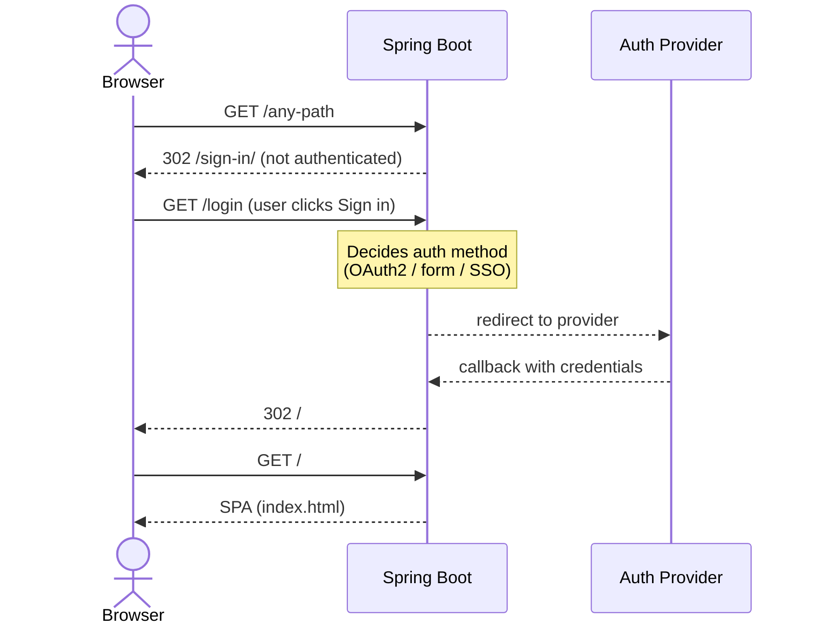

# demo-frontend

React 19 SPA built with Vite, TanStack Router, and Tailwind CSS v4. Designed to be served by a Spring Boot backend that guards the SPA behind authentication.

## Development

```bash
npm install
npm run dev   # http://localhost:3000
```

## Storybook

```bash
npm run storybook        # http://localhost:6006
npm run build-storybook  # static build to storybook-static/
```

## Building for production

```bash
npm run build
```

The `dist/` folder is what Spring Boot serves. It contains two HTML entry points:

| Path                      | Purpose                                      |
| ------------------------- | -------------------------------------------- |
| `dist/index.html`         | The SPA — only served to authenticated users |
| `dist/sign-in/index.html` | Login gate — served to unauthenticated users |

## Spring Boot integration

### Overview

Spring Boot owns authentication entirely. The login page (`dist/sign-in/index.html`) is a static HTML file that shows a sign-in button pointing to `/login`. Spring Security intercepts that request and decides what to do — OAuth2 redirect, login form, SSO, etc. — the frontend does not need to know.



### 1. Build and deploy separately

The frontend and backend are built and cached independently. The final deployment places them side by side:

```
deploy/
  app.jar           ← Spring Boot artifact
  static/           ← frontend dist/, copied here by CI/CD
    index.html
    sign-in/
    assets/
```

Tell Spring Boot to serve from the external `static/` folder beside the JAR:

```yaml
# application.yml
spring:
  web:
    resources:
      static-locations:
        - file:./static/ # external folder beside the jar (checked first)
        - classpath:/static/ # fallback to anything bundled inside the jar
```

In your CI/CD pipeline, build and cache each artifact independently, then merge them at deploy time by copying `dist/` into `static/` beside the JAR before starting the process.

### 2. Security configuration

> Spring Boot 4.x (Spring Security 7.x). Add `spring-boot-starter-security-oauth2-client` to your dependencies.

Permit `/sign-in/**` and redirect all other unauthenticated requests there. Spring Security handles everything after the user hits `/login`:

```java
@Configuration
@EnableWebSecurity
public class SecurityConfig {

    @Bean
    public SecurityFilterChain filterChain(HttpSecurity http) throws Exception {
        http
            .authorizeHttpRequests(auth -> auth
                .requestMatchers("/sign-in/**").permitAll()
                .anyRequest().authenticated()
            )
            // configure your preferred auth mechanism here:
            .oauth2Login(oauth2 -> oauth2
                .defaultSuccessUrl("/", true)
            )
            // or .formLogin(...) — the frontend does not care which
            .exceptionHandling(ex -> ex
                .authenticationEntryPoint((request, response, e) ->
                    response.sendRedirect("/sign-in/"))
            );

        return http.build();
    }
}
```

### 3. SPA fallback

TanStack Router handles navigation client-side, so deep links (e.g. `/dashboard/settings`) must fall back to `index.html` for authenticated users:

```java
@Controller
public class SpaController {

    @GetMapping(value = {"/", "/{path:^(?!api|oauth2|sign-in|assets)[^.]*$}/**"})
    public String spa() {
        return "forward:/index.html";
    }
}
```
