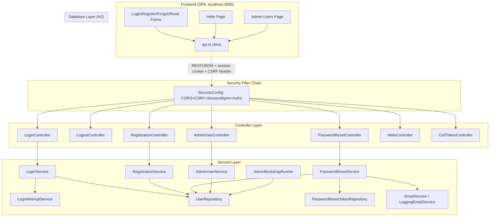
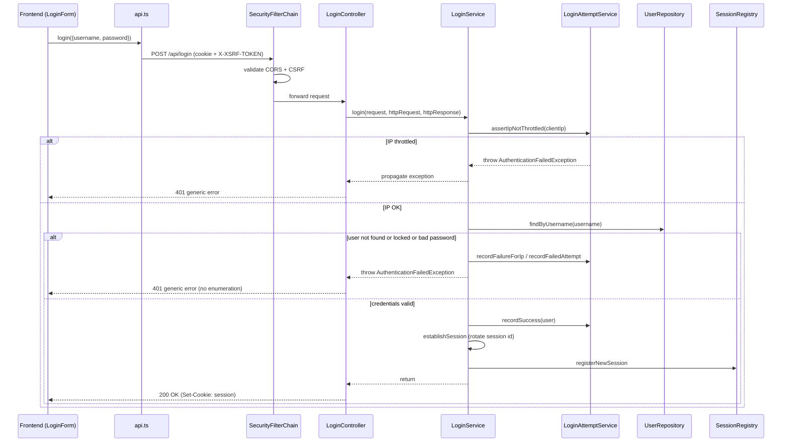
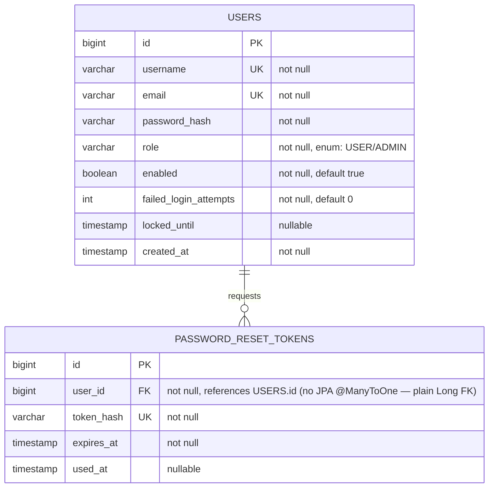

# Technical Architecture Document
> Generated: 2026-09-28T11:46:28+08:00
> Project: secured-hello-world-app (directory name; no top-level manifest name found — backend artifact `secured-hello-world-backend`, frontend package `frontend`)

## 1. Architecture Narrative

### 1.1 System Overview

A two-origin reference implementation of username/password authentication ("Secured Hello World App"), per `PRODUCT.md`. A React 19 + Vite + TypeScript single-page frontend (`frontend/`, served at `localhost:3000` in dev) talks over REST/JSON to a Spring Boot 4.1.0 + Spring Security 7.1.0 + Spring Session + Spring Data JPA backend (`backend/`, served at `localhost:8080` in dev), backed by H2 (file/mem, Postgres-portable schema). Auth is server-side session via a secure HttpOnly cookie (not JWT). The product goal is demonstrating correct security plumbing — BCrypt hashing, account lockout, IP throttling, enumeration-resistant login errors, CSRF/CORS, session invalidation on logout/password-reset, and role-gated admin user management — rather than visual polish.

> **Change since prior report (2026-09-28 09:41):** `backend/pom.xml`'s `spring-boot-starter-parent` was upgraded from `3.3.4` to `4.1.0`, resolving both High-severity CVEs previously flagged in Section 6 (transitive Spring Framework 6.1.13 → 7.0.8; Tomcat 10.1.30 → 11.0.22). See Section 6 and `dependency-vuln-scan.md` for the full re-scan.

### 1.2 Module Summary

| Module | Source Files | Description |
|--------|-------------|-------------|
| `auth` (backend) | `LoginService`, `LoginController`, `LogoutController`, `LoginAttemptService`, `AppUserDetails(Service)`, `ClientIpResolver`, `AuthenticationFailedException`, `LoginRequest` | Login/logout orchestration, generic-error enumeration resistance, per-account lockout, per-IP throttling, session establishment via `SessionRegistry`. |
| `user` (backend) | `User`, `Role`, `UserRepository` | JPA entity/repository for registered accounts (credentials, role, lockout state). |
| `registration` (backend) | `RegistrationService`, `RegistrationController`, `RegistrationRequest`, `DuplicateAccountException` | New-account creation with uniqueness checks on username/email and password policy validation. |
| `passwordreset` (backend) | `PasswordResetService`, `PasswordResetController`, `PasswordResetToken(Repository)`, `EmailService`/`LoggingEmailService`, `InvalidResetTokenException`, request DTOs | Single-use hashed reset tokens (15–30 min expiry), session invalidation for the target user on reset, stub email delivery (logs the link instead of sending mail). |
| `admin` (backend) | `AdminUserService`, `AdminUserController`, `AdminUserView`, `UpdateStatusRequest`, `UpdateRoleRequest`, `SelfActionForbiddenException`, `UserNotFoundException` | Role-gated (`ADMIN`) CRUD-lite operations on other users: list, enable/disable, role change, delete — with self-action guardrails. |
| `bootstrap` (backend) | `AdminBootstrapRunner`, `AdminBootstrapProperties` | Seeds a configured initial `ADMIN` account on first startup if none exists. |
| `config` (backend) | `SecurityConfig`, `CsrfTokenController` | Central Spring Security filter chain wiring: CORS, CSRF (cookie-based double-submit), session management, authorization rules, password encoder. |
| `web` (backend) | `ApiExceptionHandler` | `@ControllerAdvice` translating domain exceptions to structured JSON error responses. |
| `hello` (backend) | `HelloController` | Authenticated-only greeting endpoint, the app's namesake demo capability. |
| Auth flow (frontend) | `LoginForm.tsx`, `RegisterForm.tsx`, `ForgotPasswordForm.tsx`, `ResetPasswordForm.tsx`, `AuthContext.tsx` | Forms + `AuthContext` React context tracking `anonymous`/`authenticated`/`loading` session status via `/api/hello` probing. |
| Post-login views (frontend) | `HelloPage.tsx`, `AdminUsersPage.tsx` | Authenticated greeting screen; admin console table (enable/disable, role toggle, delete per row). |
| API client (frontend) | `api.ts` | `fetch` wrapper: credentialed requests, CSRF cookie-to-header echo (`XSRF-TOKEN` → `X-XSRF-TOKEN`), typed error handling via `ApiError`. |
| App shell (frontend) | `App.tsx`, `main.tsx` | View-state router (no library — plain `useState` view enum) wiring auth status to the six screens. |

### 1.3 Module Interaction Diagram

### 1.4 Module Interactions

The frontend's `api.ts` is the sole bridge to the backend: every form component calls a typed method on `api`, which issues a credentialed `fetch` (cookies always included) and, for mutating verbs, echoes the `XSRF-TOKEN` cookie into an `X-XSRF-TOKEN` header to satisfy Spring Security's cookie-based CSRF double-submit check configured in `SecurityConfig`. All backend endpoints pass through the single `SecurityFilterChain` bean in `SecurityConfig`, which applies CORS (single allowed origin, credentials enabled), CSRF (except `/h2-console/**`), session management (unlimited concurrent sessions tracked via `SessionRegistry`), and authorization rules (`/api/register`, `/api/login`, `/api/password-reset/**`, `/api/csrf` are `permitAll`; `/api/admin/**` requires `ROLE_ADMIN`; everything else requires authentication). `LoginService` depends on `LoginAttemptService` for both per-account lockout and per-IP throttling before ever touching `UserRepository`, and on `SessionRegistry` to register the new session after establishing a `SecurityContext`. `PasswordResetService` depends on both `UserRepository` and `PasswordResetTokenRepository`, and on `EmailService` (implemented by the dev-only `LoggingEmailService` stub) to hand off the reset link. `AdminUserService` depends only on `UserRepository`, applying self-action guards (`requireNotSelf`) before delegating to admin-triggered mutations. `AdminBootstrapRunner` is an `ApplicationRunner` that depends on `UserRepository` and `AdminBootstrapProperties` (bound from `app.admin.*` config) to seed the first admin account exactly once, at startup, if none exists.

### 1.5 Execution Flow

**Request lifecycle (typical mutating request, e.g. login):** Browser sends `POST /api/login` with the session cookie (if any) and `X-XSRF-TOKEN` header → Spring's servlet filter chain validates CORS origin, then CSRF token against the cookie, then reaches `LoginController` → `LoginService.login()` resolves the client IP (`ClientIpResolver`, honoring `X-Forwarded-For` if present), asserts the IP is not throttled, looks up the user (returning a generic `AuthenticationFailedException` if absent — enumeration resistance), checks account lock state, verifies the BCrypt password hash, and on success calls `ChangeSessionIdAuthenticationStrategy` (session fixation protection) before persisting the `SecurityContext` into the HTTP session and registering it with `SessionRegistry`. `ApiExceptionHandler` (a `@ControllerAdvice`) converts any thrown domain exception (`AuthenticationFailedException`, `DuplicateAccountException`, `InvalidResetTokenException`, `SelfActionForbiddenException`, `UserNotFoundException`, validation errors) into a structured JSON error body.

**Background/initialisation process:** On application startup, `AdminBootstrapRunner` (an `ApplicationRunner`) checks `UserRepository.countByRole(ADMIN)`; if zero, it creates the configured admin account (`app.admin.username`/`app.admin.password` from `application.yml`, defaulting to `admin`/`ChangeMe123456!` in this reference config) using the same `BCryptPasswordEncoder` bean as normal registrations.

**Event flow (password reset):** `POST /api/password-reset/request` → `PasswordResetService.requestReset()` always returns a generic success message (enumeration resistance) regardless of whether the email exists, generates a plaintext token, persists only its hash with a 15–30 min expiry (`app.security.password-reset.token-expiry-minutes`), and calls `EmailService.sendPasswordResetEmail()` (in dev, `LoggingEmailService` logs the link instead of sending mail) → `POST /api/password-reset/confirm` validates the token hash match, expiry, and single-use (`isUsed`) state, updates the password hash, and invalidates all existing sessions for that user via `SessionRegistry` lookup.

### 1.6 Execution Flow Diagrams

## 2. Software Module Catalog

#### auth
- **Source Files:** `backend/src/main/java/com/assessment/securedhelloworld/auth/*.java`
- **Purpose:** Orchestrates login/logout, credential verification, session establishment, per-account lockout, and per-IP throttling.
- **Dependencies:** `user` (UserRepository), Spring Security core (SessionRegistry, PasswordEncoder), `config` (indirectly, via the shared filter chain).

**Module Interactions:** `LoginService` is the aggregation point calling into `LoginAttemptService` for rate-limiting decisions and `UserRepository` for credential lookups, then manually driving Spring Security's session APIs (`SessionAuthenticationStrategy`, `SecurityContextRepository`, `SessionRegistry`) rather than relying on `AuthenticationManager`/`UsernamePasswordAuthenticationFilter`, giving it full control over the generic-error and lockout semantics the PRD requires.

| Function / Method | Parameters | Returns | Description |
|-------------------|------------|---------|-------------|
| `LoginService.login` | `LoginRequest, HttpServletRequest, HttpServletResponse` | `void` | Full login flow: IP throttle check, credential check, lockout check, session establishment. |
| `LoginAttemptService.assertIpNotThrottled` | `String clientIp` | `void` (throws) | Rejects requests from an IP that has exceeded `app.security.ip-throttle.max-attempts` within the configured window. |
| `LoginAttemptService.recordFailedAttempt` | `User` | `void` | Increments the account's failed-attempt counter and applies `lockedUntil` once the threshold is reached. |
| `ClientIpResolver.resolve` | `HttpServletRequest` | `String` | Resolves the effective client IP, honoring `X-Forwarded-For`. |
| `LogoutController.logout` | — | `void`/`204` | Invalidates the current HTTP session server-side. |

#### user
- **Source Files:** `User.java`, `Role.java`, `UserRepository.java`
- **Purpose:** Core account entity (JPA) and its Spring Data repository.
- **Dependencies:** None (leaf module); depended on by `auth`, `registration`, `passwordreset`, `admin`, `bootstrap`.

| Function / Method | Parameters | Returns | Description |
|-------------------|------------|---------|-------------|
| `User.isLocked` | `Instant now` | `boolean` | True if `lockedUntil` is set and in the future. |
| `UserRepository.findByUsername` / `findByEmail` | `String` | `Optional<User>` | Lookup by unique fields. |
| `UserRepository.existsByUsername` / `existsByEmail` | `String` | `boolean` | Uniqueness checks used by registration. |
| `UserRepository.countByRole` | `Role` | `long` | Used by `AdminBootstrapRunner` to detect whether an admin already exists. |

#### registration
- **Source Files:** `RegistrationService.java`, `RegistrationController.java`, `RegistrationRequest.java`, `DuplicateAccountException.java`
- **Purpose:** New-account creation with uniqueness and password-policy validation (length ≥ 12, enforced via `@Valid` + `RegistrationRequest` constraints).
- **Dependencies:** `user` (UserRepository), Spring Security `PasswordEncoder`.

| Function / Method | Parameters | Returns | Description |
|-------------------|------------|---------|-------------|
| `RegistrationService.register` | `RegistrationRequest` | `User` | Validates uniqueness, hashes password, persists new `User` with default `Role.USER`. |

#### passwordreset
- **Source Files:** `PasswordResetService.java`, `PasswordResetController.java`, `PasswordResetToken(Repository).java`, `EmailService.java`, `LoggingEmailService.java`, `PasswordResetRequestRequest.java`, `PasswordResetConfirmRequest.java`, `InvalidResetTokenException.java`
- **Purpose:** Single-use, hashed, time-boxed password reset tokens; invalidates all sessions for the target user on successful reset.
- **Dependencies:** `user` (UserRepository), `SessionRegistry` (for invalidation), `EmailService` (stub implementation in this reference build).

| Function / Method | Parameters | Returns | Description |
|-------------------|------------|---------|-------------|
| `PasswordResetService.requestReset` | `PasswordResetRequestRequest` | `void` | Generates token, persists hash, emails link; always returns generically regardless of email existence. |
| `PasswordResetService.confirmReset` | `PasswordResetConfirmRequest` | `void` | Validates token (hash match, not expired, not used), updates password, invalidates existing sessions. |
| `PasswordResetService.hashToken` / `matchesToken` | `String` | `String`/`boolean` | Token hashing (never stores plaintext) and constant-time-ish comparison. |

#### admin
- **Source Files:** `AdminUserService.java`, `AdminUserController.java`, `AdminUserView.java`, `UpdateStatusRequest.java`, `UpdateRoleRequest.java`, `SelfActionForbiddenException.java`, `UserNotFoundException.java`
- **Purpose:** Role-gated (`ADMIN`) management of other users' accounts, with self-action guardrails (an admin cannot disable/demote/delete themself).
- **Dependencies:** `user` (UserRepository).

| Function / Method | Parameters | Returns | Description |
|-------------------|------------|---------|-------------|
| `AdminUserService.listUsers` | — | `List<AdminUserView>` | Returns all accounts as safe view DTOs (no password hash exposed). |
| `AdminUserService.updateEnabled` | `Long id, boolean, Long actingAdminId` | `void` | Toggles account enablement; blocks self-action. |
| `AdminUserService.updateRole` | `Long id, Role, Long actingAdminId` | `void` | Changes role; blocks self-action. |
| `AdminUserService.deleteUser` | `Long id, Long actingAdminId` | `void` | Deletes account; blocks self-action. |
| `AdminUserService.requireNotSelf` | `Long targetId, Long actingAdminId` | `void` (throws) | Guardrail shared by all three mutating operations. |

#### bootstrap
- **Source Files:** `AdminBootstrapRunner.java`, `AdminBootstrapProperties.java`
- **Purpose:** Seeds a single initial `ADMIN` account on first startup from `app.admin.*` configuration, only if no admin exists yet.
- **Dependencies:** `user` (UserRepository), `PasswordEncoder`.

| Function / Method | Parameters | Returns | Description |
|-------------------|------------|---------|-------------|
| `AdminBootstrapRunner.run` | `ApplicationArguments` | `void` | Startup hook; no-op if `UserRepository.countByRole(ADMIN) > 0`. |

#### config
- **Source Files:** `SecurityConfig.java`, `CsrfTokenController.java`
- **Purpose:** Central Spring Security wiring — CORS, CSRF, session management, authorization matcher rules, password encoder bean.
- **Dependencies:** None internal; wraps all HTTP-facing modules.

| Function / Method | Parameters | Returns | Description |
|-------------------|------------|---------|-------------|
| `SecurityConfig.filterChain` | `HttpSecurity, CorsConfigurationSource, SessionRegistry` | `SecurityFilterChain` | The single security filter chain bean for the whole app. |
| `SecurityConfig.corsConfigurationSource` | `Environment` | `CorsConfigurationSource` | Single allowed origin (from `app.frontend.origin`), credentials enabled. |
| `CsrfTokenController.getCsrfToken` | `CsrfToken` | `Map` | Forces resolution of the deferred CSRF token so the cookie is issued to the SPA on first load. |

#### web
- **Source Files:** `ApiExceptionHandler.java`
- **Purpose:** `@ControllerAdvice` centralising domain-exception-to-JSON-error translation.
- **Dependencies:** All controller-layer modules (implicitly, via exception types).

#### hello
- **Source Files:** `HelloController.java`
- **Purpose:** The namesake authenticated greeting endpoint (`GET /api/hello`), gated by the default `anyRequest().authenticated()` rule.
- **Dependencies:** None beyond the security context (reads the authenticated principal).

#### Frontend — Auth flow (`LoginForm`, `RegisterForm`, `ForgotPasswordForm`, `ResetPasswordForm`, `AuthContext`)
- **Source Files:** `frontend/src/{LoginForm,RegisterForm,ForgotPasswordForm,ResetPasswordForm,AuthContext}.tsx`
- **Purpose:** Renders the four unauthenticated-flow forms and tracks session status (`anonymous`/`authenticated`/`loading`) for the whole app via `AuthContext`.
- **Dependencies:** `api.ts`.

#### Frontend — Post-login views (`HelloPage`, `AdminUsersPage`)
- **Source Files:** `frontend/src/{HelloPage,AdminUsersPage}.tsx`
- **Purpose:** Authenticated greeting screen and the admin console table (list/enable-disable/role-toggle/delete per row).
- **Dependencies:** `api.ts`.

#### Frontend — API client (`api.ts`)
- **Source Files:** `frontend/src/api.ts`
- **Purpose:** Single `fetch` wrapper: always-credentialed requests, CSRF cookie→header echo, typed `ApiError`.
- **Dependencies:** None (leaf); depended on by every view module.

| Function / Method | Parameters | Returns | Description |
|-------------------|------------|---------|-------------|
| `apiFetch<T>` | `path, RequestOptions` | `Promise<T>` | Shared fetch wrapper: credentials, CSRF header injection, JSON error parsing. |
| `primeCsrfToken` | — | `Promise<void>` | Warms the CSRF cookie via `GET /api/csrf` on app load. |
| `api.login` / `api.register` / `api.hello` / `api.adminListUsers` / etc. | varies | `Promise<T>` | Typed endpoint bindings. |

#### Frontend — App shell (`App.tsx`, `main.tsx`)
- **Source Files:** `frontend/src/{App,main}.tsx`
- **Purpose:** View-state routing (plain `useState` enum, no router library) wiring `AuthContext` status to the six screens.
- **Dependencies:** All frontend view modules, `AuthContext`.

## 3. Technology Decisions

No ADR documents were found under any of the conventional locations (`docs/adr/`, `adr/`, `docs/decisions/`, `docs/architecture/decisions/`, `doc/adr/`, `architecture/decisions/`). The decisions below are **inferred from the codebase** (framework choice, auth approach, database) per the skill's fallback instruction — they are not sourced from a written ADR and rationale is reconstructed, not quoted.

### 3.1 Decision Index

| ID | Title | Status | Date | Related Dependencies |
|----|-------|--------|------|---------------------|
| INF-1 | Server-side session auth over JWT | Accepted (inferred) | N/A | `spring-session-core`, `spring-boot-starter-security` |
| INF-2 | H2 embedded database for reference/dev | Accepted (inferred) | N/A | `com.h2database:h2` |
| INF-3 | React 19 + Vite + TypeScript (no CSS framework / router library yet) | Accepted (inferred) | N/A | `react`, `react-dom`, `vite`, `typescript` |
| INF-4 | BCrypt for password hashing | Accepted (inferred) | N/A | `spring-security-crypto` (transitively via `spring-boot-starter-security`) |

### 3.2 Decision Details

#### Server-side session auth over JWT
- **Status:** Accepted (inferred)
- **Date:** N/A (no ADR)

| Option | Description | Pros | Cons |
|--------|-------------|------|------|
| Server-side session (cookie, `HttpOnly`, `Secure`) | Spring Session + `SecurityContextRepository` persisting to the HTTP session (chosen) | Trivial server-side revocation (logout, password-reset invalidate sessions immediately); no token-replay window; `HttpOnly` cookie is inaccessible to XSS-injected JS | Requires CORS `credentials: true` + matching CSRF protection for cross-origin SPA; less naturally stateless/horizontally-scalable without a shared session store |
| JWT (stateless bearer token) | Signed token carried in `Authorization` header or storage | Stateless, no server-side session store needed; scales horizontally without sticky sessions | Revocation is hard (must maintain a blocklist or short expiry + refresh); token leakage (e.g., via XSS if stored in localStorage) is harder to contain than an `HttpOnly` cookie |

**Chosen Option:** Server-side session (cookie-based)
**Rationale (inferred):** `PRODUCT.md` explicitly documents JWT as "an alternative in the PRD appendix, not built" — the product's stated goal is demonstrating session invalidation on logout and password reset, which is native to server-side sessions and requires extra bookkeeping under JWT. `SecurityConfig`'s CSRF, CORS-with-credentials, and `SessionRegistry`-backed lockout/invalidation wiring is built entirely around the session model.

#### H2 embedded database
- **Status:** Accepted (inferred)

| Option | Description | Pros | Cons |
|--------|-------------|------|------|
| H2 (file/mem) | `com.h2database:h2`, runtime scope (chosen) | Zero external setup for a reference/demo app; fast test startup; SQL dialect close enough to Postgres for schema portability | Not representative of a production RDBMS's operational characteristics (connection pooling behavior, locking, replication) |
| PostgreSQL | External Postgres instance | Production-representative; supports concurrent access patterns realistically | Requires provisioning infrastructure — explicitly out of scope per `PRODUCT.md` ("containerization/CI/CD/hosting infra" is out of scope) |

**Chosen Option:** H2
**Rationale (inferred):** `PRODUCT.md` describes the schema as "Postgres-portable," signalling H2 was chosen as a zero-infrastructure stand-in with an explicit intent to swap to Postgres in a real deployment, not as a permanent choice.

#### React 19 + Vite + TypeScript, no UI/router library
- **Status:** Accepted (inferred)

| Option | Description | Pros | Cons |
|--------|-------------|------|------|
| Plain `useState` view-enum routing (chosen) | `App.tsx`'s `View` union type + `setView` | Zero extra dependency for a 6-screen app; trivial to reason about | Would not scale past a handful of screens; no browser history/back-button support beyond the one `window.location.pathname` check for `/reset-password` |
| React Router / TanStack Router | Declarative route config | Scales to real navigation, deep-linking, back-button | Unnecessary dependency weight for a fixed 6-screen demo |

**Chosen Option:** Plain `useState` enum
**Rationale (inferred):** Consistent with `PRODUCT.md`'s framing of "six screens/views exist today" and the project's minimal-scope, reference-implementation goal — adding a router would be premature abstraction for the current surface area.

## 4. Database Design

### 4.1 Entity-Relationship Diagram

No formal SQL migration files (e.g. Flyway/Liquibase) were found under `backend/src/main/resources`; schema is generated by Hibernate DDL auto (JPA `@Entity` annotations on `User` and `PasswordResetToken` are the sole source of truth for table structure in this reference build).

### 4.2 Major Data Structures

| Structure | Type | Used By | Description |
|-----------|------|---------|-------------|
| `LoginRequest` | Request DTO | `LoginController` | `{username, password}` — both `@NotBlank`. |
| `RegistrationRequest` | Request DTO | `RegistrationController` | `{username, email, password}` — password `@Size(min=12)`. |
| `PasswordResetRequestRequest` | Request DTO | `PasswordResetController` | `{email}`. |
| `PasswordResetConfirmRequest` | Request DTO | `PasswordResetController` | `{token, newPassword}`. |
| `UpdateStatusRequest` | Request DTO | `AdminUserController` | `{enabled: boolean}`. |
| `UpdateRoleRequest` | Request DTO | `AdminUserController` | `{role: USER\|ADMIN}`. |
| `AdminUserView` | Response DTO | `AdminUserController` | Safe projection of `User` (no password hash) — `{id, username, email, role, enabled, createdAt}`. |
| `CurrentUserRole` / `AdminUserView` (frontend) | TS interface | `api.ts`, `AdminUsersPage.tsx` | Mirrors the backend `AdminUserView` shape for the admin table. |
| API error body | JSON shape | `ApiExceptionHandler`, `api.ts`'s `ApiError` | `{error: string}` — consumed by the frontend's generic error-message rendering. |

## 5. Dependency Inventory

### 5.1 Production Dependencies — Backend (Maven, `backend/pom.xml`, resolved via `mvn dependency:tree`)

Directly declared in `pom.xml` (compile/runtime scope):

| Package | Version | Licence | Purpose |
|---------|---------|---------|---------|
| org.springframework.boot:spring-boot-starter-web | 4.1.0 | Apache-2.0 | REST controllers, embedded Tomcat, Jackson JSON. |
| org.springframework.boot:spring-boot-starter-security | 4.1.0 | Apache-2.0 | Spring Security auto-configuration. |
| org.springframework.boot:spring-boot-starter-data-jpa | 4.1.0 | Apache-2.0 | Hibernate + Spring Data repositories. |
| org.springframework.boot:spring-boot-starter-validation | 4.1.0 | Apache-2.0 | Bean Validation (`@NotBlank`, `@Size`, etc.) on request DTOs. |
| org.springframework.boot:spring-boot-starter-actuator | 4.1.0 | Apache-2.0 | Health/metrics endpoints. |
| org.springframework.boot:spring-boot-h2console | 4.1.0 | Apache-2.0 | H2 console auto-configuration (split out of the monolithic autoconfigure jar in Spring Boot 4). |
| org.springframework.session:spring-session-core | (Spring Boot 4.1.0 managed) | Apache-2.0 | Session abstraction backing `SecurityContextRepository`. |
| com.h2database:h2 | 2.4.240 (runtime) | MPL-2.0 / EPL-1.0 | Embedded/dev database. |

Key resolved transitive production dependencies (97 compile/runtime-scope artifacts per `mvn dependency:tree`):

| Package | Version | Licence | Purpose |
|---------|---------|---------|---------|
| org.springframework:spring-web / spring-webmvc / spring-core / spring-context / spring-beans / spring-aop / spring-expression / spring-jdbc / spring-orm / spring-tx / spring-jcl | 7.0.8 | Apache-2.0 | Spring Framework core (see Section 6 — CVE-2024-38819 now resolved, fixed at 6.1.14, well below 7.0.8). |
| org.springframework.security:spring-security-core / -config / -web / -crypto | 7.1.0 | Apache-2.0 | Security framework: authn/authz, CSRF, password hashing support. |
| org.apache.tomcat.embed:tomcat-embed-core / -el / -websocket | 11.0.22 | Apache-2.0 | Embedded servlet container (see Section 6 — CVE-2024-50379/56337 now resolved, fixed at 11.0.3, well below 11.0.22). |
| org.hibernate.orm:hibernate-core | 7.4.1.Final | LGPL-2.1 | JPA provider. |
| tools.jackson.core:jackson-databind (+ core/annotations) | 3.1.4 | Apache-2.0 | JSON serialization (Jackson moved from `com.fasterxml.jackson` to `tools.jackson` group in the Jackson 3.x line pulled by Spring Boot 4). |
| com.zaxxer:HikariCP | 7.0.2 | Apache-2.0 | JDBC connection pool. |
| ch.qos.logback:logback-classic / -core | 1.5.34 | EPL-1.0 / LGPL-2.1 | Logging implementation. |
| org.yaml:snakeyaml | 2.6 | Apache-2.0 | YAML parsing for `application.yml`. |
| org.hibernate.validator:hibernate-validator | 9.1.0.Final | Apache-2.0 | Bean Validation implementation. |
| jakarta.persistence / jakarta.validation / jakarta.annotation / jakarta.transaction (APIs) | (Spring Boot 4.1.0 managed) | EPL-2.0 | Jakarta EE specification jars. |

*(Deeper transitive leaves — e.g. `jandex`, `classmate`, `jboss-logging`, `antlr4-runtime`, `aspectjweaver`, `micrometer-*`, `jaxb-*` — omitted from this table for brevity; full list captured in the raw `mvn dependency:tree` output, 97 compile/runtime-scope + 31 test-scope artifacts.)*

### 5.1b Production Dependencies — Frontend (`frontend/package.json`)

| Package | Version | Licence | Purpose |
|---------|---------|---------|---------|
| react | ^19.2.8 (resolved 19.3.0) | MIT | UI library. |
| react-dom | ^19.2.8 (resolved 19.3.0) | MIT | React DOM renderer. |

Resolved transitive production dependency:

| Package | Version | Licence | Purpose |
|---------|---------|---------|---------|
| scheduler | 0.28.0 | MIT | React's internal task scheduler (transitive via `react-dom`). |

### 5.2 Development Dependencies

**Backend (test scope, 31 artifacts via `mvn dependency:tree`):** `spring-boot-starter-test` (4.1.0), `spring-boot-webmvc-test` (4.1.0), `spring-boot-data-jpa-test` (4.1.0), `spring-security-test` (7.1.0), and their transitives (JUnit Jupiter, Mockito, AssertJ, Awaitility, Hamcrest, JSONassert, XMLUnit, etc.).

**Frontend (`devDependencies` in `package.json`, 88 resolved packages incl. nested via `npm ls`):**

| Package | Version | Licence | Purpose |
|---------|---------|---------|---------|
| typescript | ~6.0.2 (resolved as declared range) | Apache-2.0 | Type checking / build (`tsc -b`). |
| vite | ^8.3.0 | MIT | Dev server & bundler. |
| @vitejs/plugin-react | ^6.1.1 | MIT | React Fast Refresh + JSX transform for Vite. |
| oxlint | ^1.81.0 (resolved 1.85.0) | MIT | Linting (`npm run lint`). |
| @types/node, @types/react, @types/react-dom | ^24.13.3 / ^19.2.18 / ^19.2.7 | MIT | TypeScript type declarations. |

### 5.3 Summary

- **Backend:** 10 directly-declared dependencies in `pom.xml` (8 compile/runtime + 4 test-scope: `spring-boot-starter-test`, `spring-boot-webmvc-test`, `spring-boot-data-jpa-test`, `spring-security-test`); **97 total resolved compile/runtime-scope artifacts** and **31 total resolved test-scope artifacts** per `mvn dependency:tree`.
- **Frontend:** 2 directly-declared production dependencies, 7 directly-declared devDependencies in `package.json`; **`npm audit`/`npm ls` reports 4 prod, 88 dev, 46 optional (91 total resolved packages)** in the full dependency graph — unchanged since the prior report.
- **Licence distribution:** overwhelmingly permissive (Apache-2.0, MIT) across both stacks; backend carries a small number of LGPL-2.1/EPL-1.0/EPL-2.0 components typical of the Jakarta EE / Hibernate / Logback ecosystem (`hibernate-core`, `logback-*`, `jakarta.*` APIs) and H2's dual MPL-2.0/EPL-1.0 licence — none of these are copyleft in a way that affects proprietary use of application code (LGPL/EPL apply only to the libraries themselves, not to code merely linking/calling them).

## 6. Vulnerability Findings

Full detail, scanner methodology, and remediation guidance: see [`dependency-vuln-scan.md`](./dependency-vuln-scan.md) in this same output folder.

### 6.1 Summary

- Critical: 0
- High: 0 — both prior High findings resolved by the `spring-boot-starter-parent` 3.3.4 → 4.1.0 upgrade
- Medium: 0
- Low: 0

**No known vulnerabilities found.** Verified via a full automated OWASP dependency-check run (99 backend dependencies scanned against cached NVD data) and `npm audit` (0 vulnerabilities, unchanged from prior report).

### 6.2 Findings

None.

### 6.3 Remediation

None required. The `spring-boot-starter-parent` upgrade from `3.3.4` to `4.1.0` (already applied in `backend/pom.xml`) resolved both prior High findings:
- CVE-2024-38819 (Spring path traversal): fixed at Spring Framework 6.1.14; current resolved version is **7.0.8**.
- CVE-2024-50379 / CVE-2024-56337 (Tomcat RCE): fixed at Tomcat 11.0.3 (11.x line); current resolved version is **11.0.22**.

Frontend requires no remediation — `npm audit` reports zero vulnerabilities. See `dependency-vuln-scan.md` for full scanner methodology and notes.
